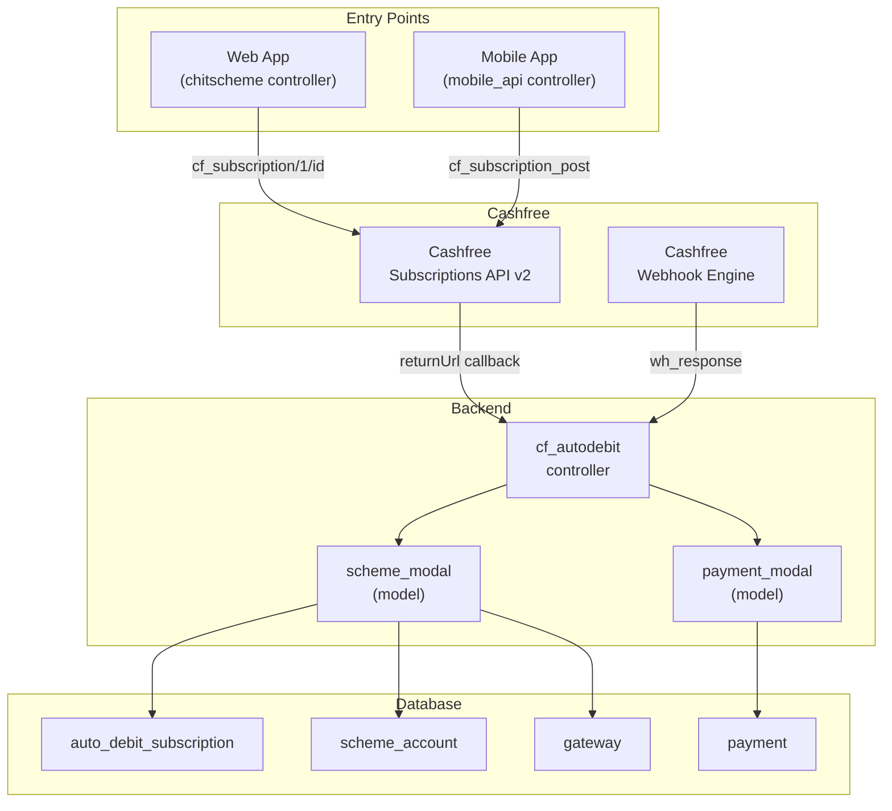
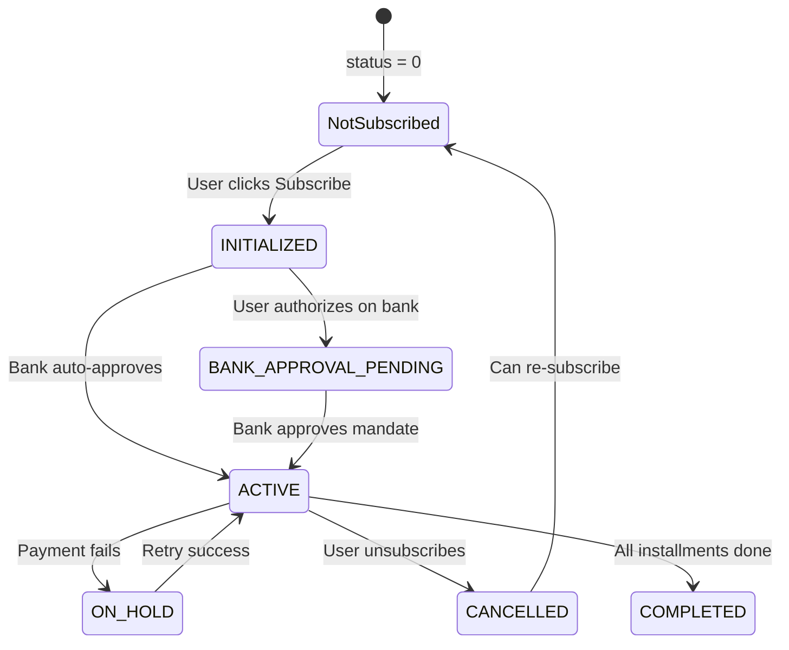
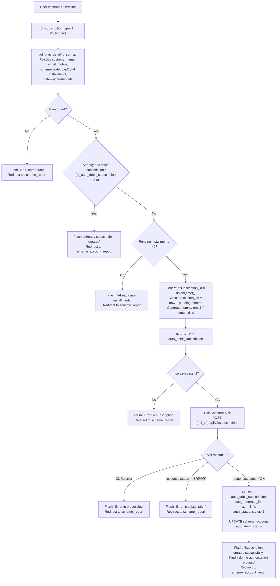
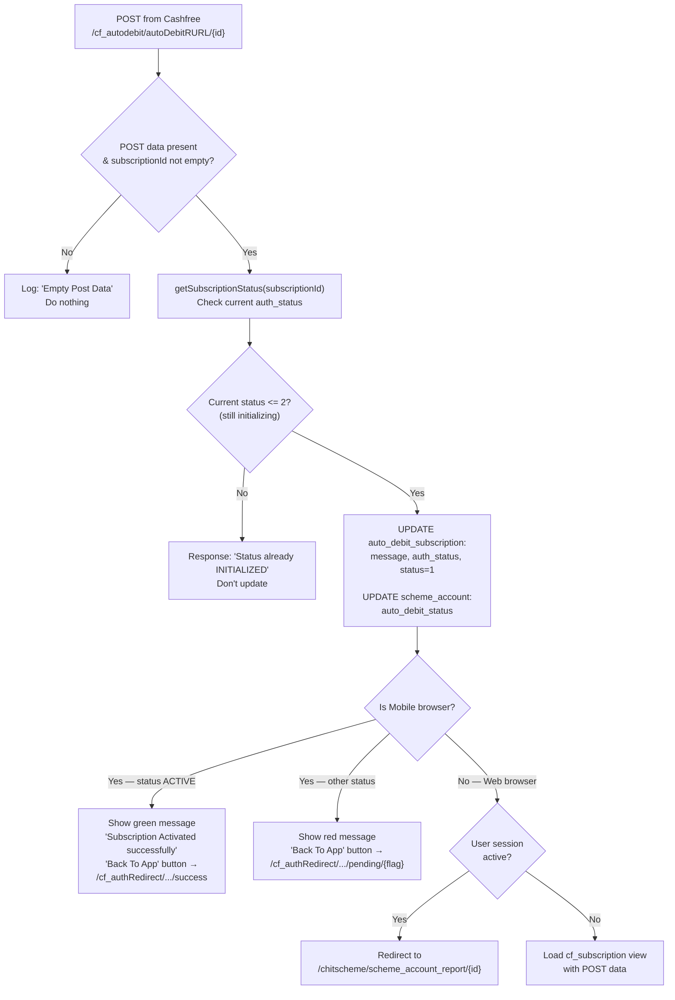
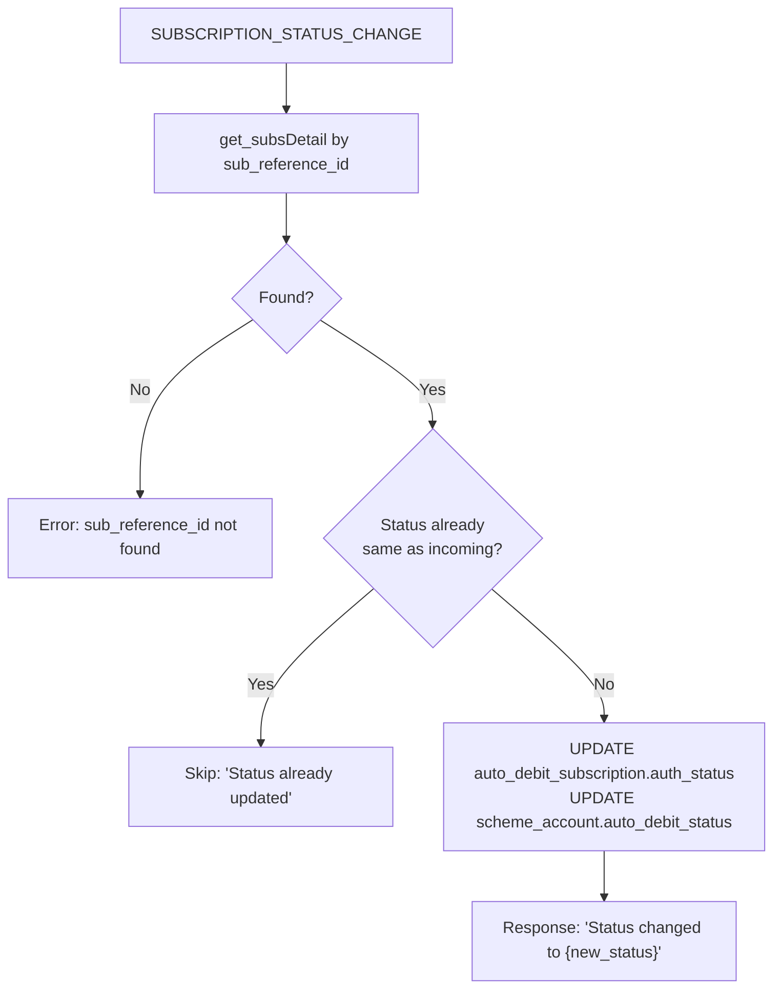
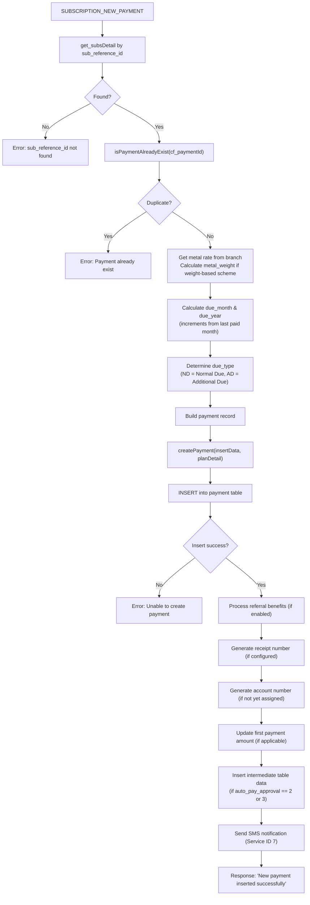
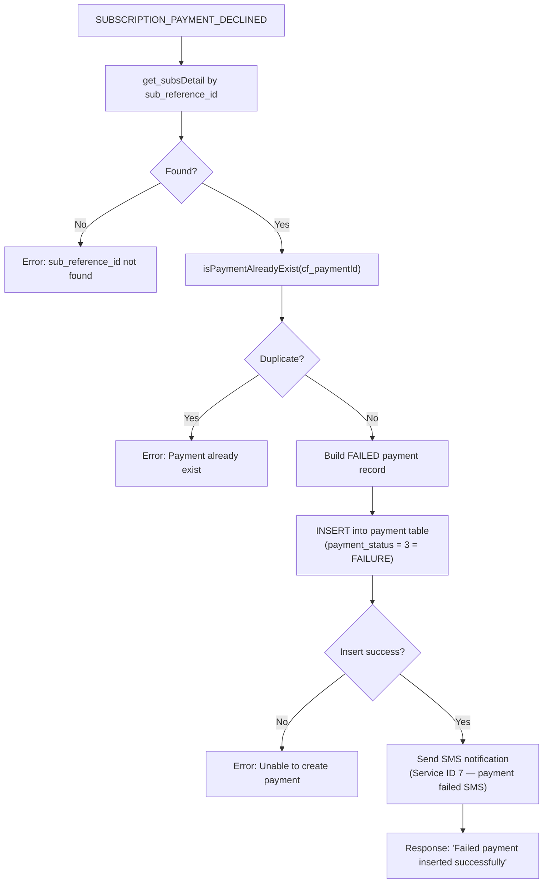
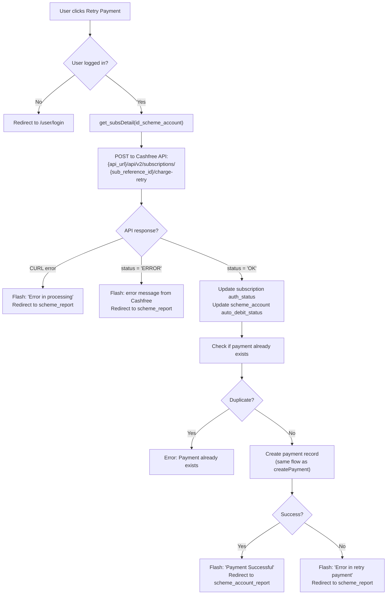
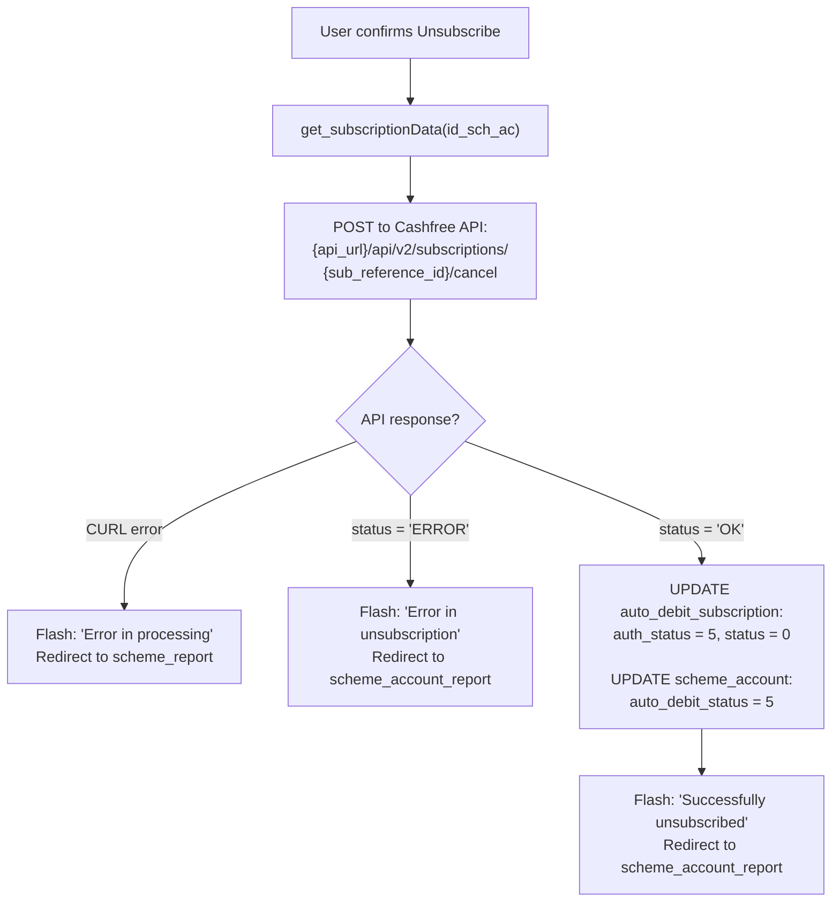
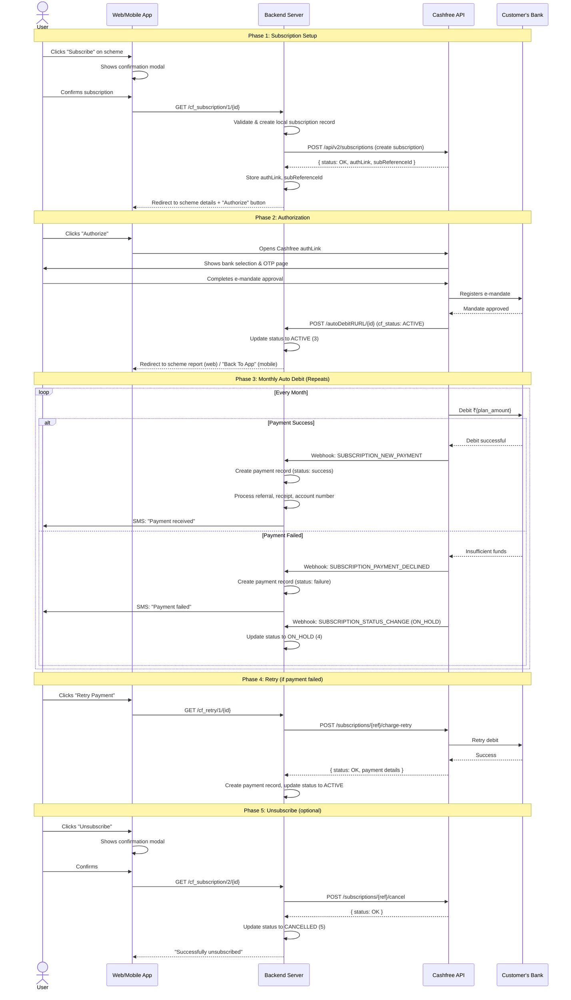

# Auto Debit Flow — Complete End-to-End Analysis

> **Project**: Manjali Jewellers — Chit Scheme Management (CodeIgniter)  
> **Payment Gateway**: Cashfree Subscriptions API v2  
> **Codebase Analysed**: All controllers, models, views, and config files

---

## 1. System Architecture Overview



---

## 2. Prerequisites — Feature Flags & Configuration

Auto debit is **gated behind two flags** that both must be enabled:

| Flag | Location | Purpose |
|------|----------|---------|
| `chit_settings.auto_debit = 1` | `chit_settings` DB table → passed as `$auto_debit` to views | Global company-level toggle. If `0`, no auto-debit UI appears anywhere. |
| `scheme.auto_debit_plan_type = 1` | `scheme` DB table → joined as `s.auto_debit_plan_type` | Per-scheme toggle. Each scheme can independently enable/disable auto debit. Only schemes with `auto_debit_plan_type = 1` show auto debit buttons. |
| `auto_pay_approval` | [config.php:L24](file:///d:/xampp7/htdocs/manjalijewellers_old/application/config/config.php#L24) | Controls payment auto-approval: `0` = No, `1` = Yes (success), `2` = Yes + insert intermediate tables. Currently set to **2**. |

### Gateway Configuration (DB: `gateway` table)

The system pulls Cashfree credentials from the `gateway` table filtered by:
- `id_branch` = the scheme account's branch
- `is_default = 1`  
- `pg_code = 4` (Cashfree)

Fields used:
- `param_1` → **X-Client-Secret** (API secret key)
- `param_3` → **X-Client-Id** (API client ID)
- `api_url` → Cashfree API base URL (e.g., `https://sandbox.cashfree.com/` or production URL)

---

## 3. Database Tables Involved

### `auto_debit_subscription` table
| Column | Purpose |
|--------|---------|
| `id_auto_debit_subscription` | Primary key |
| `id_scheme_account` | FK to `scheme_account` |
| `subscription_id` | Locally generated unique ID sent to Cashfree (`uniqid(time())`) |
| `plan_id` | Maps to `scheme.sync_scheme_code` — the Cashfree plan ID |
| `sub_reference_id` | Cashfree's reference ID returned on successful creation |
| `auth_link` | Authorization URL returned by Cashfree for customer to approve |
| `auth_status` | Current subscription status (integer 1-6, see Status Map below) |
| `message` | Cashfree's status message |
| `status` | Local active flag: `0` = inactive, `1` = active |
| `first_charge_delay` | Days before first charge (set to `0`) |
| `expires_on` | Calculated expiry: current date + remaining installments months |
| `created_on` | Timestamp |
| `last_update` | Last status change timestamp |
| `added_by` | `0` = Web App, `1` = Mobile App |

### `scheme_account` table (relevant columns)
| Column | Purpose |
|--------|---------|
| `auto_debit_status` | Mirrors `auth_status` from subscription table for quick access |

### `payment` table (relevant columns for auto-debit created records)
| Column | Value |
|--------|-------|
| `payment_type` | `"Cash Free"` |
| `payment_mode` | `"Subscription"` |
| `added_by` | `4` (Cashfree Subscription) |
| `remark` | `"Payment done through cashfree subscription"` (success) or Cashfree's decline reason (failure) |

---

## 4. Auto Debit Status Map



| Cashfree Status | Internal Code | DB `auth_status` | User-Facing Label | UI Action Available |
|----------------|--------------|-------------------|-------------------|---------------------|
| *(not subscribed)* | — | `0` | Not Subscribed | **Subscribe** button |
| `INITIALIZED` | 1 | `1` | Initialized | **Authorize** button (links to `auth_link`) |
| `BANK_APPROVAL_PENDING` / `PENDING` | 2 | `2` | Bank Verification Pending | *(wait)* |
| `ACTIVE` | 3 | `3` | Subscribed ✅ | **Unsubscribe** button |
| `ON_HOLD` | 4 | `4` | On Hold | **Retry Payment** button |
| `CANCELLED` | 5 | `5` | Cancelled | **Subscribe** button (re-subscribe) |
| `COMPLETED` | 6 | `6` | Completed | *(none)* |

> Source: [cf_autodebit.php:L22-30](file:///d:/xampp7/htdocs/manjalijewellers_old/application/controllers/cf_autodebit.php#L22-L30)

---

## 5. Complete Flow — Step by Step

### Phase 1: User Initiates Subscription

#### 5.1 — User Sees the "Subscribe" Button

**Conditions for the button to appear** (both must be true):
1. `chit_settings.auto_debit == 1` (global toggle ON)
2. `scheme.auto_debit_plan_type == 1` (this specific scheme has auto debit enabled)
3. `scheme_account.auto_debit_status == 0 OR 5` (not subscribed or previously cancelled)
4. `paid_installments < total_installments` (has pending installments)

**Where it appears:**
- **My Schemes page** ([my_schemes.php:L94-96](file:///d:/xampp7/htdocs/manjalijewellers_old/application/views/chitscheme/my_schemes.php#L94-L96)) — Desktop view: green "Subscribe" button next to scheme card
- **My Schemes page** ([my_schemes.php:L157-159](file:///d:/xampp7/htdocs/manjalijewellers_old/application/views/chitscheme/my_schemes.php#L157-L159)) — Mobile view: same button
- **Scheme Account Details page** ([scheme_acc_details.php:L35-38](file:///d:/xampp7/htdocs/manjalijewellers_old/application/views/chitscheme/scheme_acc_details.php#L35-L38)) — With message: *"Manjali Subscription automates your monthly payments after the initial checkout is completed. Subscribe Now!!"*

#### 5.2 — User Clicks "Subscribe" → Confirmation Modal

A Bootstrap modal appears ([my_schemes.php:L267-285](file:///d:/xampp7/htdocs/manjalijewellers_old/application/views/chitscheme/my_schemes.php#L267-L285)):

```
CONFIRM SUBSCRIPTION
────────────────────
Manjali Subscription automates your monthly payments after the initial 
checkout is completed. You can unsubscribe from Auto-Debit anytime.

Are you sure? You want to Subscribe Manjali Auto-Debit option for 
this Purchase plan?

(Malayalam translation also shown)

[Cancel] [Subscribe]
```

#### 5.3 — User Confirms → Backend Processes Subscription

**Web App URL triggered:**  
```
GET /index.php/chitscheme/cf_subscription/1/{id_scheme_account}
```

**Mobile App URL triggered:**  
```
POST /index.php/mobile_api/cf_subscription_post
```

**What happens in** [cf_subscription() — chitscheme.php:L1646-1785](file:///d:/xampp7/htdocs/manjalijewellers_old/application/controllers/chitscheme.php#L1646-L1785):



#### Data Sent to Cashfree API

The system sends a `POST` to `{api_url}api/v2/subscriptions` with this payload ([chitscheme.php:L1684-1694](file:///d:/xampp7/htdocs/manjalijewellers_old/application/controllers/chitscheme.php#L1684-L1694)):

```json
{
    "subscriptionId": "162281687260ba38682436f",   // uniqid(time())
    "planId":         "GOLD_1000",                  // scheme.sync_scheme_code
    "customerName":   "John Doe",                   // customer name
    "customerEmail":  "john@gmail.com",             // real email or random 8-char@gmail.com
    "customerPhone":  "9876543210",                 // customer mobile
    "firstChargeDelay": 1,                          // 1 day delay before first charge
    "authAmount":     1,                            // ₹1 authorization amount
    "expiresOn":      "2024-12-01 10:30:00",        // now + remaining months
    "returnUrl":      "https://domain.com/index.php/cf_autodebit/autoDebitRURL/{id_sch_ac}"
}
```

**Headers:**
```
X-Client-Id: {gateway.param_3}
X-Client-Secret: {gateway.param_1}
Content-Type: application/x-www-form-urlencoded
```

> Source: [cf_curl() — chitscheme.php:L1787-1816](file:///d:/xampp7/htdocs/manjalijewellers_old/application/controllers/chitscheme.php#L1787-L1816)

---

### Phase 2: User Authorizes the Subscription

After Cashfree creates the subscription, it returns an `authLink` URL. The system stores this in `auto_debit_subscription.auth_link`.

#### 5.4 — User Sees "Authorize" Button

When `auto_debit_status == 1` (INITIALIZED), the view shows:

- **My Schemes page** ([my_schemes.php:L98-99](file:///d:/xampp7/htdocs/manjalijewellers_old/application/views/chitscheme/my_schemes.php#L98-L99)):  
  Green **"Authorize"** button that links directly to Cashfree's `auth_link`

- **Scheme Account Details page** ([scheme_acc_details.php:L40-42](file:///d:/xampp7/htdocs/manjalijewellers_old/application/views/chitscheme/scheme_acc_details.php#L40-L42)):  
  *"Subscription has been created and is ready to be authorized."* + **"Click to authorize"** button

#### 5.5 — User Clicks Authorize → Cashfree Hosted Page

The user is redirected to Cashfree's hosted authorization page where they:
1. Select their bank
2. Authenticate via OTP / Net Banking / UPI
3. Approve the e-mandate (NACH/E-Mandate/UPI Autopay)

#### 5.6 — Cashfree Redirects Back → `autoDebitRURL`

After authorization, Cashfree `POST`s back to:
```
POST /index.php/cf_autodebit/autoDebitRURL/{id_sch_ac}
```

**POST data from Cashfree:**
```php
[
    'cf_authAmount'     => '1.00',
    'cf_message'        => 'Subscription Activated successfully',
    'cf_orderId'        => 'SUB_162281687260ba38682436f_AUTH_46715',
    'cf_referenceId'    => '907582',
    'cf_status'         => 'ACTIVE',          // or INITIALIZED, BANK_APPROVAL_PENDING
    'cf_subReferenceId' => '43225',
    'cf_subscriptionId' => '162281687260ba38682436f',
    'signature'         => 'VfPBjwwokjls4Vh9CpQsC5vq0KWB0FCT1fAvw05PjoY='
]
```

> Source: [cf_autodebit.php:L36-58](file:///d:/xampp7/htdocs/manjalijewellers_old/application/controllers/cf_autodebit.php#L36-L58)

**What happens in** [autoDebitRURL() — cf_autodebit.php:L69-136](file:///d:/xampp7/htdocs/manjalijewellers_old/application/controllers/cf_autodebit.php#L69-L136):



#### Success Path (cf_status = ACTIVE):
- `auto_debit_subscription.auth_status` → `3` (ACTIVE)
- `scheme_account.auto_debit_status` → `3` (ACTIVE)
- **Web**: User is redirected to their scheme account report page
- **Mobile**: Shows green message + "Back To App" button

#### Pending Path (cf_status = INITIALIZED or BANK_APPROVAL_PENDING):
- `auto_debit_subscription.auth_status` → `1` or `2`
- `scheme_account.auto_debit_status` → `1` or `2`
- **Web**: Shows the subscription result view
- **Mobile**: Shows red message + "Back To App" button linking to `/cf_authRedirect/.../pending/{flag}`
  - flag `1` = INITIALIZED, flag `2` = BANK_APPROVAL_PENDING

---

### Phase 3: Recurring Auto Debit Payments (Webhooks)

Once the subscription is `ACTIVE`, Cashfree automatically charges the customer monthly according to the plan. The system receives notifications via webhooks.

**Webhook URL:**
```
POST /index.php/cf_autodebit/wh_response
```

> Source: [wh_response() — cf_autodebit.php:L152-437](file:///d:/xampp7/htdocs/manjalijewellers_old/application/controllers/cf_autodebit.php#L152-L437)

The webhook handles **3 event types**:

---

#### Event 1: `SUBSCRIPTION_STATUS_CHANGE`

**Triggers when**: Cashfree subscription status changes (e.g., ACTIVE → COMPLETED, ACTIVE → CANCELLED)

**Sample webhook POST:**
```json
{
    "cf_event":         "SUBSCRIPTION_STATUS_CHANGE",
    "cf_merchantId":    "37030",
    "cf_subReferenceId":"1",
    "cf_status":        "COMPLETED",
    "cf_lastStatus":    "ACTIVE",
    "cf_eventTime":     "2021-06-09 17:14:53",
    "signature":        "TzXitELQq77QIYSVciDRnJrgHx6xMHwnqee0i3SLc20="
}
```

**Processing** ([cf_autodebit.php:L160-185](file:///d:/xampp7/htdocs/manjalijewellers_old/application/controllers/cf_autodebit.php#L160-L185)):



---

#### Event 2: `SUBSCRIPTION_NEW_PAYMENT` ✅ (The actual auto debit charge)

**Triggers when**: Cashfree successfully debits money from the customer's bank account for a monthly installment.

**Sample webhook POST:**
```json
{
    "cf_event":         "SUBSCRIPTION_NEW_PAYMENT",
    "cf_merchantId":    "37030",
    "cf_subReferenceId":"44075",
    "cf_paymentId":     "1",
    "cf_amount":        "1000",
    "cf_eventTime":     "2021-06-23 10:38:47",
    "cf_referenceId":   "123",
    "signature":        "UqqNmlTzh+gMOXWS2zm+3YCF713YKTZspZscJ4Fstow="
}
```

**Processing** ([cf_autodebit.php:L186-294](file:///d:/xampp7/htdocs/manjalijewellers_old/application/controllers/cf_autodebit.php#L186-L294)):



**Payment record created** ([cf_autodebit.php:L265-288](file:///d:/xampp7/htdocs/manjalijewellers_old/application/controllers/cf_autodebit.php#L265-L288)):

| Field | Value |
|-------|-------|
| `id_scheme_account` | From subscription lookup |
| `payment_amount` | `cf_amount` from Cashfree |
| `payment_type` | `"Cash Free"` |
| `payment_mode` | `"Subscription"` |
| `payment_status` | **1** (success) if `auto_pay_approval` is 1 or 2; **2** (awaiting) otherwise |
| `added_by` | `4` (Cashfree Subscription — distinct from manual, web, mobile) |
| `payment_ref_number` | `cf_paymentId` from Cashfree |
| `metal_rate` | Current day's 22ct gold rate for the branch |
| `metal_weight` | `amount / gold_rate` (only for weight-based or amount-to-weight schemes) |
| `due_month` / `due_year` | Auto-calculated from last paid month |
| `due_type` | `ND` (Normal Due) or `AD` (Additional Due) |
| `remark` | `"Payment done through cashfree subscription"` |
| `no_of_dues` | `1` |
| `gst` / `gst_type` | `0` (no GST on auto debit payments) |

---

#### Event 3: `SUBSCRIPTION_PAYMENT_DECLINED` ❌

**Triggers when**: Cashfree's debit attempt fails (insufficient funds, mandate revoked, etc.)

**Sample webhook POST:**
```json
{
    "cf_event":         "SUBSCRIPTION_PAYMENT_DECLINED",
    "cf_merchantId":    "37030",
    "cf_subReferenceId":"1",
    "cf_paymentId":     "1",
    "cf_amount":        "10",
    "cf_reasons":       "Insufficient amount",
    "cf_eventTime":     "2021-06-23 15:43:27",
    "cf_referenceId":   "1234",
    "signature":        "E7/7Wc7FMfdqBPxmyVgdbsjbmmI7P94c0u1ZO5ilgyY="
}
```

**Processing** ([cf_autodebit.php:L295-427](file:///d:/xampp7/htdocs/manjalijewellers_old/application/controllers/cf_autodebit.php#L295-L427)):



**Key differences from successful payment:**
- `payment_status` → `3` (failure) — hardcoded, not dependent on `auto_pay_approval`
- `remark` → `cf_reasons` from Cashfree (e.g., "Insufficient amount")
- `metal_rate` and `metal_weight` → both `NULL` (not calculated for failed payments)
- **No** receipt generation, referral processing, or intermediate table inserts
- **Does** still send SMS notification about the failure

---

### Phase 4: Retry Failed Payment

When a payment is declined, the subscription goes `ON_HOLD` (status 4). The user can retry.

#### 5.7 — User Sees "Retry Payment" Button

**Conditions**: `auto_debit_status == 4` (ON_HOLD) and `auto_debit == 1` (global toggle ON)

Shows on:
- [my_schemes.php:L104-105](file:///d:/xampp7/htdocs/manjalijewellers_old/application/views/chitscheme/my_schemes.php#L104-L105) — Orange/warning "Retry Payment" button
- [my_schemes.php:L167-169](file:///d:/xampp7/htdocs/manjalijewellers_old/application/views/chitscheme/my_schemes.php#L167-L169) — Mobile view

A confirmation modal appears ([my_schemes.php:L304-320](file:///d:/xampp7/htdocs/manjalijewellers_old/application/views/chitscheme/my_schemes.php#L304-L320)):
```
RETRY PAYMENT
──────────────
Are you sure? You want to retry payment?
[Cancel] [Retry Payment]
```

#### 5.8 — Retry Flow

**URL triggered:**
```
GET /index.php/cf_autodebit/cf_retry/1/{id_scheme_account}
```

> Source: [cf_retry() — cf_autodebit.php:L439-610](file:///d:/xampp7/htdocs/manjalijewellers_old/application/controllers/cf_autodebit.php#L439-L610)



**Cashfree API call for retry:**
```
POST {api_url}/api/v2/subscriptions/{sub_reference_id}/charge-retry
Body: { "subReferenceId": "{sub_reference_id}" }
```

---

### Phase 5: Unsubscribe (Cancel Auto Debit)

#### 5.9 — User Sees "Unsubscribe" Button

**Conditions**: `auto_debit_status == 3` (ACTIVE) and `auto_debit == 1` (global toggle ON)

Shows on:
- [my_schemes.php:L101-102](file:///d:/xampp7/htdocs/manjalijewellers_old/application/views/chitscheme/my_schemes.php#L101-L102) — Red "Unsubscribe" button
- [scheme_acc_details.php:L44-47](file:///d:/xampp7/htdocs/manjalijewellers_old/application/views/chitscheme/scheme_acc_details.php#L44-L47) — With subscription expiry date shown

Confirmation modal ([my_schemes.php:L286-303](file:///d:/xampp7/htdocs/manjalijewellers_old/application/views/chitscheme/my_schemes.php#L286-L303)):
```
CONFIRM UNSUBSCRIBE
────────────────────
Are you sure? You want to Unsubscribe Manjali Auto-Debit option 
for this Purchase plan?

(Malayalam translation also shown)

[Cancel] [Unsubscribe]
```

#### 5.10 — Unsubscribe Flow

**URL triggered:**
```
GET /index.php/chitscheme/cf_subscription/2/{id_scheme_account}
```

> Source: [cf_subscription() case 2 — chitscheme.php:L1746-1783](file:///d:/xampp7/htdocs/manjalijewellers_old/application/controllers/chitscheme.php#L1746-L1783)



After unsubscription:
- `auto_debit_subscription.auth_status` → `5` (CANCELLED)
- `auto_debit_subscription.status` → `0` (inactive)
- `scheme_account.auto_debit_status` → `5` (CANCELLED)
- The user can **re-subscribe** — the Subscribe button will reappear since status is now `5`

---

## 6. Mobile App Flow

The mobile app has its own equivalent function at [mobile_api.php:L11026](file:///d:/xampp7/htdocs/manjalijewellers_old/application/controllers/mobile_api.php#L11026):

```
POST /index.php/mobile_api/cf_subscription_post
```

The flow is identical to the web app's `cf_subscription()` with these differences:
- `added_by` = `1` (Mobile App) instead of `0` (Web App)
- Returns JSON response instead of redirecting
- The `returnUrl` still points to `cf_autodebit/autoDebitRURL/{id}` — same callback handler
- After authorization, mobile users see a styled HTML page with a "Back To App" button that uses a custom deep link scheme (`cf_authRURL/success` or `cf_authRURL/pending/{flag}`)

**Mobile In-App Browser behavior** ([cf_autodebit.php:L98-110](file:///d:/xampp7/htdocs/manjalijewellers_old/application/controllers/cf_autodebit.php#L98-L110)):
- Detects mobile via user-agent regex
- If `ACTIVE` → green "Back To App" button → redirect to `/cf_authRedirect/cf_authRURL/success`
- If other status → red "Back To App" button → redirect to `/cf_authRedirect/cf_authRURL/pending/{flag}`
- The app intercepts these URLs to navigate back within the native app

---

## 7. Logging

Every step is extensively logged:

| Log Directory | File Pattern | What It Captures |
|---------------|-------------|------------------|
| `log/cf_subscription/` | `{date}.txt` | Subscription creation return URL callbacks (POST data + results) |
| `log/cf_hook/` | `{date}_postData.txt` | All raw webhook POST data |
| `log/cf_hook/` | `{date}_status_change.txt` | Subscription status change events |
| `log/cf_hook/` | `{date}_new_payment.txt` | Successful payment events |
| `log/cf_hook/` | `{date}_pay_declined.txt` | Declined payment events |
| `log/cf_hook/` | `{date}_empty_post.txt` | Empty POST data received |

---

## 8. SMS Notifications

Payment notifications use **Service ID 7**. When a payment is created (success or failure):

1. Check if SMS service is enabled (`services_modal->checkService(7)`)
2. If enabled, fetch formatted SMS data (`services_modal->get_SMS_data(7, payment_id)`)
3. Send via configured gateway:
   - Gateway `1` → MSG91
   - Gateway `2` → Nettyfish (transactional)

> Source: [cf_autodebit.php:L396-408](file:///d:/xampp7/htdocs/manjalijewellers_old/application/controllers/cf_autodebit.php#L396-L408) and [L711-724](file:///d:/xampp7/htdocs/manjalijewellers_old/application/controllers/cf_autodebit.php#L711-L724)

---

## 9. Payment Post-Processing (via `createPayment`)

For **successful** payments (and retries), the system does extensive post-processing in [createPayment() — cf_autodebit.php:L646-741](file:///d:/xampp7/htdocs/manjalijewellers_old/application/controllers/cf_autodebit.php#L646-L741):

| Step | Condition | Action |
|------|-----------|--------|
| **Referral Benefits** | `chit_settings.allow_referral == 1` and referral conditions met | Inserts wallet transaction for referral value |
| **Receipt Number** | `chit_settings.receipt_no_set == 1` and `auto_pay_approval` is 1/2/3 | Auto-generates receipt like `MJL000042` |
| **Account Number** | `chit_settings.schemeacc_no_set == 0` and no account number yet | Auto-generates scheme account number |
| **First Payment Amount** | `firstPayamt_payable == 1` and no first payment recorded | Records first payment amount in scheme_account |
| **Intermediate Tables** | `auto_pay_approval` is 2 or 3 | Inserts into sync/intermediate tables for external ERP integration |
| **SMS** | Service ID 7 enabled | Sends SMS to customer |

---

## 10. Complete URL Reference

| URL | Method | Controller | Function | Purpose |
|-----|--------|------------|----------|---------|
| `/chitscheme/cf_subscription/1/{id}` | GET | chitscheme | [cf_subscription](file:///d:/xampp7/htdocs/manjalijewellers_old/application/controllers/chitscheme.php#L1646) | Web: Create subscription |
| `/chitscheme/cf_subscription/2/{id}` | GET | chitscheme | [cf_subscription](file:///d:/xampp7/htdocs/manjalijewellers_old/application/controllers/chitscheme.php#L1746) | Web: Cancel subscription |
| `/mobile_api/cf_subscription_post` | POST | mobile_api | [cf_subscription_post](file:///d:/xampp7/htdocs/manjalijewellers_old/application/controllers/mobile_api.php#L11026) | Mobile: Create subscription |
| `/cf_autodebit/autoDebitRURL/{id}` | POST | cf_autodebit | [autoDebitRURL](file:///d:/xampp7/htdocs/manjalijewellers_old/application/controllers/cf_autodebit.php#L69) | Cashfree return URL after authorization |
| `/cf_autodebit/wh_response` | POST | cf_autodebit | [wh_response](file:///d:/xampp7/htdocs/manjalijewellers_old/application/controllers/cf_autodebit.php#L152) | Webhook receiver for all 3 events |
| `/cf_autodebit/cf_retry/1/{id}` | GET | cf_autodebit | [cf_retry](file:///d:/xampp7/htdocs/manjalijewellers_old/application/controllers/cf_autodebit.php#L439) | Retry failed payment |
| `/cf_autodebit/cf_authRedirect/{status}` | GET | cf_autodebit | [cf_authRedirect](file:///d:/xampp7/htdocs/manjalijewellers_old/application/controllers/cf_autodebit.php#L138) | Mobile app redirect page |

---

## 11. Key Files Reference

| File | Role |
|------|------|
| [cf_autodebit.php](file:///d:/xampp7/htdocs/manjalijewellers_old/application/controllers/cf_autodebit.php) | Core controller — handles return URL, webhooks, retry |
| [chitscheme.php](file:///d:/xampp7/htdocs/manjalijewellers_old/application/controllers/chitscheme.php) | Web app — subscription create/cancel, cURL to Cashfree |
| [mobile_api.php](file:///d:/xampp7/htdocs/manjalijewellers_old/application/controllers/mobile_api.php) | Mobile app — subscription create/cancel |
| [scheme_modal.php](file:///d:/xampp7/htdocs/manjalijewellers_old/application/models/scheme_modal.php) | DB queries — plan details, subscription CRUD |
| [payment_modal.php](file:///d:/xampp7/htdocs/manjalijewellers_old/application/models/payment_modal.php) | Payment record management, metal rates, receipt numbers |
| [my_schemes.php](file:///d:/xampp7/htdocs/manjalijewellers_old/application/views/chitscheme/my_schemes.php) | User-facing scheme list with auto debit buttons |
| [scheme_acc_details.php](file:///d:/xampp7/htdocs/manjalijewellers_old/application/views/chitscheme/scheme_acc_details.php) | Individual scheme account detail view |
| [config.php](file:///d:/xampp7/htdocs/manjalijewellers_old/application/config/config.php) | `auto_pay_approval` setting |

---

## 12. End-to-End Summary Sequence Diagram


