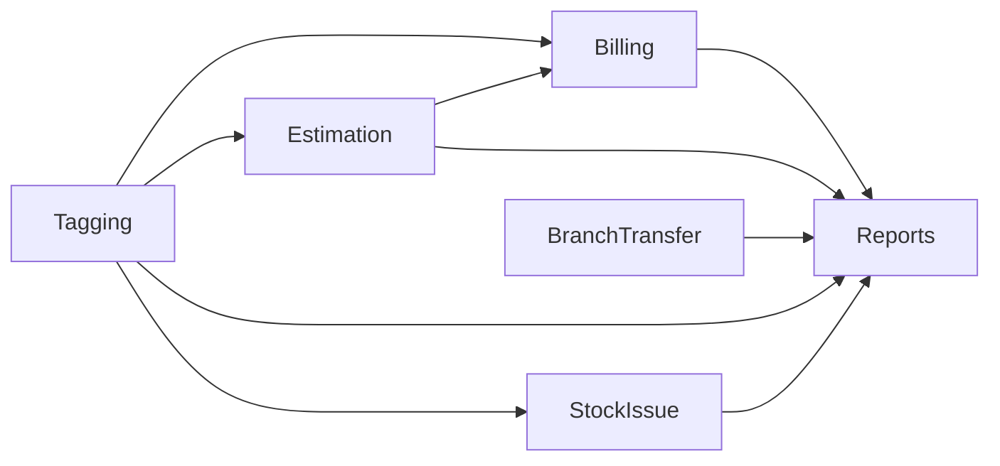

# Build System Brain Workflow

> **Purpose**: Aggregate data from all individual module brains into a cross-module knowledge layer. This enables cross-module bug diagnosis, shared-table impact analysis, and report consistency checks.
> **Prereq**: Minimum 3 module brains built via `/build-module-brain`. Recommended: 6+.
> **Time**: ~30 min initial build. ~5 min per incremental module add. ~15 min quarterly refresh.

## When to Use

| Trigger                                       | Mode                               | Time    |
| --------------------------------------------- | ---------------------------------- | ------- |
| 3+ module brains exist, system brain doesn't  | **Initial Build** (Steps 1-8b)     | ~35 min |
| New module brain just built                   | **Incremental Add** (Steps 1, 4-7) | ~5 min  |
| Quarterly health check / after major refactor | **Full Refresh** (Steps 1-8)       | ~15 min |
| Setup for new client                          | **Copy + Refine** (see note)       | ~10 min |

## Output

```
knowledge_brain/_SYSTEM/
├── SHARED_TABLES.md          ← Tables used by 2+ modules (the #1 cross-module risk)
├── MODULE_DEPENDENCIES.md    ← Which modules call each other's models/AJAX endpoints
├── SHARED_MODELS.md          ← common_model, auth_model — who calls what
├── CROSS_MODULE_BUGS.md      ← Bugs that span multiple modules (history + active)
├── SYSTEM_COVERAGE.md        ← Coverage: how many modules have brains, % of system
├── TAG_STATUS_MAP.md         ← All tag_status values, which modules set each, state diagram
├── DATA_FLOW_CHAINS.md       ← End-to-end business flows (Lot→Tag→Estimate→Bill→Report)
├── VALIDATION_GAPS.md        ← Server-trusts-client gaps, SQL injection risks
├── HARDCODED_VALUES.md       ← Magic numbers, hardcoded dates/UIDs/tax rates
├── CLEANUP_GAPS.md           ← Missing cascades on delete/cancel/reverse
├── PERFORMANCE_RISKS.md      ← Missing indexes, date() wrapping, wide tables
├── DIAGNOSTIC_PLAYBOOK.md    ← Symptom→suspect rules ("when you see X, suspect Y first")
├── DANGER_ZONES.md           ← NEVER rules (hard stops that prevent catastrophic mistakes)
└── HANDOFF_AUDIT.md          ← Cross-module contract verification (inbound↔outbound match)
```

> **Documents 1-5** are generated from Round 1 (Steps 4-8).
> **Documents 6-11** are generated from deep enhancement rounds reading BUSINESS_RULES.md, SCHEMA_ANALYSIS.md, FORENSIC_TEMPLATE.md, and INVARIANT_MATRIX.md across all module brains.
> **HANDOFF_AUDIT.md** is generated from Step 8b reading all FLOW_RISK_MATRIX.md files across module brains.

---

## Steps

### Step 0: Pre-Check [Antigravity]

// turbo

1. Load `.agent/config.md` → get `{PROJECT_ROOT}`, Module Registry
2. List all directories in `knowledge_brain/`:
   ```powershell
   Get-ChildItem "{PROJECT_ROOT}\knowledge_brain" -Directory | Where-Object { $_.Name -ne '_TEMPLATE' -and $_.Name -ne '_SYSTEM' }
   ```
3. For each brain dir, verify `MODULE_BRAIN.md` exists
4. Count: `{N}` brains found

**If < 3 brains** → STOP: "Only {N} module brains exist. Build at least 3 before running system brain. Run `/build-module-brain` first."

**If ≥ 3 brains** → proceed

5. Check if `_SYSTEM/` already exists:
   - **No** → Initial Build (all steps)
   - **Yes** → ask: Incremental Add (new module) or Full Refresh?

### Step 1: Read All CROSS_MODULE_MAP.md Files [Antigravity]

// turbo

For each module brain:

1. Read `knowledge_brain/{MODULE}/CROSS_MODULE_MAP.md`
2. Extract:
   - External models loaded (e.g., Billing loads `ret_taging_model`)
   - External tables read (e.g., Estimation reads `ret_taging`)
   - External tables written (e.g., Billing writes `ret_journal`)
   - Cross-module AJAX calls (e.g., Billing calls `/admin_ret_tagging/getStoneItems`)
3. If `CROSS_MODULE_MAP.md` doesn't exist → read `MODULE_BRAIN.md` constructor section for loaded models

Store all extracted data in memory for next steps.

### Step 2: Read All METHOD_INDEX.md Files [Antigravity]

// turbo

For each module brain:

1. Read `knowledge_brain/{MODULE}/METHOD_INDEX.md`
2. Extract the **Table → Methods Reverse Map** section
3. Build a master table list: `{table_name} → [{module_1, method_1}, {module_2, method_2}, ...]`

This reveals which tables are touched by multiple modules — the core cross-module risk.

### Step 3: Read All SCHEMA_ANALYSIS.md Files [Antigravity]

// turbo

For each module brain:

1. Read `knowledge_brain/{MODULE}/SCHEMA_ANALYSIS.md` (if exists)
2. Extract: table names, column counts, engine types
3. Cross-reference with Step 2 master table list

### Step 3b: Read All FLOW_RISK_MATRIX.md Files [Antigravity]

// turbo

For each module brain:

1. Read `knowledge_brain/{MODULE}/FLOW_RISK_MATRIX.md` (if exists)
2. Extract:
   - **State machines**: entity + status field + all values + who sets each
   - **Inbound contracts**: upstream module + expected state + whether checked in code
   - **Outbound contracts**: downstream module + what's guaranteed + enforcement method
   - **Reversal contracts**: operation + tables that should be restored + actual status
   - **Flow risk checklist**: all FR-{MOD}-xxx items and their verification status
3. If `FLOW_RISK_MATRIX.md` doesn't exist → note module as "no flow contracts" in HANDOFF_AUDIT.md

Store all contract data in memory for Step 8b.

### Step 4: Generate SHARED_TABLES.md [Antigravity]

Create `knowledge_brain/_SYSTEM/SHARED_TABLES.md`:

```markdown
# Shared Tables — Cross-Module Risk Map

> Tables used by 2+ modules. Changes to these tables affect multiple modules.
> Last updated: {TODAY}
> Modules scanned: {N}

## Risk Levels

- 🔴 **HIGH**: Table written by 2+ modules (data corruption risk)
- 🟡 **MEDIUM**: Table read by 2+ modules but written by only 1 (stale read risk)
- 🟢 **LOW**: Lookup/config table — read-only by all modules

## Shared Table Matrix

| Table          | Owner Module | Read By                                  | Written By | Risk   | Key Columns          |
| -------------- | ------------ | ---------------------------------------- | ---------- | ------ | -------------------- |
| ret_taging     | Tagging      | Billing, Reports, Estimation, StockIssue | Tagging    | 🟡     | id_tagging, gwt, nwt |
| ret_estimation | Estimation   | Billing, Reports                         | Estimation | 🟡     | id_estimation, total |
| {table}        | {module}     | {list}                                   | {list}     | {risk} | {columns}            |

## High-Risk Tables (Written by 2+ Modules)

> [!CAUTION]
> These tables receive writes from multiple modules. A bug fix in one module
> can corrupt data for another. Always check ALL writing modules before changing
> INSERT/UPDATE logic.

| Table   | Written By                          | What Each Writes |
| ------- | ----------------------------------- | ---------------- |
| {table} | Module A: {what} / Module B: {what} |                  |

## Impact Lookup

When changing a table, check this list:

| If you change...         | Check these modules...                            |
| ------------------------ | ------------------------------------------------- |
| `ret_taging` columns     | Tagging, Billing, Reports, Estimation, StockIssue |
| `ret_estimation` columns | Estimation, Billing, Reports                      |
| {table}                  | {modules}                                         |
```

### Step 5: Generate MODULE_DEPENDENCIES.md [Antigravity]

Create `knowledge_brain/_SYSTEM/MODULE_DEPENDENCIES.md`:

````markdown
# Module Dependencies Map

> Which modules depend on which. Use this before modifying any shared code.
> Last updated: {TODAY}

## Dependency Matrix

| Module     | Depends On                                               | Depended On By                           |
| ---------- | -------------------------------------------------------- | ---------------------------------------- |
| Billing    | Tagging, Estimation, Reports                             | Reports                                  |
| Estimation | Tagging                                                  | Billing, Reports                         |
| Reports    | Billing, Estimation, Tagging, BranchTransfer, StockIssue | —                                        |
| Tagging    | —                                                        | Billing, Estimation, Reports, StockIssue |
| {module}   | {list}                                                   | {list}                                   |

## Dependency Graph


````

## Cross-Module AJAX Calls

| Source Module | Target Controller | Endpoint       | What Data     | Risk                                |
| ------------- | ----------------- | -------------- | ------------- | ----------------------------------- |
| Billing JS    | admin_ret_tagging | /getStoneItems | Stone details | Target could change response format |
| {source}      | {target}          | {endpoint}     | {data}        | {risk}                              |

## Shared Model Usage

| Model        | Loaded By   | Key Methods Used                                        |
| ------------ | ----------- | ------------------------------------------------------- |
| common_model | ALL modules | get_branch_list, get_metal_list, insertData, updateData |
| auth_model   | ALL modules | check_login, get_permissions                            |
| {model}      | {modules}   | {methods}                                               |

````

### Step 6: Generate SHARED_MODELS.md [Antigravity]

Create `knowledge_brain/_SYSTEM/SHARED_MODELS.md`:

```markdown
# Shared Models — Cross-Module Function Map

> Models loaded by 2+ modules. Changing a method here affects ALL loading modules.
> Last updated: {TODAY}

## common_model

| Method | Called By Modules | Tables Touched | Risk if Changed |
|---|---|---|---|
| insertData($table, $data) | ALL | {any} | 🔴 Universal — breaks all inserts |
| updateData($table, $data, $where) | ALL | {any} | 🔴 Universal — breaks all updates |
| get_branch_list() | ALL | ret_branch | 🟡 UI dropdown — wrong data |
| {method} | {modules} | {tables} | {risk} |

## admin_settings_model

| Method | Called By Modules | What It Returns | Risk if Changed |
|---|---|---|---|
| {method} | {modules} | {description} | {risk} |

> [!WARNING]
> Before modifying ANY method in a shared model, grep ALL controllers to find callers:
> ```powershell
> Select-String -Pattern "method_name" -Path "{PROJECT_ROOT}\application\controllers\*.php"
> ```
````

### Step 7: Generate CROSS_MODULE_BUGS.md [Antigravity]

Create `knowledge_brain/_SYSTEM/CROSS_MODULE_BUGS.md`:

```markdown
# Cross-Module Bug History

> Bugs that affected 2+ modules. Learn from these to prevent future cross-module issues.
> Last updated: {TODAY}

## Active Cross-Module Bugs

| Bug ID           | Modules Affected | Description | Status |
| ---------------- | ---------------- | ----------- | ------ |
| (none currently) |                  |             |        |

## Resolved Cross-Module Bugs

| Bug ID    | Modules Affected                             | Root Cause                        | Fix                                        | Date       |
| --------- | -------------------------------------------- | --------------------------------- | ------------------------------------------ | ---------- |
| RPT-INT01 | Reports (categorywise vs categorywise_stone) | Missing query in variant function | Added Branch Transfer Out status log query | 2026-03-04 |

## Cross-Module Patterns

| Pattern                        | Frequency                | Prevention                                  |
| ------------------------------ | ------------------------ | ------------------------------------------- |
| Variant function missing query | 1 occurrence             | CONSISTENCY_RULES.md Rule-01 automated test |
| Shared table column mismatch   | (check after more fixes) | \_SYSTEM/SHARED_TABLES.md impact lookup     |
```

### Step 8: Generate SYSTEM_COVERAGE.md [Antigravity]

Create `knowledge_brain/_SYSTEM/SYSTEM_COVERAGE.md`:

```markdown
# System Brain Coverage

> How much of the system has brain coverage?
> Last updated: {TODAY}

## Module Coverage

| Module          | Brain? | Audit? | Consistency Rules? | Last Updated |
| --------------- | ------ | ------ | ------------------ | ------------ |
| Estimation      | ✅     | ✅     | ❌                 | {date}       |
| Billing         | ✅     | ❌     | ❌                 | {date}       |
| Reports         | ✅     | ❌     | ✅ (4 rules)       | {date}       |
| Tagging         | ✅     | ❌     | ❌                 | {date}       |
| Branch Transfer | ✅     | ❌     | ❌                 | {date}       |
| Stock Issue     | ✅     | ❌     | ❌                 | {date}       |
| Sales           | ❌     | ❌     | ❌                 | —            |
| Purchase        | ❌     | ❌     | ❌                 | —            |
| Payment         | ❌     | ❌     | ❌                 | —            |
| LOT             | ❌     | ❌     | ❌                 | —            |

## Coverage Summary

| Metric                           | Count |
| -------------------------------- | ----- |
| Total modules in registry        | {N}   |
| Modules with brain               | {N}   |
| Modules with audit               | {N}   |
| Brain coverage                   | {N}%  |
| Shared tables documented         | {N}   |
| Cross-module dependencies mapped | {N}   |

## Refresh History

| Date    | Mode          | Modules Scanned | Changes                         |
| ------- | ------------- | --------------- | ------------------------------- |
| {TODAY} | Initial Build | {N} modules     | Created all \_SYSTEM/ documents |
```

### Step 8b: Generate HANDOFF_AUDIT.md [Antigravity]

Create `knowledge_brain/_SYSTEM/HANDOFF_AUDIT.md`:

```markdown
# Handoff Audit — Cross-Module Contract Verification

> Matches each module's outbound contracts against the next module's inbound contracts.
> Mismatches here = flow-wise bugs waiting to happen.
> Last updated: {TODAY}
> Modules with FLOW_RISK_MATRIX: {N}/{TOTAL}

## Contract Match Matrix

| Module A (Outbound) | Guarantee | Module B (Inbound) | Expectation | Match? | Risk |
|---|---|---|---|---|---|
| Tagging | tag_status=0 on create | Estimation | tag_status=0 required | ✅ Match | — |
| Estimation | estbillid=NULL if not billed | Billing | Checks estbillid before billing | ❓ Unverified | Double billing |
| Billing | tag_status=1 after sale | Reports | Reads tag_status for stock count | ✅ Match | — |
| Billing | cancel restores tag_status=0 | Estimation | No re-billing guard | ❌ Gap | Re-billing possible |

## Unmatched Contracts

> Outbound contracts with no corresponding inbound check, or vice versa.

| Module | Direction | Contract | No Match Because |
|---|---|---|---|
| {module} | Outbound: guarantees X | {downstream} has no inbound check for X | Missing validation |
| {module} | Inbound: expects Y | {upstream} has no outbound guarantee for Y | Assumption not enforced |

## Reversal Gap Summary

> Aggregated from all module FLOW_RISK_MATRIX reversal contracts.

| Module | Operation | Tables Not Restored | Severity |
|---|---|---|---|
| Billing | Cancel bill | ret_billing_advance | 🔴 Advance amount not returned |
| {module} | {operation} | {table} | {severity} |

## State Machine Conflicts

> Status values set by multiple modules — potential for conflicting writes.

| Entity.Field | Value | Set By Module A | Set By Module B | Conflict? |
|---|---|---|---|---|
| ret_taging.tag_status | 1 (Sold) | Billing.billing('save') | — | ✅ Single writer |
| ret_taging.tag_status | 0 (Available) | Tagging.tagging('save') | Billing.cancel_bill() | ⚠️ Two writers — acceptable (create vs restore) |

## Flow Risk Summary

| Priority | Total Scenarios | Verified | Unverified |
|---|---|---|---|
| 🔴 HIGH | {N} | {N} | {N} |
| 🟡 MED | {N} | {N} | {N} |
| 🟢 LOW | {N} | {N} | {N} |

## Modules Missing FLOW_RISK_MATRIX

| Module | Brain Exists? | FLOW_RISK_MATRIX? | Action Needed |
|---|---|---|---|
| {module} | ✅ | ❌ | Run `/build-module-brain` Refresh with Step 3b |
```

To build this:
1. For each module's **outbound contracts**, find the corresponding downstream module's **inbound contracts**
2. Compare: does the outbound guarantee match the inbound expectation?
3. Flag `✅ Match`, `❓ Unverified` (one side missing FLOW_RISK_MATRIX), or `❌ Gap`
4. Aggregate all reversal gaps across modules
5. Cross-reference state machines: find status fields written by 2+ modules
6. Summarize all FR-xxx flow risk scenarios with verification status

---

## Incremental Add (After New Module Brain)

When a new module brain is built:

1. Run Step 0 → detect existing `_SYSTEM/`
2. Read ONLY the new module’s `CROSS_MODULE_MAP.md` and `METHOD_INDEX.md`
3. For the Round 1 `_SYSTEM/` documents:
   - Add new module’s entries to `SHARED_TABLES.md`
   - Add new module’s entries to `MODULE_DEPENDENCIES.md`
   - Add new model usage to `SHARED_MODELS.md`
   - Update `SYSTEM_COVERAGE.md` module table
4. Read the new module’s `BUSINESS_RULES.md`, `SCHEMA_ANALYSIS.md`, `FORENSIC_TEMPLATE.md`:
   - Update `TAG_STATUS_MAP.md` if module touches tag_status
   - Update `VALIDATION_GAPS.md` with any new server-trusts-client gaps
   - Update `HARDCODED_VALUES.md` with any new magic numbers
   - Update `CLEANUP_GAPS.md` with any missing cascades
   - Update `PERFORMANCE_RISKS.md` with any new index/query risks
   - Update `DATA_FLOW_CHAINS.md` if module participates in an existing flow
5. Read the new module's `FLOW_RISK_MATRIX.md` (if exists):
   - Match new module's outbound contracts against existing modules' inbound contracts in `HANDOFF_AUDIT.md`
   - Match existing modules' outbound contracts against new module's inbound contracts
   - Add any new reversal gaps and state machine entries
   - Update flow risk summary counts
6. Update the Mermaid dependency graph
7. Bump `Last updated` on all modified files

**Do NOT re-read existing module brains.** Only add the delta from the new module.
**Exception for HANDOFF_AUDIT**: You MAY read existing modules' `FLOW_RISK_MATRIX.md` outbound contracts section to match against the new module's inbound contracts.

---

## Full Refresh

Run all Steps 1-8b from scratch. Use when:

- Quarterly health check
- After major code refactor
- After `build-module-brain` runs in Refresh/Upgrade mode on 3+ modules
- Suspected stale data in `_SYSTEM/`
- After 3+ modules get `FLOW_RISK_MATRIX.md` added (to generate/refresh HANDOFF_AUDIT)

---

## For New Clients (via /setup-existing-client)

1. Copy `_SYSTEM/` directory along with module brains (Step 2 of setup-existing-client)
2. Mark as derived: add `⚠️ DERIVED from {SOURCE}` header to each file
3. Verify: client may have fewer modules → remove missing modules from all tables
4. After client brain refinement → run Incremental Add for any differences found
5. **CRITICAL**: Ensure `DIAGNOSTIC_PLAYBOOK.md` and `DANGER_ZONES.md` are included in the copy
   - These files contain cross-project knowledge that applies to ALL clients
   - The POSTMORTEM_LOG.md should also be copied from source (in `bug_report_AI/`)

---

## Completion Report

```
✅ System Brain — {MODE} complete

   Modules scanned: {N}

   📊 SYSTEM COVERAGE:
   ├── SHARED_TABLES.md:         {N} tables mapped ({N} high-risk)
   ├── MODULE_DEPENDENCIES.md:   {N} dependency links
   ├── SHARED_MODELS.md:         {N} shared model methods mapped
   ├── CROSS_MODULE_BUGS.md:     {N} historical, {N} active
   ├── SYSTEM_COVERAGE.md:       {N}/{TOTAL} modules covered ({N}%)
   ├── TAG_STATUS_MAP.md:        {N} status values mapped
   ├── DATA_FLOW_CHAINS.md:      {N} end-to-end flows documented
   ├── VALIDATION_GAPS.md:       {N} gaps ({N} critical)
   ├── HARDCODED_VALUES.md:      {N} hardcoded items ({N} critical)
   ├── CLEANUP_GAPS.md:          {N} missing cascades
   ├── PERFORMANCE_RISKS.md:     {N} performance risks
   └── HANDOFF_AUDIT.md:         {N} contracts matched, {N} gaps, {N} unverified

   Brain location: knowledge_brain/_SYSTEM/

   Next refresh: {date + 90 days}
   Next recommended: Build brain for {MODULE} (highest estimated risk)
```
