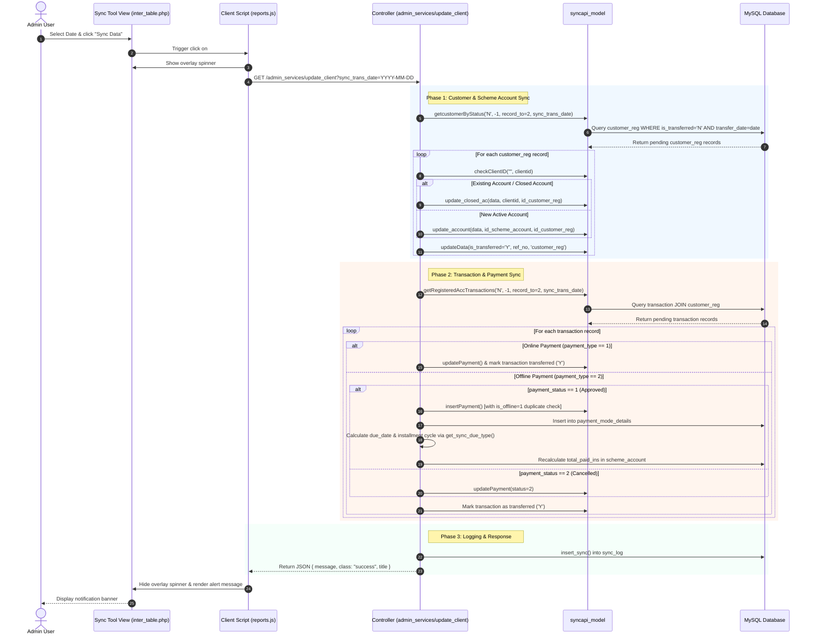

# Inter-Table Un-Updated Data Synchronization Workflow

This document details the technical workflow for syncing un-transferred customer registrations and transaction records (`customer_reg` and `transaction`) into operational tables (`scheme_account` and `payment`).

---

## 1. Overview & Purpose

In multi-branch / hybrid (online & offline) jeweler management systems, customer registrations and payment transactions are initially staged in inter-tables (`customer_reg` and `transaction`) marked with transfer flags (`is_transferred = 'N'`).

The **Sync Un-Updated Data** flow processes these pending records for a specified transaction date (`sync_trans_date`), syncs account metadata to `scheme_account`, posts payments to `payment` and `payment_mode_details`, updates account paid installment counts, and marks processed records as transferred (`is_transferred = 'Y'`).

---

## 2. System Architecture & Components

### 2.1 File Map

| Component Layer | Relative File Path | Responsibility |
| :--- | :--- | :--- |
| **View (UI)** | `admin/application/views/reports/inter_table_rep/inter_table.php` | Date picker control, "Sync Data" trigger button, and status alerts. |
| **JS Controller** | `admin/assets/js/reports.js` | Listens to `#sync_data` click, formats date parameter, sends AJAX GET request, handles spinner & alerts. |
| **API Controller** | `admin/application/controllers/admin_services.php` | `Admin_services::update_client()` controller method executing synchronization logic. |
| **Sync API Model** | `admin/application/models/syncapi_model.php` | Handles DB queries for fetching pending inter-table data and updating operational tables. |
| **Account Model** | `admin/application/models/account_model.php` | Handles sync audit log insertions (`sync_log`). |
| **Payment Model** | `admin/application/models/payment_model.php` | Handles payment mode detail updates and paid installment calculations. |

---

## 3. Sequence Architecture Diagram



---

## 4. Detailed Execution Logic Breakdown

### 4.1 Step 1: Frontend Request Trigger
1. **User Action**: Admin navigates to `admin/index.php/reports/inter_table/list` and selects a transaction date in `#single_date` (e.g. `2026-07-23`).
2. **AJAX Execution**: `#sync_data` triggers an HTTP `GET` request:
   ```http
   GET /admin/index.php/admin_services/update_client?sync_trans_date=2026-07-23 HTTP/1.1
   ```

---

### 4.2 Step 2: Customer Registration & Scheme Account Syncing
The API queries un-transferred customer registrations:
- **Condition**: `customer_reg.record_to = 2` (Online), `customer_reg.is_transferred = 'N'`, `customer_reg.transfer_date = sync_trans_date`.
- **Iteration Logic**:
  1. Checks if `is_modified == 1` and `is_registered_online >= 1`.
  2. Executes `checkClientID("", $client['clientid'])`:
     - **If Client ID exists in `scheme_account`**: Updates account closing attributes (`closed_by`, `closing_date`, `closing_amount`, `closing_weight`, `is_closed`, `active`) in `scheme_account`.
     - **If Client ID is new**: Updates `group_code`, `scheme_acc_number`, `ref_no` in `scheme_account`.
  3. Updates `customer_reg`: sets `is_transferred = 'Y'`, `is_modified = 'N'`, `transfer_date = CURDATE()`.

---

### 4.3 Step 3: Transaction & Payment Syncing
The API queries un-transferred registered transactions:
- **Condition**: `transaction.record_to = 2` (Online), `transaction.is_transferred = 'N'`, `transaction.transfer_date = sync_trans_date`, and customer is registered online (`is_registered_online > 0`).

#### 3.3.1 Handling Online Payments (`payment_type == 1`)
- Checks if scheme account exists in `scheme_account`.
- If `is_modified == 1` and `payment_status == 1`:
  - Updates `receipt_no` and `payment_ref_number` in `payment` table.
  - Updates `transaction`: sets `is_transferred = 'Y'`, `is_modified = 0`.

#### 3.3.2 Handling Offline Payments (`payment_type == 2`)
- Checks if scheme account exists in `scheme_account`.
- **When Payment is Active (`payment_status == 1`)**:
  1. Inserts into `payment` table via `insertPayment()` (which enforces unique constraint check on `is_offline = 1 AND payment_ref_number = ref_no`).
  2. Inserts entry in `payment_mode_details` table with mode, amount, and reference number.
  3. Evaluates due cycle using `get_sync_due_type($id_scheme_account, $payment_date)` and updates `due_date`, `due_date_to`, `grace_date`, `installment` in `payment`.
  4. Recalculates total paid installments for the account using `getPaidInsData()` and updates `scheme_account.total_paid_ins`.
- **When Payment is Cancelled (`payment_status != 1`)**:
  1. Updates `payment` table status to `2` (Cancelled).
- Marks `transaction` record as transferred (`is_transferred = 'Y'`).

---

### 4.4 Step 4: Audit Logging & Response Generation
1. Summarizes synced statistics:
   - `total_records`: Sum of processed customer & transaction rows.
   - `scheme_accounts`: Total updated scheme accounts.
   - `payments`: Total updated payment rows.
   - `remark`: JSON encoded list of updated account IDs and payment reference numbers.
2. Inserts audit summary record into `sync_log`.
3. Returns JSON response:
   ```json
   {
     "message": "Total 15 records .Updated 5 scheme accounts and 10 payments records.",
     "class": "success",
     "title": "Update Client Details"
   }
   ```

---

## 5. Database Schema & Data Dictionary

### 5.1 Inter-Tables (Staging)

#### `customer_reg` Table
| Field | Type | Description |
| :--- | :--- | :--- |
| `id_customer_reg` | `INT` (PK) | Auto-increment primary key. |
| `clientid` | `VARCHAR` | Unique Client Reference ID. |
| `id_scheme_account` | `INT` (FK) | Reference to target `scheme_account`. |
| `is_transferred` | `ENUM('Y','N')` | Synchronization status flag (`N` = Pending, `Y` = Synced). |
| `is_modified` | `TINYINT` | Record modification flag (`1` = Pending sync). |
| `record_to` | `TINYINT` | Target environment (`2` = Online). |
| `transfer_date` | `DATE` | Staged transfer/sync date. |

#### `transaction` Table
| Field | Type | Description |
| :--- | :--- | :--- |
| `id_transaction` | `INT` (PK) | Auto-increment primary key. |
| `client_id` | `VARCHAR` | Client Reference ID. |
| `ref_no` | `VARCHAR` | Unique transaction reference number / receipt reference. |
| `id_scheme_account` | `INT` (FK) | Target scheme account ID. |
| `payment_type` | `TINYINT` | Payment category (`1` = Online, `2` = Offline). |
| `payment_status` | `TINYINT` | Status (`1` = Success/Approved, `2` = Cancelled). |
| `is_transferred` | `ENUM('Y','N')` | Synchronization status flag (`N` = Pending, `Y` = Synced). |

---

### 5.2 Operational Tables (Target)

#### `scheme_account` Table
| Field | Type | Description |
| :--- | :--- | :--- |
| `id_scheme_account` | `INT` (PK) | Target scheme account ID. |
| `ref_no` | `VARCHAR` | Client Reference ID / Account Ref. |
| `scheme_acc_number` | `VARCHAR` | Generated Scheme Account Number. |
| `group_code` | `VARCHAR` | Assigned Group Code. |
| `total_paid_ins` | `INT` | Calculated count of paid installments. |
| `is_closed` | `TINYINT` | Account closure flag (`0` = Active, `1` = Closed). |

#### `payment` Table
| Field | Type | Description |
| :--- | :--- | :--- |
| `id_payment` | `INT` (PK) | Target payment record ID. |
| `id_scheme_account` | `INT` (FK) | Target scheme account ID. |
| `payment_ref_number` | `VARCHAR` | Inter-table transaction reference (`ref_no`). |
| `is_offline` | `TINYINT` | Offline payment indicator (`1` = Offline sync). |
| `payment_status` | `TINYINT` | Operational payment status (`1` = Active/Paid, `2` = Cancelled). |

---

## 6. API Technical Reference

### Endpoint Specification

- **URL**: `http://<domain>/admin/index.php/admin_services/update_client`
- **Method**: `GET`
- **Authentication**: Required (Active Admin Session)

### Query Parameters

| Parameter | Type | Required | Default | Description | Example |
| :--- | :--- | :--- | :--- | :--- | :--- |
| `sync_trans_date` | `String` | No | Today's Date (`Y-m-d`) | Target transfer date to process. | `2026-07-23` |

### Sample Response (JSON)

```json
{
  "message": "Total 12 records .Updated 4 scheme accounts and 8 payments records.",
  "class": "success",
  "title": "Update Client Details"
}
```

---

## 7. Migration & Reusability Guide for Other Clients

When implementing this synchronization flow in another client codebase, follow these steps:

### Step 1: Database Verification
Ensure the target database contains the required inter-tables and operational tables with appropriate flags:
- `customer_reg` (`is_transferred`, `is_modified`, `record_to`, `transfer_date`)
- `transaction` (`is_transferred`, `is_modified`, `record_to`, `transfer_date`, `payment_type`, `payment_status`)
- `scheme_account` (`ref_no`, `total_paid_ins`, `is_closed`)
- `payment` (`payment_ref_number`, `is_offline`, `payment_status`)
- `sync_log` (`total_records`, `scheme_accounts`, `payments`, `sync_date`, `remark`)

### Step 2: Controller & Model Deployment
Copy or port the following core functions:
1. `Admin_services::update_client()` in controller (`admin/application/controllers/admin_services.php`).
2. `Syncapi_model::getcustomerByStatus()`, `getRegisteredAccTransactions()`, `checkClientID()`, `insertPayment()`, `updatePayment()`, `update_account()`, `update_closed_ac()` (`admin/application/models/syncapi_model.php`).
3. `Admin_services::get_sync_due_type()` helper function.

### Step 3: Frontend Integration
Include the daterangepicker UI control and AJAX click handler in your client's JS reports file (`admin/assets/js/reports.js`):
```javascript
$(document).on('click', '#sync_data', function() {
    var date = $('#singledate_search').val();
    $("div.overlay").css("display", "block");
    $.ajax({
        type: "GET",
        url: base_url + "index.php/admin_services/update_client",
        data: { "sync_trans_date": date },
        dataType: "json",
        success: function(res) {
            $("div.overlay").css("display", "none");
            var alertClass = res.class || 'info';
            var msg = '<div class="alert alert-' + alertClass + ' alert-dismissible">' +
                      '<h4><i class="icon fa fa-info"></i> ' + res.title + '</h4>' +
                      res.message + '</div>';
            $("#alert_msg").html(msg).css("display", "block");
        },
        error: function() {
            $("div.overlay").css("display", "none");
            alert("Failed to sync data.");
        }
    });
});
```

---
