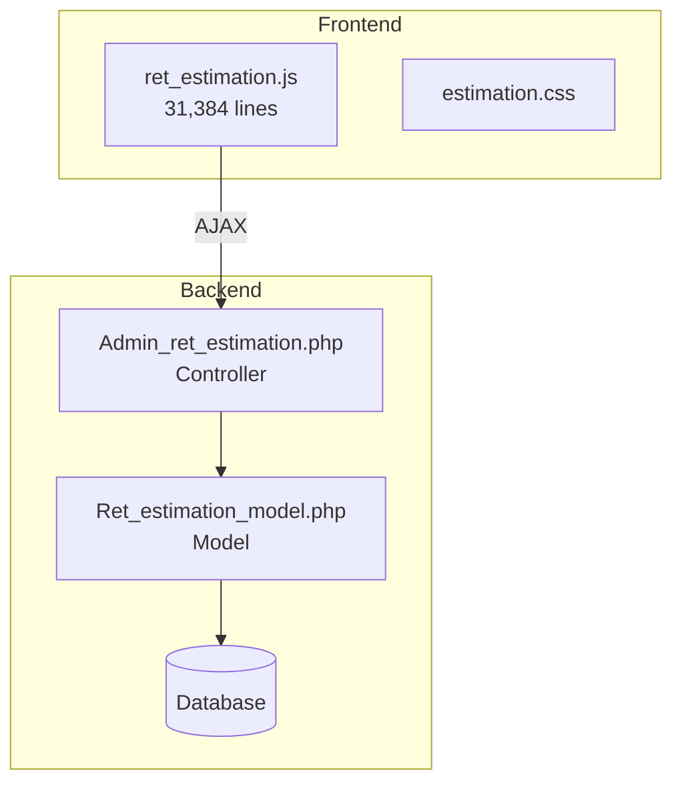

# Estimation Module Overview

## Purpose

The Estimation module handles jewelry estimation/quotation for retail jewelry businesses. It calculates:

- Metal value based on weight, purity, and rates
- Making charges (per gram, per piece, percentage, fixed)
- Old metal exchange calculations
- Chit scheme integrations
- Tax calculations (inclusive/exclusive GST)

---

## Architecture

---

## Key Workflows

### 1. Create Estimation

1. Select branch
2. Choose customer (or create new)
3. Add items (tagged/catalog/custom)
4. Calculate totals
5. Save or convert to billing

### 2. Add Tagged Item

1. Scan tag barcode/ID
2. System fetches item details
3. Calculate metal value + making charges
4. Add to estimation

### 3. Old Metal Exchange

1. Enter old metal weight
2. Select purity/touch
3. Apply buy rate
4. Deduct from total

### 4. Chit Scheme Application

1. Search customer chit accounts
2. Select scheme to apply
3. Calculate closing balance
4. Apply as payment

---

## Key Functions (JavaScript)

| Function                         | Lines | Purpose               |
| -------------------------------- | ----- | --------------------- |
| `calculateSaleValue`             | 389   | Main item calculation |
| `calculate_sales_details`        | 84    | Summary calculation   |
| `get_tag_data`                   | 574   | Fetch tag from server |
| `calculate_chit_closing_balance` | 461   | Chit scheme math      |

---

## Key Methods (PHP)

| Method                | Purpose                        |
| --------------------- | ------------------------------ |
| `get_tag_details`     | Fetch tag by ID                |
| `save_estimation`     | Save estimation to DB          |
| `get_estimation_list` | List with filters              |
| `convert_to_billing`  | Create billing from estimation |

---

## Calculation Types

| caltype | Description               |
| ------- | ------------------------- |
| 0       | Gross weight calculation  |
| 1       | Net weight calculation    |
| 2       | Net weight for metal only |
| 3       | Fixed price item          |

---

## Making Charge Types

| Type | Description  |
| ---- | ------------ |
| 1    | Per gram     |
| 2    | Per piece    |
| 3    | Percentage   |
| 4    | Fixed amount |

---

## Test Coverage

| Suite             | Tests | Status  |
| ----------------- | ----- | ------- |
| JavaScript (Jest) | 24    | ✅ Pass |
| PHP (PHPUnit)     | 51    | ✅ Pass |
