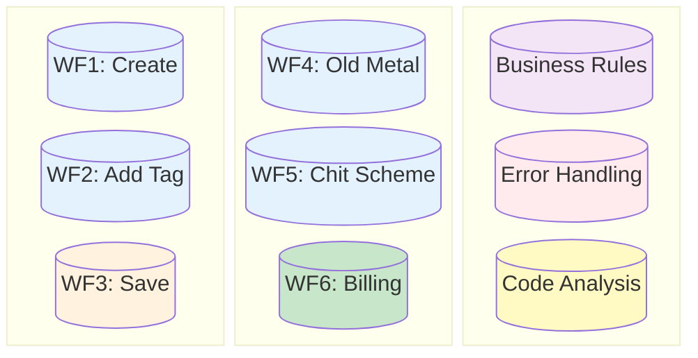

# 🚀 Estimation Module: Quality & Documentation Initiative

> **Executive Status Report**  
> **Date:** January 27, 2026  
> **Prepared for:** Managing Director

---

## 📊 Executive Summary

We have successfully completed a comprehensive initiative to **stabilize, document, and secure** the core Estimation Module. This work transforms the module from a "black box" into a well-mapped, testable, and maintainable asset.

### 🏆 Key Achievements

| Area                  | Status              | Deliverable                          | Business Value                                                     |
| :-------------------- | :------------------ | :----------------------------------- | :----------------------------------------------------------------- |
| **Documentation**     | ✅ **100%**         | **Knowledge Base** (8 Workflows)     | Reduces onboarding time; eliminates "tribal knowledge" dependency. |
| **Quality Assurance** | ✅ **100%**         | **Automated Test Suite** (107 Tests) | Prevents regression bugs; allows safe code refactoring.            |
| **Risk Analysis**     | ✅ **Complete**     | **Code Analysis Report**             | Identified 12 critical/medium risks; clear roadmap for fixes.      |
| **Process**           | ✅ **Standardized** | **Master Index**                     | Centralized access to all technical logic and rules.               |

---

## 🗺️ Visual Overview of Work

### 1. The "Safety Net" (Testing Coverage)

We created a dual-layer safety net to catch bugs before they reach production.

```mermaid
graph LR
    subgraph JS[Frontend (Browser)]
        J1[56 Jest Unit Tests] --> J2[Calculations]
        J1 --> J3[Validations]
        style J1 fill:#c8e6c9,stroke:#333,stroke-width:2px
    end

    subgraph PHP[Backend (Server)]
        P1[51 PHPUnit Tests] --> P2[Data Integrity]
        P1 --> P3[Save Logic]
        style P1 fill:#c8e6c9,stroke:#333,stroke-width:2px
    end

    J2 --> SAFE[🛡️ SAFETY NET]
    J3 --> SAFE
    P2 --> SAFE
    P3 --> SAFE
    style SAFE fill:#fff9c4,stroke:#fbc02d,stroke-width:2px
```

### 2. The Documentation Map

We mapped every single user action to technical logic.



---

## 📉 Risk Mitigation

We performed a deep-dive code analysis and identified **12 improvement areas**.

- 🔴 **High Severity (3 items):** Calculation precision fixes, potential tag locking issues.
- 🟠 **Medium Severity (5 items):** Performance optimization, security token handling.
- 🟢 **Low Severity (4 items):** Code cleanup and readability.

**Status:** _Roadmap created. Fixes can now be applied safely thanks to the new Test Suite._

---

## ⏭️ Next Steps Recommendation

1.  **Immediate:** Fix the **3 High Severity** bugs (Double precision issue, Tag locking).
2.  **Short-term:** Integrate the Test Suite into the automatic deployment pipeline (CI/CD).
3.  **Medium-term:** Refactor the "Calculate" function in JS to be modular (reducing the 31k line file size).

---

> _"We have moved from a state of 'hoping it works' to 'proving it works' via automated tests."_
