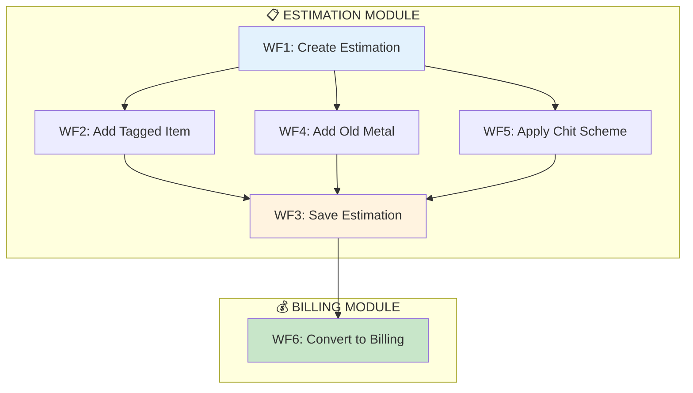
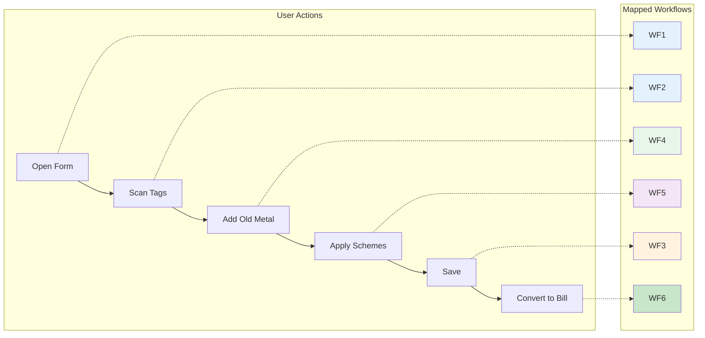
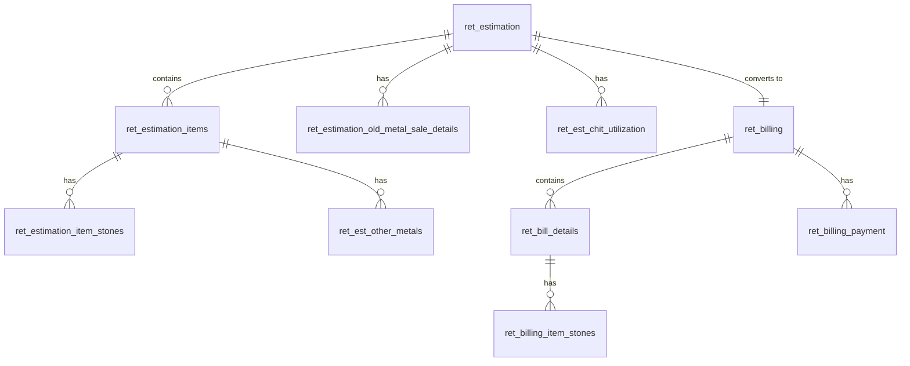

# 📚 Estimation Module - Master Index

> **Complete Knowledge Base for eTail v3 Retail Estimation**  
> Last Updated: 2026-01-26

---

> 🚀 **Executive Summary**: [Read the High-Level Status Report for MD](./Executive_Summary.md)

---

## 🗺️ Module Overview



---

## 📑 Workflow Index

|  #  | Workflow                                                  | Description                   | File                                |
| :-: | :-------------------------------------------------------- | :---------------------------- | :---------------------------------- |
|  1  | [Create Estimation](./workflow_01_create_estimation.md)   | Form load, settings, rates    | `workflow_01_create_estimation.md`  |
|  2  | [Add Tagged Item](./workflow_02_add_tagged_item.md)       | Tag scan, validation, row add | `workflow_02_add_tagged_item.md`    |
|  3  | [Save Estimation](./workflow_03_save_estimation.md)       | DB transaction, all inserts   | `workflow_03_save_estimation.md`    |
|  4  | [Add Old Metal](./workflow_04_add_old_metal.md)           | Old gold/silver purchase      | `workflow_04_add_old_metal.md`      |
|  5  | [Apply Chit Scheme](./workflow_05_apply_chit_scheme.md)   | Savings scheme utilization    | `workflow_05_apply_chit_scheme.md`  |
|  6  | [Convert to Billing](./workflow_06_convert_to_billing.md) | Estimation → Final bill       | `workflow_06_convert_to_billing.md` |
|  7  | [Edit Estimation](./workflow_07_edit_estimation.md)       | Update existing estimation    | `workflow_07_edit_estimation.md`    |
|  8  | [Home Bill Items](./workflow_08_home_bill_items.md)       | Custom/partial sale items     | `workflow_08_home_bill_items.md`    |

## 📚 Reference Documents

| Document                                                  | Description                            | File                          |
| :-------------------------------------------------------- | :------------------------------------- | :---------------------------- |
| [Edge Cases & Errors](./edge_cases_and_errors.md)         | 23 error scenarios & recovery          | `edge_cases_and_errors.md`    |
| [Business Rules](./business_rules.md)                     | Calculation types, limits, permissions | `business_rules.md`           |
| [Chit Utilization Methods](./chit_utilization_methods.md) | All 3 closure types, 3 calc types      | `chit_utilization_methods.md` |

## 🏆 Quality & Testing Artifacts

| Document                                          | Description                        | File                      |
| :------------------------------------------------ | :--------------------------------- | :------------------------ |
| [Code Analysis Report](./code_analysis_report.md) | Bug hunt, severity ratings, fixes  | `code_analysis_report.md` |
| [Test Specification](./test_specification.md)     | 45+ test cases & integration plans | `test_specification.md`   |

---

## 🔗 Workflow Relationships



---

## 📦 Key Files Reference

### Controllers

| File                       | Purpose                 |
| :------------------------- | :---------------------- |
| `admin_ret_estimation.php` | Main estimation CRUD    |
| `admin_ret_billing.php`    | Billing & bill creation |

### Models

| File                       | Purpose            |
| :------------------------- | :----------------- |
| `ret_estimation_model.php` | Estimation queries |
| `ret_billing_model.php`    | Billing queries    |

### JavaScript

| File                | Purpose                            |
| :------------------ | :--------------------------------- |
| `ret_estimation.js` | All client-side logic (~31K lines) |

### Views

| File                  | Purpose                  |
| :-------------------- | :----------------------- |
| `estimation/form.php` | Estimation form template |
| `billing/form.php`    | Billing form template    |

---

## 🗄️ Database Schema (Key Tables)



---

## 🧮 Key Calculation Formulas

### Metal Value

```
// Calculation Type determines base weight
caltype=0: metal_value = gross_wt × rate
caltype=1: metal_value = net_wt × rate
caltype=2: metal_value = net_wt × rate (MC on gross)
```

### Item Total

```
item_cost = metal_value + wastage_value + mc_total
          + stone_amount + other_charges
          + tax_amount - discount
```

### Final Estimation

```
total_cost = purchase_total - old_metal_amount
           - chit_amount - gift_voucher
           - advance_paid - sales_return
```

---

## 🎯 Quick Access

| Need To...                     | Go To                                                           |
| :----------------------------- | :-------------------------------------------------------------- |
| Understand form initialization | [WF1 - Create Estimation](./workflow_01_create_estimation.md)   |
| Debug tag scanning             | [WF2 - Add Tagged Item](./workflow_02_add_tagged_item.md)       |
| Trace database save            | [WF3 - Save Estimation](./workflow_03_save_estimation.md)       |
| Fix old metal calc             | [WF4 - Add Old Metal](./workflow_04_add_old_metal.md)           |
| Understand chit benefits       | [WF5 - Apply Chit Scheme](./workflow_05_apply_chit_scheme.md)   |
| Debug billing conversion       | [WF6 - Convert to Billing](./workflow_06_convert_to_billing.md) |

---

## 📋 Additional Resources

| Document                                            | Purpose                     |
| :-------------------------------------------------- | :-------------------------- |
| [Estimation Module KB](./estimation_module_kb.md)   | High-level module overview  |
| [Diagram Style Preview](./diagram_style_preview.md) | Documentation style samples |

---

## ✅ Documentation Status

| Workflow       | Swimlane | Details | Pseudo-code | Tables |
| :------------- | :------: | :-----: | :---------: | :----: |
| WF1 Create     |    ✅    |   ✅    |     ✅      |   ✅   |
| WF2 Add Tag    |    ✅    |   ✅    |     ✅      |   ✅   |
| WF3 Save       |    ✅    |   ✅    |     ✅      |   ✅   |
| WF4 Old Metal  |    ✅    |   ✅    |     ✅      |   ✅   |
| WF5 Chit       |    ✅    |   ✅    |     ✅      |   ✅   |
| WF6 Billing    |    ✅    |   ✅    |     ✅      |   ✅   |
| WF7 Edit       |    ✅    |   ✅    |     ✅      |   ✅   |
| Edge Cases     |    -     |   ✅    |      -      |   -    |
| Business Rules |    -     |   ✅    |      -      |   -    |

---

_Generated by Estimation Module Knowledge Base Builder_
