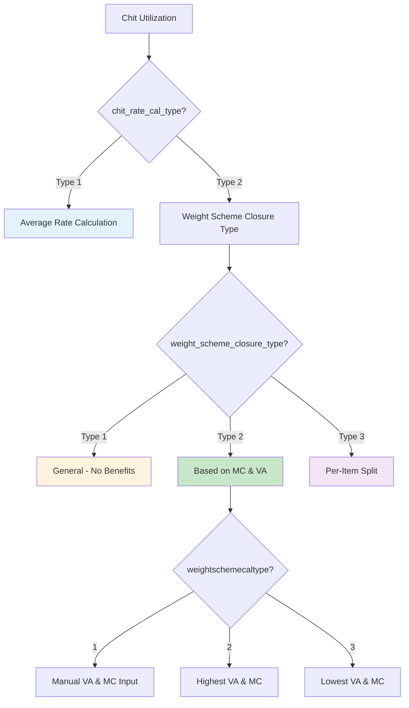

# Chit Utilization Methods - Complete Reference

> **Deep Dive: Settings-Based Chit Calculation Variations**  
> Addendum to Workflow 5: Apply Chit Scheme

---

## 🎛️ Key Settings Overview

| Setting                        | Field ID                     | Values  | Purpose                   |
| ------------------------------ | ---------------------------- | ------- | ------------------------- |
| **Weight Scheme Closure Type** | `weight_scheme_closure_type` | 1, 2, 3 | How to calculate benefits |
| **Weight Scheme Cal Type**     | `weightschemecaltype`        | 1, 2, 3 | Which MC/VA to use        |
| **Chit Rate Calculation Type** | `chit_rate_cal_type`         | 1, 2    | Rate basis for conversion |

---

## 📊 Decision Tree



---

## 🔢 Weight Scheme Closure Type (weight_scheme_closure_type)

### Type 1: General (No Benefits)

```javascript
// Simple chit closure - no wastage/MC benefits
chit_amount = closing_amount; // Direct deduction
saving_weight = 0; // No weight benefit
```

**Use Case**: Cash-only savings schemes without gold weight accumulation.

---

### Type 2: Based on MC & VA

```javascript
// Chit benefits based on Wastage and Making Charge
// Requires: paid_installments == total_installments (fully matured)
// AND: sales_details.length > 0 (items in estimation)
// AND: is_topup_scheme == 0 (not a top-up)

if (
  weight_scheme_closure_type == 2 &&
  saving_weight > 0 &&
  paid_installments == total_installments &&
  sales_details.length > 0 &&
  is_topup_scheme == 0
) {
  // Calculate benefits based on weightschemecaltype
  // See section below for VA/MC selection logic
}
```

**Use Case**: Standard gold savings with maturity benefits.

---

### Type 3: Per-Item Split (Tag-wise Allocation)

```javascript
// Chit amount split proportionally across tagged items
if (weight_scheme_closure_type == 3) {
  set_tag_split_details(); // Allocate chit to each tag
}
```

**Use Case**: Complex schemes where benefit is allocated per jewelry item.

---

## 🔧 Weight Scheme Calculation Type (weightschemecaltype)

_Only applies when `weight_scheme_closure_type == 2`_

### Type 1: Manual VA & MC Input

```javascript
if (weightschemecaltype == 1 && weight_scheme_closure_type != 3) {
  // Allow user to manually enter wastage_per and mc_value
  $("#wastage_per").attr("readonly", false);
  $("#mc_value").attr("readonly", false);
}
```

**Behavior**: User inputs custom wastage % and MC value.

---

### Type 2: Highest VA & MC

```javascript
if (weightschemecaltype == 2) {
  // Take MAXIMUM wastage from all items
  wastage_per = Math.max.apply(
    null,
    sales_details.map((item) => item.wastage_per),
  );

  // Take MAXIMUM MC from all items
  $.each(sales_details, function (key, val) {
    if (parseFloat(val.mc_value) > parseFloat(mc_value)) {
      mc_value = val.mc_value;
      item_gross_wt = val.item_gross_wt;
    }
  });
}
```

**Example**:
| Item | Wastage % | MC/gm |
|------|-----------|-------|
| Necklace | 12% | ₹450 |
| Ring | 16% | ₹350 |
| Bangle | 10% | ₹500 |

**Result**: Uses 16% wastage, ₹500/gm MC (highest of each)

---

### Type 3: Lowest VA & MC

```javascript
if (weightschemecaltype == 3) {
  // Take MINIMUM wastage from all items
  wastage_per = Math.min.apply(
    null,
    sales_details.map((item) => item.wastage_per),
  );

  // Take MINIMUM MC from all items
  for (let i = 0; i < sales_details.length; i++) {
    if (parseFloat(sales_details[i].mc_value) < parseFloat(mc_value)) {
      mc_value = sales_details[i].mc_value;
      item_gross_wt = sales_details[i].item_gross_wt;
    }
  }
}
```

**Example** (same items as above):  
**Result**: Uses 10% wastage, ₹350/gm MC (lowest of each)

---

## 💹 Chit Rate Calculation Type (chit_rate_cal_type)

### Type 1: Average Rate Calculation

```javascript
if (chit_rate_cal_type == 1 && rate_type == 2) {
  // Rate comes from top-up calculation
  var chit_rate_per_gram = curRow.find(".chit_rate").val();

  curRow.find(".rate_per_gram").val(parseFloat(chit_rate_per_gram).toFixed(2));
  curRow.find(".saved_weight").html(parseFloat(saving_weight).toFixed(3));

  chit_amount = curRow.find(".closing_amount").val();
}
```

**Use Case**: Schemes where rate is averaged over contribution period.

---

### Type 2: Based on Weight Scheme Closure Type

```javascript
if (chit_rate_cal_type == 2) {
  // Behavior depends on weight_scheme_closure_type
  if (weight_scheme_closure_type == 3) {
    set_tag_split_details(); // Per-item allocation
  }
}
```

**Use Case**: Schemes using item-based benefit allocation.

---

## 📈 Benefits Calculation (for Type 2 Closure)

```javascript
// Calculate wastage weight benefit
wastage_wt = (parseFloat(saving_weight) * parseFloat(wastage_per)) / 100;

// Calculate wastage amount savings
savings_in_wast_amt = parseFloat(
  parseFloat(wastage_wt) * parseFloat(goldrate_22ct),
);

// Calculate MC savings
savings_in_mcvalue = parseFloat(
  parseFloat(saving_weight) * parseFloat(mc_value),
);

// Chit rate per gram
chit_rate_per_gram =
  parseFloat(goldrate_22ct) +
  (parseFloat(goldrate_22ct) * parseFloat(wastage_per)) / 100 +
  parseFloat(mc_value);

// Total chit amount
chit_amount = parseFloat(saving_weight) * parseFloat(chit_rate_per_gram);
```

---

## 🎯 Complete Example Scenarios

### Scenario A: Simple Cash Scheme (Type 1)

| Setting                      | Value |
| ---------------------------- | ----- |
| `weight_scheme_closure_type` | 1     |

**Customer has**: ₹50,000 saved  
**Result**: ₹50,000 deducted, no weight benefit

---

### Scenario B: Matured Scheme with Highest Benefits (Type 2 + Type 2)

| Setting                      | Value       |
| ---------------------------- | ----------- |
| `weight_scheme_closure_type` | 2           |
| `weightschemecaltype`        | 2 (Highest) |
| `paid_installments`          | 12          |
| `total_installments`         | 12          |

**Customer has**: 10 grams saved, Gold Rate = ₹5,500

**Items in estimation**:

- Item A: VA=12%, MC=₹400/gm
- Item B: VA=15%, MC=₹350/gm

**Calculation**:

```
Uses: VA=15%, MC=₹400/gm (highest of each)

chit_rate = 5500 + (5500 × 15/100) + 400 = 5500 + 825 + 400 = ₹6,725/gm
chit_amount = 10 × 6725 = ₹67,250

wastage_benefit = 10 × 15% × 5500 = ₹8,250
mc_benefit = 10 × 400 = ₹4,000
```

---

### Scenario C: Per-Item Split (Type 3)

| Setting                      | Value |
| ---------------------------- | ----- |
| `weight_scheme_closure_type` | 3     |

**Behavior**:

- `set_tag_split_details()` is called
- Chit weight split proportionally across items
- Each item gets a portion of the chit benefit

---

## 📋 items with scheme_closure_benefit

Only items with `scheme_closure_benefit == 1` AND `metal_type == 1` (Gold) contribute to the benefit calculation:

```javascript
if (
  tagcurRow.find(".scheme_closure_benefit").val() == 1 &&
  tagcurRow.find(".metal_type").val() == 1
) {
  sales_details.push({
    wastage_per: tagcurRow.find(".wastage_max_per").val(),
    mc_value: calculated_mc_value,
    item_gross_wt: tagcurRow.find(".gwt").val(),
  });
}
```

---

## ✅ Document Complete

| Topic                              | Covered |
| ---------------------------------- | :-----: |
| weight_scheme_closure_type (1,2,3) |   ✅    |
| weightschemecaltype (1,2,3)        |   ✅    |
| chit_rate_cal_type (1,2)           |   ✅    |
| Benefits calculation formulas      |   ✅    |
| Example scenarios                  |   ✅    |
| Item eligibility criteria          |   ✅    |
