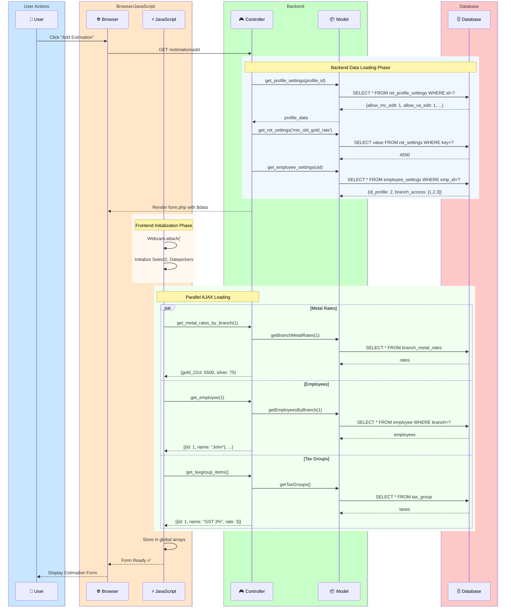
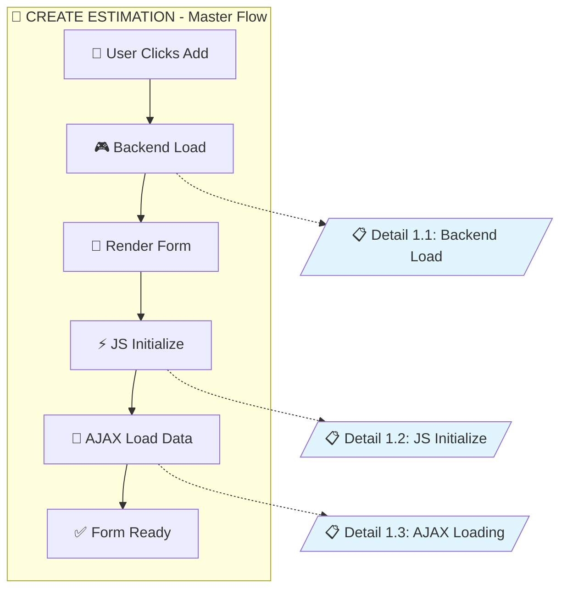
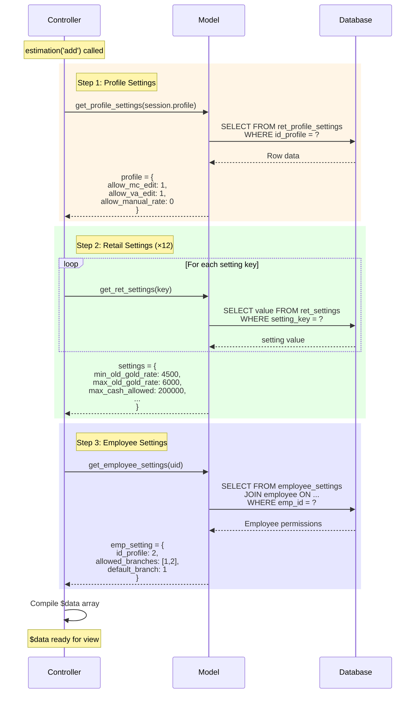
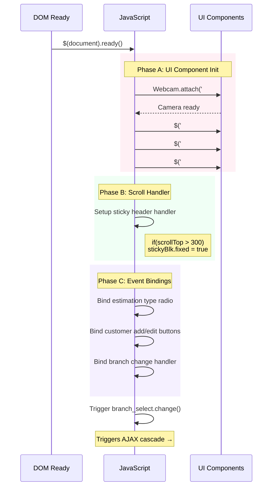
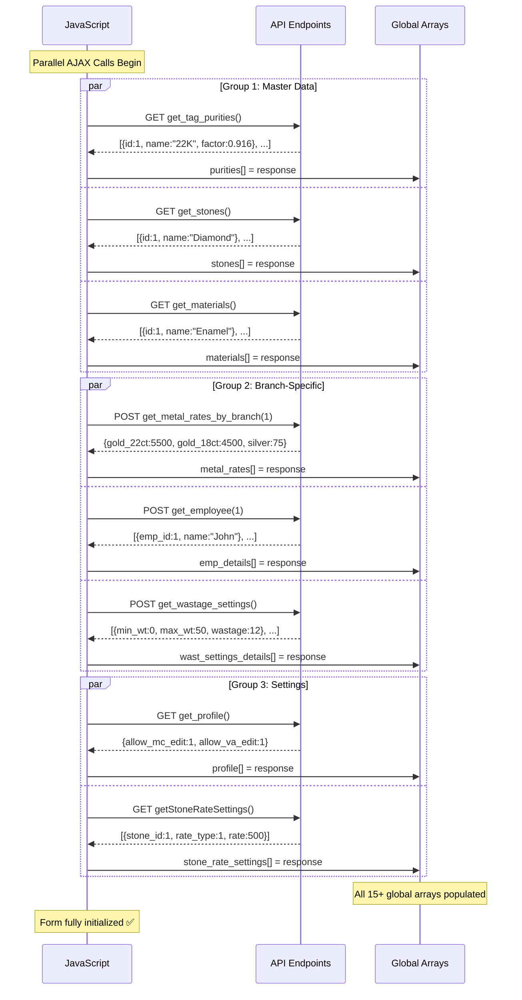

# Diagram Style Preview: Option C vs Option D

> Compare both styles to decide which provides better clarity for your documentation.

---

# 🏊 Option C: Swimlane Style

Shows parallel processes across clear lanes with timing.

---

# 📊 Option D: Hierarchical Drill-Down

**Master overview** with **clickable sub-diagrams** for each phase.

## Level 0: Master Overview

---

## Level 1.1: Backend Load (Drill-Down)

---

## Level 1.2: JS Initialize (Drill-Down)

---

## Level 1.3: AJAX Loading (Drill-Down)

---

# 🆚 Comparison Summary

| Aspect          | Option C (Swimlane)      | Option D (Hierarchical)     |
| --------------- | ------------------------ | --------------------------- |
| **Best For**    | Seeing full flow at once | Deep-diving specific phases |
| **Complexity**  | One large diagram        | Multiple focused diagrams   |
| **Parallelism** | Shows clearly with `par` | Shows in sub-diagrams       |
| **Readability** | Good for overview        | Better for detailed study   |
| **Maintenance** | Update one diagram       | Update specific sub-diagram |
| **Navigation**  | Scroll through           | Click to drill-down         |

---

**Which style do you prefer?** Or should I combine elements of both?
