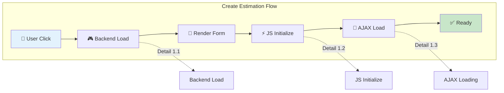
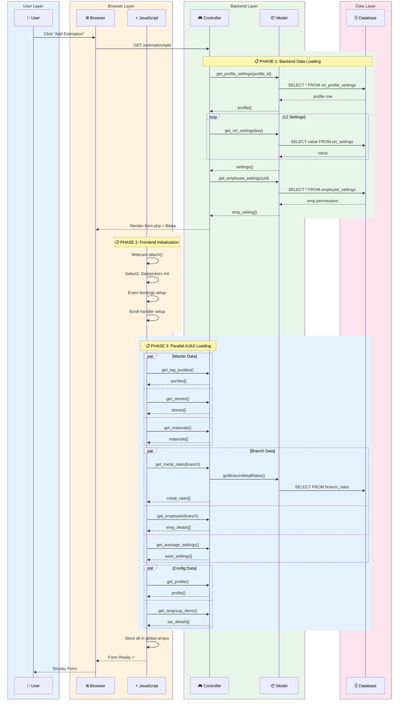
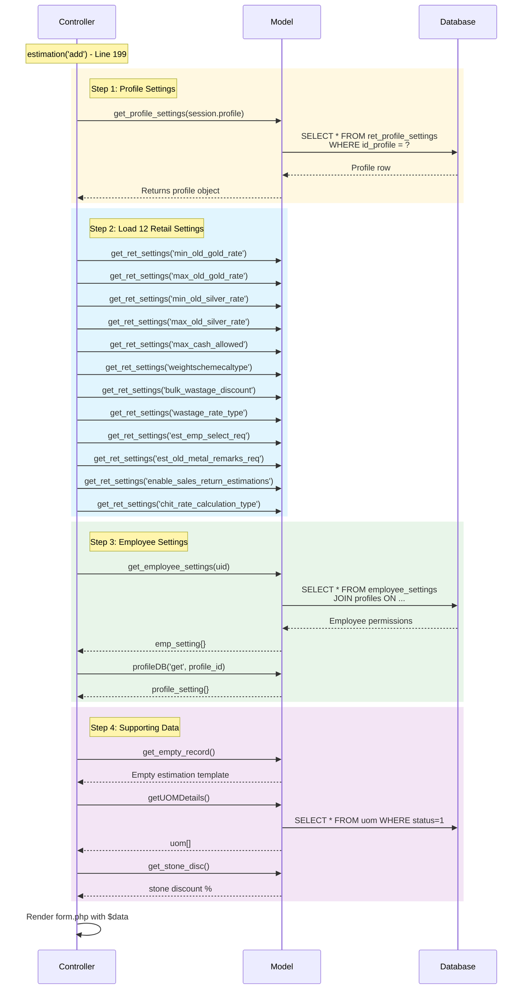
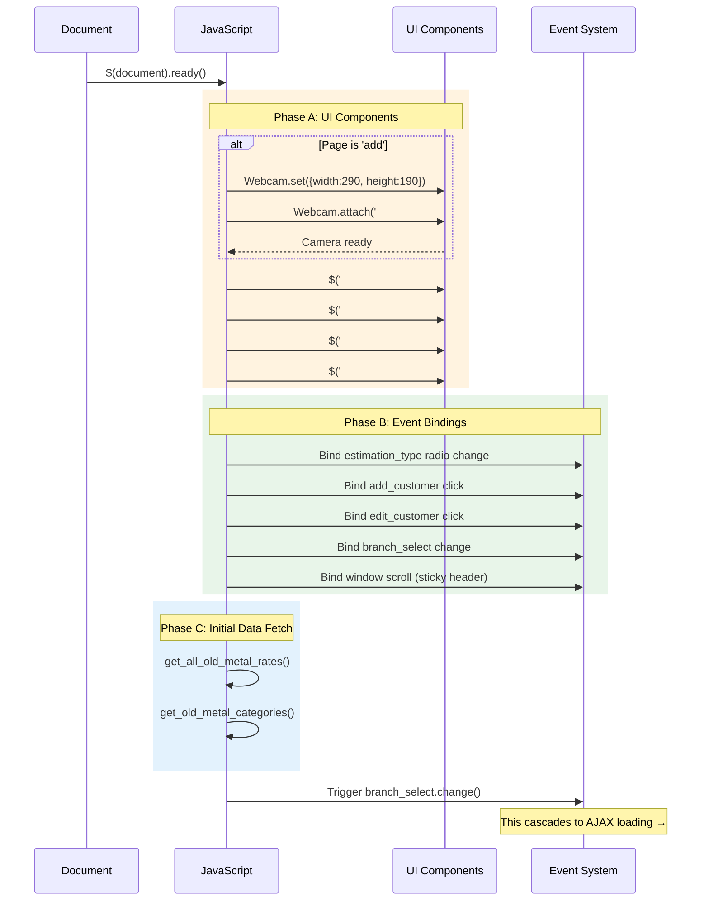
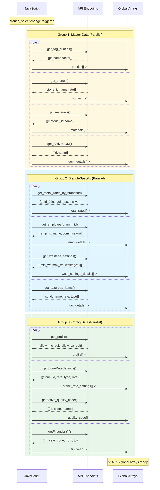

# Workflow 1: Create New Estimation

> **Combined Swimlane + Hierarchical Documentation**  
> Entry Point: User clicks "Add Estimation" → `/admin_ret_estimation/estimation/add`

---

## 🎯 Master Overview



---

## 📊 Complete Swimlane Diagram



---

## 📋 Detail 1.1: Backend Load

### Sequence



### Data Structures Returned

```javascript
// $data array passed to view
{
  profile: {
    allow_mc_edit: 1,
    allow_va_edit: 1,
    allow_manual_rate: 0,
    allow_discount: 1
  },
  estimation: {
    estimation_id: '',
    cus_id: '',
    total_cost: 0,
    // ... empty template
  },
  min_old_gold_rate: 4500,
  max_old_gold_rate: 6000,
  max_cash_allowed: 200000,
  emp_setting: {
    id_profile: 2,
    default_branch: 1
  },
  uom: [
    {id: 1, name: 'Gram'},
    {id: 2, name: 'Carat'}
  ]
}
```

---

## 📋 Detail 1.2: JS Initialize

### Sequence



### Pseudo-code

```
FUNCTION document.ready():

    // Phase A: UI Setup
    IF page == 'add':
        Webcam.set({width: 290, height: 190, format: 'jpg'})
        Webcam.attach('#my_camera')

    bootstrapSwitch('#status')
    select2('#profession', {placeholder: "Select Profession"})
    datepicker('#date_of_birth', {format: 'yyyy-mm-dd'})

    // Phase B: Event Bindings
    ON radio[estimation.esti_for].change:
        SWITCH value:
            CASE 1 (Customer):
                Show customer required marker
                Enable catalog/custom/old metal sections
            CASE 2 (Branch Transfer):
                Hide customer required
                Disable catalog/custom/old metal
            CASE 3 (Company):
                Show GST fields

    ON window.scroll:
        IF scrollTop > 300:
            stickyBlk.position = 'fixed'
        ELSE:
            stickyBlk.position = 'static'

    // Phase C: Initial Load
    AJAX get_all_old_metal_rates()
    AJAX get_old_metal_categories()

    // Trigger cascade
    trigger('#branch_select', 'change')

END FUNCTION
```

---

## 📋 Detail 1.3: AJAX Loading

### Sequence



### Data Structures

```javascript
// Global arrays after AJAX completion

purities = [
  { id: 1, purity_name: "22K", purity_factor: 0.916, category: 1 },
  { id: 2, purity_name: "18K", purity_factor: 0.75, category: 1 },
  { id: 3, purity_name: "Silver 925", purity_factor: 0.925, category: 2 },
];

metal_rates = {
  gold_22ct: 5500,
  gold_18ct: 4500,
  silver_1gm: 75,
  platinum: 3200,
};

wast_settings_details = [
  { min_weight: 0, max_weight: 10, wastage_percent: 12 },
  { min_weight: 10, max_weight: 50, wastage_percent: 10 },
  { min_weight: 50, max_weight: 999, wastage_percent: 8 },
];

profile = {
  allow_mc_edit: 1, // Can edit making charges
  allow_va_edit: 1, // Can edit value addition
  allow_manual_rate: 0, // Cannot override metal rate
  allow_discount: 1, // Can apply discounts
};

tax_details = [
  { tax_group_id: 1, name: "GST 3%", rate: 3, type: "inclusive" },
  { tax_group_id: 2, name: "GST 5%", rate: 5, type: "inclusive" },
];
```

---

## 🔗 Collision Points

| This Workflow     | Shares With     | Shared Component                           |
| ----------------- | --------------- | ------------------------------------------ |
| Create Estimation | Edit Estimation | Same AJAX calls, profile loading           |
| Create Estimation | Add Tagged Item | `metal_rates[]`, `purities[]`, `profile[]` |
| Create Estimation | Calculate Cost  | `wast_settings_details[]`, `tax_details[]` |
| Create Estimation | Save Estimation | `fin_year[]`, `profile[]` for validation   |

---

## ✅ Workflow Complete Checklist

- [x] Master overview diagram
- [x] Full swimlane sequence
- [x] Backend load detail (1.1)
- [x] JS initialize detail (1.2)
- [x] AJAX loading detail (1.3)
- [x] Data structures documented
- [x] Collision points identified

---

**Ready for Workflow 2: Add Tagged Item?**
