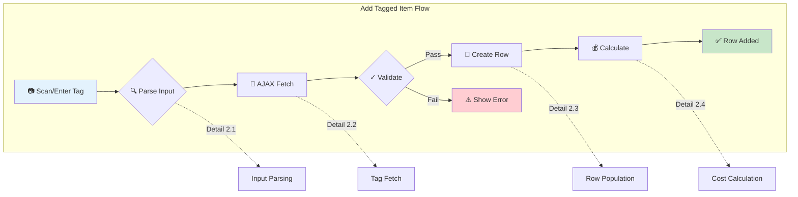
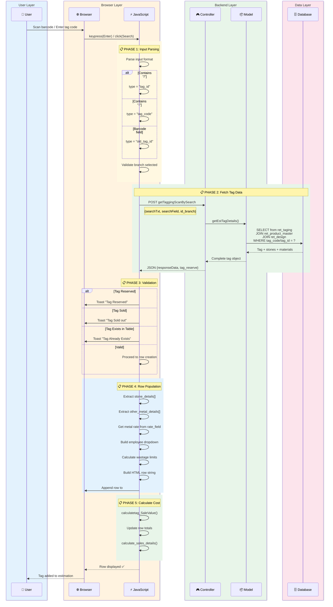
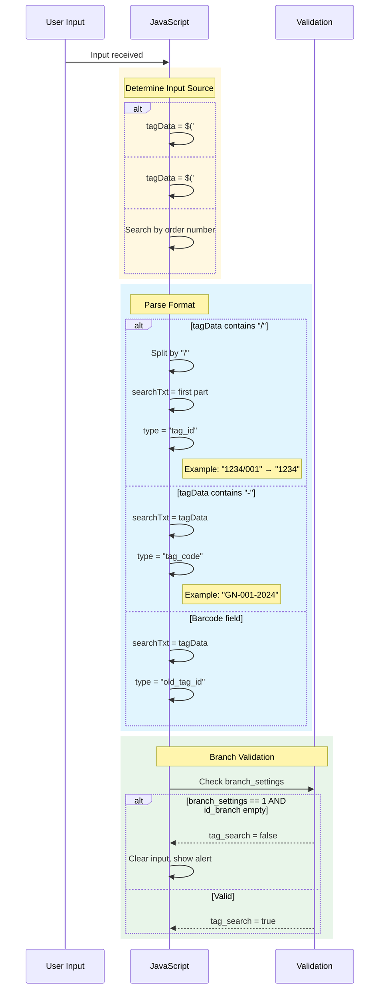
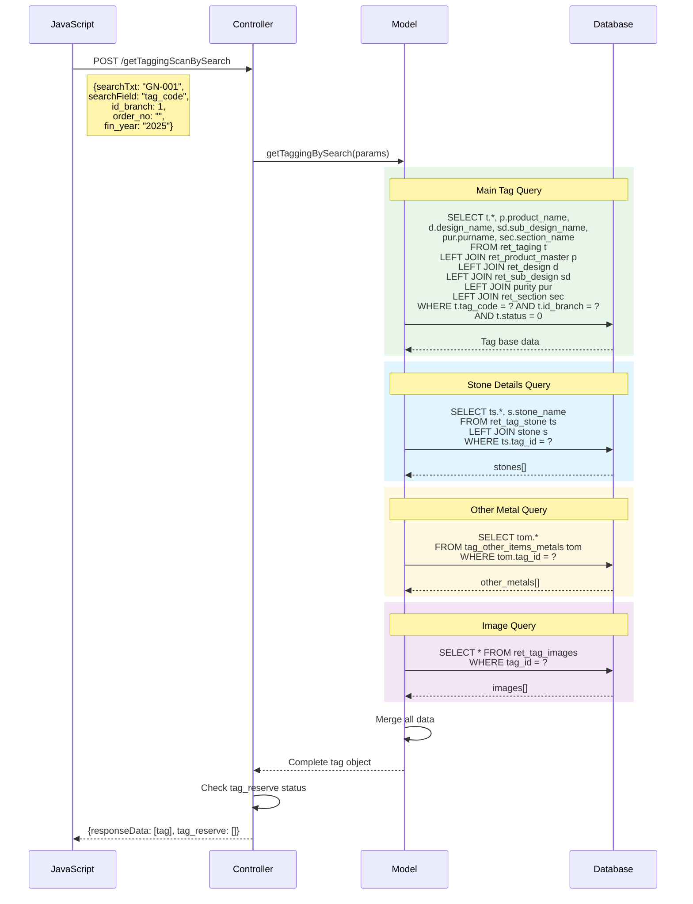

# Workflow 2: Add Tagged Item

> **Combined Swimlane + Hierarchical Documentation**  
> Entry Point: User scans tag code or enters tag ID in estimation form

---

## 🎯 Master Overview



---

## 📊 Complete Swimlane Diagram



---

## 📋 Detail 2.1: Input Parsing

### Sequence



### Pseudo-code

```
FUNCTION get_tag_data(callback):

    // Get input values
    tagData = trim($('#est_tag_scan').val())
    old_tag_no = trim($('#est_tag_barcode_scan').val())

    // Initialize
    type = ""
    searchTxt = ""
    tag_search = false

    // Parse input format
    IF tagData != "":
        IF tagData.contains("/"):
            // Format: "12345/001" - extract tag_id
            parts = tagData.split("/")
            searchTxt = parts[0]
            type = "tag_id"
        ELSE IF tagData.contains("-"):
            // Format: "GN-001-2024" - full tag code
            searchTxt = tagData
            type = "tag_code"

    ELSE IF old_tag_no != "":
        // Barcode/old tag format
        searchTxt = old_tag_no.replaceAll(' ', '')
        IF searchTxt.contains("/"):
            type = "tag_id"
        ELSE:
            type = "old_tag_id"

    ELSE IF $('#est_order').val() != "":
        // Search by order number
        tag_search = true

    // Branch validation
    IF searchTxt != "":
        IF branch_settings == 1:
            IF id_branch != "":
                tag_search = true
            ELSE:
                tag_search = false
                ALERT "Select Branch"
        ELSE:
            tag_search = true

    // Proceed to AJAX if valid
    IF tag_search:
        AJAX_CALL(searchTxt, type)

END FUNCTION
```

---

## 📋 Detail 2.2: Tag Fetch (AJAX)

### Sequence



### Data Structure Returned

```javascript
// Response from getTaggingScanBySearch
{
  responseData: [{
    tag_id: 1234,
    tag_code: "GN-001-2024",
    label: "GN-001-2024",

    // Product info
    lot_product: 55,
    product_name: "Gold Necklace",
    metal_type: 1,  // 1=Gold, 2=Silver

    // Design info
    design_id: 516,
    design_name: "Antique Design",
    id_sub_design: 126,
    sub_design_name: "Traditional",

    // Section
    id_section: 3,
    section_name: "Ladies",

    // Purity
    purity: 3,  // FK
    purname: "22K",

    // Weights
    gross_wt: 15.800,
    net_wt: 15.800,
    less_wt: 0,
    piece: 1,

    // Pricing
    calculation_based_on: 2,  // MC on gross, wast on net
    tag_mc_type: 2,  // Per gram
    tag_mc_value: 60.00,
    retail_max_wastage_percent: 12,
    sales_value: 5500,

    // Rate mapping
    rate_field: "goldrate_22ct",
    market_rate_field: "goldrate_22ct",

    // Tax
    tax_group_id: 1,
    tax_percentage: 3,
    tgi_calculation: "inclusive",

    // Limits
    mc_va_limit: {
      mc_min: 50,
      mc_max: 100,
      wastag_min: 8,
      wastag_max: 15
    },

    // Nested arrays
    stone_details: [
      {stone_id: 15, pieces: 1, wt: 0.5, amount: 500, ...}
    ],
    other_metal_details: [
      {tag_other_itm_metal_id: 2, tag_other_itm_amount: 200, ...}
    ],
    tag_images: [
      {image: "tag_1234.jpg", is_default: 1}
    ]
  }],

  tag_reserve: []  // Empty if not reserved
}
```

---

## 📋 Detail 2.3: Row Population

### Sequence



```mermaid
sequenceDiagram
    participant JS as JavaScript
    participant DOM as DOM
    participant G as Global Arrays

    JS->>JS: Check for duplicates

    rect rgb(255,248,225)
    Note over JS: Extract Nested Data
    JS->>JS: stone_details = []
    loop Each stone in tag.stone_details
        JS->>JS: Push {stone_id, wt, price, ...}
    end

    JS->>JS: other_metal_details = []
    JS->>JS: Sum tag_other_itm_amount
    end

    rect rgb(225,245,254)
    Note over JS,G: Get Rate per Gram
    alt Order has fixed rate
        JS->>JS: rate = order_rate_per_grm
    else Ornament (stone_type=0)
        JS->>G: rate = metal_rates[rate_field]
        Note right of JS: e.g., goldrate_22ct = 5500
    else Loose stone product
        JS->>G: Match in loose_product_rate[]
        JS->>JS: rate based on cent weight
    end
    end

    rect rgb(232,245,233)
    Note over JS,G: Build Dropdowns
    JS->>G: Loop emp_details[]
    JS->>JS: Build employee <select>

    JS->>G: Loop purities[]
    JS->>JS: Build purity <select>
    end

    rect rgb(243,229,245)
    Note over JS: Calculate Limits
    JS->>JS: mc_min_limit = tag.mc_va_limit.mc_min
    JS->>JS: va_min_limit = tag.mc_va_limit.wastag_min
    JS->>JS: va_wt_min = net_wt × (va_min_limit / 100)
    end

    rect rgb(255,243,224)
    Note over JS,DOM: Build Row HTML
    JS->>JS: Generate unique rowId
    JS->>JS: Build <tr> with:
    Note right of JS: - Tag code input<br/>- Employee select<br/>- Partial checkbox<br/>- Product/Design display<br/>- Weight inputs<br/>- Rate input<br/>- Wastage input<br/>- MC input<br/>- Hidden: stones, materials, tax
    JS->>DOM: $('#estimation_tag_details tbody').append(row)
    JS->>DOM: Initialize select2 on employee
    end
```

### Row HTML Structure (Key Fields)

```html
<tr id="1706267890123">
  <!-- Tag Code -->
  <td>
    <input
      class="est_tag_name"
      name="est_tag[tag_name][]"
      value="GN-001-2024"
    />
    <input
      class="est_tag_id"
      type="hidden"
      name="est_tag[tag_id][]"
      value="1234"
    />
    <input class="rate_field" type="hidden" value="goldrate_22ct" />
  </td>

  <!-- Merge Button & Child Tags -->
  <td>
    <a onClick="create_new_empty_est_tag_merge_item(...)">+</a>
    <input type="hidden" id="child_tag_details" value="[]" />
  </td>

  <!-- Image -->
  <td></td>

  <!-- Employee -->
  <td>
    <select class="item_emp_id" name="est_tag[item_emp_id][]">
      ...
    </select>
  </td>

  <!-- Partial Sale -->
  <td><input type="checkbox" class="partial" /></td>

  <!-- Product/Design -->
  <td><div class="prodct_name">Gold Necklace</div></td>
  <td><div class="design_name">Antique Design</div></td>

  <!-- Weights -->
  <td><input class="gwt" name="est_tag[gwt][]" value="15.800" readonly /></td>
  <td><input class="lwt" name="est_tag[lwt][]" value="0" readonly /></td>
  <td><div class="nwt">15.800</div></td>

  <!-- Rate -->
  <td>
    <input
      class="market_rate_value"
      name="est_tag[est_rate_per_grm][]"
      value="5500"
    />
  </td>

  <!-- Wastage -->
  <td>
    <input class="wastage_max_per" name="est_tag[wastage][]" value="12" />
  </td>
  <td><input class="est_wastage_wt" name="est_tag[est_wastage_wt][]" /></td>

  <!-- Making Charge -->
  <td>
    <select class="est_mc_type">
      Per Gram/Per Piece
    </select>
  </td>
  <td><input class="act_mc_value" name="est_tag[mc][]" value="60" /></td>

  <!-- Hidden Data -->
  <input type="hidden" class="stone_details" value='[{"stone_id":15,...}]' />
  <input type="hidden" class="other_metal_details" value="[...]" />
  <input type="hidden" class="tax_percentage" value="3" />
  <input type="hidden" class="caltype" value="2" />

  <!-- Delete -->
  <td><a onClick="remove_tag_row(...)">🗑️</a></td>
</tr>
```

---

## 📋 Detail 2.4: Cost Calculation

### Sequence



```mermaid
sequenceDiagram
    participant JS as JavaScript
    participant R as Row
    participant T as Totals

    JS->>JS: calculatetag_SaleValue()

    loop Each Row in #estimation_tag_details
        rect rgb(255,248,225)
        Note over R: Get Row Values
        R->>R: gwt = gross_weight
        R->>R: nwt = net_weight
        R->>R: rate = market_rate_value
        R->>R: wastage_per = wastage_max_per
        R->>R: mc_val = act_mc_value
        R->>R: mc_type = est_mc_type
        R->>R: caltype = calculation_based_on
        end

        rect rgb(225,245,254)
        Note over R: Calculate Metal Value
        alt caltype == 0 (MC & Wast on Gross)
            R->>R: metal_val = gwt × rate
        else caltype == 1 (MC & Wast on Net)
            R->>R: metal_val = nwt × rate
        else caltype == 2 (MC Gross, Wast Net)
            R->>R: metal_val = nwt × rate
        else caltype == 3 (Fixed Rate)
            R->>R: metal_val = item_rate
        end
        end

        rect rgb(232,245,233)
        Note over R: Calculate Wastage
        alt caltype == 2
            R->>R: wast_wt = nwt × (wastage_per / 100)
        else
            R->>R: wast_wt = gwt × (wastage_per / 100)
        end
        R->>R: wast_val = wast_wt × rate
        end

        rect rgb(243,229,245)
        Note over R: Calculate Making Charge
        alt mc_type == 1 (Per Piece)
            R->>R: mc_total = mc_val × piece
        else mc_type == 2 (Per Gram)
            R->>R: mc_total = mc_val × gwt
        else mc_type == 3 (% on Price)
            R->>R: mc_total = metal_val × (mc_val / 100)
        end
        end

        rect rgb(255,243,224)
        Note over R: Add Extras
        R->>R: stone_amt = SUM(stone_details.price)
        R->>R: other_metal_amt = tag_other_itm_amount
        R->>R: charge_amt = charge_value
        end

        rect rgb(227,242,253)
        Note over R: Calculate Tax
        R->>R: subtotal = metal_val + wast_val + mc_total + stone_amt + other_metal_amt
        R->>R: tax = subtotal × (tax_percentage / 100)
        R->>R: total = subtotal + tax
        end

        R->>R: Update row display
    end

    JS->>T: calculate_sales_details()
    T->>T: Sum all tag rows
    T->>T: Update grand total display
```

### Calculation Formula

```
FUNCTION calculate_row_cost(row):

    // 1. Get base values
    gwt = row.gross_weight
    nwt = row.net_weight
    rate = row.rate_per_gram

    // 2. Metal value (based on calculation_type)
    SWITCH calculation_based_on:
        CASE 0: // MC & Wastage on Gross
            metal_value = gwt × rate
            wastage_weight = gwt × (wastage_percent / 100)
            mc_base_weight = gwt

        CASE 1: // MC & Wastage on Net
            metal_value = nwt × rate
            wastage_weight = nwt × (wastage_percent / 100)
            mc_base_weight = nwt

        CASE 2: // MC on Gross, Wastage on Net (MOST COMMON)
            metal_value = nwt × rate
            wastage_weight = nwt × (wastage_percent / 100)
            mc_base_weight = gwt

        CASE 3: // Fixed Rate
            metal_value = item_rate (from tag)
            wastage_weight = 0
            mc_base_weight = 0

    // 3. Wastage value
    wastage_value = wastage_weight × rate

    // 4. Making charge (based on mc_type)
    SWITCH mc_type:
        CASE 1: // Per Piece
            mc_total = mc_value × pieces
        CASE 2: // Per Gram
            mc_total = mc_value × mc_base_weight
        CASE 3: // Percentage
            mc_total = metal_value × (mc_value / 100)

    // 5. Add components
    stone_amount = SUM(stone_details[].price)
    other_metal_amount = SUM(other_metal_details[].amount)
    charge_amount = other_charges_value

    // 6. Subtotal
    subtotal = metal_value + wastage_value + mc_total
             + stone_amount + other_metal_amount + charge_amount

    // 7. Tax
    tax_amount = subtotal × (tax_percentage / 100)

    // 8. Final
    total = subtotal + tax_amount

    RETURN total

END FUNCTION
```

---

## 🔗 Collision Points

| This Workflow   | Shares With       | Shared Component                 |
| --------------- | ----------------- | -------------------------------- |
| Add Tagged Item | Add Catalog Item  | Cost calculation logic           |
| Add Tagged Item | Add Order Item    | Tag fetch, rate lookup           |
| Add Tagged Item | Create Estimation | `metal_rates[]`, `emp_details[]` |
| Add Tagged Item | Save Estimation   | Row data extraction              |
| Add Tagged Item | Tag Merge         | `child_tag_details[]` handling   |

---

## ✅ Workflow Complete Checklist

- [x] Master overview diagram
- [x] Full swimlane sequence
- [x] Input parsing detail (2.1)
- [x] Tag fetch detail (2.2)
- [x] Row population detail (2.3)
- [x] Cost calculation detail (2.4)
- [x] Data structures documented
- [x] Calculation formulas included

---

**Ready for Workflow 3: Calculate Item Cost (Central Engine)?**
