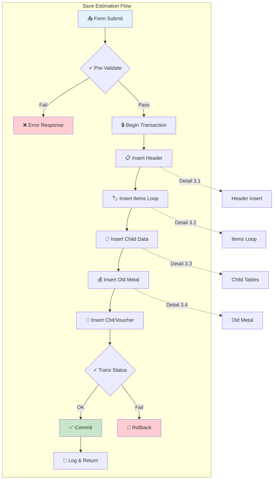
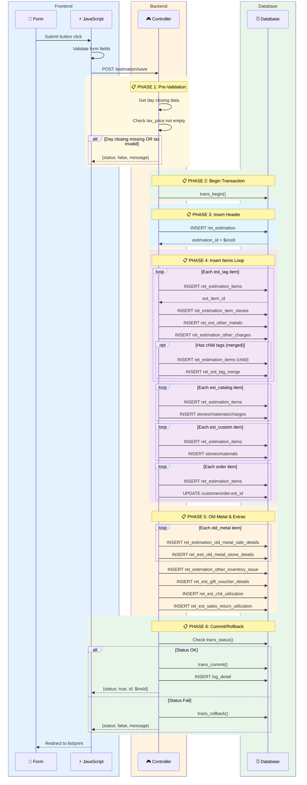
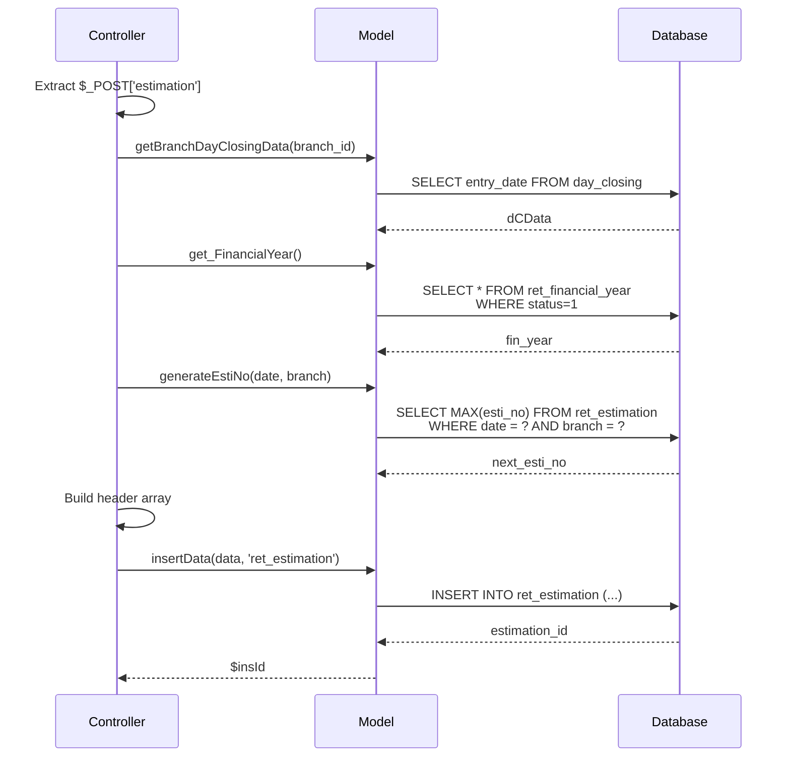
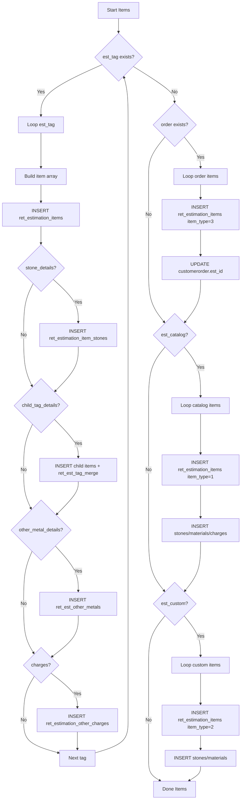
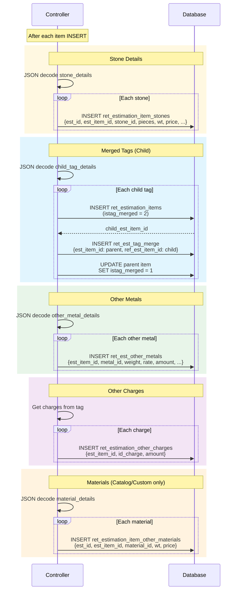
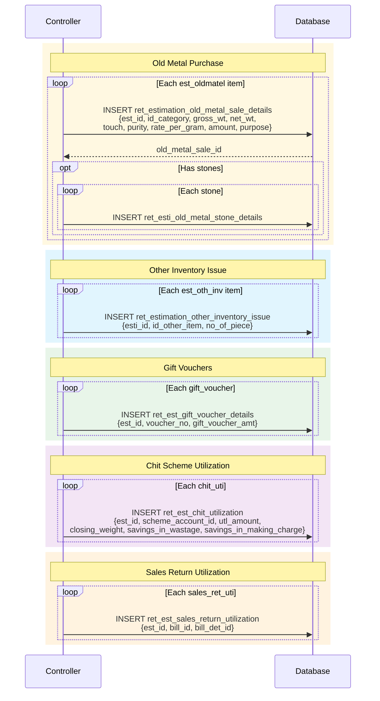

# Workflow 3: Save Estimation

> **Combined Swimlane + Hierarchical Documentation**  
> Entry Point: User clicks "Save" button → POST to `/admin_ret_estimation/estimation/save`

---

## 🎯 Master Overview



---

## 📊 Complete Swimlane Diagram



---

## 📋 Detail 3.1: Header Insert

### Sequence



### Header Data Array

```php
$data = array(
    'estimation_datetime' => $estimation_datetime,  // from day_closing
    'fin_year_code'       => $fin_year['fin_year_code'],
    'esti_no'             => $model->generateEstiNo($date, $branch),
    'esti_for'            => $addData['esti_for'],      // 1=Customer, 2=Branch, 3=Company
    'cus_id'              => $addData['cus_id'],
    'disc_per'            => $addData['discount'],
    'bulk_was_disc_per'   => $addData['blk_discount'],
    'gift_voucher_amt'    => $addData['gift_voucher_amt'],
    'total_cost'          => $addData['total_cost'],
    'est_date'            => date($estimation_datetime),
    'created_time'        => date("Y-m-d H:i:s"),
    'created_by'          => $addData['created_by'],
    'id_branch'           => $addData['id_branch'],
    'is_eda'              => $addData['is_eda'],
    'goldrate_22ct'       => $addData['goldrate_22ct'],
    'silverrate_1gm'      => $addData['silverrate_1gm'],
    'goldrate_18ct'       => $addData['goldrate_18ct'],
    'manual_rate'         => $addData['manual_rate'],
);

// INSERT → ret_estimation
// Returns: estimation_id
```

---

## 📋 Detail 3.2: Items Loop

### Flowchart



### Item Types

| item_type | Source           | Array Key     | Description               |
| --------- | ---------------- | ------------- | ------------------------- |
| **0**     | Tagged Item      | `est_tag`     | Items from `ret_taging`   |
| **1**     | Catalog/Non-Tag  | `est_catalog` | From `ret_nontagginglots` |
| **2**     | Custom/Home Bill | `est_custom`  | Manual entry              |
| **3**     | Order Item       | `order`       | From `customerorder`      |

### Tag Item Insert Structure

```php
$arrayEstTags = array(
    'esti_id'              => $insId,           // FK to ret_estimation
    'tag_id'               => $estTag['tag_id'][$key],
    'item_type'            => 0,                // Tagged item
    'product_id'           => $estTag['pro_id'][$key],
    'design_id'            => $estTag['design_id'][$key],
    'id_sub_design'        => $estTag['id_sub_design'][$key],
    'purity'               => $estTag['purity'][$key],
    'size'                 => $estTag['size'][$key],
    'piece'                => $estTag['piece'][$key],
    'less_wt'              => $estTag['lwt'][$key],
    'net_wt'               => $estTag['nwt'][$key],
    'gross_wt'             => $estTag['gwt'][$key],
    'calculation_based_on' => $estTag['caltype'][$key],
    'wastage_percent'      => $estTag['wastage'][$key],
    'mc_value'             => $estTag['mc'][$key],
    'mc_type'              => $estTag['id_mc_type'][$key],
    'item_cost'            => $estTag['cost'][$key],
    'item_total_tax'       => $estTag['tax_price'][$key],
    'est_rate_per_grm'     => $estTag['est_rate_per_grm'][$key],
    'is_partial'           => $estTag['is_partial'][$key],
    'item_emp_id'          => $estTag['item_emp_id'][$key],
    'discount'             => $estTag['discount_amount'][$key],
    'stone_amount'         => $estTag['stone_amt'][$key],
    // ... more fields
);

// INSERT → ret_estimation_items
// Returns: est_item_id (used for child tables)
```

---

## 📋 Detail 3.3: Child Tables Insert

### Sequence



### Child Table Relationships

```
ret_estimation_items (est_item_id)
    ├── ret_estimation_item_stones (FK: est_item_id)
    ├── ret_est_other_metals (FK: est_item_id)
    ├── ret_estimation_other_charges (FK: est_item_id)
    ├── ret_estimation_item_other_materials (FK: est_item_id)
    └── ret_est_tag_merge (FK: est_item_id → ref_est_item_id)
```

---

## 📋 Detail 3.4: Old Metal & Extras

### Sequence



---

## 📋 Transaction Handling

### Pseudo-code

```
FUNCTION estimation_save():

    // PHASE 1: Pre-validation
    dCData = model.getBranchDayClosingData(branch_id)
    fin_year = model.get_FinancialYear()

    IF dCData is empty:
        RETURN {status: false, message: "Day closing required"}

    // Check all tag prices have tax calculated
    FOR EACH tag IN est_tag:
        IF tag.tax_price is empty:
            RETURN {status: false, message: "GST info wrong"}

    // PHASE 2: Begin Transaction
    db.trans_begin()

    // PHASE 3: Insert Header
    estimation_id = model.insertData(headerData, 'ret_estimation')

    IF estimation_id:

        // PHASE 4: Insert Tag Items
        FOR EACH tag IN est_tag:
            item_id = model.insertData(tagData, 'ret_estimation_items')

            IF tag.stone_details:
                FOR EACH stone: INSERT ret_estimation_item_stones

            IF tag.child_tag_details:
                FOR EACH child:
                    child_id = INSERT ret_estimation_items (merged)
                    INSERT ret_est_tag_merge (parent → child)
                    UPDATE parent.istag_merged = 1

            IF tag.other_metal_details:
                FOR EACH metal: INSERT ret_est_other_metals

            IF tag.charges:
                FOR EACH charge: INSERT ret_estimation_other_charges

        // Insert Order Items (item_type = 3)
        FOR EACH order:
            INSERT ret_estimation_items
            UPDATE customerorder.est_id

        // Insert Catalog Items (item_type = 1)
        FOR EACH catalog:
            INSERT ret_estimation_items + stones/materials/charges

        // Insert Custom Items (item_type = 2)
        FOR EACH custom:
            INSERT ret_estimation_items + stones/materials

        // PHASE 5: Insert Old Metal
        FOR EACH old_metal:
            INSERT ret_estimation_old_metal_sale_details + stones

        // Insert Other Inventory
        FOR EACH oth_inv:
            INSERT ret_estimation_other_inventory_issue

        // Insert Gift Vouchers
        FOR EACH voucher:
            INSERT ret_est_gift_voucher_details

        // Insert Chit Utilization
        FOR EACH chit:
            INSERT ret_est_chit_utilization

        // Insert Sales Return
        FOR EACH sales_ret:
            INSERT ret_est_sales_return_utilization

    // PHASE 6: Commit/Rollback
    IF db.trans_status() === TRUE:
        db.trans_commit()
        log_model.log_detail('Add Estimation', estimation_id)
        flash_message('Estimation added successfully')
        RETURN {status: true, id: estimation_id}
    ELSE:
        db.trans_rollback()
        flash_message('Unable to proceed')
        RETURN {status: false}

END FUNCTION
```

---

## 🔗 Tables Affected

| Table                                   | Insert Count  | Purpose                 |
| --------------------------------------- | ------------- | ----------------------- |
| `ret_estimation`                        | 1             | Header record           |
| `ret_estimation_items`                  | N × items     | Line items (all types)  |
| `ret_estimation_item_stones`            | N × stones    | Stone details per item  |
| `ret_est_other_metals`                  | N × metals    | Other metal components  |
| `ret_estimation_other_charges`          | N × charges   | Additional charges      |
| `ret_estimation_item_other_materials`   | N × materials | Other materials         |
| `ret_est_tag_merge`                     | N × merged    | Tag merge relationships |
| `ret_estimation_old_metal_sale_details` | N × old_metal | Old metal purchase      |
| `ret_esti_old_metal_stone_details`      | N × stones    | Stones in old metal     |
| `ret_estimation_other_inventory_issue`  | N × inventory | Other inventory         |
| `ret_est_gift_voucher_details`          | N × vouchers  | Gift vouchers           |
| `ret_est_chit_utilization`              | N × chit      | Chit scheme usage       |
| `ret_est_sales_return_utilization`      | N × returns   | Sales returns           |

---

## 🔗 Collision Points

| This Workflow   | Shares With       | Component                     |
| --------------- | ----------------- | ----------------------------- |
| Save Estimation | Create Estimation | Settings, financial year      |
| Save Estimation | Add Tagged Item   | Item data structure           |
| Save Estimation | Convert to Bill   | Same item structure → billing |
| Save Estimation | Edit Estimation   | Same save logic with UPDATE   |

---

## ✅ Workflow Complete Checklist

- [x] Master overview diagram
- [x] Full swimlane sequence
- [x] Header insert detail (3.1)
- [x] Items loop detail (3.2)
- [x] Child tables detail (3.3)
- [x] Old metal & extras detail (3.4)
- [x] Transaction handling pseudo-code
- [x] Tables affected list

---

**Ready for Workflow 4: Add Old Metal Purchase?**
