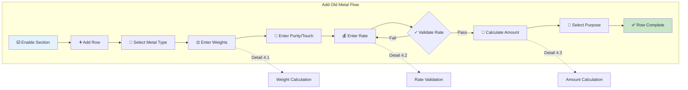
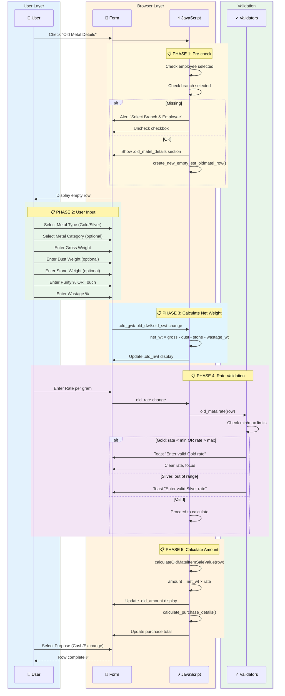
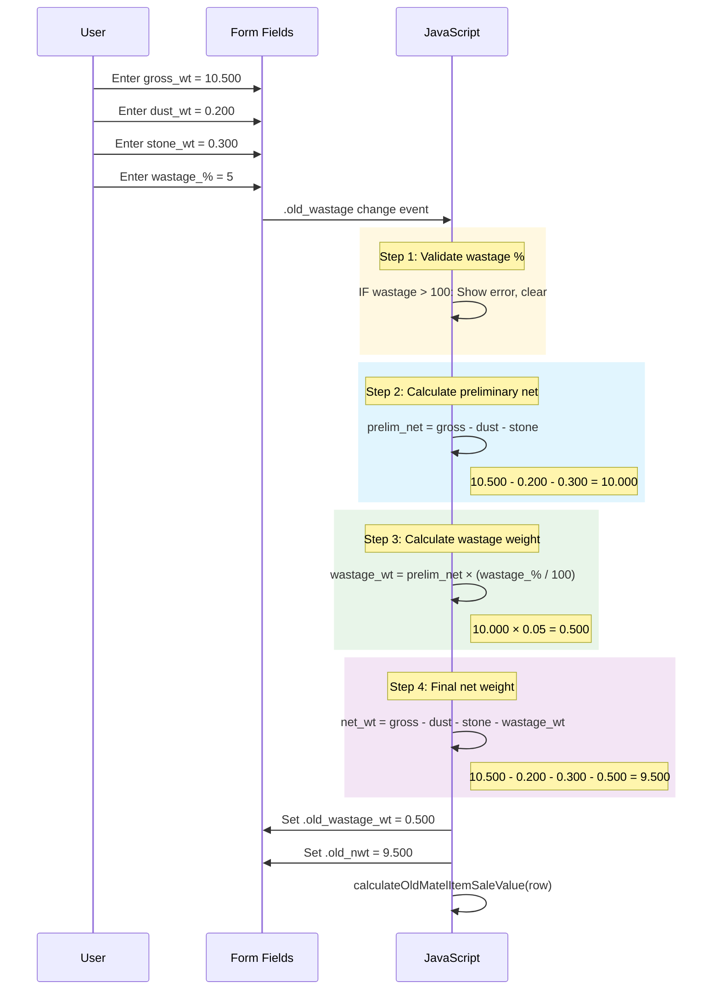
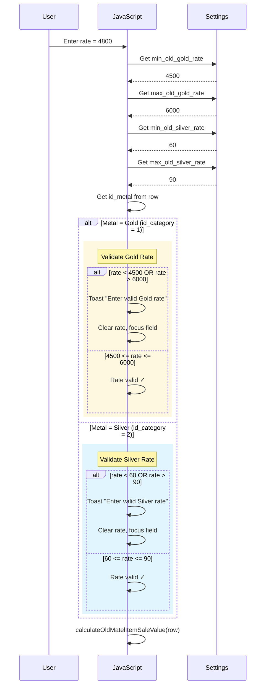
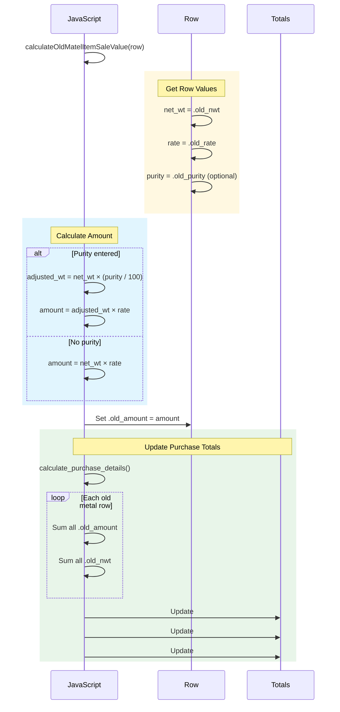

# Workflow 4: Add Old Metal Purchase

> **Combined Swimlane + Hierarchical Documentation**  
> Entry Point: User checks "Old Metal Details" checkbox → adds old gold/silver row

---

## 🎯 Master Overview



---

## 📊 Complete Swimlane Diagram



---

## 📋 Detail 4.1: Weight Calculation

### Sequence



### Formula

```
net_wt = gross_wt - dust_wt - stone_wt - wastage_wt

WHERE:
  wastage_wt = (gross_wt - dust_wt - stone_wt) × (wastage_% / 100)
```

### Pseudo-code

```
FUNCTION calculate_old_metal_weights(row):

    // Get all weight inputs
    gross_wt = parseFloat(row.find('.old_gwt').val()) OR 0
    dust_wt = parseFloat(row.find('.old_dwt').val()) OR 0
    stone_wt = parseFloat(row.find('.old_swt').val()) OR 0
    wastage_per = parseFloat(row.find('.old_wastage').val()) OR 0
    other_stone_wt = parseFloat(row.find('.stone_wt').val()) OR 0

    // Validate wastage %
    IF wastage_per > 100:
        SHOW toast "Wastage % must be within 100%"
        CLEAR wastage fields
        RETURN

    // Calculate preliminary net (before wastage)
    prelim_net = gross_wt - dust_wt - stone_wt - other_stone_wt

    // Calculate wastage weight
    wastage_wt = (prelim_net × wastage_per) / 100

    // Calculate final net weight
    net_wt = gross_wt - dust_wt - stone_wt - other_stone_wt - wastage_wt

    // Update display
    row.find('.old_wastage_wt').val(wastage_wt.toFixed(3))
    row.find('.old_nwt').val(net_wt.toFixed(3))

    // Trigger amount calculation
    calculateOldMatelItemSaleValue(row)

END FUNCTION
```

---

## 📋 Detail 4.2: Rate Validation

### Sequence



### Settings Used

| Setting               | Source                 | Description                          |
| --------------------- | ---------------------- | ------------------------------------ |
| `min_old_gold_rate`   | `#min_old_gold_rate`   | Minimum allowed gold purchase rate   |
| `max_old_gold_rate`   | `#max_old_gold_rate`   | Maximum allowed gold purchase rate   |
| `min_old_silver_rate` | `#min_old_silver_rate` | Minimum allowed silver purchase rate |
| `max_old_silver_rate` | `#max_old_silver_rate` | Maximum allowed silver purchase rate |

### Pseudo-code

```
FUNCTION old_metalrate(curRow):

    // Get settings from hidden fields
    min_gold = parseFloat($('#min_old_gold_rate').val())
    max_gold = parseFloat($('#max_old_gold_rate').val())
    min_silver = parseFloat($('#min_old_silver_rate').val())
    max_silver = parseFloat($('#max_old_silver_rate').val())

    // Get current values
    id_metal = curRow.find('.old_id_category').val()
    rate = parseFloat(curRow.find('.old_rate').val())

    // Validate based on metal type
    IF id_metal == 1:  // Gold
        IF rate < min_gold OR rate > max_gold:
            TOAST "Enter valid Gold rate"
            curRow.find('.old_rate').val('')
            curRow.find('.old_rate').focus()
            RETURN false

    ELSE IF id_metal == 2:  // Silver
        IF rate < min_silver OR rate > max_silver:
            TOAST "Enter valid Silver rate"
            curRow.find('.old_rate').val('')
            curRow.find('.old_rate').focus()
            RETURN false

    RETURN true

END FUNCTION
```

---

## 📋 Detail 4.3: Amount Calculation

### Sequence



### Formula

```
// Basic calculation
amount = net_wt × rate_per_gram

// With purity adjustment
adjusted_wt = net_wt × (purity% / 100)
amount = adjusted_wt × rate_per_gram

// Example:
net_wt = 9.500
rate = 4800
purity = 91.6% (22K)

adjusted_wt = 9.500 × 0.916 = 8.702
amount = 8.702 × 4800 = 41,769.60
```

### Pseudo-code

```
FUNCTION calculateOldMatelItemSaleValue(row):

    // Get values
    net_wt = parseFloat(row.find('.old_nwt').val()) OR 0
    rate = parseFloat(row.find('.old_rate').val()) OR 0
    purity = parseFloat(row.find('.old_purity').val()) OR 0
    touch = parseFloat(row.find('.old_touch').val()) OR 0

    // Calculate amount
    IF purity > 0:
        // Purity-based calculation
        purity_factor = purity / 100
        amount = net_wt × purity_factor × rate
    ELSE IF touch > 0:
        // Touch-based calculation
        touch_factor = touch / 100
        amount = net_wt × touch_factor × rate
    ELSE:
        // Plain calculation
        amount = net_wt × rate

    // Round to 2 decimals
    amount = amount.toFixed(2)

    // Update row
    row.find('.old_amount').val(amount)

    // Update totals
    calculate_purchase_details()

END FUNCTION

FUNCTION calculate_purchase_details():

    total_gwt = 0
    total_nwt = 0
    total_amount = 0

    // Loop all old metal rows
    $('#estimation_old_matel_details tbody tr').each(function() {
        row = $(this)
        total_gwt += parseFloat(row.find('.old_gwt').val()) OR 0
        total_nwt += parseFloat(row.find('.old_nwt').val()) OR 0
        total_amount += parseFloat(row.find('.old_amount').val()) OR 0
    })

    // Update summary
    $('#pur_gwt').text(total_gwt.toFixed(3))
    $('#pur_nwt').text(total_nwt.toFixed(3))
    $('#pur_amt').text(total_amount.toFixed(2))

    // Update grand total
    calculate_sales_details()

END FUNCTION
```

---

## 📦 Row Data Structure

### HTML Row Fields

```html
<tr>
  <!-- Metal Type -->
  <td>
    <select class="old_id_category" name="est_oldmatel[id_category][]">
      <option value="1">Gold</option>
      <option value="2">Silver</option>
    </select>
  </td>

  <!-- Metal Category -->
  <td>
    <select
      class="old_metal_category"
      name="est_oldmatel[id_old_metal_category][]"
    >
      <option value="1">Ornament</option>
      <option value="2">Bar/Coin</option>
    </select>
  </td>

  <!-- Product -->
  <td>
    <select class="old_metal_prod" name="est_oldmatel[old_metal_prod_id][]">
      <!-- Populated from old_metal_products -->
    </select>
  </td>

  <!-- Pieces -->
  <td><input type="number" class="old_pcs" name="est_oldmatel[pcs][]" /></td>

  <!-- Weights -->
  <td><input type="number" class="old_gwt" name="est_oldmatel[gwt][]" /></td>
  <td><input type="number" class="old_dwt" name="est_oldmatel[dwt][]" /></td>
  <td><input type="number" class="old_swt" name="est_oldmatel[swt][]" /></td>

  <!-- Purity/Touch -->
  <td>
    <input type="number" class="old_purity" name="est_oldmatel[purity][]" />
  </td>
  <td>
    <input type="number" class="old_touch" name="est_oldmatel[touch][]" />
  </td>

  <!-- Wastage -->
  <td>
    <input type="number" class="old_wastage" name="est_oldmatel[wastage][]" />
  </td>
  <td>
    <input
      type="number"
      class="old_wastage_wt"
      name="est_oldmatel[wastage_wt][]"
      readonly
    />
  </td>

  <!-- Net Weight (calculated) -->
  <td>
    <input type="number" class="old_nwt" name="est_oldmatel[nwt][]" readonly />
  </td>

  <!-- Rate -->
  <td><input type="number" class="old_rate" name="est_oldmatel[rate][]" /></td>

  <!-- Amount (calculated) -->
  <td>
    <input
      type="number"
      class="old_amount"
      name="est_oldmatel[amount][]"
      readonly
    />
  </td>

  <!-- Purpose -->
  <td>
    <select class="old_purpose" name="est_oldmatel[id_purpose][]">
      <option value="1">Cash</option>
      <option value="2">Exchange</option>
    </select>
  </td>

  <!-- Remarks -->
  <td>
    <input
      type="text"
      class="old_remarks"
      name="est_oldmatel[old_metal_remarks][]"
    />
  </td>

  <!-- Stones -->
  <td>
    <a onclick="add_old_metal_stone($(this))">+</a>
    <input
      type="hidden"
      class="stone_details"
      name="est_oldmatel[stone_details][]"
    />
  </td>
</tr>
```

---

## 🔗 Purpose Types

| Value | Purpose       | Effect on Estimation                         |
| ----- | ------------- | -------------------------------------------- |
| **1** | Cash Purchase | Added to cash outflow summary                |
| **2** | Exchange      | Deducted from sales total (customer benefit) |

---

## 🔗 Collision Points

| This Workflow | Shares With     | Component                                             |
| ------------- | --------------- | ----------------------------------------------------- |
| Add Old Metal | Save Estimation | Data saved to `ret_estimation_old_metal_sale_details` |
| Add Old Metal | Sales Total     | Exchange amount deducted from total                   |
| Add Old Metal | Cash Handling   | Cash purchases tracked separately                     |

---

## ✅ Workflow Complete Checklist

- [x] Master overview diagram
- [x] Full swimlane sequence
- [x] Weight calculation detail (4.1)
- [x] Rate validation detail (4.2)
- [x] Amount calculation detail (4.3)
- [x] Row HTML structure
- [x] Purpose types explained

---

**Ready for Workflow 5: Apply Chit Scheme?**
