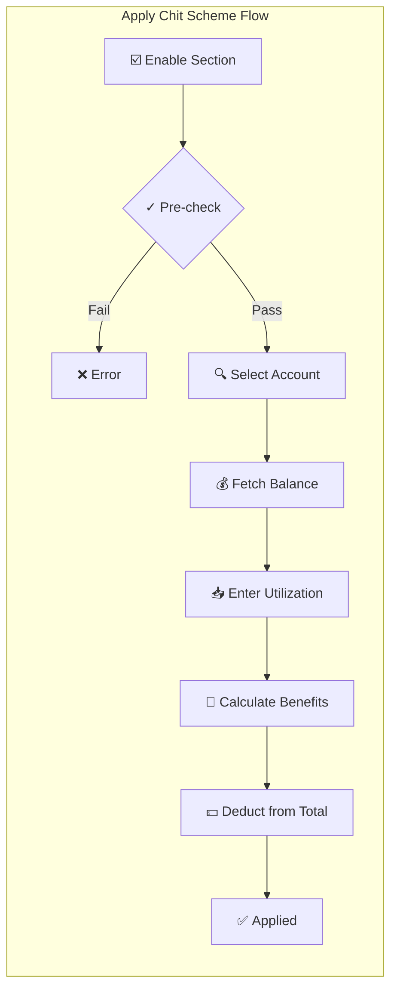
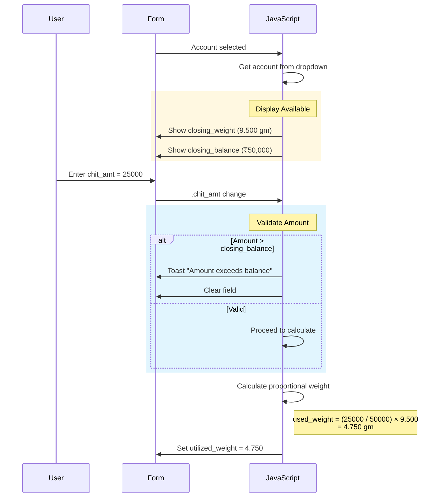
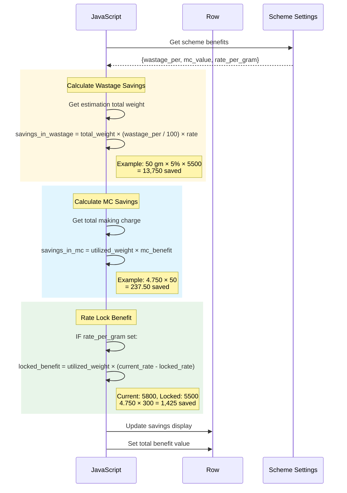
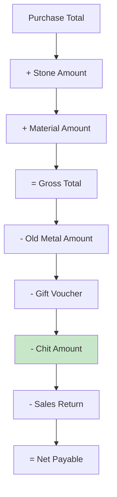

# Workflow 5: Apply Chit Scheme

> **Combined Swimlane + Hierarchical Documentation**  
> Entry Point: User checks "Chit Details" → selects customer's scheme account

---

## 🎯 Master Overview



    C -.->|Detail 5.1| C1["Account Lookup"]
    E -.->|Detail 5.2| E1["Balance Utilization"]
    F -.->|Detail 5.3| F1["Benefits Calculation"]

    style A fill:#e3f2fd
    style H fill:#c8e6c9
    style X fill:#ffcdd2

````

---

## 📊 Complete Swimlane Diagram

```mermaid
sequenceDiagram
    box rgb(227,242,253) User Layer
    participant U as 👤 User
    end
    box rgb(255,243,224) Browser Layer
    participant F as 📝 Form
    participant JS as ⚡ JavaScript
    end
    box rgb(232,245,233) Backend Layer
    participant C as 🎮 Controller
    participant DB as 🗄️ Database
    end

    U->>F: Check "Chit Details"
    F->>JS: #select_chit_details.change()

    rect rgb(255,248,225)
    Note over JS: 📋 PHASE 1: Pre-validation
    JS->>JS: Check customer selected
    JS->>JS: Check items exist
    alt No customer
        JS->>F: Toast "Please Select Customer"
    else No items
        JS->>F: Toast "Item Details Not Found"
    else Valid
        JS->>F: Show .chit_details section
        JS->>JS: create_new_empty_est_chit_row()
    end
    end

    rect rgb(232,245,233)
    Note over JS,DB: 📋 PHASE 2: Fetch Scheme Accounts
    JS->>C: AJAX getSchemeAccounts(cus_id)
    C->>DB: SELECT * FROM scheme_accounts<br/>WHERE customer_id = ?<br/>AND status = 'active'
    DB-->>C: Customer's scheme accounts
    C-->>JS: [{account_id, scheme_name, balance, ...}]
    JS->>F: Populate account dropdown
    end

    U->>F: Select scheme account

    rect rgb(225,245,254)
    Note over JS: 📋 PHASE 3: Display Balance
    F->>JS: .scheme_account change
    JS->>JS: Get selected account details
    JS->>F: Show closing_weight
    JS->>F: Show available amount
    end

    U->>F: Enter utilization amount

    rect rgb(243,229,245)
    Note over JS: 📋 PHASE 4: Calculate Benefits
    F->>JS: .chit_amt change
    JS->>JS: Calculate wastage savings
    JS->>JS: Calculate MC savings
    JS->>JS: Calculate rate per gram benefit
    JS->>F: Update savings display
    end

    rect rgb(255,243,224)
    Note over JS: 📋 PHASE 5: Update Totals
    JS->>JS: calculate_sales_details()
    JS->>JS: Sum all chit_amt
    JS->>JS: Sum all saved_weight
    JS->>F: Update .summary_chit_amt
    JS->>F: Update .summary_chit_weight
    JS->>JS: calculateFinalCost()
    JS->>F: Deduct from total_cost
    end

    F-->>U: Scheme applied ✅
````

---

## 📋 Detail 5.1: Account Lookup

### Sequence

```mermaid
sequenceDiagram
    participant JS as JavaScript
    participant C as Controller
    participant DB as Database

    JS->>C: AJAX getSchemeAccounts
    Note right of JS: {customer_id: 1234}

    C->>DB: SELECT sa.*, s.scheme_name<br/>FROM scheme_accounts sa<br/>JOIN schemes s ON sa.scheme_id = s.id<br/>WHERE sa.customer_id = ?<br/>AND sa.status = 'active'<br/>AND sa.closing_balance > 0

    DB-->>C: Active accounts with balance

    C-->>JS: accounts[]
```

### Account Data Structure

```javascript
// Response from getSchemeAccounts
accounts = [
  {
    id_scheme_account: 101,
    scheme_account_no: "SCH-2025-001",
    scheme_name: "Gold Savings Scheme",
    scheme_type: 1, // 1=Amount, 2=Weight

    // Balances
    closing_balance: 50000.0,
    closing_weight: 9.5,

    // Benefits configured
    wastage_benefit: 5, // % deduction
    mc_benefit: 50, // ₹ per gram
    rate_per_gram: 5500, // locked rate

    // Dates
    maturity_date: "2025-12-31",
    start_date: "2024-01-01",
  },
];
```

---

## 📋 Detail 5.2: Balance Utilization

### Sequence



### Pseudo-code

```
FUNCTION on_chit_amount_change(row):

    // Get values
    chit_amt = parseFloat(row.find('.chit_amt').val())
    closing_balance = parseFloat(row.attr('data-closing-balance'))
    closing_weight = parseFloat(row.attr('data-closing-weight'))

    // Validate
    IF chit_amt > closing_balance:
        TOAST "Utilization cannot exceed balance"
        row.find('.chit_amt').val('')
        RETURN

    // Calculate proportional weight used
    IF closing_balance > 0:
        weight_ratio = chit_amt / closing_balance
        utilized_weight = closing_weight × weight_ratio
        row.find('.utilized_weight').val(utilized_weight.toFixed(3))

    // Trigger benefits calculation
    calculate_chit_benefits(row)

END FUNCTION
```

---

## 📋 Detail 5.3: Benefits Calculation

### Sequence



### Benefits Formula

```
// Wastage Benefit
savings_in_wastage = (utilized_weight × wastage_benefit_per / 100) × rate_per_gram

// Making Charge Benefit
savings_in_mc = utilized_weight × mc_benefit_per_gram

// Rate Lock Benefit (if applicable)
rate_lock_benefit = utilized_weight × (current_market_rate - locked_rate)

// Total Benefit
total_chit_benefit = chit_amt + savings_in_wastage + savings_in_mc + rate_lock_benefit
```

### Pseudo-code

```
FUNCTION calculate_chit_benefits(row):

    // Get scheme settings
    wastage_per = parseFloat(row.attr('data-wastage-per')) OR 0
    mc_value = parseFloat(row.attr('data-mc-value')) OR 0
    locked_rate = parseFloat(row.attr('data-rate-per-gram')) OR 0

    // Get utilized values
    utilized_weight = parseFloat(row.find('.utilized_weight').val()) OR 0
    chit_amt = parseFloat(row.find('.chit_amt').val()) OR 0

    // Get current rate from estimation
    current_rate = parseFloat($('#goldrate_22ct').val()) OR 0

    // Calculate wastage savings
    savings_wastage = utilized_weight × (wastage_per / 100) × current_rate
    row.find('.savings_in_wastage').val(savings_wastage.toFixed(2))

    // Calculate MC savings
    savings_mc = utilized_weight × mc_value
    row.find('.savings_in_mcvalue').val(savings_mc.toFixed(2))

    // Calculate rate lock benefit (if locked rate exists)
    IF locked_rate > 0 AND current_rate > locked_rate:
        rate_benefit = utilized_weight × (current_rate - locked_rate)
        row.find('.rate_benefit').val(rate_benefit.toFixed(2))

    // Update totals
    calculate_sales_details()

END FUNCTION
```

---

## 📦 Row Data Structure

### HTML Row Fields

```html
<tr
  data-closing-balance="50000"
  data-closing-weight="9.500"
  data-wastage-per="5"
  data-mc-value="50"
  data-rate-per-gram="5500"
>
  <!-- Scheme Account Selection -->
  <td>
    <select class="scheme_account_id" name="chit_uti[scheme_account_id][]">
      <option value="">--Select--</option>
      <option value="101">SCH-2025-001 (Gold Savings)</option>
    </select>
    <input
      type="hidden"
      class="id_scheme_account"
      name="chit_uti[id_scheme_account][]"
    />
  </td>

  <!-- Utilization Amount -->
  <td>
    <input type="number" class="chit_amt" name="chit_uti[chit_amt][]" />
    <div class="available_balance"></div>
  </td>

  <!-- Closing Weight Display -->
  <td>
    <span class="saved_weight"></span>
    <input
      type="hidden"
      class="closing_weight"
      name="chit_uti[closing_weight][]"
    />
  </td>

  <!-- Benefits -->
  <td>
    <input type="hidden" class="wastage_per" name="chit_uti[wastage_per][]" />
    <input
      type="hidden"
      class="savings_in_wastage"
      name="chit_uti[savings_in_wastage][]"
    />
    <div>Wastage Saved: <span class="wastage_saved_display"></span></div>
  </td>

  <td>
    <input type="hidden" class="mc_value" name="chit_uti[mc_value][]" />
    <input
      type="hidden"
      class="savings_in_mcvalue"
      name="chit_uti[savings_in_mcvalue][]"
    />
    <div>MC Saved: <span class="mc_saved_display"></span></div>
  </td>

  <td>
    <input
      type="hidden"
      class="rate_per_gram"
      name="chit_uti[rate_per_gram][]"
    />
    <div>Locked Rate: <span class="locked_rate_display"></span></div>
  </td>

  <!-- Delete -->
  <td>
    <a onclick="remove_chit_row($(this))">🗑️</a>
  </td>
</tr>
```

---

## 📊 Final Cost Integration

### How Chit Affects Total



### Code Reference

```javascript
// From calculateFinalCost()
tot_purchase = purchase_amt + stone_amt + material_amt;

tot_sale = sales_amt + gift_voucher_amt + chit_paid_amt + sales_ret_Amt;

tot_cost = tot_purchase - tot_sale - discount - adv_paid_amt;

$(".total_cost").val(tot_cost.toFixed(2));
```

---

## 🔗 Tables Affected (on Save)

| Table                      | Data Stored                                                                           |
| -------------------------- | ------------------------------------------------------------------------------------- |
| `ret_est_chit_utilization` | scheme_account_id, utl_amount, closing_weight, wastage_per, mc_value, savings amounts |

---

## ✅ Workflow Complete Checklist

- [x] Master overview diagram
- [x] Full swimlane sequence
- [x] Account lookup detail (5.1)
- [x] Balance utilization detail (5.2)
- [x] Benefits calculation detail (5.3)
- [x] Row HTML structure
- [x] Final cost integration

---

**Ready for Workflow 6: Convert to Billing?**
