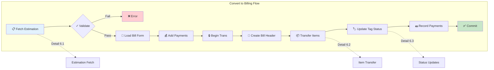
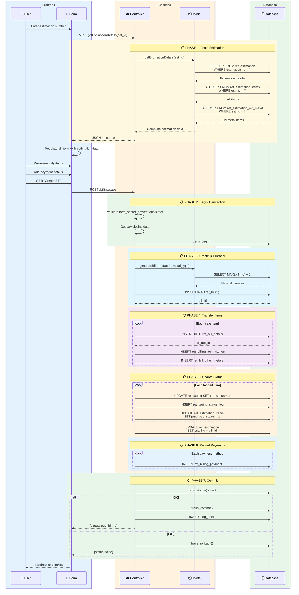
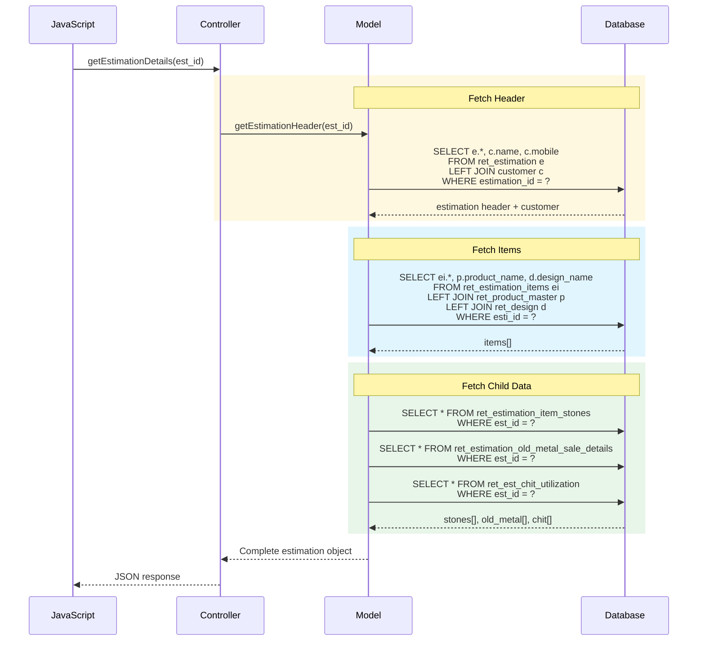
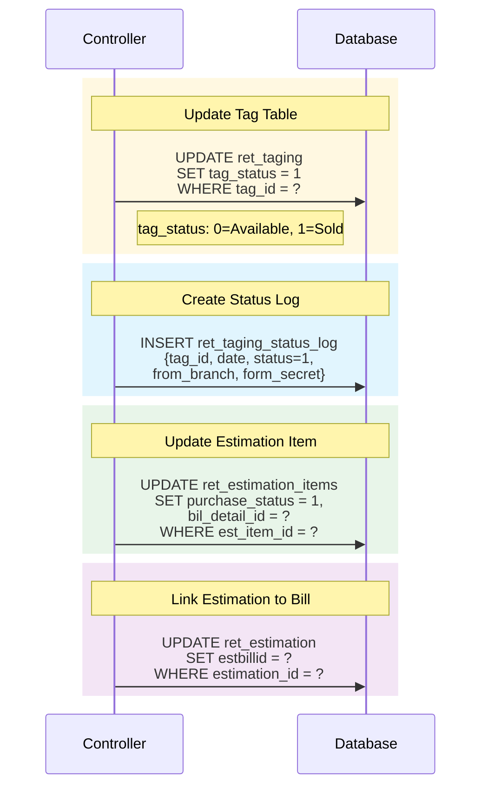

# Workflow 6: Convert to Billing

> **Combined Swimlane + Hierarchical Documentation**  
> Entry Point: User opens billing → enters estimation number → converts to bill

---

## 🎯 Master Overview



---

## 📊 Complete Swimlane Diagram



---

## 📋 Detail 6.1: Estimation Fetch

### Data Flow



### Response Structure

```javascript
{
  estimation: {
    estimation_id: 1234,
    esti_no: "EST-2025-001",
    cus_id: 55,
    customer_name: "John Doe",
    mobile: "9876543210",
    total_cost: 150000,
    goldrate_22ct: 5500,
    silverrate_1gm: 75
  },
  items: [
    {
      est_item_id: 101,
      tag_id: 5001,
      item_type: 0,  // Tagged
      product_name: "Gold Necklace",
      gross_wt: 15.800,
      net_wt: 15.800,
      item_cost: 95000,
      stone_details: [...],
      other_metal_details: [...]
    }
  ],
  old_metal: [...],
  chit_utilization: [...],
  payments: []  // Empty for new bill
}
```

---

## 📋 Detail 6.2: Item Transfer

### Estimation → Billing Mapping

| Estimation Table                        | Billing Table                   |
| --------------------------------------- | ------------------------------- |
| `ret_estimation`                        | `ret_billing`                   |
| `ret_estimation_items`                  | `ret_bill_details`              |
| `ret_estimation_item_stones`            | `ret_billing_item_stones`       |
| `ret_est_other_metals`                  | `ret_bill_other_metals`         |
| `ret_estimation_old_metal_sale_details` | `ret_billing_old_metal_details` |
| `ret_est_chit_utilization`              | `ret_billing_chit_utilization`  |

### Bill Header Insert

```php
$data = array(
    'bill_no'           => $model->generateBillNo($branch, $metal_type),
    'fin_year_code'     => $fin_year['fin_year_code'],
    'bill_type'         => $addData['bill_type'],
    'bill_cus_id'       => $addData['cus_id'],
    'customer_name'     => $addData['customer_name'],
    'goldrate_22ct'     => $addData['goldrate_22ct'],
    'silverrate_1gm'    => $addData['silverrate_1gm'],
    'tot_bill_amount'   => $addData['tot_bill_amount'],
    'tot_amt_received'  => $addData['tot_amt_received'],
    'tot_discount'      => $addData['tot_discount'],
    'round_off_amt'     => $addData['round_off_amt'],
    'is_credit'         => $addData['is_credit'],
    'bill_date'         => $bill_date,
    'created_time'      => date("Y-m-d H:i:s"),
    'created_by'        => $session->userdata('uid'),
    'id_branch'         => $addData['id_branch'],
);

// INSERT → ret_billing
// Returns: bill_id
```

### Bill Detail Insert (per item)

```php
$arrayBillSales = array(
    'bill_id'           => $bill_id,
    'esti_item_id'      => $billSale['est_itm_id'],  // Link to estimation
    'item_type'         => $billSale['itemtype'],
    'tag_id'            => $billSale['tag'],
    'product_id'        => $billSale['product'],
    'design_id'         => $billSale['design'],
    'gross_wt'          => $billSale['gross'],
    'net_wt'            => $billSale['net'],
    'purity'            => $billSale['purity'],
    'wastage_percent'   => $billSale['wastage'],
    'mc_value'          => $billSale['mc'],
    'mc_type'           => $billSale['bill_mctype'],
    'item_cost'         => $billSale['total_sales_amount'],
    'item_total_tax'    => $billSale['item_total_tax'],
    'total_cgst'        => $billSale['total_cgst'],
    'total_sgst'        => $billSale['total_sgst'],
    'rate_per_grm'      => $billSale['per_grm'],
);

// INSERT → ret_bill_details
// Returns: bill_det_id
```

---

## 📋 Detail 6.3: Status Updates

### Tag Status Update



### Status Values

| Table                  | Field             | Before        | After      |
| ---------------------- | ----------------- | ------------- | ---------- |
| `ret_taging`           | `tag_status`      | 0 (Available) | 1 (Sold)   |
| `ret_estimation_items` | `purchase_status` | 0 (Pending)   | 1 (Billed) |
| `ret_estimation`       | `estbillid`       | NULL          | bill_id    |

---

## 📋 Payment Recording

### Payment Types

| Mode          | Code  | Additional Fields               |
| ------------- | ----- | ------------------------------- |
| Cash          | `CSH` | -                               |
| Card (Credit) | `CC`  | card_type, card_no, approval_no |
| Card (Debit)  | `DC`  | card_type, card_no, approval_no |
| Cheque        | `CHQ` | cheque_no, cheque_date, bank_id |
| Net Banking   | `NB`  | NB_type, ref_no                 |
| UPI           | `UPI` | ref_no                          |

### Payment Insert

```php
$arrayCashPay = array(
    'bill_id'           => $bill_id,
    'payment_amount'    => $pay['amount'],
    'payment_mode'      => $pay['payment_mode'],
    'id_pay_device'     => $pay['device_type'],
    'card_type'         => $pay['card_name'],
    'card_no'           => $pay['card_no'],
    'payment_ref_number'=> $pay['ref_no'],
    'id_bank'           => $pay['bank_id'],
    'cheque_no'         => $pay['cheque_no'],
    'cheque_date'       => $pay['cheque_date'],
    'type'              => 1,  // Receipt
    'payment_for'       => 1,  // Sale
    'payment_status'    => 1,  // Complete
    'payment_date'      => date("Y-m-d H:i:s"),
);

// INSERT → ret_billing_payment
```

---

## 🔗 Tables Affected

| Table                     | Action | Purpose                |
| ------------------------- | ------ | ---------------------- |
| `ret_billing`             | INSERT | Bill header            |
| `ret_bill_details`        | INSERT | Bill line items        |
| `ret_billing_item_stones` | INSERT | Stone details          |
| `ret_bill_other_metals`   | INSERT | Other metal components |
| `ret_billing_payment`     | INSERT | Payment records        |
| `ret_taging`              | UPDATE | Mark tag as sold       |
| `ret_taging_status_log`   | INSERT | Audit trail            |
| `ret_estimation`          | UPDATE | Link to bill           |
| `ret_estimation_items`    | UPDATE | Mark as billed         |

---

## ✅ Workflow Complete Checklist

- [x] Master overview diagram
- [x] Full swimlane sequence
- [x] Estimation fetch detail (6.1)
- [x] Item transfer detail (6.2)
- [x] Status updates detail (6.3)
- [x] Payment recording
- [x] Tables affected list

---

**All 6 Workflows Complete!** 🎉

| #   | Workflow           | Status |
| --- | ------------------ | ------ |
| 1   | Create Estimation  | ✅     |
| 2   | Add Tagged Item    | ✅     |
| 3   | Save Estimation    | ✅     |
| 4   | Add Old Metal      | ✅     |
| 5   | Apply Chit Scheme  | ✅     |
| 6   | Convert to Billing | ✅     |
