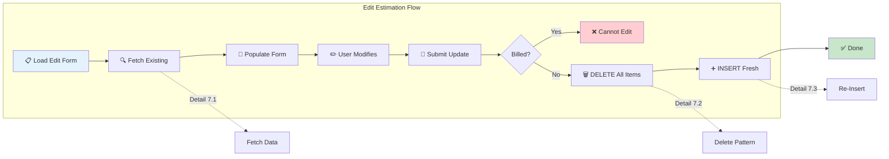
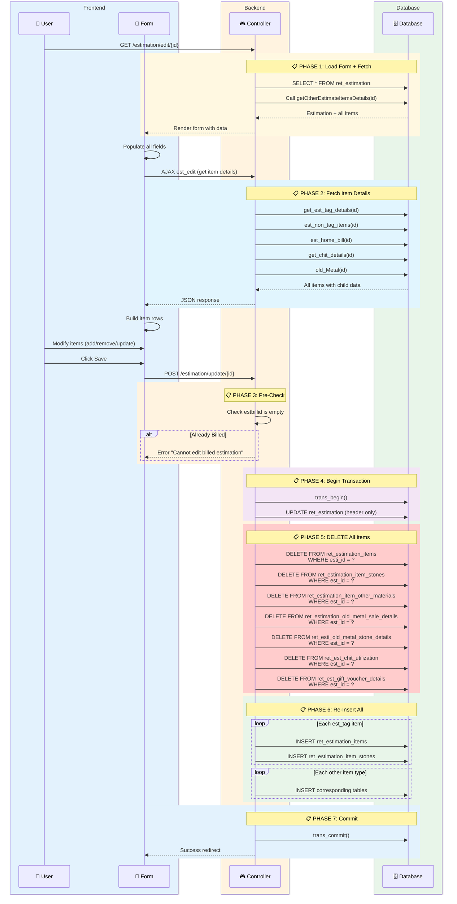
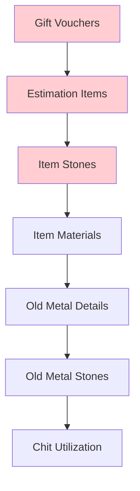

# Workflow 7: Edit Estimation

> **Combined Swimlane + Hierarchical Documentation**  
> Entry Point: User clicks "Edit" on estimation list → modifies → saves

---

## 🎯 Master Overview



---

## ⚠️ Critical Pattern: Delete + Insert

> [!IMPORTANT]
> **Edit does NOT use SQL UPDATE for items!**  
> Instead, it **DELETES all child records** and **RE-INSERTS** them fresh.

This is **intentional** because:

1. Items can be added/removed during edit
2. Child tables (stones, materials) would need complex diff logic
3. Delete + Insert is simpler and atomic

---

## 📊 Complete Swimlane Diagram



---

## 📋 Detail 7.1: Fetch Existing Data

### Controller Functions

```php
// case "edit" - Load form with header data
$data['estimation'] = $this->$model->get_entry_records($id);
$data['est_other_item'] = $this->$model->getOtherEstimateItemsDetails($id);

// case "est_edit" - AJAX fetch all items
$data['tag_details'] = $this->$model->get_est_tag_details($id);
$data['non_tag_details'] = $this->$model->est_non_tag_items($id);
$data['est_home_bill'] = $this->$model->est_home_bill($id);
$data['chit_details'] = $this->$model->get_chit_details($id);
$data['old_metal'] = $this->$model->old_Metal($id);
```

### Data Fetched

| Model Function            | Returns                      |
| ------------------------- | ---------------------------- |
| `get_entry_records(id)`   | Estimation header + customer |
| `get_est_tag_details(id)` | Tagged items with stones     |
| `est_non_tag_items(id)`   | Catalog items                |
| `est_home_bill(id)`       | Custom/Home bill items       |
| `get_chit_details(id)`    | Chit utilization             |
| `old_Metal(id)`           | Old metal purchase           |

---

## 📋 Detail 7.2: Delete Pattern

### Tables Deleted (in order)

```php
// Inside case "update" after header update succeeds
$this->$model->deleteData('est_id', $id, 'ret_est_gift_voucher_details');
$this->$model->deleteData('esti_id', $id, 'ret_estimation_items');
$this->$model->deleteData('est_id', $id, 'ret_estimation_item_stones');
$this->$model->deleteData('est_id', $id, 'ret_estimation_item_other_materials');
$this->$model->deleteData('est_id', $id, 'ret_estimation_old_metal_sale_details');
$this->$model->deleteData('est_id', $id, 'ret_esti_old_metal_stone_details');
$this->$model->deleteData('est_id', $id, 'ret_est_chit_utilization');
```

### Delete Order



---

## 📋 Detail 7.3: Re-Insert Logic

After DELETE, the code proceeds **exactly like WF3: Save Estimation**:

1. Loop each `est_tag[]` → INSERT `ret_estimation_items` + stones
2. Loop each `est_catalog[]` → INSERT items + stones + materials
3. Loop each `est_custom[]` → INSERT items + stones
4. Loop each `est_oldmatel[]` → INSERT old metal + stones
5. Loop each `chit_uti[]` → INSERT chit utilization

> [!TIP]
> See [Workflow 3: Save Estimation](./workflow_03_save_estimation.md) for detailed insert logic.

---

## 🛡️ Guards & Validations

### Cannot Edit If Billed

```php
$estimation = $this->$model->get_entry_records($id);

if ($estimation['estbillid'] == '') {
    // Proceed with update
} else {
    // Cannot edit - estimation already converted to bill
}
```

| Check          | Field       | Condition  | Result        |
| -------------- | ----------- | ---------- | ------------- |
| Already Billed | `estbillid` | Not empty  | ❌ Block edit |
| Not Billed     | `estbillid` | Empty/NULL | ✅ Allow edit |

---

## 🔄 Edit vs Save Comparison

| Aspect      | Save (WF3)              | Update (WF7)                              |
| ----------- | ----------------------- | ----------------------------------------- |
| Header      | INSERT                  | UPDATE                                    |
| Items       | INSERT                  | DELETE + INSERT                           |
| Stones      | INSERT                  | DELETE + INSERT                           |
| Transaction | Begin → Insert → Commit | Begin → Update → Delete → Insert → Commit |
| Pre-check   | Day closing             | Day closing + not billed                  |

---

## ⚠️ Risk: Tag Status Not Reverted

> [!CAUTION]
> When editing, if a tag is **removed** from the estimation:
>
> - The item row is deleted
> - **But the tag's `tag_status` in `ret_taging` may NOT be updated**
> - This is a potential bug area - check if tag reversion is needed

---

## ✅ Workflow Complete Checklist

- [x] Master overview diagram
- [x] Full swimlane sequence
- [x] Fetch existing detail (7.1)
- [x] Delete pattern detail (7.2)
- [x] Re-insert reference (7.3)
- [x] Guards & validations
- [x] Risk warnings
