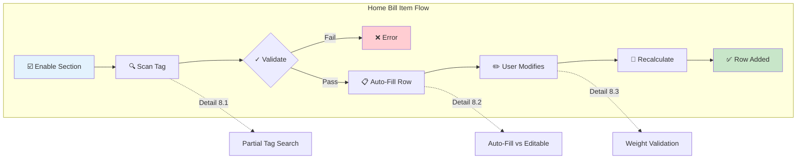
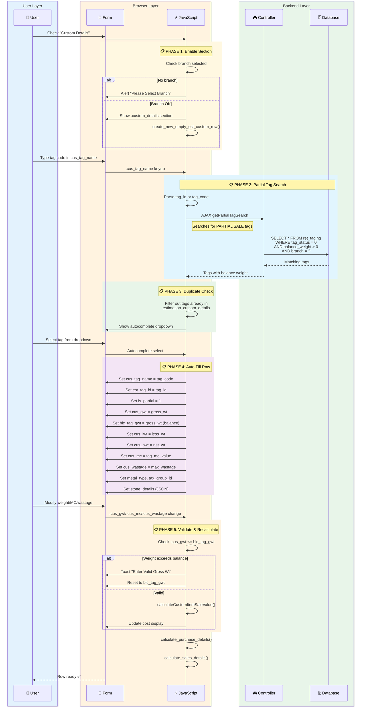
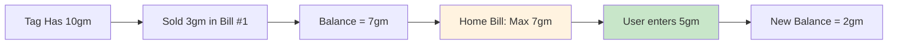

# Workflow 8: Add Home Bill Item

> **Combined Swimlane + Hierarchical Documentation**  
> Entry Point: User enables "Custom Details" → scans existing tag → modifies properties

---

## 🎯 Master Overview



---

## ⚖️ Tagged vs Home Bill Comparison

| Feature               | Tagged (item_type=0)  |   Home Bill (item_type=2)   |
| --------------------- | :-------------------: | :-------------------------: |
| Tag Required          |        ✅ Yes         | ⚠️ Optional (can be manual) |
| Weight Editable       |         ❌ No         |           ✅ Yes            |
| MC Editable           |         ❌ No         |           ✅ Yes            |
| Wastage Editable      |         ❌ No         |           ✅ Yes            |
| Purity Editable       |         ❌ No         |           ✅ Yes            |
| Partial Sale          | Via `is_partial` flag |      Default behavior       |
| Can Exceed Tag Weight |         ❌ No         |      ❌ No (validated)      |

---

## 📊 Complete Swimlane Diagram



---

## 📋 Detail 8.1: Partial Tag Search

### API Call

```javascript
function getCusSearchTags(searchTxt, searchField, curRow, searchtab) {
  $.ajax({
    url: base_url + "index.php/admin_ret_estimation/getPartialTagSearch",
    method: "POST",
    data: {
      searchTxt: searchTxt,
      searchField: searchField,
      id_branch: $("#id_branch").val(),
    },
    success: function (data) {
      // Filter out already-added tags
      // Show autocomplete
    },
  });
}
```

### Query (Backend)

```sql
-- getPartialTagSearch returns tags with:
-- 1. tag_status = 0 (available)
-- 2. balance_weight > 0 (has remaining weight)
-- 3. Matching branch

SELECT t.*,
       (t.gross_wt - COALESCE(sold_wt, 0)) AS balance_weight
FROM ret_taging t
WHERE t.tag_status = 0
  AND t.id_branch = ?
  AND (t.tag_code LIKE ? OR t.tag_id = ?)
  AND (t.gross_wt - COALESCE(sold_wt, 0)) > 0
```

### Search Types

| Input Format | Search Type |
| ------------ | ----------- |
| `123/`       | tag_id      |
| `GOLD-001`   | tag_code    |
| `ABC123`     | old_tag_id  |

---

## 📋 Detail 8.2: Auto-Fill vs Editable Fields

### On Tag Select - Field Mapping

```javascript
// Auto-filled from tag data
curRow.find(".cus_tag_name").val(i.item.tag_code);
curRow.find(".est_tag_id").val(i.item.value);
curRow.find(".is_partial").val(1); // Always 1 for home bill
curRow.find(".cus_product").select2("val", curRowItem.product_id);
curRow.find(".cus_product_id").val(curRowItem.product_id);
curRow.find(".cus_des_id").val(curRowItem.design_id);
curRow.find(".cus_id_sub_design").val(curRowItem.id_sub_design);
curRow.find(".cus_purity").val(curRowItem.purity);
curRow.find(".cus_pcs").val(1);

// Weight fields (editable but validated)
curRow.find(".cus_gwt").val(curRowItem.gross_wt);
curRow.find(".blc_tag_gwt").val(curRowItem.gross_wt); // Max allowed
curRow.find(".cus_lwt").val(curRowItem.less_wt);
curRow.find(".cus_nwt").val(curRowItem.net_wt);

// MC & Wastage (editable)
curRow.find(".cus_mc").val(curRowItem.tag_mc_value);
curRow.find(".HB_cus_mc").val(curRowItem.tag_mc_value); // Original
curRow.find(".cus_wastage").val(curRowItem.retail_max_wastage_percent);
curRow.find(".act_va_per").val(curRowItem.retail_max_wastage_percent);

// Hidden config fields
curRow.find(".metal_type").val(curRowItem.metal_type);
curRow.find(".tax_group_id").val(curRowItem.tax_group_id);
curRow.find(".cus_calculation_based_on").val(curRowItem.calculation_based_on);
curRow.find(".stone_details").val(JSON.stringify(stone_details));
```

### Editable Fields Summary

| Field        | Class           | Editable | Validation             |
| ------------ | --------------- | :------: | ---------------------- |
| Tag Code     | `.cus_tag_name` |    ✅    | Autocomplete search    |
| Product      | `.cus_product`  |    ✅    | Dropdown select        |
| Purity       | `.cus_purity`   |    ✅    | Dropdown select        |
| Gross Weight | `.cus_gwt`      |    ✅    | Must ≤ balance weight  |
| Less Weight  | `.cus_lwt`      |    ❌    | Calculated from stones |
| Net Weight   | `.cus_nwt`      |    ❌    | Auto = gwt - lwt       |
| MC Value     | `.cus_mc`       |    ✅    | Number input           |
| MC Type      | `.cus_mc_type`  |    ✅    | Per Gram / Per Piece   |
| Wastage %    | `.cus_wastage`  |    ✅    | Number input           |

---

## 📋 Detail 8.3: Weight Validation

### Check Weight Balance

```javascript
$(document).on("keyup", ".cus_gwt, .cus_lwt, .cus_wastage...", function (e) {
  var row = $(this).closest("tr");

  var gross_wt = parseFloat(row.find(".cus_gwt").val()) || 0;
  var blc_tag_gwt = parseFloat(row.find(".blc_tag_gwt").val()) || 0;

  // Validate: entered weight cannot exceed tag balance
  if (blc_tag_gwt < gross_wt && row.find(".cus_tag_name").val() != "") {
    $.toaster({
      priority: "danger",
      title: "Warning!",
      message: "Please Enter The Valid Gross Wt..",
    });

    // Reset to max allowed
    row.find(".cus_gwt").val(blc_tag_gwt);
  } else {
    // Valid - proceed with calculation
    var net_wt = parseFloat(gross_wt - less_wt).toFixed(3);
    row.find(".cus_nwt").val(net_wt);
    calculateCustomItemSaleValue();
  }
});
```

### Balance Weight Flow



---

## 🧮 Calculation Function

### calculateCustomItemSaleValue()

```javascript
function calculateCustomItemSaleValue(curRow) {
    $('#estimation_custom_details > tbody tr').each(function(idx, row) {
        curRow = $(this);

        // Get values
        var gross_wt = curRow.find('.cus_gwt').val() || 0;
        var net_wt = curRow.find('.cus_nwt').val() || 0;
        var calculation_type = curRow.find('.cus_calculation_based_on').val() || 0;
        var rate_per_grm = curRow.find('.cus_market_rate_value').val();
        var retail_max_mc = curRow.find('.cus_mc').val() || 0;
        var tot_wastage = curRow.find('.cus_wastage').val() || 0;
        var stone_price = /* sum of stone_details */;

        // Same calculation logic as tagged items
        if (calculation_type == 0) {  // Gross weight based
            wast_wgt = gross_wt * (tot_wastage / 100);
            wast_amt = wast_wgt * board_rate;
            mc_total = retail_max_mc * gross_wt;  // or per piece
            rate_with_mc = (rate_per_grm * net_wt) + wast_amt + mc_total + stone_price;
        }
        // ... other calculation types

        // Tax calculation
        // Update cost display
    });
}
```

---

## 📦 Row HTML Structure

```html
<tr id="cus1">
  <!-- Tag Code (searchable) -->
  <td>
    <input class="cus_tag_name" name="est_custom[tag_name][]" />
    <input type="hidden" class="est_tag_id" name="est_custom[tag_id][]" />
    <input
      type="hidden"
      class="is_partial"
      name="est_custom[is_partial][]"
      value="1"
    />
    <input type="hidden" class="blc_tag_gwt" />
    <!-- Balance weight limit -->
  </td>

  <!-- Product/Design Selects -->
  <td>
    <select class="cus_product">
      ...
    </select>
  </td>
  <td>
    <select class="cus_design">
      ...
    </select>
  </td>
  <td>
    <select class="cus_purity">
      ...
    </select>
  </td>

  <!-- Weights -->
  <td><input class="cus_gwt" name="est_custom[gwt][]" /></td>
  <td><input class="cus_lwt" name="est_custom[lwt][]" readonly /></td>
  <td><input class="cus_nwt" name="est_custom[nwt][]" readonly /></td>

  <!-- MC & Wastage (editable) -->
  <td>
    <select class="cus_mc_type">
      ...
    </select>
    <input class="cus_mc" name="est_custom[mc][]" />
  </td>
  <td><input class="cus_wastage" name="est_custom[wastage][]" /></td>

  <!-- Cost Display -->
  <td>
    <div class="cus_cost"></div>
    <input type="hidden" class="cus_total" name="est_custom[cost][]" />
  </td>

  <!-- Delete -->
  <td>
    <a onclick="removeCus_row($(this).closest('tr'))">🗑️</a>
  </td>
</tr>
```

---

## 💾 Save Differences

On save (Workflow 3), home bill items are stored with:

```php
// Item insert for home bill
$arrayEstCustom = array(
    'esti_id'              => $estimation_id,
    'item_type'            => 2,  // Custom/Home Bill
    'tag_id'               => $estCustom['tag_id'][$key],  // Optional
    'product_id'           => $estCustom['pro_id'][$key],
    'design_id'            => $estCustom['des_id'][$key],
    'gross_wt'             => $estCustom['gwt'][$key],  // User-entered
    'net_wt'               => $estCustom['nwt'][$key],
    'mc_value'             => $estCustom['mc'][$key],   // User-entered
    'wastage_percent'      => $estCustom['wastage'][$key],  // User-entered
    'is_partial'           => $estCustom['is_partial'][$key],  // Usually 1
    // ... other fields
);
```

---

## 🔀 Use Cases

### Use Case 1: Partial Sale of Tagged Item

- Customer wants only 5gm from a 10gm chain
- Scan tag in Home Bill section
- Reduce gross_wt to 5gm
- Remaining 5gm stays in inventory

### Use Case 2: Manual Entry (No Tag)

- Don't scan any tag
- Manually select product, enter weight
- Full flexibility for custom orders

### Use Case 3: Modify MC/Wastage

- Scan existing tag
- Negotiate different MC rate with customer
- Override default wastage %

---

## ✅ Workflow Complete Checklist

- [x] Master overview diagram
- [x] Tagged vs Home Bill comparison
- [x] Full swimlane sequence
- [x] Partial tag search detail (8.1)
- [x] Field mapping detail (8.2)
- [x] Weight validation detail (8.3)
- [x] Calculation function
- [x] Row HTML structure
- [x] Save differences
- [x] Use cases
