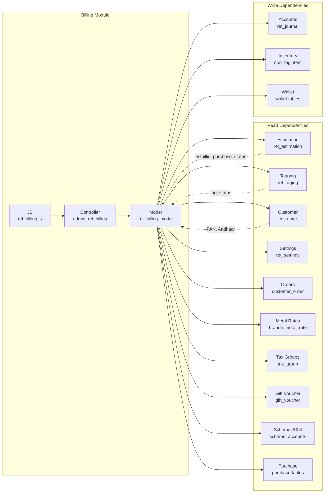

# Billing Module — Cross-Module Map

> **Round 1** | External dependencies identified from constructor, model, and JS

---

## Constructor-Loaded External Models

| External Model             | Module    | Purpose                                           |
| -------------------------- | --------- | ------------------------------------------------- |
| `ret_purchase_order_model` | Purchase  | Purchase order data for return/exchange flows     |
| `admin_settings_model`     | Settings  | Profile settings, access rights, day closing data |
| `sms_model`                | SMS/Comms | SMS gateway integration                           |
| `admin_usersms_model`      | SMS/Comms | User SMS preferences/templates                    |
| `log_model`                | System    | Activity logging                                  |
| `payment_model`            | Payments  | Payment processing                                |
| `account_model`            | Accounts  | Journal entries, accounting                       |
| `ret_order_model`          | Orders    | Customer order management                         |

---

## Cross-Module Table Access

| External Module | Direction  | Tables                                                                                     | What Data                                     | Risk                                                            |
| --------------- | ---------- | ------------------------------------------------------------------------------------------ | --------------------------------------------- | --------------------------------------------------------------- |
| Estimation      | Read       | `ret_estimation`, `ret_estimation_items`                                                   | Estimation header + items for billing         | Core dependency — estimation drives billing                     |
| Estimation      | Write      | `ret_estimation.estbillid`, `ret_estimation_items.purchase_status`                         | Link bill to estimation, mark item as billed  | If billing crashes mid-save, estimation can be partially linked |
| Tagging         | Read       | `ret_taging`, `ret_taging_stones`, `ret_taging_status_log`                                 | Tag details, stones, movement history         | Tag could be deleted by another module                          |
| Tagging         | Write      | `ret_taging.tag_status`, `ret_taging_status_log`                                           | Mark tag as sold/available, log movement      | Tag status mismatch if cancel fails                             |
| Customer        | Read       | `customer`                                                                                 | Customer details, PAN, Aadhaar, address       | Customer data shared across all modules                         |
| Customer        | Write      | `customer.pan`, `customer.aadharid`, `customer.driving_license_no`, `customer.passport_no` | Update ID documents at billing time           | Could overwrite data entered by other modules                   |
| Settings        | Read       | `ret_settings`, `profile`, `employee`                                                      | Retail settings, OTP config, employee details | Settings change impacts billing behavior                        |
| Settings        | Read       | `day_closing`                                                                              | Day closing status for branch                 | Bill date determination                                         |
| Accounts        | Write      | `ret_journal`                                                                              | Journal entries for every bill                | Wrong amounts propagate to accounts                             |
| Orders          | Read       | `customer_order`, order details                                                            | Order advance, order items                    | Order could be modified/cancelled                               |
| Orders          | Write      | Order advance adjustment records                                                           | Advance adjustment on billing                 | Wrong adjustment amounts                                        |
| Metal Rates     | Read       | `branch_metal_rate`, `metal_types`                                                         | Metal rates for pricing                       | Stale rates if not refreshed                                    |
| Tax             | Read       | `tax_group`, `tax_group_items`                                                             | Tax rates (CGST, SGST, IGST)                  | Tax rate changes affect calculations                            |
| Gift Voucher    | Read       | `gift_voucher`, gift tables                                                                | Voucher validation and redemption             | Voucher could be expired or used                                |
| Scheme/Chit     | Read       | Scheme account tables, chit tables                                                         | Scheme closure, chit utilization              | Cross-module financial dependency                               |
| Inventory       | Read/Write | `ret_non_tag_item`, section stock tables                                                   | Non-tagged item stock                         | Stock mismatch if concurrent operations                         |
| Purchase        | Read       | Purchase tables, stone tables                                                              | Purchase details for return items             | Purchase data drives return calculations                        |
| Wallet          | Read/Write | Wallet tables                                                                              | Wallet transactions                           | Balance errors                                                  |

---

## Cross-Module AJAX Calls (from JS)

The billing JS file uses an internal AJAX helper (not direct `$.ajax` calls). AJAX endpoints primarily call the `admin_ret_billing` controller. Cross-module AJAX calls need further investigation in Round 2.

---

## Dependency Graph

---

## Risk Assessment

| Risk                           | Severity   | Description                                                                                                                 |
| ------------------------------ | ---------- | --------------------------------------------------------------------------------------------------------------------------- |
| Estimation linkage             | **High**   | Bill save updates estimation items. If save fails mid-transaction, estimation can be partially linked to a nonexistent bill |
| Tag status race condition      | **High**   | Two concurrent bills could reference the same tag. `get_tag_status()` check is not atomic with the update                   |
| Journal entry mismatch         | **High**   | Wrong bill amount → wrong journal entries → incorrect financial statements                                                  |
| Customer ID document overwrite | **Medium** | Billing updates PAN/Aadhaar on customer record — could overwrite correct data from other module                             |
| Day closing dependency         | **Medium** | If day closing is not done, bills post with previous day's date (business rule, not a bug, but confusing)                   |
| Metal rate staleness           | **Low**    | Rates are fetched at page load — if user takes hours to complete bill, rate may have changed                                |
