# Cross-Module Map - Branch Transfer

> **Round 10 Update** — 2026-03-24
> Added `metal` table (new read dependency in `get_purchase_items` L1466 for metal-agnostic PS/SR/OM loop).
> **Round 4**: Added mermaid diagram, expanded AJAX dependencies table, added `customerorderdetails` and packaging tables.

---

## 1. Loaded External Models
| External Module / Model | Purpose |
|---|---|
| `ret_billing_model` | Billing integration (validating bill detail IDs for part sales / sales return transfers). |
| `sms_model` | Sending OTPs to branch managers during transfer approval. |
| `log_model` | System-wide action logging via `log_detail()`. |
| `admin_settings_model` | Fetching branch access, Day Close entries (`getAllBranchDCData`), company details, and config settings. |
| `admin_usersms_model` | SMS notification services context. |

## 2. Shared DB Tables (Read/Write)

### Tagging Module
| Table | R/W | What Data / Purpose | Risk |
|---|---|---|---|
| `ret_taging` | R/W | Fetches tag details (`get_tag_details`). Updates `tag_status`/`current_branch`/`trans_to_acc_stock`. | Tag status could be changed concurrently via billing or another transfer. |
| `ret_taging_status_log` | W | Logs transit and received states. | |
| `ret_section_tag_status_log` | W | Logs section-level movements during transfer. | |

### Non-Tagging Module
| Table | R/W | What Data / Purpose | Risk |
|---|---|---|---|
| `ret_nontag_item` | R/W | Fetches / updates `gross_wt`, `net_wt`, `no_of_piece` based on sending/receiving. | Concurrent non-tag deductions in billing. |
| `ret_nontag_item_log` | W | Logs NT transit/download states. | |
| `ret_section_nontag_item_log` | W | Logs section-level NT movements. | |

### Billing Module
| Table | R/W | What Data / Purpose | Risk |
|---|---|---|---|
| `ret_bill_details` | R/W | For sales returns / partly sales: updates `current_branch` and `transferred_to_acc_stock`. | Affects credit notes and sales return tracking. |
| `ret_bill_old_metal_sale_details` | R/W | For old metal: updates `current_branch` and `is_transferred`. | Affects old metal registers. |

### Purchase Module
| Table | R/W | What Data / Purpose | Risk |
|---|---|---|---|
| `ret_purchase_items_log` | W | Logs inward/intransit movement of old metal / partly sale / sales returns. item_type: 1=OM, 2=SR, 3=PS, 9=NT-SR | |

### Order / Repair Module
| Table | R/W | What Data / Purpose | Risk |
|---|---|---|---|
| `ret_bt_order_log` | W | Logs transfers that fulfill branch orders (`id_orderdetails`). | |
| `ret_repair_orders_details` | R | Fetches repair order details for Type 5 transfers. | |
| `ret_repair_orders_trans_data` | W | Maps transfer to repair order. | |
| `customerorderdetails` | W | Updates `current_branch` on order transit/download. | Cross-module write — affects CRM/Order module. |

### Packaging / Other Inventory Module
| Table | R/W | What Data / Purpose | Risk |
|---|---|---|---|
| `ret_other_inventory_items` | R | Checks packaging qty availability. | |
| `ret_other_inventory_item` | R | Master item reference for packaging. | |
| `ret_other_inventory_item_type` | R | Item type classification for packaging. | |
| `ret_other_inventory_purchase_items_details` | R/W | Individual packaging items — status transitions (0→4→0). Tracked by FIFO/LIFO. | |
| `ret_other_inventory_purchase_items_log` | W | Logs packaging transit/download with amounts. | |

### Master Data Module (Read-only)
| Table | R/W | What Data / Purpose | Risk |
|---|---|---|---|
| `metal` | R | `SELECT * FROM metal WHERE metal_status=1` — drives the PS/SR/OM metal loop in `get_purchase_items()` L1466. ✅ **New in R10** — replaces Gold/Silver hardcode. | If new metal added with `metal_status=1`, automatically included in branch transfer OM/PS/SR data. |

## 3. Cross-Module AJAX Dependencies (JS → External Controllers)

| # | JS Function | Target Controller | Endpoint | Purpose |
|---|---|---|---|---|
| 1 | `getSearchProd()` | `admin_ret_catalog` | `/product/active_prodBySearch` | Product autocomplete search |
| 2 | `get_ActiveSections()` | `admin_ret_catalog` | `/get_sectionBranchwise` | Section dropdown by branch |
| 3 | `get_invnetory_item()` | `admin_ret_other_inventory` | `/get_invnetory_item` | Packaging item list |
| 4 | `get_ActiveKarigars()` | `admin_ret_catalog` | `/karigar/active_list` | Karigar dropdown |
| 5 | `send_mobile_approval_request()` | `admin_app_api` | `/bt_approval_otp_req` | Mobile app OTP request |
| 6 | `update_aprvl_status()` | `admin_app_api` | `/update_aprvl_status` | Mobile app approval update |
| 7 | `get_approval_status()` | `admin_app_api` | `/get_approval_status` | Poll mobile approval status |

## 4. Dependency Graph

```mermaid
graph TD
    BT["🔄 Branch Transfer<br/>(admin_ret_brntransfer)"]
    
    TAG["🏷️ Tagging<br/>(ret_taging)"]
    NT["📦 Non-Tagging<br/>(ret_nontag_item)"]
    BILL["💰 Billing<br/>(ret_bill_details)"]
    PUR["📋 Purchase<br/>(ret_purchase_items_log)"]
    ORD["📝 Orders/Repairs<br/>(customerorderdetails)"]
    PACK["🎁 Packaging<br/>(ret_other_inventory)"]
    CAT["📂 Catalog<br/>(admin_ret_catalog)"]
    APP["📱 Mobile App<br/>(admin_app_api)"]
    SMS["💬 SMS<br/>(sms_model)"]
    SET["⚙️ Settings<br/>(admin_settings_model)"]
    LOG["📝 Log<br/>(log_model)"]
    
    BT -->|"R/W tag_status,<br/>current_branch"| TAG
    BT -->|"R/W gross_wt,<br/>net_wt, pcs"| NT
    BT -->|"R/W current_branch,<br/>transferred_to_acc_stock"| BILL
    BT -->|"W transit/inward<br/>logs"| PUR
    BT -->|"W current_branch,<br/>bt_order_log"| ORD
    BT -->|"R/W status,<br/>qty FIFO/LIFO"| PACK
    BT -.->|"AJAX: products,<br/>sections, karigars"| CAT
    BT -.->|"AJAX: OTP,<br/>approval status"| APP
    BT -->|"OTP send"| SMS
    BT -->|"DayClose,<br/>settings"| SET
    BT -->|"activity logs"| LOG
    
    style BT fill:#4a90d9,stroke:#333,color:#fff
    style TAG fill:#f5a623,stroke:#333,color:#fff
    style NT fill:#7b68ee,stroke:#333,color:#fff
    style BILL fill:#e74c3c,stroke:#333,color:#fff
    style PACK fill:#2ecc71,stroke:#333,color:#fff
    style ORD fill:#9b59b6,stroke:#333,color:#fff
```

> **Legend:** Solid arrows = server-side model/DB calls. Dashed arrows = JS AJAX calls to external controllers.
