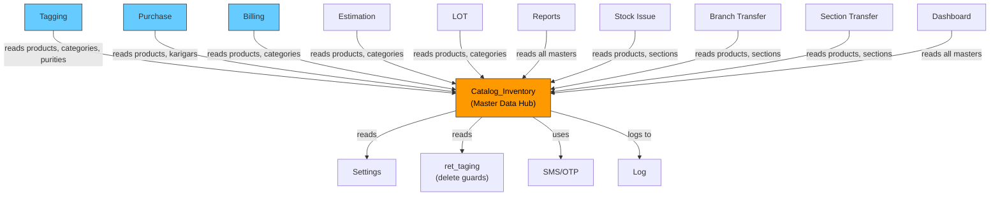

# Catalog_Inventory — CROSS MODULE MAP

> **Built**: 2026-03-13

## Constructor Dependencies

| External Module | Model Loaded | Purpose |
|---|---|---|
| Settings | `admin_settings_model` | Access control — `get_access()` for permission-gated views |
| SMS/OTP | `sms_model` | Vendor OTP for karigar approval workflow |
| Logging | `log_model` | Audit trail — `log_detail()` on all CRUD operations |

## Table Read Dependencies (Other Module's Tables)

| External Module | Table Read | Methods | What Data | Risk |
|---|---|---|---|---|
| Tagging | `ret_taging` | `getItemsinTagDetails()` | Tag count by category/product/purity/stone | If tagging table is down, all delete operations fail |
| Settings | `chit_settings`, `ret_settings` | `get_ret_settings()`, `get_profile_settings()` | App-level configuration | Settings changes can alter behavior across module |
| Billing | `ret_billing` | Bank deposit queries (L6222-6226) | Billing records for payment reconciliation | Stock existence checks |
| Issue/Receipt | `ret_issue_receipt` | Bank deposit queries (L6276) | Issue receipt records for payment mapping | — |
| User/Profile | `profile` | `get_profile_settings()` (L199-203) | `vendor_approval_otp_req` — controls karigar OTP | ⚠️ SQL injection via concat |
| Branch | `branch` | Multiple methods | Branch data for multi-branch features | Branch table integrity critical |
| Company | `company` | `getCompanyDetails()` | Company info for forms | — |
| Employee | `employee` | `get_employee()` | Employee list for bank deposit forms | — |
| Location | `city`, `state`, `country` | Karigar forms | Location data for address | — |
| Payment | `payment`, `payment_mode`, `payment_mode_details` | Bank deposit module | Payment methods | — |
| Dealer | `dealer` | Some karigar functions | Dealer/vendor info | — |
| Web Catalog | `sub_category` | `ajax_getProduct()` join | Web catalog sub-categories | — |

## Table Write Dependencies (Writing to Other Module's Tables)

| External Module | Table Written | Methods | What Data | Risk |
|---|---|---|---|---|
| None identified | — | — | — | This module primarily owns its tables |

> **Note**: Catalog_Inventory is a **master data provider** — it doesn't write to other modules' tables. But many modules READ from its tables extensively.

## Modules That DEPEND ON Catalog_Inventory

| Module | Reads These Tables | Critical? |
|---|---|---|
| Tagging | `ret_product_master`, `ret_category`, `ret_purity`, `ret_stone` | 🔴 Critical — can't create tags without products |
| Purchase | `ret_product_master`, `ret_category`, `ret_karigar` | 🔴 Critical — PO references products and karigars |
| Billing | `ret_product_master`, `ret_category`, `ret_purity` | 🔴 Critical — billing needs product config |
| Estimation | `ret_product_master`, `ret_category` | 🔴 Critical — estimates reference products |
| Sales/LOT | `ret_product_master`, `ret_category`, `ret_purity` | 🔴 Critical |
| Reports | All master tables | 🟡 Medium — reports aggregate master data |
| Stock Issue | `ret_product_master`, `ret_section` | 🔴 Critical |
| Branch Transfer | `ret_product_master`, `ret_section` | 🔴 Critical |
| Section Transfer | `ret_product_master`, `ret_section` | 🔴 Critical |
| Dashboard | Multiple master tables | 🟡 Medium — dashboard aggregates |

## Dependency Graph

## JS Cross-Module AJAX Calls

> ⚠️ **R9 Correction**: R1–R5 brain stated "No cross-module AJAX calls found" — this was based on `catalog.js` (legacy, 450 lines). `catalog_master.js` (49,240 lines, the PRIMARY JS file discovered in R6) contains **14 confirmed [EXT] cross-module AJAX calls**.

### Cross-Module AJAX Map (catalog_master.js → External Controllers)

| JS Line | JS Function | External Endpoint | Target Module | Purpose |
|---|---|---|---|---|
| L11105 | `getFloorBranch` | `branch/branchname_list` | Branch controller | Get branches for floor filter |
| L21109 | `(unknown)` | `branch/branchname_list` | Branch controller | Inline branch dropdown |
| L25240 | `breakeve_branch_details` | `branch/branchname_list` | Branch controller | Branch list for breakeven logs |
| L32705 | `getDepositBranch` | `branch/branchname_list` | Branch controller | Branch list for bank deposit |
| L36479 | `get_branches` | `branch/branchname_list` | Branch controller | Generic branch list |
| L42941 | `get_reorder_branch_details` | `branch/branchname_list` | Branch controller | Branch list for reorder settings |
| L20339 | `get_ActiveSubDesign` | `admin_ret_reports/get_ActiveSubDesign` | Reports | Active sub-designs for dropdown |
| L37285 | `get_ActiveStoneType` | `admin_ret_tagging/getStoneTypes` | Tagging | Stone types for stone rate settings |
| L45148 | `get_ActiveStoneTypeForRate` | `admin_ret_tagging/getStoneTypes` | Tagging | Stone types for rate configuration |
| L46996 | `cover_up` | `admin_app_api/add_cover_up` | App API | Cover-up entry submission |
| L48217 | `checkGSTAvail` | `admin_ret_purchase/karigar_gst_available` | Purchase | Karigar GST availability check |
| L48234 | `checkPANAvail` | `admin_ret_purchase/karigar_pan_available` | Purchase | Karigar PAN availability check |
| L48251 | `checkAADHARAvail` | `admin_ret_purchase/karigar_aadhar_available` | Purchase | Karigar Aadhaar availability check |
| Legacy | `(unknown)` | `product/delect_prodDetail` | Web Catalog | Legacy product detail delete |

**Summary**: `branch/branchname_list` (6×), `admin_ret_tagging/getStoneTypes` (2×), `admin_ret_purchase/karigar_*` (3×), `admin_ret_reports/get_ActiveSubDesign` (1×), `admin_app_api/add_cover_up` (1×), legacy `product/delect_prodDetail` (1×)

> `catalog.js` (legacy, 450 lines): 0 cross-module AJAX calls — all 2 endpoints target `admin_ret_catalog` only.
