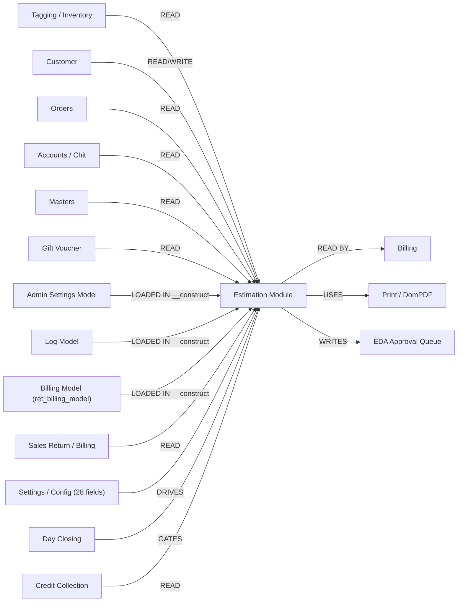

# Estimation Module — Cross-Module Dependency Map

> **Module**: Estimation
> **Date Built**: 2026-02-18 (Round 5 update)

---

## Dependencies Overview

---

## Detailed Dependencies

### 1. Tagging / Inventory → Estimation (READ)

| What | Table(s) | How Used | Risk |
|---|---|---|---|
| Tag details | `ret_taging` | Lookup by tag_id/tag_code — fetches gwt, nwt, product, purity, rate, status | If tag is deleted/transferred between lookup and save, stale data |
| Tag stones | `ret_taging_stone` | Stone weight/amount for tag | Same staleness risk |
| Tag other metals | `ret_other_metal_details` | Other material weights for tag | Same staleness risk |
| Tag images | `ret_tagging_images` | Tag photo display | Missing image = no display |
| Tag reserve check | `ret_taging` (reserve_status) | Check if tag is reserved for another estimation | No row locking — race condition possible |
| Tag status | `ret_taging` (tag_status) | Only active/available tags can be added | Status check is client-side only |
| Collection mapping | `ret_tag_mapping` | Fetch tags by collection/set | — |

**Key Model Methods**:
- `getTaggingBySearch()` (L918-1012)
- `getTaggingScanBySearch()` (L1088-1167)
- `get_tag_details()` (L1576-1590)
- `getTagStoneDetails()` (L1168-1180)
- `get_other_metal_details()` (L1181-1193)
- `tag_reserve_check()` (L1077-1087)

---

### 2. Customer → Estimation (READ + WRITE)

| What | Table(s) | Direction | How Used |
|---|---|---|---|
| Customer lookup | `customer` | READ | Search by name/mobile for estimation header |
| Customer details | `customer` | READ | Load address, GST, PAN, etc. |
| Customer creation | `customer` | WRITE | Inline create new customer from estimation form |
| Customer update | `customer` | WRITE | Inline update customer details |
| Customer purchase history | Multiple billing tables | READ | `getCustomerDet()` — shows past purchases |

**Key Model Methods**:
- `getAvailableCustomers()` (L872-917)
- `get_customer()` (L148-156)
- `createNewCustomer()` (L775-829)
- `updateCustomer()` (L830-871)
- `getCustomerDet()` (L1750-1884)

**Risk**: Customer data is written from estimation form — if incorrect data is entered, it affects ALL modules that use customer data (billing, orders, CRM, receipts).

---

### 3. Orders → Estimation (READ)

| What | Table(s) | How Used | Risk |
|---|---|---|---|
| Order details | `ret_order`, `ret_order_details` | Link estimation to pending orders | — |
| Order tag assignment | `ret_order_details` | Cancel/reassign order tags | Incorrect cancellation affects order fulfillment |
| Advance details | `ret_issue_receipt` | Show advance amount for order | Financial data dependency |

**Key Model Methods**:
- `getOrderBySearch()` (L1473-1540)
- `get_order_details()` (L1558-1566)
- `order_details()` (L1567-1575)
- `get_taggedorder_details()` (L1983-1988)
- `advance_details_order_no()` (L1541-1557)

---

### 4. Estimation → Billing (READ BY)

Billing module reads estimation data to convert estimations into bills.

| What | Table(s) | How Used |
|---|---|---|
| Estimation header | `ret_estimation` | Load customer, date, totals |
| Estimation items | `ret_estimation_items` | Load line items for billing |
| Estimation stones | `ret_estimation_item_stones` | Load stone details |

**Impact**: If estimation data is corrupt (e.g., due to EST-R601 transaction bug), the billing module will inherit corrupt data.

---

### 5. Accounts / Chit Scheme → Estimation (READ)

| What | Table(s) | How Used | Risk |
|---|---|---|---|
| Chit/scheme accounts | `scheme_account`, `scheme_transaction` | Adjust chit balance against estimation | Balance might change between lookup and save |
| Billing advance | `ret_issue_receipt` | Show advance amount available | Financial data |
| Credit details | `ret_issue_receipt` | Show pending credits | Financial data |
| Old sales | Multiple billing tables | Show old sales for reference | Read-only |

**Key Model Methods**:
- `get_closed_accounts()` (L1377-1385)
- `get_chit_details()` (L2021-2044)
- `get_billing_advance_details()` (L2920-2954)
- `get_order_advance_details()` (L2956-2968)
- `get_credit_pending_details()` (L2709-2777)

---

### 6. Master Data → Estimation (READ)

| What | Table(s) | How Used |
|---|---|---|
| Metal types | `ret_metaltype` | Dropdown for metal selection |
| Purities | `ret_purity` | Dropdown for purity selection |
| Products | `ret_product` | Product search autocomplete |
| Designs | `ret_design`, `ret_sub_design` | Design search |
| Tax master | `ret_taxmaster`, `ret_taxgroup` | Tax calculation |
| Stones master | `ret_stone_type` | Stone type dropdown |
| Materials master | `ret_material` | Material type dropdown |
| UOM master | `ret_uom` | Unit of measurement |
| Employees | `employee` | Employee dropdown |
| Branches | `branch` | Branch selection |
| Financial year | `ret_financial_year` | Bill numbering |
| Bill number format | `ret_bill_no_format` | Estimation number generation |
| Branch rates | `ret_branchwise_rate` | Metal market rates per branch |
| Settings | `ret_general_settings` | Module behavior settings |
| Employee settings | `ret_employee_settings` | Per-employee permissions |
| Profile settings | `ret_profile` | Role-based access |
| Village/Pincode | `village`, `pincode` | Address lookup |
| Country/State/City | `country`, `state`, `city` | Location dropdowns |
| Old metal rates | `ret_old_metal_rate` | Exchange rates for old metal |
| Old metal types | `ret_old_metal_type` | Types of old metal |
| Old metal products | — | Products for old metal |
| VA range | `ret_va_range` | Value addition min/max rates |
| Section | `ret_section` | Branch-wise section assignment |
| Stone discount | `ret_stone_disc` | Stone discount settings |
| Loose stone rate | — | Loose stone product rates |
| Purchase details | `ret_purchase_details` | Historical purchase data for design |

---

### 7. Print / DomPDF → Estimation (USES)

| What | How Used |
|---|---|
| DomPDF library | `require_once(APPPATH . 'libraries/dompdf/autoload.inc.php')` — loaded at controller top |
| Company details | `getCompanyDetails($id_branch)` — logo, name, address for header |
| 9 print templates | Branch-specific print layouts (different jewelers have different formats) |

---

## Impact Matrix

If Estimation data is wrong, these modules are affected:

| Affected Module | How | Severity |
|---|---|---|
| **Billing** | Wrong totals, quantities inherited | P0 — Financial |
| **Customer** | Wrong customer details written back | P1 — Data integrity |
| **Inventory/Tagging** | Tag incorrectly reserved/unreserved | P1 — Stock accuracy |
| **Accounts/Chit** | Chit balance wrongly adjusted | P1 — Financial |
| **Orders** | Order tags incorrectly cancelled/assigned | P2 — Workflow |
| **Reports** | Aggregated data reflects estimation errors | P2 — Reporting |
| **Gift Voucher** | Voucher amounts consumed but estimation fails → voucher stuck | P2 — Financial |
| **Sales Return** | SR credit applied to estimation but not reflected in billing SR | P1 — Financial |
| **EDA Queue** | Discount approval queue shows stale/corrupt estimations | P2 — Workflow |
| **Settings/Config** | Wrong hidden config → all calculations silently wrong across ALL estimations | P0 — System-wide |

---

## Round 2 Additions

### 8. Gift Voucher → Estimation (READ)

| What | Table(s) | How Used | Risk |
|---|---|---|---|
| Voucher lookup | `ret_gift_voucher` | Search voucher by number, validate balance | Voucher could be redeemed concurrently in billing |
| Voucher amount | `ret_gift_voucher` | Deducted from estimation grand total | No row-level locking — race condition between estimation and billing |

### 9. Sales Return / Billing → Estimation (READ)

| What | Table(s) | How Used | Risk |
|---|---|---|---|
| Bill items | Billing tables (`ret_billing_details`) | `getBillDetails()` fetches items for SR selection | Bill items could change if billing is being modified concurrently |
| SR credits | `ret_est_sales_return_utilization` | Deducted from grand total | No validation that SR amount ≤ original bill amount |
| Chit recalculation | Chit tables | `get_topup_chit_closing_balance()` recalculates after SR add/remove | Timing-sensitive if multiple users editing |

### 10. Settings/Config → Estimation (DRIVES)

| What | Table(s) | How Used | Risk |
|---|---|---|---|
| 28 hidden fields | `ret_general_settings`, `ret_employee_settings`, `ret_profile`, `stn_disc_per` | Injected into form.php as hidden inputs; drive ALL JS calculation behavior | Changing a setting (e.g., `wastage_rate_type`) silently changes calculations for ALL future estimations without code change |
| Feature flags | `ret_general_settings` | `enable_sales_return_estimations`, `wedding_wastage_slab`, `allow_manual_rate` toggle entire form sections | Missing/null flag = form section silently hidden |
| Employee permissions | `ret_employee_settings` | `allowed_old_met_pur`, `disc_limit`, `blk_wast_disc_lmt`, `dia_disc_lmt` | Switching employee mid-session doesn't refresh these fields |

### 11. EDA Approval ← Estimation (WRITES)

| What | Table(s) | How Used | Risk |
|---|---|---|---|
| EDA flag | `ret_estimation.is_eda` | Checkbox on form sets flag | Clearing flag after approval = bypasses discount approval |
| Approve/Reject | `ret_estimation` | Modal in `eda/list.php` updates estimation status | No audit trail of who approved/rejected or why |

### 12. Day Closing → Estimation (GATES) *(Round 3)*

| What | Table(s) | How Used | Risk |
|---|---|---|---|
| Day close status | `ret_day_closing` | `getBranchDayClosingData(id_branch)` checks `is_day_closed` flag and `entry_date` | Controller enforcement unclear — may allow saves on closed days |
| Entry date | `ret_day_closing.entry_date` | Should match estimation date to validate | Date mismatch could cause silent data issues |

### 13. Credit Collection ← Billing (READ, via Estimation) *(Round 3)*

| What | Table(s) | How Used | Risk |
|---|---|---|---|
| Credit bill lookup | `ret_billing` | `get_credit_pending_details()` queries for customer's credit bills | No row-level locking — concurrent billing could change totals |
| Collection records | `ret_billing` (via `ref_bill_id`) | `getCreditCollection()` chains through 3+ model methods | 6-method chain with no error handling between links |
| Issue receipts | `ret_issue_receipt`, `ret_issue_credit_collection_details` | `get_IssueCreditCollectionDetails()` queries receipt-based collections | Receipt data could change if parallel Issue/Receipt module is active |
| Old metal in collections | `ret_bill_old_metal_sale_details` | `getOld_sales_detail()` adds old metal value to collection total | Cross-joins billing and old metal — stale if billing is being edited |

---

## Round 3 Additions (2026-03-24) — New JS AJAX Cross-Module Deps

> Found during complete JS endpoint scan. These 9 external controllers were previously undocumented in the brain.

### 14. Catalog → Estimation (READ, via JS AJAX) — *Round 3*

| What | AJAX URL | JS Lines | Risk |
|---|---|---|---|
| Active product list | `/admin_ret_catalog/ret_product/active_list` | L19257 | Catalog product removed → empty dropdown in estimation |
| Active design products | `/admin_ret_catalog/get_active_design_products` | L19423, L19866, L20082, L20108 | Design removed → row loses product reference |
| Active sub-designs | `/admin_ret_catalog/get_ActiveSubDesigns` | L19493, L19954, L20130, L20152 | Sub-design removed → sub-design field silently empty |
| Loose stone rate settings | `/admin_ret_catalog/getLooseStoneProductRateSettings` | L21974 | Rate change → stone pricing wrong in new row |
| Stone rate settings | `/admin_ret_catalog/getStoneRateSettings` | L29378 | Stone discount validation uses stale rate |

### 15. Other Inventory → Estimation (READ, via JS AJAX) — *Round 3*

| What | AJAX URL | JS Lines | Risk |
|---|---|---|---|
| Packaging product details | `/admin_ret_other_inventory/get_productMappedDetails` | L17987 | Missing mapping → packaging section silently empty |

### 16. Admin Settings → Estimation (READ, via JS AJAX) — *Round 3*

| What | AJAX URL | JS Lines | Risk |
|---|---|---|---|
| Profession list (customer form) | `/admin_settings/get_profession` | L19161 | Profession dropdown empty → customer creation form broken |

### 17. Branch → Estimation (READ, via JS AJAX) — *Round 3*

| What | AJAX URL | JS Lines | Risk |
|---|---|---|---|
| Branch name list | `/branch/branchname_list` | L21554 | Branch list failure → branch dropdown empty |

### 18. Tagging — Additional Endpoints (READ) — *Round 3*

| What | AJAX URL | JS Lines | Risk |
|---|---|---|---|
| PO details for tag | `/admin_ret_tagging/get_po_details` | L18489 | PO not found → PO-linked tag info missing |
| Wastage settings details | `/admin_ret_tagging/get_wastage_settings_details` | L18521 | Missing settings → wastage defaults wrong per product |

### 19. Billing — Additional Tax Endpoint (READ) — *Round 3*

| What | AJAX URL | JS Lines | Risk |
|---|---|---|---|
| All tax group items | `/admin_ret_billing/getAllTaxgroupItems` | L16372 | Tax group removed from billing → tax item not found in estimation |

---

## Impact Matrix

| If This Changes... | Affected In Estimation | Severity |
|---|---|---|
| Tag deleted/transferred | Stale tag data in estimation items | HIGH |
| Customer mobile changed | Lookup mismatch on edit | MEDIUM |
| Metal rate changed | All rate-dependent calculations | HIGH |
| Product master changed | Product name/design mismatch | LOW |
| Order cancelled | Order link broken, advance not updated | MEDIUM |
| Billing created from estimation | Estimation becomes read-only reference | LOW |
| Chit account closed | Stale chit balance shown | HIGH |
| Gift voucher redeemed elsewhere | Double redemption risk | HIGH |
| Sales return bill modified | SR credit amount becomes stale | MEDIUM |
| EDA queue cleared/bypassed | Discount approval circumvented | MEDIUM |
| Settings changed | All future estimations affected silently | HIGH |
| Day closing flag changed | May allow/block estimation saves | MEDIUM |
| Credit bill paid concurrently | Credit balance shown incorrectly | HIGH |
| Print template diverges from JS | Printed totals differ from form | MEDIUM |
| Catalog product/design removed | Estimation rows lose product reference | MEDIUM |
| Other Inventory product mapping removed | Packaging section silently empty | LOW |
| Branch config changed | Branch dropdown empty or stale | MEDIUM |
