# LOT MODULE — CROSS-MODULE MAP
> Module: Lot | Rounds 1–12 | 2026-03-17

---

## ⚠️ Reverse Dependencies (OTHER Modules Reading Lot Tables)

> Added Round 12. The original map only documented LOT → others.
> Round 10 found 1 module; Round 12 corrected this to **4 modules**.

| Module | Model File | Lot Tables | Ref Count | Risk |
|---|---|---|---|---|
| **Tagging** | `ret_tag_model.php` | `ret_lot_inwards`, `ret_lot_inwards_detail`, `ret_lot_inwards_stone_detail`, `ret_lot_merge`, `ret_lot_split_details` | 324+ | 🔴 Critical |
| **Estimation** | `ret_estimation_model.php` | `ret_lot_inwards`, `ret_lot_inwards_detail` | ~12 | 🟠 Medium |
| **Stock Issue** | `ret_stock_issue_model.php` | `ret_lot_inwards`, `ret_lot_inwards_detail` | ~6 | 🟠 Medium |
| **Sales Transfer** | `ret_sales_transfer_model.php` | `ret_lot_inwards` | 2 | 🟡 Low |

**All joins are READ-ONLY.** No external module writes to Lot tables.

**Impact of R-LOT-012 (no cascade delete)**: Orphan rows break all 4 modules above.

## External Dependencies

| External Module | Direction | Tables / Methods | What Data | Risk |
|---|---|---|---|---|
| **Settings** | Read | `admin_settings_model->getBranchDayClosingData()` | Branch day close date → determines lot_date | Wrong date if day not closed |
| **Settings** | Read | `admin_settings_model->get_company()` | Company details for print | N/A |
| **Settings** | Read | `admin_settings_model->get_access()` | Access permissions for routes | Access not enforced uniformly |
| **Settings** | Read | `ret_settings` table | `lot_recv_branch`, `is_purchase_cost_from_lot`, `is_supplierbill_entry_req` | Config drives form behavior |
| **Catalog** | Read | `ret_catalog_model->getActiveUOM()` | UOM list for weight fields | UOM deleted → display broken |
| **Tagging** | Read | `ret_taging` | Tag status (!=2, !=5) for merge/split eligibility, branch distribution | Tagged items block lot reuse |
| **Tagging** | Read | `ret_taging_stone` | Stone weights for lot ack print | N/A |
| **Purchase / GRN** | Read | `ret_purchase_order` | `po_ref_no` for display in list | N/A |
| **GRN** | Read | `ret_grn_entry` | `grn_ref_no` for display | N/A |
| **Old Metal** | Read | `ret_old_metal_process` | `process_no` for lot origin display | N/A |
| **Orders** | Read | `customerorder`, `customerorderdetails` | Order no lookup, order details, product/design/karigar data | Order deleted → lot orphaned |
| **Job Order** | Read | `joborder` | Karigar list for order | Carrier dependency on orders |
| **Non-Tag Inventory** | Write | `ret_nontag_item`, `ret_nontag_item_log`, `ret_section_nontag_item_log` | Stock quantities for non-tagged items | Incorrect arithmetic = wrong stock |
| **Non-Tag Inventory** | Read | `ret_nontag_receipt` | Existing NT receipts (for merge balance) | N/A |
| **HR** | Read | `employee` | Employee name display | N/A |
| **Auth** | Read | `profile` | Profile settings for list view customize | N/A |
| **Logging** | Write | `log_model->log_detail()` | Activity audit (Add/Edit/Delete/Cancel/Split) | N/A |
| **Karigar** | Read | `ret_karigar`, `country`, `state`, `city` | Goldsmith/vendor details for print | N/A |
| **Branch** | Read | `branch` | Branch names, HO identification | Wrong HO if is_ho not set |
| **Catalog-Products** | Read | `ret_product_master`, `ret_category`, `ret_design_master`, `ret_sub_design_master` | Product/design data | N/A |
| **Catalog-Catalog** | Read | `ret_purity`, `ret_stone`, `ret_uom`, `ret_section`, `ret_charges` | Reference data | N/A |

---

## Mermaid Dependency Graph

```mermaid
graph TD
    LOT[Lot Module<br/>admin_ret_lot] 

    LOT -->|READ day_close, company, access| SETTINGS[Settings Module<br/>admin_settings_model]
    LOT -->|READ uom| CATALOG[Catalog Module<br/>ret_catalog_model]
    LOT -->|READ tag_status, stones| TAGGING[Tagging Module<br/>ret_taging]
    LOT -->|READ po_ref| PURCHASE[Purchase Module<br/>ret_purchase_order]
    LOT -->|READ grn_ref| GRN[GRN Module<br/>ret_grn_entry]
    LOT -->|READ process_no| OLDMETAL[Old Metal Module<br/>ret_old_metal_process]
    LOT -->|READ orders, karigar| ORDERS[Orders Module<br/>customerorder]
    LOT -->|WRITE stock quantities| NONTAG[NonTag Inventory<br/>ret_nontag_item]
    LOT -->|READ nontag receipts| NTR[NonTag Receipts<br/>ret_nontag_receipt]
    LOT -->|WRITE audit log| LOG[Log Model<br/>log_model]
    LOT -->|READ employees| HR[Employee Table]
    LOT -->|READ branches| BRANCH[Branch Table]
    LOT -->|READ karigar details| KARIGAR[Karigar Module<br/>ret_karigar]

    style LOT fill:#2563eb,color:#fff
    style NONTAG fill:#dc2626,color:#fff
    style TAGGING fill:#f59e0b,color:#fff
    style SETTINGS fill:#059669,color:#fff
```

---

## Cross-Module JS AJAX Calls

The JS file makes many calls to external controllers (not yet mapped — these use a shared `base_url` pattern):

| JS Function | Estimated Target Controller | Purpose |
|---|---|---|
| `get_karigar()` | `admin_ret_catalog` or `admin_ret_karigar` | Load karigar/goldsmith list |
| `get_category()` | `admin_ret_catalog` | Load categories |
| `getActiveUOM()` | `admin_ret_catalog` | Load UOM |
| `get_ActiveMetals()` | `admin_ret_catalog` | Load metals |
| `get_ActivePurity()` | `admin_ret_catalog` | Load purities |
| `get_Branchwise_Sections()` | `admin_ret_catalog` | Load sections by branch |
| `get_stones()` | `admin_ret_catalog` | Load stones |
| `get_stone_types()` | `admin_ret_catalog` | Load stone type categories |
| `getActive_quality_code()` | `admin_ret_catalog` | Load diamond quality codes |
| `getQualityDiamondRates()` | `admin_ret_catalog` | Load diamond rates |
| `get_charges()` | `admin_ret_catalog` | Load charge definitions |
| `get_taxgroup_items()` | `admin_ret_catalog` | Load tax group items |
| `getSearchCustomers()` | `admin_ret_customer` or similar | Search customers |
| `get_employee()` | `admin_ret_employee` or similar | Load employees |
| `get_karigar_details()` | `admin_ret_catalog` | Single karigar details |
| `get_cat_purity()` | `admin_ret_catalog` | Purities for selected category |
| `get_ActiveGRNS()` | `admin_ret_grn` or similar | Active GRN entries |
| `getSearchDesign()` | `admin_ret_catalog` | Search designs for product |
