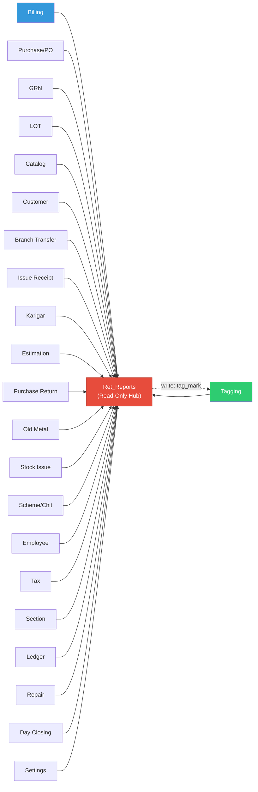

# Ret_Reports — Cross-Module Map

> **Module**: Ret_Reports
> **Last Updated**: 2026-03-26 — Round 8 (header sync)
> **Direction**: Almost exclusively READ from other modules

---

## Overview

Ret_Reports is the **most cross-module-dependent module** in the entire system. It reads from virtually every other module's tables but writes to none (except `ret_taging` via `update_green_tag`).

---

## Constructor Dependencies

| External Model | Loaded In | Purpose |
|---|---|---|
| `admin_settings_model` | Constructor L25, L29 | Access control (`get_access()`), settings lookups |
| `ret_catalog_model` | Constructor L27 | Catalog lookups, deposit queries (`get_deposit()`) |
| `log_model` | Constructor L31 | Event logging for `update_green_tag()` |
| `ret_purchase_order_model` | Constructor L33 | HO vault report, retagging details |

---

## Cross-Module Table Reads

| External Module | Direction | Tables Read | What Data | Risk |
|---|---|---|---|---|
| **Billing** | Read | `ret_billing`, `ret_bill_details`, `ret_billing_payment`, `ret_billing_advance`, `ret_billing_chit_utilization`, `ret_billing_gift_voucher_details`, `ret_billing_item_stones`, `ret_bill_old_metal_sale_details`, `ret_bill_return_details`, `ret_bill_pay_device`, `ret_bill_delivery`, `ret_bill_duplicate_copy`, `ret_advance_utilized`, `ret_partlysold` | Sales data, payments, returns, advance utilization, partly sold tracking | Schema changes in billing affect 30+ report methods |
| **Tagging** | Read | `ret_taging`, `ret_taging_stone`, `ret_taging_status_log`, `ret_taging_huid`, `ret_taging_images`, `ret_tag_other_metals`, `ret_tag_scan`, `ret_tag_scanned` | Tag/inventory data | Most-queried tables — any column rename breaks ~50 methods |
| **Purchase/PO** | Read | `ret_purchase_order`, `ret_purchase_order_items`, `ret_po_payment`, `ret_po_payment_detail`, `ret_po_rate_fix`, `ret_po_qc_issue_process`, `ret_po_qc_issue_details`, `ret_po_halmark_process`, `ret_po_stone_items`, `ret_po_other_item`, `ret_po_bill_payment_details` | Purchase orders, payments, QC | PO schema changes affect ~15 methods |
| **GRN** | Read | `ret_grn_entry`, `ret_grn_items`, `ret_grn_item_stone`, `ret_grn_other_charges`, `ret_grn_other_metals` | GRN receipts | GRN schema changes affect ~5 methods |
| **LOT** | Read | `ret_lot_inwards`, `ret_lot_inwards_detail`, `ret_lot_inwards_stone_detail`, `ret_lot_merge`, `ret_lot_split_details` | LOT data | LOT schema changes affect ~10 methods |
| **Catalog/Inventory** | Read | `ret_category`, `ret_product_master`, `ret_design_master`, `ret_sub_design_master`, `ret_product_section`, `ret_product_mapping`, `ret_sub_design_mapping`, `ret_collection_master`, `ret_tag_collection_mapping`, `ret_purity`, `ret_stone`, `ret_uom`, `ret_stone_type`, `ret_size`, `ret_reorder_settings` | Product hierarchy, stone/purity lookups, size/UOM, reorder settings | Catalog changes affect filter dropdowns across all reports |
| **Settings** | Read | `ret_settings`, `chit_settings`, `modules`, `bill_no_format`, `profile`, `ret_branch_floor_counter` | System configuration, profile settings (allow_bill_type), floor/counter layout | Settings read via `admin_settings_model` |
| **Customer** | Read | `customer`, `customer_edit_log`, `customer_feedback`, `customer_feedback_master`, `customer_feedback_response` | Customer data | Customer schema changes affect ~15 methods |
| **Order Management** | Read | `customerorder`, `customerorderdetails`, `customer_order_image`, `order_cart`, `order_status_message` | Customer orders | Order schema changes affect dashboard methods |
| **Branch Transfer** | Read | `ret_branch_transfer`, `ret_brch_transfer_tag_items`, `ret_brch_transfer_non_tag_items`, `ret_brch_transfer_old_metal`, `ret_branch_transfer_other_inventory` | Transfer data | BT schema changes affect ~5 methods |
| **Issue Receipt** | Read | `ret_issue_receipt`, `ret_issue_rcpt_payment`, `ret_issue_credit_collection_details`, `ret_issue_receipt_advance_adj`, `ret_metai_issue_receipt_details` | Issue receipts | IR schema changes affect cash/day reports |
| **Karigar** | Read | `ret_karigar`, `ret_karigar_metal_issue`, `ret_karigar_metal_issue_details`, `ret_karigar_stones`, `ret_karikar_items_wastage`, `ret_karigar_item_wast_pro_images`, `ret_karigar_kyc`, `ret_kyc_master` | Karigar/smith data | Karigar changes affect ~5 methods |
| **Estimation** | Read | `ret_estimation`, `ret_estimation_items`, `ret_esti_old_metal_stone_details`, `ret_estimation_old_metal_sale_details` | Estimation records | Estimation changes affect dashboard + sales referral |
| **Purchase Returns** | Read | `ret_purchase_return`, `ret_purchase_return_items`, `ret_purchase_return_other_charges`, `ret_purchase_return_other_metal`, `ret_purchase_return_stone_items` | Return data | PR changes affect ~5 methods |
| **Old Metal** | Read | `ret_old_metal_type`, `ret_old_metal_melting`, `ret_old_metal_refining`, `ret_old_metal_process`, `ret_old_metal_polishing`, `ret_old_metal_testing`, `ret_old_tag_import`, `ret_old_metal_category` | Old metal processing, category classification | OM changes affect ~5 methods |
| **Stock Issue** | Read | `ret_stock_issue`, `ret_stock_issue_detail`, `ret_stock_issue_types` | Stock issues | Stock issue changes affect ~3 methods |
| **Scheme/Chit** | Read | `scheme`, `scheme_account`, `wallet_account`, `wallet_transaction`, `ret_wallet`, `ret_wallet_transcation` | Scheme/wallet data | Scheme changes affect incentive reports |
| **HR** | Read | `employee` | Employee master | Employee changes affect incentive + tag reports |
| **Master Data** | Read | `branch`, `address`, `city`, `state`, `country`, `village`, `village_zone`, `bank`, `metal`, `metal_rates`, `payment_mode`, `payment_mode_details` | Reference data | Rarely change |
| **Tax** | Read | `ret_taxgroupmaster`, `ret_taxgroupitems`, `ret_taxmaster` | GST rates | Tax changes affect GST/GSTR reports |
| **Section** | Read | `ret_section`, `ret_section_branch`, `ret_section_tag_status_log`, `ret_section_nontag_item_log` | Section/counter data | Section changes affect stock reports |
| **Ledger** | Read | `ledger_master`, `ret_ledger_transfer`, `ret_view_customer_ledger`, `ret_view_smith_*`, `ret_view_supplier_*` | Ledger views | View definition changes affect ~10 methods |
| **Repair** | Read | `ret_repair_master` | Repair orders | Repair changes affect ~2 methods |
| **Day Closing** | Read | `ret_day_closing` | Day close records | Day close changes affect ~3 methods |
| **Non-Tag** | Read | `ret_nontag_item`, `ret_nontag_item_log`, `ret_nontag_receipt`, `ret_home_section_item_log` | Non-tagged inventory | Non-tag changes affect ~10 methods |

---

## Cross-Module AJAX (JS → Other Controllers)

| JS Context | External Controller | Endpoint | What Data |
|---|---|---|---|
| Tag image viewer | `admin_ret_tagging` | Tag details | Tag images |
| Customer search | `admin_ret_billing` | `getCustomersBySearch` | Customer list |
| Branch dropdown | `admin_settings` | `getBranches` | Branch list |
| Product/Design | `admin_ret_catalog` | Various | Product hierarchy |

---

## Dependency Graph

> **Key Insight**: Ret_Reports has ~22 module dependencies but only 1 write target. Any schema change in ANY upstream module can break reports. This module is the **canary in the coal mine** for schema migrations.
> **Round 5 Update**: Total cross-module table count increased from ~140 to ~155+ with 11 previously unlisted tables added (profile, ret_advance_utilized, ret_branch_floor_counter, ret_purity, ret_stone, ret_uom, ret_stone_type, ret_old_metal_category, ret_reorder_settings, ret_partlysold, ret_size).
