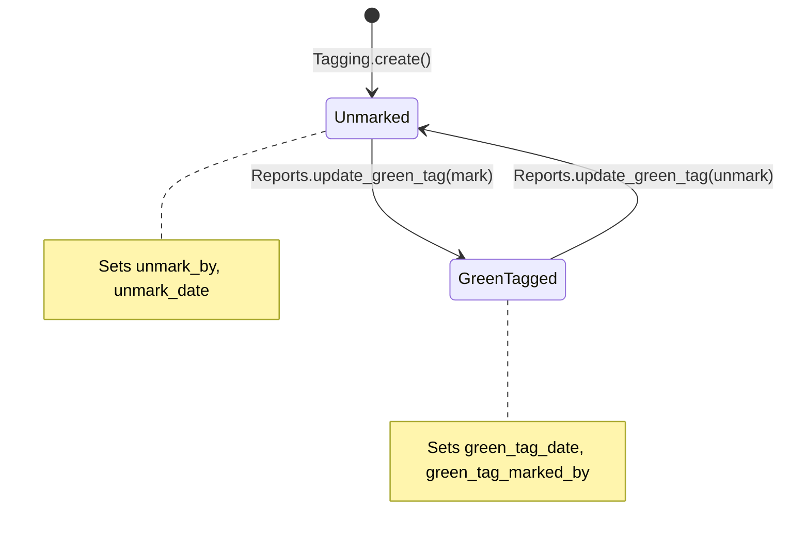

# Ret_Reports — Flow Risk Matrix

> **Module**: Ret_Reports
> **Built**: 2026-03-26 (Round 7 — Refresh)
> **Purpose**: Handoff contracts, state machines, and QA-ready flow risk scenarios.
> **How to use**: Compare this module's outbound contracts against downstream modules' inbound contracts. Mismatches = bugs waiting to happen.
> **Architecture Note**: Ret_Reports is a **read-only hub** — it reads from ~22 upstream modules but writes to only 1 table (`ret_taging.tag_mark`). Flow risks here are about **data accuracy** and **upstream schema stability**, not transactional integrity.

---

## 1. State Machine: ret_taging.tag_mark

> The only write operation in the entire module is `update_green_tag()` (Controller L183–L240).
> This toggles the `tag_mark` field on `ret_taging`.

| State | Value | Set By (Module.Method) | Can Transition To | Guard / Precondition |
|---|---|---|---|---|
| Unmarked | 0 | Ret_Reports.update_green_tag() | Marked (1) | ⚠️ NO GUARD — no check if tag is sold/transferred |
| Green Tagged | 1 | Ret_Reports.update_green_tag() | Unmarked (0) | ⚠️ NO GUARD — no check if tag is still available |

### State Diagram

### Additional Fields Modified

| Field | Set on Mark | Set on Unmark |
|---|---|---|
| `tag_mark` | `1` | `0` |
| `green_tag_date` | `date('Y-m-d H:i:s')` | `NULL` |
| `green_tag_marked_by` | `session('id_employee')` | `NULL` |
| `unmark_by` | — | `session('id_employee')` |
| `unmark_date` | — | `date('Y-m-d H:i:s')` |

### ⚠️ Known Risk: Green Tag Loop Bug (R2)
At L225, `$tag['req_status']` is used **outside** the foreach loop — it always references the **last tag**'s status. If a mix of mark/unmark operations is submitted in a single batch, the log message will incorrectly describe all operations as matching the last tag's action.

---

## 2. Inbound Contracts (What This Module Expects from Upstream)

> Ret_Reports reads from ~182 tables across ~22 modules. The contracts below focus on the **highest-risk assumptions**.

| Upstream Module | Data/State Expected | Precondition Check in Code? | Line | Risk if Violated |
|---|---|---|---|---|
| Billing | `ret_billing.bill_status = 1` (active bills only) | YES — hardcoded in WHERE clauses | Multiple | Report shows cancelled bills as active sales |
| Billing | `ret_bill_details.bill_det_id` is NOT NULL | YES — `WHERE d.bill_det_id IS NOT NULL` | L708+ | Orphan bill headers inflate sales counts |
| Billing | `ret_billing.is_eda` values (1 or 2) | PARTIAL — checked via `allow_bill_type` setting | L714+ | Wrong bills appear in EDA/non-EDA reports |
| Tagging | `ret_taging.tag_id` exists for every `ret_bill_details.tag_id` | NO — LEFT JOIN only, no FK validation | — | Null product data in reports for deleted tags |
| Tagging | `ret_taging.tag_status` is consistent | NO — reports don't check tag_status before displaying | — | Sold/deleted tags appear in stock reports |
| Day Closing | `ret_day_closing.id_branch` matches `ret_billing.id_branch` | YES — used in EDA filtering | L566+ | Bills from mismatched branches silently excluded |
| Customer | `customer.id_customer` is valid FK | NO — LEFT JOIN only | — | Customer names show as NULL in reports |
| Catalog | `ret_product_master.pro_id` exists | NO — LEFT JOIN only | — | Product names show as NULL |
| Catalog | `ret_category.id_ret_category` is consistent | PARTIAL — used in GROUP BY | — | Stock reports miscount if categories deleted |
| Section | `ret_section_tag_status_log` entries exist for section stock reports | NO — relies on log completeness | — | Section stock reports show zero if logs missing |
| LOT | `ret_lot_inwards.lot_no` matches `ret_lot_inwards_detail.lot_no` | YES — JOIN condition | L310+ | LOT reports show orphan detail records |
| Purchase/PO | `ret_purchase_order.po_id` is valid | NO — LEFT JOIN only | — | PO reports silently skip orphan items |
| Settings | `profile.allow_bill_type` has valid value (1, 2, or 3) | NO — no default case | L714 | Invalid value → empty reports (no rows match) |
| Metal | `metal_rates` has entry for report date | NO — LEFT JOIN only | L240 | Rate shows as 0 for dates with no rate entry |
| Schema | All referenced column names exist in upstream tables | NO — runtime failure | — | **Any upstream column rename breaks reports** |

---

## 3. Outbound Contracts (What This Module Guarantees to Downstream)

> Ret_Reports is almost entirely read-only. Its "downstream consumers" are:
> 1. **Users** — who rely on report accuracy for business decisions
> 2. **Green tag status** — consumed by other modules that check `tag_mark`
> 3. **Exported files** — PDF/Excel used externally

| Downstream Consumer | What This Module Guarantees | Enforced How? | Risk if Broken |
|---|---|---|---|
| Users (Sales Reports) | Sale totals match billing records | Aggregate queries with `bill_status=1` filter | ⚠️ CONTRACT GAP — no server-side total validation against `ret_billing.net_amount` |
| Users (Stock Reports) | Tag count matches actual inventory | `tag_status` filters in some queries | ⚠️ CONTRACT GAP — not all stock queries filter by tag_status consistently |
| Users (GST Reports) | GST amounts match filed returns | Raw query aggregation | ⚠️ CONTRACT GAP — rounding differences between per-item and total GST possible |
| Users (HO Stock Book) | Closing = Opening + Inward - Outward | Formula at Controller L8848-8852 | ⚠️ CONTRACT GAP — missing component silently zeros (R6 known risk) |
| Tagging Module | `tag_mark` value is binary (0 or 1) | Hardcoded in update_green_tag() | Low risk — but no FK constraint on `tag_mark` |
| Billing Module | Green tag status reflects actual tag availability | ⚠️ NO enforcement | Green tag on sold/transferred tag = misleading |
| PDF Export | Cash abstract totals match DataTable display | Same model method for both | ⚠️ CONTRACT GAP — DOMPDF typo may alter orientation (R3) |
| Excel Export | File format matches extension | PHPExcel outputs Excel2007 as `.xls` | ⚠️ CONTRACT GAP — extension mismatch (R3 known) |

---

## 4. Reversal Contracts (Cancel/Delete/Reverse)

> Ret_Reports has only ONE write operation: `update_green_tag()`. The "reversal" is the unmark action.

| Operation | Tables That Must Be Restored | Actually Restored in Code? | Method & Line | Gap? |
|---|---|---|---|---|
| Unmark green tag | `ret_taging.tag_mark` → 0 | ✅ YES | `update_green_tag()` L183-240 | — |
| Unmark green tag | `ret_taging.green_tag_date` → NULL | ✅ YES | `update_green_tag()` L183-240 | — |
| Unmark green tag | `ret_taging.green_tag_marked_by` → NULL | ✅ YES | `update_green_tag()` L183-240 | — |
| Unmark green tag | `ret_taging.unmark_by` → set | ✅ YES | `update_green_tag()` L183-240 | — |
| Unmark green tag | `ret_taging.unmark_date` → set | ✅ YES | `update_green_tag()` L183-240 | — |
| Unmark green tag | Log entry reversed/added | ✅ YES — new log entry created | `log_model->log_detail()` L225 | ⚠️ PARTIAL — log message uses wrong `$tag` variable (loop bug R2) |

### Reversal Completeness

| Metric | Count |
|---|---|
| Tables written during MARK | 1 (ret_taging) |
| Tables restored during UNMARK | 1 (ret_taging) |
| Gaps (written but not restored) | 0 |
| Completeness | 100% |

---

## 5. Flow Risk Checklist (QA-Ready Test Scenarios)

> Ret_Reports' risks are primarily about **data accuracy** (showing wrong numbers) and **schema stability** (breaking when upstream changes). Traditional CRUD risks are minimal since this is a read-only module.

### 5a. Green Tag Operation Risks

| ID | Test Scenario | Expected Result | Priority | Verified? |
|---|---|---|---|---|
| FR-RPT-001 | Mark a tag as green when `tag_status` = sold | REJECT with error | 🔴 HIGH | ❌ |
| FR-RPT-002 | Mark a tag as green when tag is in branch transfer (in transit) | REJECT or warn | 🔴 HIGH | ❌ |
| FR-RPT-003 | Submit batch with mixed mark + unmark operations | Each tag independently processed, correct log per tag | 🔴 HIGH | ❌ |
| FR-RPT-004 | Unmark green tag → verify all 5 fields correctly reset | `tag_mark=0`, dates/users set correctly | 🟡 MED | ❌ |
| FR-RPT-005 | Mark → unmark → re-mark same tag | Should work with clean state | 🟡 MED | ❌ |
| FR-RPT-006 | Concurrent green tag update on same tag by 2 users | Transaction isolation should prevent conflict | 🟡 MED | ❌ |
| FR-RPT-007 | Green tag update midway crash (check trans_begin/complete) | No partial updates | 🔴 HIGH | ❌ |

### 5b. Report Data Accuracy Risks

| ID | Test Scenario | Expected Result | Priority | Verified? |
|---|---|---|---|---|
| FR-RPT-008 | Sales total in report vs `SUM(ret_bill_details.item_total)` | Exact match | 🔴 HIGH | ❌ |
| FR-RPT-009 | Stock count in report vs `COUNT(ret_taging WHERE tag_status=0)` | Exact match | 🔴 HIGH | ❌ |
| FR-RPT-010 | Report with `allow_bill_type=3` (both EDA modes) | Shows both EDA and non-EDA bills | 🟡 MED | ❌ |
| FR-RPT-011 | Report with `allow_bill_type` set to invalid value | Graceful error, not empty result | 🟡 MED | ❌ |
| FR-RPT-012 | HO Stock Book closing formula validation | `closing = opening + inward - outward` for each weight type | 🔴 HIGH | ❌ |
| FR-RPT-013 | GST abstract totals vs individual GSTR1/2 line items | Exact match within rounding tolerance | 🔴 HIGH | ❌ |
| FR-RPT-014 | Report when upstream table has 0 records (empty branch) | Shows zeros, not errors/nulls in totals | 🟡 MED | ❌ |
| FR-RPT-015 | Report date range spanning across day closings | Consistent results regardless of day close boundary | 🟡 MED | ❌ |

### 5c. Export & Schema Risks

| ID | Test Scenario | Expected Result | Priority | Verified? |
|---|---|---|---|---|
| FR-RPT-016 | PDF export (cash abstract) orientation | Correct portrait orientation despite typo | 🟢 LOW | ❌ |
| FR-RPT-017 | Excel export concurrent by 2 users (same second) | Both exports succeed without file collision | 🟡 MED | ❌ |
| FR-RPT-018 | Report after upstream column rename in `ret_taging` | Report should fail gracefully, not PHP fatal | 🔴 HIGH | ❌ |
| FR-RPT-019 | SQL injection via date range parameters | Sanitized, no injection | 🔴 HIGH | ❌ |
| FR-RPT-020 | SQL injection via branch/product/design filter params | Sanitized, no injection | 🔴 HIGH | ❌ |

### Summary

| Priority | Total | Verified | Unverified |
|---|---|---|---|
| 🔴 HIGH | 10 | 0 | 10 |
| 🟡 MED | 9 | 0 | 9 |
| 🟢 LOW | 1 | 0 | 1 |
