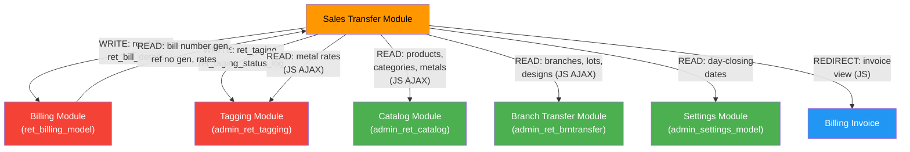

# Sales Transfer Module — Cross-Module Map

> **Module**: Sales Transfer
> **Last Updated**: 2026-03-20 — Round 3 (Verification)

---

## Dependencies Table

| # | External Module | Direction | Tables/Methods Used | What Data | Risk |
|---|---|---|---|---|---|
| 1 | **Billing** (`ret_billing_model`) | Write | `insertData('ret_billing')`, `insertData('ret_bill_details')`, `updateData('ret_billing')`, `code_number_generator()` L5279, `generateRefNo()` L337, `get_branchwise_rate()`, `get_FinancialYear()` | Creates billing records (bill_type 13/14), bill numbers, ref numbers, metal rates | Core dependency — if billing model changes bill structure, transfers break |
| 2 | **Settings** (`admin_settings_model`) | Read | `getBranchDayClosingData()` L2407 → returns `row_array()` ✅, `getAllBranchDCData()` L2413 → returns `result_array()` ⚠️ | Day-closing dates, entry dates for date validation | **R3 VERIFIED**: `getAllBranchDCData()` returns array-of-arrays, NOT a flat array. This is the root cause of R2 Risk #12 |
| 3 | **Tagging** (`admin_ret_tagging`) | Read (AJAX) | JS: `get_metal_rates_by_branch` | Metal rates for branch | Rate changes between fetch and save are possible |
| 4 | **Catalog** (`admin_ret_catalog`) | Read (AJAX) | JS: `product/active_prodBySearch`, `category/active_category`, `ret_product/active_metal` | Product search, category list, metal list | UI-only dependency; server doesn't validate product/category existence |
| 5 | **Branch Transfer** (`admin_ret_brntransfer`) | Read (AJAX) | JS: `bt_get_branches`, `branch_transfer/getLotsByBranch`, `branch_transfer/getDesignByFilter` | Branch list with GST, lot numbers, design filter | Shares branch loading logic — changes there affect this module's UI |
| 6 | **Billing Invoice** (`admin_ret_billing`) | Read (JS redirect) | JS: `billing_invoice/{id}` | Opens invoice PDF/view after successful transfer | If invoice route changes, post-create redirect breaks |

---

## Tables Read from Other Modules

| Table | Owner Module | Read By (this module) | Fields Used |
|---|---|---|---|
| `branch` | Settings/Admin | `get_branch_details()` | `id_branch`, `id_country`, `id_state` |
| `metal` | Catalog | `get_metal_details()`, `get_category_details()` | `id_metal`, `metal_code` |
| `ret_category` | Catalog | Multiple model methods | `id_ret_category`, `id_metal`, `name` |
| `ret_product_master` | Catalog | Multiple model methods | `pro_id`, `cat_id`, `product_name` |
| `ret_lot_inwards` | LOT | `get_sales_transfer_tag_details()` | `lot_no` |
| `ret_design_master` | Catalog | `get_sales_transfer_tag_details()` | `design_no` |
| `ret_settings` | Settings | `getSettigsByName()` | `name`, `value` |
| `ret_financial_year` | Settings | `get_FinancialYear()` | `fin_year_code`, `fin_status` |

## Tables Written by This Module (Owned by Others)

| Table | Owner Module | Written By | Operation | Risk |
|---|---|---|---|---|
| `ret_billing` | Billing | `create_sales_transfer()`, `create_sales_ret_transfer()` | INSERT | Wrong bill data propagates to reports |
| `ret_billing` | Billing | `update_sales_transfer_request()`, `update_TagScan()`, `update_ret_TagScan()` | UPDATE (download_date, download_by) | Download status corruption |
| `ret_bill_details` | Billing | `create_sales_transfer()` | INSERT | Wrong item details affect billing totals |
| `ret_bill_return_details` | Billing | `create_sales_ret_transfer()` | INSERT | Incorrect return linkage |
| `ret_taging` | Tagging | Multiple methods | UPDATE (tag_status, current_branch) | Wrong tag status = inventory mismatch |
| `ret_taging_status_log` | Tagging | All write methods | INSERT | Audit trail integrity |

---

## Dependency Graph

> **Legend**: 🔴 Red = Write dependency (high risk), 🟢 Green = Read-only dependency (low risk), 🔵 Blue = UI dependency
