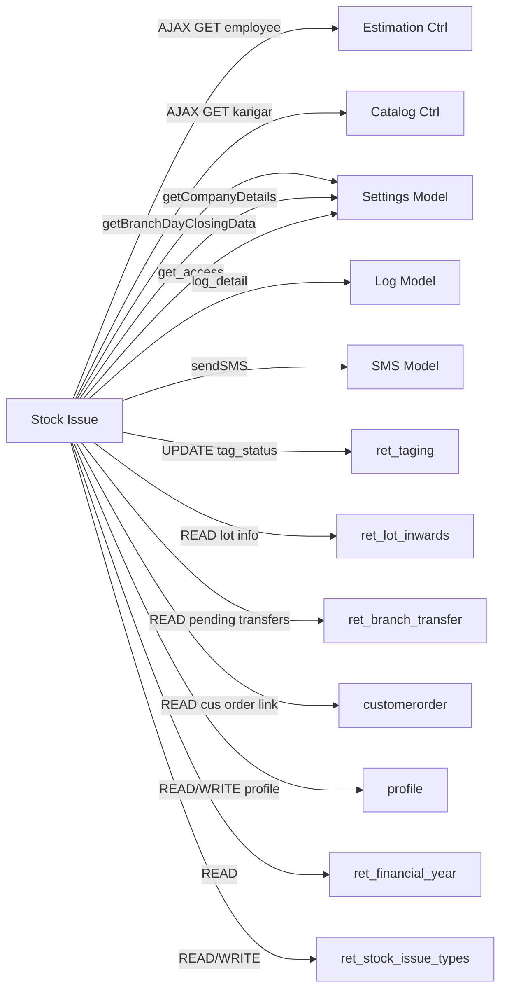

# CROSS-MODULE MAP — Stock Issue
> Verified Round 11 | 2026-03-19 | get_employee endpoint deep-verified

---

## Dependency Summary

| External Module | Direction | Method/Table | What Data | Risk |
|---|---|---|---|---|
| Estimation | Read (AJAX) | `admin_ret_estimation/get_employee` | Employee list | If estimation controller changes, employees won't load |
| Catalog | Read (AJAX) | `admin_ret_catalog/karigar/active_list` | Karigar list | If catalog changes endpoint, karigar dd breaks |
| Settings | Read | `admin_settings_model.getBranchDayClosingData()` | Day-close entry_date | Wrong issue date if day-close not done |
| Settings | Read | `admin_settings_model.getCompanyDetails()` | Company name, address for PDF | Null crash if company not configured |
| Settings | Read | `admin_settings_model.get_access()` | ACL permissions for list | |
| Log | Write | `log_model.log_detail()` | Audit trail | Silent fail — no error handling on log failure |
| SMS | Write | `sms_model.sendSMS_MSG91()` / `sendSMS_Nettyfish()` | OTP via SMS | SMS failure not surfaced to user |
| Tagging | Read/Write | `ret_taging` table | Tag status control | Tag status mismatch = stock integrity failure |
| LOT | Read | `ret_lot_inwards`, `ret_lot_inwards_detail` | Lot info for tag scan details | Lot records could be deleted |
| Branch Transfer | Read | `ret_branch_transfer` | Pending transfers deducted from non-tag scan | Race condition with transfers in progress |
| Customer Order | Read | `customerorder` | Repair order links for list view | JOIN — if order deleted, row still shows |

---

## Mermaid Dependency Graph



---

## Detailed Dependencies

### Estimation Controller (`admin_ret_estimation`)
- **Used by**: `get_all_employee()` JS function
- **Endpoint**: `POST admin_ret_estimation/get_employee`
- **POST data**: `{id_branch: branch_id}`
- **Controller** (L3050): reads `id_branch` via `$this->input->post()` safely, then calls `ret_estimation_model::get_employee($id_branch)`
- **Model** (L1386): SQL fetches ALL active employees (no WHERE id_branch) + LEFT JOIN employee_settings + JOIN chit_settings
  - PHP post-filters by `employee.login_branches` CSV column
  - If `chit_settings.login_branch == 0`: all employees returned (no branch filter at all)
  - If employee's `login_branches == 0 or NULL`: included for all branches
  - Otherwise: only if `id_branch` is in the employee's `login_branches` CSV
- **Actual response fields** (6 keys):
  ```json
  {
    "id_employee": 1,
    "emp_name": "E001-John Smith",
    "disc_limit_type": 1,
    "disc_limit": 5.0,
    "allowed_old_met_pur": 1,
    "allow_branch_transfer": 0
  }
  ```
- **Note**: Stock Issue JS only uses `id_employee` and `emp_name` from this response (extra fields ignored)
- **Risk**: If `chit_settings.login_branch = 0`, all employees across all branches are shown regardless of `id_branch` sent

### Catalog Controller (`admin_ret_catalog`)
- **Used by**: `get_all_karigar()` JS function
- **Endpoint**: `GET admin_ret_catalog/karigar/active_list`
- **Response**: Array of `{id_karigar, karigar}`
- **Risk**: Same as above

### `admin_settings_model`
- **`getBranchDayClosingData($branch_id)`**: Returns `{entry_date}` — used to set issue_date
- **`getCompanyDetails("")`**: Used in PDF print
- **`get_access($url)`**: Used in list view to check user permissions

### `log_model`
- **`log_detail('insert', '', $log_data)`**: Called after every successful transaction
- **Log fields**: `id_log`, `event_date`, `module`, `operation`, `record`, `remark`
- **Risk**: No error handling — if log insert fails, already-committed transaction is not rolled back

### `sms_model`
- **Triggered by**: `stock_trans_send_sms()` → auto-selects gateway from config `sms_gateway`
- **Gateway 1**: `sendSMS_MSG91($mobile, $message, '', $dlt_te_id)`
- **Gateway 2**: `sendSMS_Nettyfish($mobile, $message, 'trans')`

### `ret_taging` (Tagging Module Table)
- **READ**: Tag scan (status, weights, product, lot, section)
- **WRITE**: `tag_status` updated to 7 (issue) or 0 (receipt)
- **Shared by**: Billing, Sales, Section Transfer, LOT modules
- **Risk**: Concurrent status changes from two modules could corrupt tag state

### `ret_branch_transfer` (Branch Transfer Module Table)
- **READ**: In `get_nontag_scan_details()` — deducts pending transfers from available non-tag stock
- **Formula**: Apparent available = nt.gross_wt - SUM(transfer.gross_wt WHERE status NOT IN 3,1,4)
- **Risk**: Incorrect filter/join could show wrong available quantities

### `profile` (Settings)
- **READ**: `profile.stock_issue_otp_req` — controls OTP requirement
- **Scope**: Per user profile (set at profile level, not branch level)
