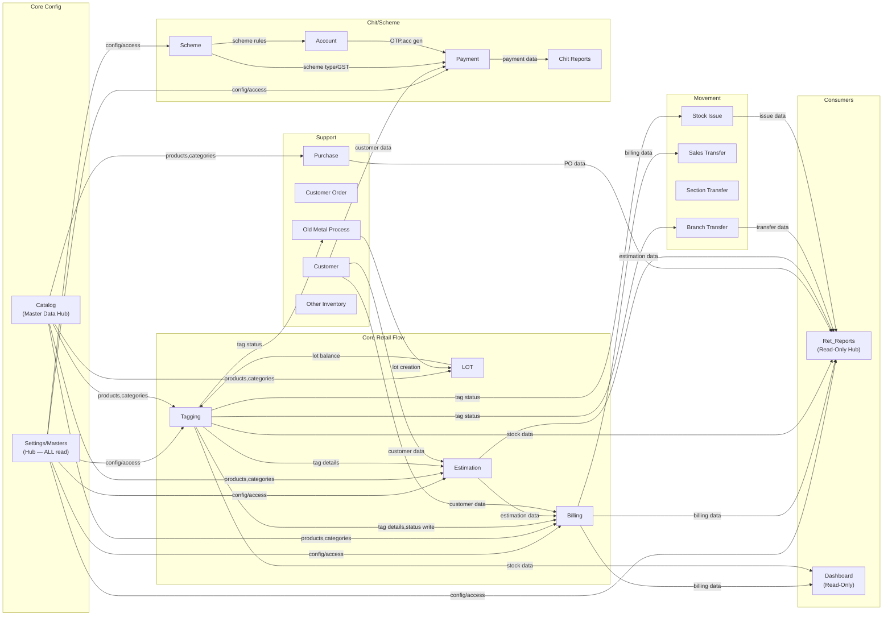

# Module Dependencies Map

> Which modules depend on which. Use this before modifying any shared code.
> Last updated: 2026-03-26
> Modules scanned: 28

---

## Dependency Matrix — Core Retail Modules

| Module | Depends On (reads/calls) | Depended On By |
|---|---|---|
| **Tagging** | Settings, Lot (balance deduction), Branch Transfer (tag move), Billing (billed check), Catalog, Metal Process, Estimation (AJAX: employee, design) | Billing, Estimation, Reports, Branch Transfer, Section Transfer, Stock Issue, Sales Transfer, Old Metal, Customer Order, Retail Dashboard |
| **Estimation** | Tagging (tag details, reserve), Customer, Orders, Settings (28 hidden fields), Billing (SR credits, tax), Gift Voucher, Day Closing, Catalog (AJAX), Other Inventory (AJAX) | Billing, Reports, Retail Dashboard |
| **Billing** | Estimation (header+items), Tagging (tag details, status write), Customer, Settings, Wallet, Accounts (journal), Inventory, Purchase, Tax, Gift Voucher, Scheme/Chit, Metal Rates | Reports, Sales Transfer, Retail Dashboard, Old Metal |
| **Ret_Reports** | Billing (~30 methods), Tagging (~50 methods), Purchase/PO (~15 methods), Customer (~15 methods), LOT (~10 methods), Catalog, Settings, Estimation, Branch Transfer, Stock Issue, Old Metal, Section, Scheme, Day Closing, Non-Tag | — (terminal consumer — read-only hub) |
| **Branch Transfer** | Tagging (tag status/branch), Non-Tag Stock, Billing (sales return details), Purchase (items log), Orders/Repairs, Other Inventory (packaging), Settings, Catalog (AJAX), Mobile App API | Reports, Stock Issue, Sales Transfer, Retail Dashboard |
| **Stock Issue** | Tagging (tag status), LOT, Branch Transfer (pending transfers), Settings, Estimation (AJAX: employee), Catalog (AJAX: karigar), Customer Order | Reports |
| **Sales Transfer** | Billing (bill creation, rate, FY), Tagging (tag status/branch), Settings (day closing), Catalog (AJAX), Branch Transfer (AJAX: branches, lots) | Reports, Billing (bill_type 13/14) |
| **LOT** | Settings, Tagging (tag status check), Purchase/GRN, Old Metal, Orders, Catalog (UOM, products), Non-Tag Inventory, Karigar | Tagging (324+ refs), Estimation, Stock Issue, Reports, Sales Transfer |
| **Catalog_Inventory** | Settings, Tagging (delete guards), Billing (deposit queries) | ALL retail modules (master data provider — products, categories, purities, designs, sections, karigars) |
| **Section Transfer** | Settings (OTP, day closing), Reports (AJAX: products), Catalog (AJAX: sections), Branch Transfer (AJAX: NT stock), Customer Orders, Estimation | Reports |
| **Old Metal Process** | Billing (old metal bills), Estimation (old metal estimates), Tagging (tag process), Catalog (karigar, category, purity), Purchase (items log), Settings | LOT (lot_from=2/4/5), Reports, Non-Tag Stock |
| **Retail Dashboard** | Billing, Estimation, Tagging, LOT, Branch Transfer, Customer Orders, E-commerce, Finance (receipts), Gift Card, Customer CRM, Ledger, Settings, Purchase/PO, ret_reports_model (cross-model dependency) | — (terminal consumer) |

---

## Dependency Matrix — Chit/Scheme/Support Modules

| Module | Depends On | Depended On By |
|---|---|---|
| **Scheme** | Settings (limits, GST, access), Account (lump-sum slabs), Payment (metal rate) | Account, Payment, Chit Reports, Chit Collection App, Chit Customer App |
| **Account** | Payment (receipt gen, metal rate), Customer, Settings, Scheme (rules), SMS, Email, Wallet, Sync APIs | Payment, Chit Reports, Billing |
| **Payment** | Account (OTP, acc num gen), Settings, Customer, Scheme (type/GST), SMS, Email, Wallet, Sync APIs, Payment Gateways (6), Billing (AJAX: device/bank) | Chit Reports, Account |
| **Chit Reports** | Payment (all queries), Account, Settings, SMS (OTP), Sync API | — (terminal consumer) |
| **Customer** | Settings (limits, access, wallet), Wallet, Log, SMS, Email, Estimation (AJAX: village), Chit Admin | ALL modules (universal FK dependency) |
| **Customer Order** | Settings, Billing (AJAX: metal rates), Purchase Approval (karigar), Email, Tagging, Job Order, Log, Estimation, DOMPDF | Branch Transfer, LOT, Reports, Section Transfer |
| **Employee** | Settings (access, company, profiles), Wallet, Estimation (device count), Log | Customer (FK), Login, Mobile App, Billing/Estimation (discount limits), Day Close |
| **Masters** | Customer (count), Scheme (count), Account (count), Chit Admin, SMS, Log | ALL modules (RBAC, config, metal rates, branches, payment modes) |
| **Retail Settings** | Customer, Scheme Account, Services | ALL modules (ret_settings config source) |
| **Purchase** | Catalog (products, karigars, wastage), Tagging (sizes, stones), Settings, Reports, Billing (cheque print), Log, SMS, Email | LOT, Reports, Old Metal, Billing (return flows) |
| **Other Inventory** | Settings, Log, Karigar, Billing (issue linkage), Customer, Employee, Catalog (AJAX: UOM), Day Closing, Branch Transfer | Branch Transfer, Billing, Scheme/Chit, Reports |

---

## Dependency Graph

---

## Cross-Module AJAX Calls

| Source Module (JS) | Target Controller | Endpoint | What Data | Risk |
|---|---|---|---|---|
| Tagging JS | `admin_ret_billing` | `getAllTaxgroupItems` | Tax group dropdown | Billing tax structure change breaks tagging |
| Tagging JS | `admin_ret_estimation` | `get_employee`, `getProductDesignBySearch` | Employee, design lookup | Shared lookup — inconsistent if models differ |
| Estimation JS | `admin_ret_catalog` | `get_active_design_products`, `get_ActiveSubDesigns`, `ret_product/active_list` | Product/design data | Catalog removal → empty estimation dropdowns |
| Estimation JS | `admin_ret_tagging` | `get_po_details`, `get_wastage_settings_details` | PO details, wastage settings | Tagging controller change breaks estimation |
| Estimation JS | `admin_ret_billing` | `getAllTaxgroupItems` | Tax group items | Same as Tagging risk |
| Estimation JS | `admin_ret_other_inventory` | `get_productMappedDetails` | Packaging products | Missing mapping → empty section |
| Branch Transfer JS | `admin_ret_catalog` | `product/active_prodBySearch`, `get_sectionBranchwise`, `karigar/active_list` | Products, sections, karigars | Catalog dependency |
| Branch Transfer JS | `admin_app_api` | `bt_approval_otp_req`, `update_aprvl_status`, `get_approval_status` | Mobile approval | External app dependency |
| Stock Issue JS | `admin_ret_estimation` | `get_employee` | Employee list | Cross-module employee data |
| Stock Issue JS | `admin_ret_catalog` | `karigar/active_list` | Karigar list | Catalog dependency |
| Purchase JS | `admin_ret_catalog` | 15+ endpoints | Products, designs, categories, karigars, wastage | Heavy Catalog dependency |
| Purchase JS | `admin_ret_tagging` | `getStoneItems`, `getStoneTypes`, `get_ActiveSize` | Stone data | Tagging stone master |
| Section Transfer JS | `admin_ret_reports` | `get_ActiveProduct` | Product dropdown | Reports controller dependency |
| Section Transfer JS | `admin_ret_brntransfer` | `getNonTaggedItem` | NT stock | BT dependency |
| Customer JS | `admin_ret_estimation` | `get_village`, `get_village_by_pincode` | Village lookup | Cross-controller AJAX |
| Payment JS | `admin_ret_billing` | `get_bank_acc_details`, `get_payment_device_details`, `bill_payment_details`, `get_advance_details` | Bank/POS/bill/advance | 5 billing AJAX calls |
| Payment JS | `admin_employee` | `get_employee` | Employee list | — |
| Catalog JS | `admin_ret_tagging` | `getStoneTypes` | Stone types (2×) | Tagging dependency |
| Catalog JS | `admin_ret_reports` | `get_ActiveSubDesign` | Sub-designs | Reports dependency |
| Catalog JS | `admin_ret_purchase` | `karigar_gst_available`, `karigar_pan_available`, `karigar_aadhar_available` | Karigar KYC checks (3×) | Purchase dependency |
| Old Metal JS | `admin_ret_reports` | `get_old_metal_type`, `get_ActiveProduct` | Metal types, products | Reports dependency |
| Old Metal JS | `admin_ret_brntransfer` | `branch_transfer/getTagsByFilter` | Tag search | BT dependency |
| Old Metal JS | `admin_ret_purchase` | `karigarmaterialissue/available_stock_details` | Stock check | Purchase dependency |
| Chit Reports JS | `admin_manage` | `passbook_reprint`, `set_remarks_byid`, `blk_payment_byid` | Passbook/remarks | Account controller |
| Chit Reports JS | `admin_payment` | `getMetalRateBydate` | Metal rate | Payment controller |

---

## Shared Model Usage

| Model | Loaded By Modules | Key Methods | Risk if Changed |
|---|---|---|---|
| `admin_settings_model` | ALL modules | `get_access()`, `settingsDB()`, `getBranchDayClosingData()`, `getCompanyDetails()`, `profileDB()`, `metal_ratesDB()` | 🔴 CRITICAL — breaks all modules |
| `log_model` | ALL modules with CRUD | `log_detail()` | 🟡 LOW — audit trail |
| `sms_model` | Billing, Tagging, Payment, Account, Customer, Employee, Stock Issue, Branch Transfer, Section Transfer | `sendSMS_MSG91()`, `sendSMS_Nettyfish()`, `sendSMS_SpearUC()` | 🟡 MED — SMS delivery |
| `admin_usersms_model` | Same as sms_model | `get_SMS_data()`, `send_whatsApp_message()`, `check_noti_settings()` | 🟡 MED |
| `payment_model` | Account, Chit Reports, Settings, Scheme, Billing | `paymentDB()`, `generate_receipt_no()`, `get_metalrate_by_branch()`, `insertData()`, `updateData()` | 🔴 HIGH — core financial |
| `account_model` | Payment, Chit Reports, Settings, Scheme, Billing | `get_scheme_account()`, `generate_receipt_no()`, `get_due_date()`, `insertData()`, `updateData()` | 🔴 HIGH — account ops |
| `customer_model` | Account, Payment, Chit Reports, Settings, Billing, Estimation | `get_cust()`, `customer_data()`, `get_entrydate()`, `format_accRcptNo()` | 🔴 HIGH — universal customer |
| `ret_billing_model` | Billing, Tagging, Branch Transfer, Sales Transfer, Customer Order, Purchase, Retail Dashboard | `code_number_generator()`, `generateRefNo()`, `get_branchwise_rate()`, `get_FinancialYear()` | 🔴 HIGH — bill creation |
| `ret_catalog_model` | Catalog, LOT, Reports, Purchase | `getActiveUOM()`, `get_deposit()`, master data queries | 🟡 MED — master data |
| `email_model` | Account, Payment, Customer Order | `send_email()` | 🟢 LOW |
| `Wallet_model` | Account, Payment, Customer, Employee | `get_wallet_acc_number()`, `wallet_accountDB()`, `wallet_transactionDB()` | 🟡 MED — wallet ops |
| `ret_reports_model` | Reports, Purchase, Retail Dashboard | `getBillDetails()`, `getLedgerReportData()` | 🟡 MED — report queries |
