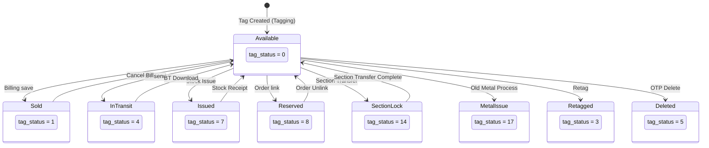

# Tag Status Map — Cross-Module Status Registry

> Last updated: 2026-03-26
> Tracks ALL status fields that are written by multiple modules.

---

## `ret_taging.tag_status` — THE Critical Multi-Writer Field

> [!CAUTION]
> `tag_status` is written by **8 different modules** with NO centralized state machine. Each module writes directly. This is the single highest cross-module risk in the system.

| Value | Meaning | Set By Module | Method/Context | Can Revert? |
|---|---|---|---|---|
| **0** | Available / In Stock | Tagging (`tagging('save')`) | Initial tag creation | — |
| **0** | Available (restored) | Billing (`cancel_bill()`) | Cancel bill restores tag | Yes |
| **0** | Available (restored) | Stock Issue (`stock_receipt()`) | Stock receipt restores tag | Yes |
| **0** | Available (restored) | Branch Transfer (`download_tag()`) | Transfer download at destination | Yes |
| **1** | Sold Out | Billing (`billing('save')`) | Bill finalized | Yes (via cancel) |
| **3** | Retagged (old tag) | Tagging (`create_retag()`) | Old tag after retag | No |
| **4** | In Transit | Branch Transfer (`save_transfer()`) | Tag sent to another branch | Yes (on download) |
| **5** | Deleted | Tagging (`verify_otp()`) / OTP delete | Tag deleted by authorized user | No |
| **7** | Issued (Stock Issue) | Stock Issue (`stock_issue_save()`) | Tag issued for display/exhibition | Yes (on receipt) |
| **8** | Reserved (Order) | Customer Order (`update_tag_status()`) | Tag assigned to customer order | Yes (on unlink) |
| **14** | Section Transfer Lock | Section Transfer | Locked during section transfer | Yes (on complete) |
| **17** | Metal Issue | Metal Process / Old Metal | Tag sent for melting/processing | No (irreversible) |

### State Machine Diagram

### Multi-Writer Conflicts

| Value | Writers | Conflict? |
|---|---|---|
| 0 (Available) | Tagging, Billing (cancel), Stock Issue (receipt), Branch Transfer (download) | ⚠️ 4 writers — acceptable (create vs various restores) but no guard against concurrent restore |
| 1 (Sold) | Billing only | ✅ Single writer |
| 4 (In Transit) | Branch Transfer only | ✅ Single writer |
| 7 (Issued) | Stock Issue only | ✅ Single writer |
| 14 (Section Lock) | Section Transfer only | ✅ Single writer |

---

## `scheme_account.active` / `is_closed` — Chit Account Status

| State | active | is_closed | Meaning | Set By |
|---|---|---|---|---|
| Open Active | 1 | 0 | Account open and active | Account (on join) |
| Suspended | 0 | 0 | Account blocked | Account admin |
| Matured/Closed | 1 | 1 | Account matured/closed | Account (close flow) |
| Pre-Closed | 0 | 1 | Account pre-closed | Account (pre-close) |

---

## `payment.payment_status` — Payment Status Codes

| Code | Meaning | Set By | Notes |
|---|---|---|---|
| **1** | Success | Payment, Chit Reports | Terminal state |
| **2** | Awaiting Approval | Payment | Needs admin approval |
| **3** | Failure | Payment (gateway) | Gateway failure |
| **4** | Cancelled | **Payment** AND **Chit Reports** | ⚠️ Two modules write this — XMOD-001 |
| **6** | Refund | Payment | Gateway refund |
| **7** | Pending | Payment | Online init waiting for callback |
| **-1** | Failed (legacy) | Payment | Pre-refactoring code |

> [!CAUTION]
> Status **4** (Cancelled) is written by BOTH `chit_reports::cancel_payment` AND `admin_payment`. The chit_reports path has NO transaction wrapping — if audit log insert fails, payment is cancelled but log is missing. See CROSS_MODULE_BUGS XMOD-001.

---

## `ret_estimation.is_eda` — EDA Approval Status

| Value | Meaning | Set By |
|---|---|---|
| 0 | No discount approval needed | Estimation |
| 1 | Pending EDA approval | Estimation (when discount exceeds limit) |
| Cleared | Approved by admin | EDA admin modal |

---

## `ret_branch_transfer` Status Values

| Value | Meaning | Set By |
|---|---|---|
| 0 | Created / Pending | Branch Transfer (save) |
| 1 | Downloaded / Received | Branch Transfer (download) |
| 3 | Cancelled | Branch Transfer (cancel) |
| 4 | In Transit | Branch Transfer (send) |

---

## OTP Status (Session-Based)

| Session Key | Module | Purpose |
|---|---|---|
| `$_SESSION['OTP']` | Account | General OTP |
| `$_SESSION['pay_OTP']` | Account | Payment verification |
| `$_SESSION['gift_OTP']` | Account | Gift issue OTP |
| `$_SESSION['OTP_scheme_join']` | Account | Scheme join |
| `$_SESSION['rate_fix_otp']` | Account | Rate fixing |
| `purch_otp` | Chit Reports | Purchase delivery |

> [!WARNING]
> OTP comparison bugs: both Account (L4188) and Payment (L5081) use `=` instead of `==` — OTP check always evaluates true. See XMOD-004.
