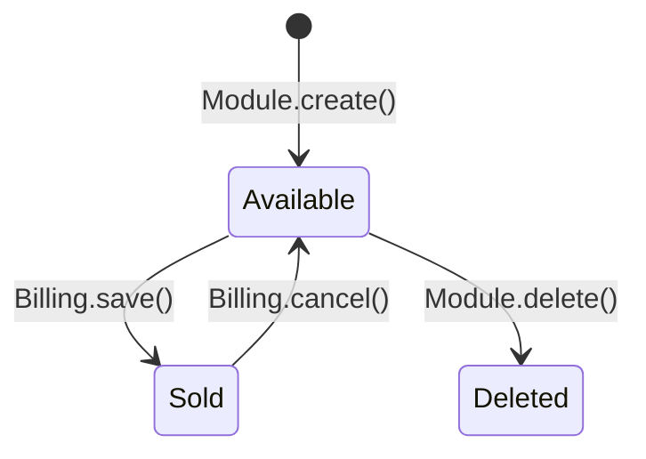

# {MODULE_NAME} — Flow Risk Matrix

> **Module**: {MODULE_NAME}
> **Built**: {DATE} (Round {N})
> **Purpose**: Handoff contracts, state machines, and QA-ready flow risk scenarios.
> **How to use**: Compare this module's outbound contracts against downstream modules' inbound contracts. Mismatches = bugs waiting to happen.

---

## 1. State Machine: {TABLE}.{STATUS_FIELD}

> Document ALL status fields on the module's primary entity and their valid transitions.
> Flag any transitions that lack a precondition guard.

| State | Value | Set By (Module.Method) | Can Transition To | Guard / Precondition |
|---|---|---|---|---|
| {state_name} | {N} | {Module}.{method()} | {target_states} | {guard or ⚠️ NO GUARD} |

### State Diagram

---

## 2. Inbound Contracts (What This Module Expects from Upstream)

> For each external module that feeds data INTO this module.
> Mark each precondition as YES (with line), PARTIAL, or NO.

| Upstream Module | Data/State Expected | Precondition Check in Code? | Line | Risk if Violated |
|---|---|---|---|---|
| {module} | {expected_state} | YES / PARTIAL / NO | L{N} | {risk_description} |

---

## 3. Outbound Contracts (What This Module Guarantees to Downstream)

> For each downstream module that consumes data FROM this module.
> Flag mismatches as ⚠️ CONTRACT GAP.

| Downstream Module | What This Module Guarantees | Enforced How? | Risk if Broken |
|---|---|---|---|
| {module} | {guarantee} | {enforcement_method} | {risk_description} |

---

## 4. Reversal Contracts (Cancel/Delete/Reverse)

> For each cancel/delete operation, compare tables written during CREATE vs tables restored during CANCEL.
> Any table in CREATE but not in CANCEL = a gap.

| Operation | Tables That Must Be Restored | Actually Restored in Code? | Method & Line | Gap? |
|---|---|---|---|---|
| {operation} | {table}.{field} → {restored_value} | ✅ YES / ⚠️ PARTIAL / ❌ NO | {method()} L{N} | {gap_description} |

### Reversal Completeness

| Metric | Count |
|---|---|
| Tables written during CREATE | {N} |
| Tables restored during CANCEL | {N} |
| Gaps (written but not restored) | {N} |
| Completeness | {N}% |

---

## 5. Flow Risk Checklist (QA-Ready Test Scenarios)

> Generate from: unguarded state transitions, missing inbound checks, reversal gaps, outbound contract gaps.
> Priority: 🔴 HIGH (data corruption/loss), 🟡 MED (wrong behavior), 🟢 LOW (cosmetic/display).

| ID | Test Scenario | Expected Result | Priority | Verified? |
|---|---|---|---|---|
| FR-{MOD}-001 | CREATE with invalid upstream state | REJECT with error | 🔴 HIGH | ❌ |
| FR-{MOD}-002 | CREATE when upstream record is deleted | REJECT | 🔴 HIGH | ❌ |
| FR-{MOD}-003 | EDIT after downstream has consumed | REJECT or warn | 🔴 HIGH | ❌ |
| FR-{MOD}-004 | CANCEL → verify ALL tables restored | Full restoration | 🔴 HIGH | ❌ |
| FR-{MOD}-005 | CANCEL → re-create same record | Should work | 🟡 MED | ❌ |
| FR-{MOD}-006 | Concurrent save on same entity | One rejects | 🟡 MED | ❌ |
| FR-{MOD}-007 | Midway crash (check trans_begin/complete) | No orphans | 🔴 HIGH | ❌ |
| FR-{MOD}-008 | Data to downstream matches saved values | Exact match | 🟡 MED | ❌ |

### Summary

| Priority | Total | Verified | Unverified |
|---|---|---|---|
| 🔴 HIGH | {N} | {N} | {N} |
| 🟡 MED | {N} | {N} | {N} |
| 🟢 LOW | {N} | {N} | {N} |
