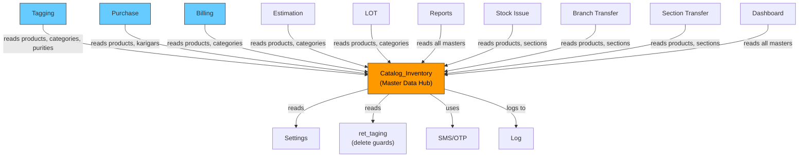

# Catalog_Inventory — CROSS MODULE MAP

> **Built**: 2026-03-13

## Constructor Dependencies

| External Module | Model Loaded | Purpose |
|---|---|---|
| Settings | `admin_settings_model` | Access control — `get_access()` for permission-gated views |
| SMS/OTP | `sms_model` | Vendor OTP for karigar approval workflow |
| Logging | `log_model` | Audit trail — `log_detail()` on all CRUD operations |

## Table Read Dependencies (Other Module's Tables)

| External Module | Table Read | Methods | What Data | Risk |
|---|---|---|---|---|
| Tagging | `ret_taging` | `getItemsinTagDetails()` | Tag count by category/product/purity/stone | If tagging table is down, all delete operations fail |
| Settings | `chit_settings`, `ret_settings` | `get_ret_settings()`, `get_profile_settings()` | App-level configuration | Settings changes can alter behavior across module |
| Billing | `ret_billing` | Referenced in some queries | Billing records for karigar | Stock existence checks |
| Branch | `branch` | Multiple methods | Branch data for multi-branch features | Branch table integrity critical |
| Company | `company` | `getCompanyDetails()` | Company info for forms | — |
| Employee | `employee` | `get_employee()` | Employee list for bank deposit forms | — |
| Location | `city`, `state`, `country` | Karigar forms | Location data for address | — |
| Payment | `payment`, `payment_mode`, `payment_mode_details` | Bank deposit module | Payment methods | — |
| Dealer | `dealer` | Some karigar functions | Dealer/vendor info | — |

## Table Write Dependencies (Writing to Other Module's Tables)

| External Module | Table Written | Methods | What Data | Risk |
|---|---|---|---|---|
| None identified | — | — | — | This module primarily owns its tables |

> **Note**: Catalog_Inventory is a **master data provider** — it doesn't write to other modules' tables. But many modules READ from its tables extensively.

## Modules That DEPEND ON Catalog_Inventory

| Module | Reads These Tables | Critical? |
|---|---|---|
| Tagging | `ret_product_master`, `ret_category`, `ret_purity`, `ret_stone` | 🔴 Critical — can't create tags without products |
| Purchase | `ret_product_master`, `ret_category`, `ret_karigar` | 🔴 Critical — PO references products and karigars |
| Billing | `ret_product_master`, `ret_category`, `ret_purity` | 🔴 Critical — billing needs product config |
| Estimation | `ret_product_master`, `ret_category` | 🔴 Critical — estimates reference products |
| Sales/LOT | `ret_product_master`, `ret_category`, `ret_purity` | 🔴 Critical |
| Reports | All master tables | 🟡 Medium — reports aggregate master data |
| Stock Issue | `ret_product_master`, `ret_section` | 🔴 Critical |
| Branch Transfer | `ret_product_master`, `ret_section` | 🔴 Critical |
| Section Transfer | `ret_product_master`, `ret_section` | 🔴 Critical |
| Dashboard | Multiple master tables | 🟡 Medium — dashboard aggregates |

## Dependency Graph

## JS Cross-Module AJAX Calls

No cross-module AJAX calls found in `catalog.js`. All AJAX endpoints target `admin_ret_catalog` controller only.
