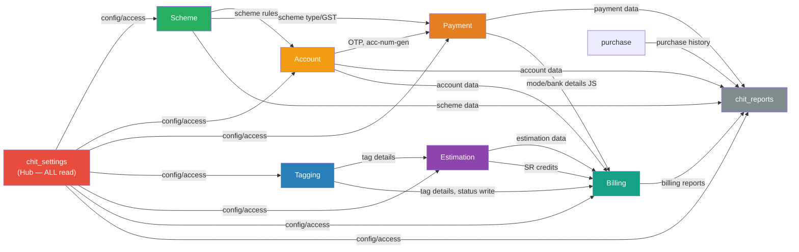

# Module Dependencies Map
> Last updated: 2026-03-16
> Modules scanned: 9 (initial build)

---

## Dependency Matrix

| Module | Depends On (reads/calls) | Depended On By |
|---|---|---|
| **chit_settings** | —  | ALL modules (every controller reads `get_access`, `settingsDB`, `metal_ratesDB`, `limitDB`) |
| **Scheme** | chit_settings (limits, GST, access), Account (lump-sum slabs), Payment (metal rate) | Account, Payment, chit_reports, Billing, Estimation |
| **Account** | Payment (receipt gen, metal rate, free payments), Customer, chit_settings, Scheme (rules), SMS, Email, Wallet, Sync APIs | Payment, chit_reports, Billing, Estimation |
| **Payment** | Account (OTP, acc num gen), chit_settings, Customer, Scheme (type/GST), SMS, Email, Wallet, Sync APIs, Payment Gateways, Billing (device/bank AJAX) | chit_reports (primary data source), Billing |
| **chit_reports** | Payment (all report queries), Account (scheme summary, outstanding), chit_settings (access), admin_manage (passbook JS), SMS (OTP purchase), Sync API (cancel), Khimji ERP | — (terminal — nothing reads reports output) |
| **Tagging** | chit_settings (access, day closing), Branch Transfer (tag move), Billing (billed status check), Lot Inward (balance deduction), Catalog, Metal Process | Billing, Estimation, chit_reports (stock reports) |
| **Estimation** | Tagging (tag details, reserve check), Customer, Orders, chit_settings (28 settings), Billing (SR credits), Gift Voucher, Day Closing, Sync | Billing |
| **Billing** | Estimation (header+items for conversion), Tagging (tag details, status update), Customer, chit_settings (access, day closing), Wallet, Accounts (journal), Inventory, Purchase | chit_reports (billing reports), Estimation (SR credits) |
| **purchase** | *(no brain — unknown)* | chit_reports (purchase history report), Payment (return flows), Billing (purchase return) |

---

## Dependency Graph

---

## Cross-Module AJAX Calls

### Chit Module AJAX Dependencies

| Source Module (JS) | Target Controller | Endpoint | What Data | Risk |
|---|---|---|---|---|
| reports.js | `admin_manage` | `passbook_reprint`, `passbook_print`, `set_remarks_byid`, `blk_payment_byid`, `loadGiftData` | Passbook ops, gift, remarks | Reports JS hardcoded to admin_manage routes |
| reports.js | `admin_employee` | `get_employee` | Employee dropdown | — |
| reports.js | `admin_customer` | `ajax_get_customers_list` | Customer search autocomplete | — |
| reports.js | `admin_payment` | `getMetalRateBydate` | Metal rate for edit form | — |
| reports.js | `branch` (old route) | `branchname_list` | Branch dropdown | Old route dependency |
| reports.js | `khimji_services` | `generateAcNoOrReceiptNoById` | Account/receipt no (Khimji ERP) | External ERP dependency |
| reports.js | `reports` (old route) | 8+ endpoints | Same as admin_reports | **Dual-route risk** — both `/reports/` and `/admin_reports/` active |
| payment.js | `admin_ret_billing` | `get_bank_acc_details`, `get_payment_device_details`, `bill_payment_details` | Bank/POS/bill details | Billing module must stay compatible |
| payment.js | `admin_customer` | `ajax_get_customers_list` | Customer search | — |
| payment.js | `admin_scheme` | `ajax_get_schemes` | Active schemes | — |
| payment.js | `admin_employee` | `get_employee` | Employee list | — |
| payment.js | `branch` | `branchname_list` | Branch names | — |
| Tagging JS | `admin_ret_billing` | `getAllTaxgroupItems` | Tax group dropdown | Tagging depends on Billing for tax data |
| Tagging JS | `admin_ret_estimation` | `get_employee`, `getProductDesignBySearch` | Employee, product-design lookup | Tagging shares employee/design data from Estimation |

---

## Shared Model Usage

| Model | Loaded By Modules | Purpose |
|---|---|---|
| `account_model` | Payment, chit_reports, chit_settings, Scheme | Account CRUD, acc num gen, OTP |
| `payment_model` | Account, chit_reports, chit_settings, Scheme | Payment CRUD, receipts, report queries |
| `admin_settings_model` | ALL modules | Access control, config, metal rates, pay modes, company, branches |
| `log_model` | Account, Payment, chit_reports, Scheme, Tagging, Billing | Audit trail |
| `customer_model` | Account, Payment, chit_reports, chit_settings, Billing, Estimation | Customer CRUD, search, format helpers |
| `admin_usersms_model` | Account, Payment, chit_reports, chit_settings, Billing, Tagging | SMS templates, notification settings |
| `sms_model` | Account, Payment, chit_reports, chit_settings, Billing, Tagging | SMS gateway dispatch (5 gateways) |
| `email_model` | Account, Payment | Email dispatch |
| `Wallet_model` | Account, Payment | Wallet CRUD |
| `syncapi_model` | Account, Payment, chit_reports | External sync |
| `chitadmin_model` | Account, Payment, chit_reports, chit_settings | Admin profile, permissions |
| `integration_model` | chit_reports | Khimji ERP integration |
