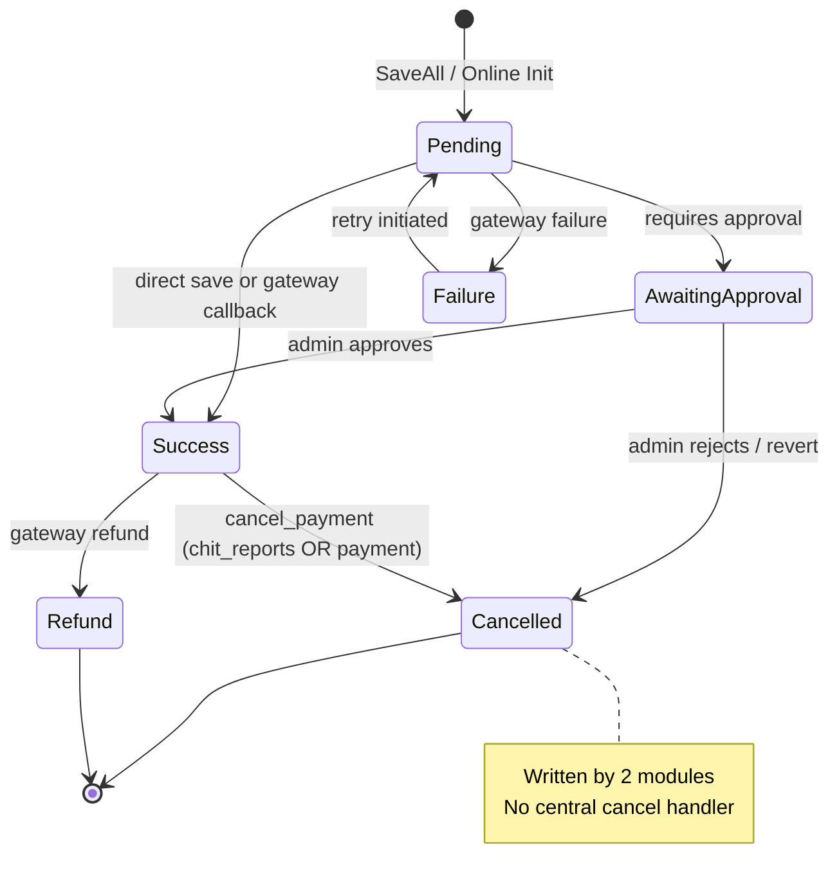

# Tag Status Map — Chit Module
> Last updated: 2026-03-16
> Tracks `scheme_account.active` / `is_closed` and `payment.payment_status` state values used across all chit modules.
> Note: `tag_status` in `ret_taging` is a retail module value — see Tagging brain.

---

## Scheme Account Status (`scheme_account.active` / `is_closed`)

| Value | Meaning | Set By | Read By |
|---|---|---|---|
| `active=1, is_closed=0` | Account open and active | Account (on join) | Payment, chit_reports |
| `active=0, is_closed=0` | Account suspended / blocked | Account | chit_reports |
| `active=1, is_closed=1` | Account matured/closed | Account (close flow) | chit_reports `closedaccount_list` |
| `active=0, is_closed=1` | Account pre-closed | Account (pre-close) | chit_reports |

---

## Payment Status Codes (`payment.payment_status`)

| Code | Meaning | Set By | Read By | Notes |
|---|---|---|---|---|
| **1** | Success | Payment (SaveAll, verify_*), chit_reports | ALL report queries | Terminal success state |
| **2** | Awaiting Approval | Payment (`Save` with approval workflow) | chit_reports, Payment (verify) | Requires admin approval before becoming 1 |
| **3** | Failure | Payment (gateway callback) | chit_reports | Gateway-reported failure |
| **4** | Cancelled | **chit_reports** (`cancel_payment`), **Payment** | chit_reports `paymentcancel_list` | ⚠️ Written by 2 modules |
| **6** | Refund | Payment | chit_reports | Gateway refund processed |
| **7** | Pending | Payment (online init) | chit_reports | Waiting for gateway callback |
| **-1** | Failed (legacy) | Payment | chit_reports `failed_payments` | Pre-refactoring failure code |

> [!CAUTION]
> Status **4** (Cancelled) is written by BOTH `chit_reports::cancel_payment` AND `admin_payment` module. The chit_reports path does NOT have transaction wrapping — if audit log insert fails, payment is cancelled but log is missing. See CROSS_MODULE_BUGS XMOD-001.

---

## State Machine Diagram

---

## Scheme Registration Request Status (`reg_request.status`)

| Value | Meaning | Set By |
|---|---|---|
| `0` | Pending | Account (on submit) |
| `1` | Approved | Account admin |
| `2` | Rejected | Account admin |

---

## OTP Status (session-based, no persistent DB state)

| Session Key | Module | Expiry Key | Purpose |
|---|---|---|---|
| `$_SESSION['OTP']` | Account | `pay_OTP_expiry` | Payment/general OTP |
| `$_SESSION['pay_OTP']` | Account | `pay_OTP_expiry` | Payment verification OTP |
| `$_SESSION['gift_OTP']` | Account | `gift_OTP_expiry` | Gift issue OTP |
| `$_SESSION['OTP_scheme_join']` | Account | `sche_join_otp_expiry` | Scheme join OTP |
| `$_SESSION['rate_fix_otp']` | Account | `rate_fixing_otp_exp` | Rate-fixing OTP |
| `purch_otp` (session) | chit_reports | None found | Purchase delivery OTP |

> [!WARNING]
> OTP comparison bugs: both Account (L4188) and Payment (L5081) use `=` (assignment) instead of `==` (comparison) — OTP check always evaluates true. See VALIDATION_GAPS VAL-020, VAL-021.

---

## `ret_taging.tag_status` (Retail Module — for reference)

| Value | Meaning | Set By |
|---|---|---|
| 0 | Available | Tagging |
| 1 | Sold | **Billing** |
| 3 | Retagged (old) | Tagging |
| 4 | In Transit | Branch Transfer |
| 17 | Metal Issue | Metal Process |

> Multiple modules write `tag_status` with no centralized state machine. See CROSS_MODULE_BUGS XMOD-008.
