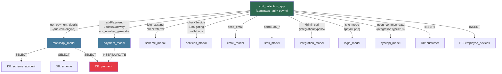

# chit_collection_app — Cross-Module Map

> **Brain Built:** 2026-03-17 | **Round:** 1

---

## External Module Dependencies

| External Module | Direction | Tables / Methods | What Data | Risk |
|---|---|---|---|---|
| **mobileapi_model** | READ | `get_payment_details()` | All scheme account due data, allow_pay, payable amounts | **Critical** — The primary eligibility engine lives in mobile_api module. Any bugs there affect collection app |
| **mobileapi_model** | READ | `isBranchWiseReg()`, `isRateFixed()`, `updFixedRate()` | Branch registration mode, rate fixing state | Rate fixed status affects payable |
| **mobileapi_model** | WRITE | `insert_schemeAcc()`, `free_payment_data()`, `accno_generatorset()`, `update_account()` | New scheme account creation | Account number assignment |
| **mobileapi_model** | READ | `get_currency()`, `branchesData()`, `getCusSchejoinedbranch()`, `verifyAgentCode()` | Currency, branch list, agent validation | |
| **payment_modal** | READ+WRITE | `addPayment()`, `updateGatewayResponse()`, `account_number_generator()`, `generate_receipt_no()`, `getMetalRate()`, `get_customer()`, `get_financialYear()`, `get_entrydate()`, `generateDueDate()`, `wallet_balance()` | Core payment operations | **Critical** — Any bugs in payment_modal propagate to all payment flows |
| **scheme_modal** | READ+WRITE | `verify_existing()`, `join_existing()`, `checkreferral_code()`, `get_groups()`, `allowUnpaid()`, `allowMultipleChits()`, `allowNewscheme_join()`, `check_unpaid_schemes()`, `hasUnclosedAccounts()`, `getJoinedScheme()`, `updateGroupCode()` | Scheme join eligibility, referral, group codes | |
| **services_modal** | READ+WRITE | `checkService()`, `get_SMS_data()`, `limitDB()`, `customer_count()`, `walletacc_insert()`, `get_walletacc()`, `get_wallet_acc_number()` | SMS gating, customer count limits, wallet creation | Customer registration blocked if limit exceeded |
| **email_model** | WRITE | `send_email()` | Transaction emails | Failure is non-blocking (not inside trans) |
| **sms_model** | WRITE | `sendSMS_MSG91()`, `sendSMS_Nettyfish()`, `sendSMS_SpearUC()`, `sendSMS_Asterixt()`, `sendSMS_Qikberry()`, `send_whatsApp_message()` | OTP + payment confirmation SMS | Gateway config-driven (sms_gateway config item) |
| **integration_model** | READ+WRITE | `khimji_curl()`, `updateData()` | Khimji offline ERP sync | Only when integrationType==5 |
| **login_model** (paymt.php) | READ | `site_mode()`, `company_details()` | Maintenance mode, comp details | paymt.php only |
| **registration_model** (paymt.php) | READ | Internal registration helpers | Customer data | paymt.php only |
| **syncapi_model** (paymt.php) | WRITE | `insert_common_data()` | Payment sync to external system | Only when integrationType==2 or 3 |
| **chitapi_model** (paymt.php) | READ | Post-payment chit operations | Chit state updates | paymt.php only |

---

## Tables Owned by This Module

> Note: `chit_collection_app` is an API layer — it does NOT own any tables directly. It reads/writes to tables owned by other modules via their models.

**Primary Tables Used (Owner → Table):**
- payment_modal → `payment`
- Registration/mobile_api → `customer`, `address`, `scheme_account`
- HR/employee module → `employee`, `employee_devices`
- scheme module → `scheme`, `scheme_account`, `scheme_group`
- config module → `chit_settings`
- services module → `wallet_account`, `wallet_transaction`

---

## Dependency Graph

---

## Integration Points (External Systems)

| System | When | Method | Notes |
|---|---|---|---|
| **Khimji ERP (Offline)** | integrationType==5 | `integration_model::khimji_curl()` | Customer registration sync to offline system |
| **PayU** | pg_code=1 | `_payment()` / PayU library | Hash-based signature, SURL/FURL/CURL callbacks |
| **TechProcess** | pg_code=3 | `submitToTechProcess()` | TransactionRequestBean via SOAP |
| **HDFC/CCAvenue** | pg_code=2 | `responseURL()` | AES encryption, merchant_data params |
| **Cashfree** | pg_code=4 | `generateCFtoken()` | HMAC-SHA256 signature |
| **Atom** | pg_code=5 | `submitToAtom()` | TransactionRequest bean |
| **Ippo** | pg_code=6 | `ipporesponseURL()` | Public key + secret key |
| **Easebuzz** | — | `easebuzzResponse_post()` | Hash-based |
| **MSG91 SMS** | sms_gateway=1 | `sms_model::sendSMS_MSG91()` | DLT template ID required |
| **Nettyfish SMS** | sms_gateway=2 | `sms_model::sendSMS_Nettyfish()` | Trans type |
| **SpearUC SMS** | sms_gateway=3 | `sendSMS_SpearUC()` | |
| **Asterixt SMS** | sms_gateway=4 | `sendSMS_Asterixt()` | |
| **Qikberry SMS** | sms_gateway=5 | `sms_model::sendSMS_Qikberry()` | |

---

## Config-Driven Behaviors (from config items)

| Config Key | Values | Effect |
|---|---|---|
| `integrationType` | 1=JIL, 2=SyncAPI, 3=SyncAPI variant, 5=Khimji | Controls post-payment sync destination |
| `auto_pay_approval` | 0=Manual, 1=Auto-approve online, 2=Auto-approve+sync, 3=Auto-update firstPayAmt | Controls whether gateway callback auto-marks success |
| `searchbyaccno` | 1=AccNo only, 2=Mobile only, 3=Both | Customer search mode in collection app |
| `sms_gateway` | 1-5 | SMS provider selection |
| `pay_branchId` | NULL or int | Forces all payments to a fixed branch |
| `showGCodeInAcNo` | 0/1 | Include group code in displayed account number |
| `isCusEmailReq` | 0/1 | Whether customer email is required for registration |
| `default_acno_label` | string | Label shown when account number not yet allocated |
| `cliIDcode` | string | Client ID short code for integrated systems |
| `branchWiseLogin` | 0/1 | Branch-restricted login |
