# Payment Module — Cross-Module Map
> **Updated**: 2026-03-06 | **Round**: 2

## Dependencies Overview

| External Module | Direction | Tables/Methods | What Data | Risk |
|---|---|---|---|---|
| **Settings** (`admin_settings_model`) | Read | `chit_settings`, pay modes, banks, drawees, company, services | Config for receipt gen, branch, GST, gateway | Config change could break payment logic |
| **Account** (`account_model`) | Read/Write | `scheme_account`, OTP, financial year | Account numbers, OTP validation, FY code | Account gen failure = payment with no account |
| **Customer** (`customer_model`) | Read | `customer`, entry date, format helpers | Customer name, mobile, email, entry_date | Customer deletion breaks payment |
| **Scheme** (via JOINs) | Read | `scheme`, `scheme_group` | Scheme type, GST, installments, amounts | Scheme change after payment = inconsistency |
| **ChitAdmin** (`chitadmin_model`) | Read | `employee`, profile settings | Profile-based permissions, metal rate edit | — |
| **SMS** (`admin_usersms_model`, `sms_model`) | Read/Write | SMS templates, notification settings | SMS data, send triggers | SMS failure doesn't rollback payment |
| **Email** (`email_model`) | Write | — | Payment confirmation emails | Email failure doesn't rollback |
| **Wallet** (`Wallet_model`) | Read/Write | wallet tables | Balance check, wallet transactions | Wallet debit without payment = data loss |
| **Sync API** (`syncapi_model`) | Write | `sync_*` tables | Payment sync to external systems | Sync failure doesn't rollback payment |
| **Chit API** (`chitapi_model`) | Read/Write | — | Chit-specific API calls | — |
| **DigiGold** (`digigold_modal`) | Read | `digi_*` tables | DigiGold account, benefit data | — |
| **Log** (`log_model`) | Write | `log_detail` | Activity logging | — |
| **Billing** (JS cross-module) | Read | `/admin_ret_billing/*` | Bank details, device details, advance details | External controller dependency |
| **Employee** (JS cross-module) | Read | `/admin_employee/get_employee` | Employee list for assignment | — |
| **Branch** (JS cross-module) | Read | `/branch/branchname_list` | Branch list for selection | — |
| **Chit Transaction** (`chit_transaction_model`) | Read/Write | — | Transaction records | — |
| **Wallet Sync** (`sync_walletapi_model`) | Write | — | Wallet sync data | — |

## Dependency Graph

```mermaid
graph TB
    PAY["Payment Module"]
    
    PAY -->|"reads config"| SET["Settings Module"]
    PAY -->|"reads/writes accounts"| ACC["Account Module"]
    PAY -->|"reads customer data"| CUS["Customer Module"]
    PAY -->|"reads scheme rules"| SCH["Scheme Module"]
    PAY -->|"sends SMS"| SMS["SMS Module"]
    PAY -->|"sends email"| EMAIL["Email Module"]
    PAY -->|"reads/writes wallet"| WAL["Wallet Module"]
    PAY -->|"syncs data"| SYNC["Sync API"]
    PAY -->|"reads DigiGold"| DIGI["DigiGold Module"]
    PAY -->|"logs activity"| LOG["Log Module"]
    PAY -->|"reads profile"| ADM["ChitAdmin Module"]
    PAY -->|"JS AJAX calls"| BILL["Billing Module"]
    PAY -->|"JS AJAX calls"| EMP["Employee Module"]
    PAY -->|"JS AJAX calls"| BRN["Branch Module"]
    PAY -->|"writes transactions"| CHIT["Chit Transaction"]
    
    PAY -->|"gateway APIs"| GW["Payment Gateways"]
    GW --> PAYU["PayU"]
    GW --> RAZOR["Razorpay"]
    GW --> CF["Cashfree"]
    GW --> EB["EaseBuzz"]
    GW --> HDFC["HDFC"]
    GW --> TP["TechProcess"]
    
    style PAY fill:#e74c3c,color:#fff
    style SET fill:#3498db,color:#fff
    style ACC fill:#3498db,color:#fff
    style CUS fill:#3498db,color:#fff
    style GW fill:#f39c12,color:#fff
```

## Cross-Module AJAX Calls from JS

| JS File | URL | Target Controller | Data Fetched |
|---|---|---|---|
| `payment.js:L104` | `/admin_customer/ajax_get_scheme_account_list` | `admin_customer` | Scheme account list |
| `payment.js:L150` | `/customer/get_customer/{id}` | `customer` (frontend) | Customer details |
| `payment.js:L998` | `/admin_ret_billing/get_bank_acc_details` | `admin_ret_billing` | Bank account details |
| `payment.js:L1622` | `/customer/get_customers` | `customer` (frontend) | Customer search |
| `payment.js:L1858` | `/settings/drawee/ajax_list/{id}` | `admin_settings` | Drawee accounts |
| `payment.js:L1900` | `{baseURL}/api/rate.txt` | External API | Metal rates |
| `payment.js:L1915` | `/settings/weight_list` | `admin_settings` | Weight categories |
| `payment.js:L3472` | `/admin_scheme/ajax_get_schemes` | `admin_scheme` | Active schemes |
| `payment.js:L3650` | `/admin_employee/get_employee` | `admin_employee` | Employee list |
| `payment.js:L3956` | `/admin_ret_billing/get_payment_device_details` | `admin_ret_billing` | POS device list |
| `payment.js:L3966` | `/admin_ret_billing/get_bank_acc_details` | `admin_ret_billing` | Bank accounts |
| `payment.js:L4808` | `/admin_ret_billing/get_advance_details/` | `admin_ret_billing` | Advance receipt details |
| `payment.js:L5096` | `/branch/branchname_list` | `branch` (frontend) | Branch names |
| `payment.js:L6069` | `/admin_customer/ajax_get_customers_list` | `admin_customer` | Customer list |
| `payment.js:L6123` | `/admin_ret_billing/bill_payment_details/` | `admin_ret_billing` | Bill payment details |

## External Tables Read (not owned by Payment)

| Table | Owner Module | How Used in Payment |
|---|---|---|
| `customer` | Customer | JOIN for name, mobile, email |
| `scheme` | Scheme | JOIN for scheme_type, GST, installments |
| `scheme_group` | Scheme | JOIN for group_code, start/end date |
| `employee` | Employee | JOIN for employee name, code |
| `agent` | Agent | JOIN for agent name, code |
| `branch` | Branch | JOIN for branch name, short_name |
| `bank` | Settings | JOIN for bank name, short_code |
| `drawee_account` | Settings | JOIN for drawee bank details |
| `metal_rates` | Settings | Read for current gold rate |
| `ret_financial_year` | Settings | Read for financial year code |
| `inter_wallet_account` | Wallet | LEFT JOIN for wallet points |
| `otp` | Account | OTP verification |
