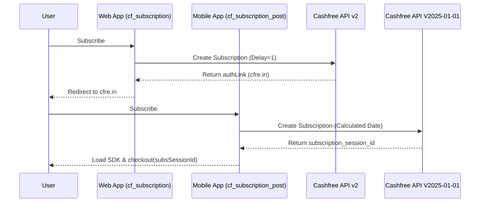
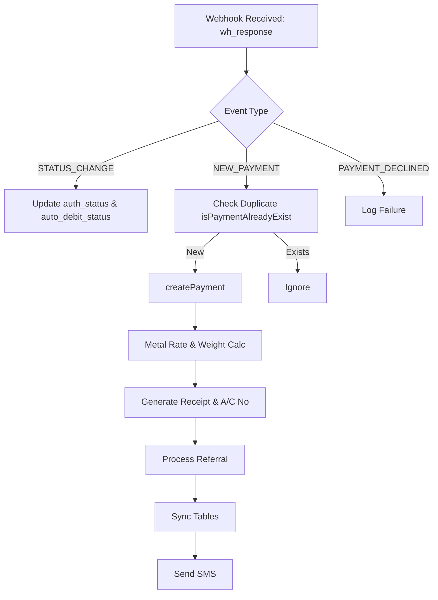
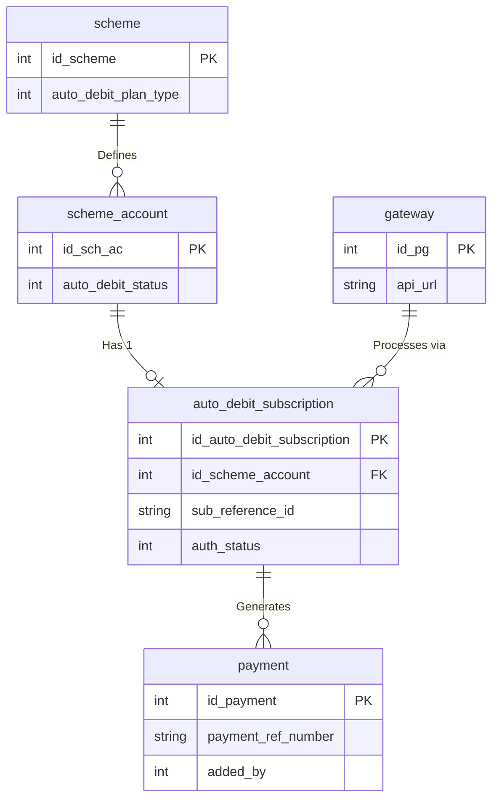

# Complete AutoDebit Flow Document

## 1. Introduction & Architecture Overview
The Cashfree AutoDebit feature spans across 3 frontend controllers, 2 frontend models, 3 admin controllers, 7 database tables, and utilizes 2 coexisting Cashfree API versions. This document maps all end-to-end touchpoints covering subscription creation, authorization, webhook handling, payment processing, retry mechanisms, and admin reporting.

### Dual API Versioning Context
The application integrates with Cashfree using two distinct APIs:
| Feature / Behavior | Web App (V2 Legacy) | Mobile App (V2025-01-01) |
|---|---|---|
| **API Endpoint** | `{api_url}api/v2/subscriptions/` | `{base_domain}/pg/subscriptions` |
| **Auth Flow** | Redirect to `authLink` | Hosted page loading CF JS SDK v3 |
| **Return URL** | `cf_autodebit/autoDebitRURL/W/{id_sch_ac}` | `cf_autodebit/autoDebitRURL/M/{id_sch_ac}` |
| **`first_charge_date`** | Uses `first_charge_delay = 1` | Explicitly calculates & sends 1st of next month for PERIODIC plans |

---

## 2. Database Schema & Status Mappings

### Database Schema
- `auto_debit_subscription`: Core subscription record.
  - Columns: `id_auto_debit_subscription`, `id_scheme_account`, `subscription_id`, `sub_reference_id`, `plan_id`, `first_charge_delay`, `expires_on`, `auth_status`, `auth_link`, `message`, `status`, `created_on`, `added_by`, `last_update`.
- `scheme_account`: Extended with autodebit status mirror.
  - Columns: `auto_debit_status`, `date_upd` (+ standard columns).
- `scheme`: Scheme-level plan type configuration.
  - Columns: `auto_debit_plan_type` (0=NA, 1=Periodic, 2=OnDemand).
- `chit_settings`: Global toggles and app payment policy.
  - Columns: `auto_debit` (0/1), `auto_debit_allow_app_pay` (0=Block, 1=Allow, 2=Conditional).
- `gateway`: Cashfree gateway credentials per branch.
  - Columns: `param_1` (secret), `param_3` (app ID), `api_url`, `id_pg`, `pg_code=4`, `is_default`, `id_branch`.
- `payment`: Payment records originating from subscriptions.
  - Columns: `added_by=4` (Cashfree Sub), `payment_ref_number`, `id_payGateway`, standard payment columns.

### Status Mappings
**`auth_status`** (in `auto_debit_subscription`) / **`auto_debit_status`** (in `scheme_account`):
- `0`: NOT_SUBSCRIBED (No subscription exists)
- `1`: INITIALIZED (Created, awaiting authorization)
- `2`: BANK_APPROVAL_PENDING (Customer authorized, bank processing)
- `3`: ACTIVE (Mandate active, charges deducted)
- `4`: ON_HOLD (Subscription paused)
- `5`: CANCELLED (Cancelled)
- `6`: COMPLETED (All cycles done)

**`payment_status`** (for autodebit payments):
- `1`: Success, `2`: Awaiting, `3`: Failure, `4`: Cancel, `7`: Pending

**`payment.added_by`**:
- `4`: Cashfree Subscription (Used to identify autodebit payments)

**`auto_pay_approval` config**:
- `1`: Auto-approve, `2`: Auto-approve+sync, `Other`: Manual approval (awaiting)

---

## 3. Subscription Creation Flows

### Web App Flow (`chitscheme.php::cf_subscription()`)
1. Fetches scheme account, customer, and subscription data (`scheme_modal::get_plan_detail()`).
2. Creates DB record in `auto_debit_subscription` via `scheme_modal::insertData()`.
3. Calls Cashfree API (v2) using `cf_curl()`.
4. Stores the returned `authLink` in the DB.
5. Updates status to INITIALIZED.
6. Redirects user to the Cashfree authorization page.

### Mobile App Flow (`mobile_api.php::cf_subscription_post()`)
1. Fetches necessary data.
2. Calls the new v2025-01-01 API via `_cf_api_call()` using JSON payloads and new headers.
3. Retrieves `subscription_session_id`.
4. Stores `subscription_session_id` in `auth_link`.
5. Returns data to the mobile client for redirection to a server-hosted authorization page.

**Important Note:** 
There are discrepancies in Date Calculations between Web and Mobile:
- **Web App**: Uses `first_charge_delay = 1` and relies on Cashfree to determine the first charge date.
- **Mobile App**: Explicitly calculates `first_charge_date` (e.g., 1st of next month) and passes it for PERIODIC plans.

---

## 4. Authorization Flow

### V2 Legacy Auth (Web)
- After subscription creation, the API returns an `authLink` (a `cfre.in` URL).
- Customer is redirected to this hosted page to approve the mandate.

### V3 SDK Auth (Mobile)
- The mobile API returns a `subscription_session_id`.
- The user hits a server-hosted authorize page (`cf_autodebit/authorize/`).
- This page loads the Cashfree JS SDK v3 and triggers `cashfree.subscriptionsCheckout({subsSessionId})`.

### Return URL Handling (`autoDebitRURL`)
- Location: `application/controllers/cf_autodebit.php:70`
- Web app expects a redirect to: `cf_autodebit/autoDebitRURL/W/{id_sch_ac}`
- Mobile app expects a redirect to: `cf_autodebit/autoDebitRURL/M/{id_sch_ac}`
- Evaluates the payload, validates signature/status, and initiates status transitions (e.g., INITIALIZED → BANK_APPROVAL_PENDING → ACTIVE).

---

## 5. Webhook Handling (The Core Engine)
Location: `cf_autodebit.php::wh_response()`

1. **SUBSCRIPTION_STATUS_CHANGE**
   - Triggered when mandate status changes.
   - Updates `auth_status` in `auto_debit_subscription` and `auto_debit_status` in `scheme_account`.

2. **SUBSCRIPTION_NEW_PAYMENT**
   - Triggered upon successful charge.
   - Prevents duplicates using `scheme_modal::isPaymentAlreadyExist()` with `payment_ref_number`.
   - Invokes `createPayment()` flow:
     - Calculates metal rate and weight for weight-based schemes.
     - Generates a due month/year based on logic.
     - Generates receipt number (`generate_receipt_no()`).
     - Generates account number (and handles lucky draw assignment).
     - Processes referral benefits (`insert_referral_data()`).
     - Syncs intermediate tables (`insert_common_data_jil()` or `insert_common_data_old()`).
     - Triggers SMS notification via `services_modal`.

3. **SUBSCRIPTION_PAYMENT_DECLINED**
   - Records the failed payment in the database.
   - Preserves status for reporting and potential retry.

---

## 6. Retry Mechanism & Payment Approvals

### Manual/Auto Charge Retries (`cf_retry()`)
- Triggered by admin action or automated cron (if configured).
- Fetches subscription and gateway data (`scheme_modal::get_subscriptionData()`).
- Calls the Cashfree `{sub_reference_id}/charge-retry` API (V2 Endpoint).
- If successful, it triggers the payment creation response immediately.

### Payment Approvals
- Based on `auto_pay_approval` config.
- `1` (Auto-approve): Payments are fully approved automatically.
- `2` (Auto-approve+sync): Approved and synced immediately.
- Other: Kept in "Awaiting" status for manual approval in the Admin Panel.

---

## 7. Admin Features & Reporting

- **Scheme Settings**: Administrators can set the `auto_debit_plan_type` (Periodic, OnDemand, or NA) in Scheme Master (`admin_scheme.php`).
- **Global Settings**: Toggles `auto_debit` and configures `auto_debit_allow_app_pay` in General Settings (`admin_settings.php`).
- **Reports**: DataTable in `autodebit_subscription_report.php` shows Branch, Customer, Mobile, A/C Name, A/C No., Status, Last Updated. Handled by `admin_reports.php::get_autodebit_subscription()`.

---

## 8. Diagrams

### System Sequence Diagram (Web vs Mobile)

### Webhook Process Flow Diagram

### Entity Relationship Diagram (ERD)

---

## 9. Known Issues to Flag

1. **CRITICAL: Return URL Parameter Mismatch (`autoDebitRURL`)**
   - *Location:* `application/controllers/cf_autodebit.php:70`
   - *Issue:* The method signature `autoDebitRURL($id_sch_ac)` receives `'W'` or `'M'` instead of the account ID because of CI3 routing, causing the DB update to fail.

2. **CRITICAL: Mobile API Plan Type Inversion**
   - *Location:* `application/controllers/mobile_api.php:7956`
   - *Issue:* Ternary logic assigns `ON_DEMAND` when `auto_debit_plan_type == 1` (which actually means `PERIODIC`), completely flipping the subscription setup on mobile.

3. **CRITICAL: Mobile API V3 webhook linkage is broken (`sub_reference_id` typo)**
   - *Location:* `application/controllers/mobile_api.php:8047`
   - *Issue:* Saves `sub_reference_id` as `null` because it checks `cf_subscription_id` previously but accesses `subscription_id` here. Without `sub_reference_id`, webhooks fail to match the record.

4. **CRITICAL: `cf_retry()` passes V3 subscriptions to V2 API endpoints**
   - *Location:* `application/controllers/cf_autodebit.php:385`
   - *Issue:* Uses hardcoded V2 API endpoint. V3 subscriptions from Mobile fail on retry because the V2 API doesn't recognize them.

5. **CRITICAL: Division by Zero in `wh_response()` for metal calculations**
   - *Location:* `application/controllers/cf_autodebit.php:236`
   - *Issue:* Performs `$weight = $_POST['cf_amount']/$metal_rate;` without checking if `$metal_rate` is 0 or null, which can crash the script.

6. **WARNING: `autoDebitRURL()` expects POST but V3 SDK may redirect via GET**
   - *Location:* `application/controllers/cf_autodebit.php:77`
   - *Issue:* The return URL strictly checks `!empty($_POST)`. Cashfree V3 SDK may redirect via GET, causing the return URL handler to fail.

7. **MISSING FILE: `autodebit_model.php`**
   - *Location:* Referenced by `admin/application/controllers/admin_reports.php:1126`
   - *Issue:* `ajax_get_autodebit_subscription()` will crash due to the missing model.

8. **MISSING FILE: `Autodebit.php` Controller**
   - *Location:* Referenced by `admin/application/config/routes.php:1648-1654`
   - *Issue:* Subscription CRUD routes point to a non-existent controller.
