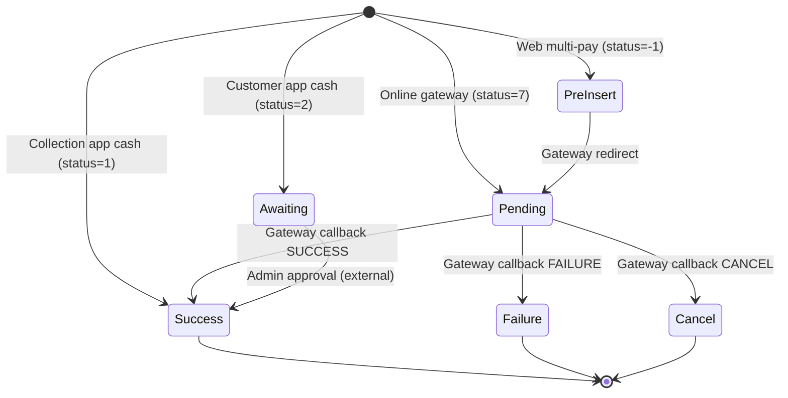

# chit_collection_app — Flow Risk Matrix

> **Module**: chit_collection_app
> **Built**: 2026-03-25 (Upgrade Round)
> **Purpose**: Handoff contracts, state machines, reversal checks, and QA-ready flow risk scenarios.
> **How to use**: Compare outbound contracts against downstream modules' inbound contracts. Mismatches = bugs waiting to happen.

---

## 1. State Machine: payment.payment_status

> The `payment` table is the primary entity written by this module. `payment_status` governs the lifecycle.

| State | Value | Set By (Module.Method) | Can Transition To | Guard / Precondition |
|---|---|---|---|---|
| Pending | 7 | `mobile_payment_post()` L1579 (online gateway) | Success(1), Failure(3), Cancel(4), Awaiting(2) | Gateway ≠ 0 |
| Awaiting | 2 | `mobile_payment_post()` L1579 (customer app cash) | Success(1) via admin approval | added_by=2, gateway=0 |
| Success | 1 | Collection app cash: `mobile_payment_post()` L1579; Gateway callbacks: `payment_success()` L1731, `successMURL()` L2863, `adminAppSuccess()` L1768/L2595, `techProcessResponseURL()` L1183, `atomReturnURL()` L953, etc. | — (terminal for this module) | ⚠️ NO GUARD for cash (EMP can mark success instantly) |
| Failure | 3 | `payment_failure()` L1663, `failureMURL()` L3114 | — (terminal) | Gateway callback status |
| Cancel | 4 | `payment_cancel()` L1949, `cancelMURL()` L3189 | — (terminal) | Gateway callback status |
| Pre-Insert | -1 | `paySubmit()` L502 (web multi-pay) | Pending(7), Success(1) | Used only in web paySubmit flow |

### State Diagram

---

## 2. Inbound Contracts (What This Module Expects from Upstream)

| Upstream Module | Data/State Expected | Precondition Check in Code? | Line | Risk if Violated |
|---|---|---|---|---|
| **mobileapi_model** | `get_payment_details()` returns valid `allow_pay`, `payable`, `due_type` | YES (checks allow_pay before payment insert) | `mobile_payment_post()` L1504 | Payment for ineligible accounts |
| **scheme_modal** | `scheme.active = 1` (scheme is active) | PARTIAL — checked in `getScheme_get()` L941 but NOT re-checked at payment time | L941 | Payment into closed/inactive scheme |
| **scheme_modal** | Referral code is valid (`checkreferral_code()` returns status=true) | YES | `createAccount_post()` L525 | Transaction rolled back |
| **payment_modal** | `metal_rates` file exists and has valid rates | NO check — `file_get_contents('api/rate.txt')` with no error handling | `get_metalrate()` L444 (BUG-028) | NULL rates → wrong metal weight, wrong payable display |
| **payment_modal** | `addPayment()` returns insertID on success | YES (checked via trans_status) | Multiple locations | Payment not recorded |
| **employee_devices** | Device UUID registered and approved (`device_status=1`) | YES | `isValidLogin()` L67-96 | Access denied correctly |
| **customer** | Customer `active=1` | PARTIAL — checked at login for employee, but customer active status not re-checked at payment time | — | Payment for inactive customer possible |
| **chit_settings** | Valid `schemeacc_no_set`, `receipt_no_set` configuration | NO explicit validation | — | Account/receipt number generation fails silently |

---

## 3. Outbound Contracts (What This Module Guarantees to Downstream)

| Downstream Module | What This Module Guarantees | Enforced How? | Risk if Broken |
|---|---|---|---|
| **payment_modal (addPayment)** | Complete payment record with all required fields | Manual field assignment (no schema validation) | ⚠️ CONTRACT GAP — Missing fields cause silent NULL inserts |
| **Reports module** | `payment.payment_status=1` means confirmed payment | Cash payments auto-set to 1 without admin approval | Reports include unapproved cash payments |
| **Account module** | `scheme_account.scheme_acc_number` is set after first payment | Only when `schemeacc_no_set=0 or 3` | ⚠️ CONTRACT GAP — Account number may never be set for certain configs |
| **Wallet module** | Wallet debit matches payment amount | `insertWalletTrans()` L3406 computes debit | ⚠️ BUG-007 — `$trans_id` undefined, wallet txnid is NULL |
| **SMS module** | Correct serviceID for payment success SMS | Hardcoded serviceID per flow | ⚠️ BUG-002 — serviceID=7 (failure) used in `adminAppSuccess()` of paymt.php |
| **Integration (Khimji)** | Correct customer reference_no passed to sync | `getDataFromOffline()` should use `$cus_reference_no` | ⚠️ BUG-003 — Parameter self-swap, always wrong ref no |
| **Referral system** | Referral credit on correct installment | `insert_referral_data()` checks `ref_benifitadd_ins` | ⚠️ BUG-014 — Referral block commented out for Easebuzz |

---

## 4. Reversal Contracts (Cancel/Delete/Reverse)

> **Critical Note**: This module has **NO explicit cancel/reverse operation**. Payment cancellation is only done via gateway callbacks (status → 3 or 4). There is NO admin cancel flow within this module.

| Operation | Tables That Must Be Restored | Actually Restored in Code? | Method & Line | Gap? |
|---|---|---|---|---|
| Gateway cancel callback | `payment.payment_status → 4` | ✅ YES | `payment_cancel()` L1949, `cancelMURL()` L3189 | — |
| Gateway cancel callback | `scheme_account.paid_installments` (no decrement needed — payment was pending) | ✅ N/A (installments not incremented until success) | — | — |
| Gateway cancel callback | Wallet points (if wallet was used) | ❌ NO — wallet debit happens at payment insert time, never reversed on cancel | — | ⚠️ **Wallet points lost on cancelled online payment with wallet combo** |
| Gateway failure callback | `payment.payment_status → 3` | ✅ YES | `payment_failure()` L1663, `failureMURL()` L3114 | — |
| Gateway failure callback | Wallet points reversal | ❌ NO | — | ⚠️ Same as cancel |
| Cash payment reversal | `payment.payment_status → ???` | ❌ NO mechanism exists | — | ⚠️ **No way to reverse a cash collection payment within this module** |
| Scheme account reversal | `scheme_account` delete/deactivate | ❌ NO mechanism exists | — | ⚠️ Account created cannot be undone from collection app |

### Reversal Completeness

| Metric | Count |
|---|---|
| Tables written during CREATE (payment) | 4 (payment, scheme_account, wallet_transaction, employee_devices) |
| Tables restored during CANCEL | 1 (payment.payment_status only) |
| Gaps (written but not restored) | 3 (wallet_transaction, scheme_account updates, incentive records) |
| Completeness | **25%** |

---

## 5. Flow Risk Checklist (QA-Ready Test Scenarios)

| ID | Test Scenario | Expected Result | Priority | Verified? |
|---|---|---|---|---|
| FR-COL-001 | Cash payment by EMP for a closed scheme account | REJECT with error | 🔴 HIGH | ❌ |
| FR-COL-002 | Cash payment when `metal_rates` file missing (BUG-028) | Graceful error, no NULL amounts | 🔴 HIGH | ❌ |
| FR-COL-003 | Online payment → cancel → wallet points not returned | Wallet points should be reversed | 🔴 HIGH | ❌ |
| FR-COL-004 | Concurrent cash payment by 2 employees for same account+month | One should succeed, one should REJECT (duplicate) | 🔴 HIGH | ❌ |
| FR-COL-005 | Cashfree callback with forged payload (BUG-013 — no sig verify) | REJECT invalid signature | 🔴 HIGH | ❌ |
| FR-COL-006 | Ippo callback with attacker-supplied credentials (BUG-031) | REJECT — use server-side credentials | 🔴 HIGH | ❌ |
| FR-COL-007 | RazorPay callback (BUG-032 — debug stub) | Process payment correctly | 🔴 HIGH | ❌ |
| FR-COL-008 | GST calculation with $sch_data bug (BUG-001) | Correct GST amount | 🔴 HIGH | ❌ |
| FR-COL-009 | Khimji sync with param swap (BUG-003) | Correct reference_no used | 🔴 HIGH | ❌ |
| FR-COL-010 | paymt.php adminAppSuccess SMS uses serviceID=7 (BUG-002) | SUCCESS SMS template, not failure | 🔴 HIGH | ❌ |
| FR-COL-011 | Split payment crashes midway (no trans_begin — BUG-043) | No orphan payment records | 🔴 HIGH | ❌ |
| FR-COL-012 | Employee device not approved → login attempt | REJECT with clear message | 🟡 MED | ❌ |
| FR-COL-013 | Wallet redemption > available balance | Capped at available balance | 🟡 MED | ❌ |
| FR-COL-014 | Easebuzz referral credit (BUG-014 — commented out) | Referral should be credited | 🟡 MED | ❌ |
| FR-COL-015 | Customer ledger with date filter (BUG-015 — unused params) | Results filtered by date | 🟡 MED | ❌ |
| FR-COL-016 | Offline sync with $data shadow variable (BUG-008) | Correct agent ID assignment | 🟡 MED | ❌ |
| FR-COL-017 | Offline sync to hardcoded URL (BUG-009) | Use config-based URL | 🟡 MED | ❌ |
| FR-COL-018 | SQL injection via login (BUG-010) | Parameterized query | 🟡 MED | ❌ |
| FR-COL-019 | Monthly agent report N+1 query (BUG-036) performance | Response within 5s for 200 customers | 🟢 LOW | ❌ |
| FR-COL-020 | Dev email in sch_enquiry CC (BUG-023) | No dev email in production | 🟢 LOW | ❌ |

### Summary

| Priority | Total | Verified | Unverified |
|---|---|---|---|
| 🔴 HIGH | 11 | 0 | 11 |
| 🟡 MED | 7 | 0 | 7 |
| 🟢 LOW | 2 | 0 | 2 |
| **Total** | **20** | **0** | **20** |
