# CROSS MODULE MAP — chit_customer_app
> Round 1 — 2026-03-16

---

## Dependency Graph (Mermaid)

```mermaid
graph TD
    APP[chit_customer_app\nmobile_api.php]

    APP -->|loads model| MOB[mobileapi_model]
    APP -->|loads model| PAY_MOD[payment_modal]
    APP -->|loads model| SCH_MOD[scheme_modal]
    APP -->|loads model| REG_MOD[registration_model]
    APP -->|loads model| SERV_MOD[services_modal]
    APP -->|loads model| LOGIN_MOD[login_model]
    APP -->|loads model| SMS_MOD[sms_model]
    APP -->|loads model| EMAIL_MOD[email_model]
    APP -->|loads model| DIGI_MOD[digigold_modal]
    APP -->|loads library| REST[REST_Controller]
    APP -->|loads library| PAYU[payu.php]

    MOB -->|loads model| SERV_MOD
    MOB -->|loads model| COMMON_MOD[commonapi_model]
    MOB -->|reads| api_rate[api/rate.txt]

    APP -->|reads metal rates| api_rate

    APP -->|External HTTP| CF_API[Cashfree API]
    APP -->|External HTTP| EB_API[Easebuzz API]
    APP -->|External HTTP| RZ_API[Razorpay API]
    APP -->|External HTTP| PAYU_API[PayU API]
    APP -->|External HTTP| MSG91[MSG91 SMS]
    APP -->|External HTTP| NETTY[Nettyfish SMS]
    APP -->|External HTTP| SPEAR[SpearUC SMS]
    APP -->|External HTTP| ASTERIXT[Asterixt SMS]
    APP -->|External HTTP| QIKBERRY[Qikberry SMS]
    APP -->|External HTTP| ZOOPWEB[Zoopweb DigiLocker]
```

---

## Internal Model Dependencies

| Model | Loaded By | Purpose | Critical Methods |
|---|---|---|---|
| `mobileapi_model` | Controller constructor | Primary data model — customer, scheme, wallet | `get_currency`, `company_details`, `get_schemeaccount_detail`, `insert_customer`, `paymentDB` |
| `payment_modal` | Controller constructor | Payment processing, receipt generation | `paymentDB`, `get_receipt_no`, `wallet_transactionDB`, `get_due_date`, `getPayIds` |
| `scheme_modal` | Controller constructor | Scheme join logic, referral, validation | `checkreferral_code`, `verify_existing`, `allowMultipleChits`, `join_existing`, `delete_scheme_account` |
| `registration_model` | Controller constructor | Wallet account creation on registration | `wallet_accno_generator` |
| `services_modal` | Controller constructor + mobileapi_model | SMS config, service config, customer limits | `checkService`, `get_SMS_data`, `get_SMS_OTPdata`, `sms_info`, `limitDB`, `customer_count` |
| `login_model` | Controller constructor | Login support | (used indirectly) |
| `sms_model` | Controller constructor | SMS dispatch | `sendSMS_MSG91`, `sendSMS_Nettyfish`, `sendSMS_SpearUC`, `sendSMS_Asterixt`, `sendSMS_Qikberry`, `send_whatsApp_message` |
| `email_model` | Controller constructor | Email dispatch | `send_email` |
| `digigold_modal` | Controller constructor | Digital gold scheme | DigiGold specific methods |
| `syncapi_model` | Via `sync_existing_data` | Third-party system sync (if integrationType=2) | `syncCustomer`, `syncPayments` |
| `commonapi_model` | Via mobileapi_model | Common API utilities | Lower-level utilities |

---

## External System Dependencies

| System | Protocol | Trigger | Direction | Risk |
|---|---|---|---|---|
| **Cashfree** Payment Gateway | HTTPS REST | `mobile_payment_post` → `generateCashfreeSession` | Outbound + Inbound webhook | 🔴 HIGH — Payment fails if Cashfree is down or key expires |
| **Easebuzz** Payment Gateway | HTTPS REST | `mobile_payment_post` → `generateOrderData` | Outbound + Inbound webhook | 🔴 HIGH |
| **Razorpay** Payment Gateway | HTTPS REST | `mobile_payment_post` → `generateRazorOrderData` | Outbound + Inbound webhook | 🔴 HIGH |
| **PayU** Payment Gateway | HTTPS (legacy) | `_payment()` helper | Outbound | 🟡 MED — Hardcoded key in constants |
| **MSG91** SMS | HTTPS | `sms_model->sendSMS_MSG91` | Outbound | 🟡 MED — OTP delivery critical |
| **Nettyfish** SMS | HTTPS | `sms_model->sendSMS_Nettyfish` | Outbound | 🟡 MED |
| **SpearUC** SMS | HTTPS | `sms_model->sendSMS_SpearUC` | Outbound | 🟡 MED |
| **Asterixt** SMS | HTTPS | `sms_model->sendSMS_Asterixt` | Outbound | 🟡 MED |
| **Qikberry** SMS | HTTPS | `sms_model->sendSMS_Qikberry` | Outbound | 🟡 MED |
| **Zoopweb** DigiLocker | HTTPS | `zoopapiCurl`, `insertkyc_post` | Outbound | 🟡 MED — KYC via DigiLocker |
| **WhatsApp Business** | HTTPS | `sms_model->send_whatsApp_message` | Outbound | 🟡 LOW — Supplementary |
| **Firebase/Push** | Via token | `device_data.token` stored | Referenced by push notification service | 🟡 LOW |

---

## Tables Shared With Admin Modules

| Table | Owned By | App Reads | App Writes | Risk |
|---|---|---|---|---|
| `customer` | Admin customer module | ✅ All profile data | ✅ Registration, profile update, password, KYC status | 🔴 HIGH — Both admin and app write. Race condition possible |
| `scheme_account` | Admin account module | ✅ Account list, details | ✅ `createAccount_post` inserts new accounts | 🔴 HIGH — Schema changes break app account creation |
| `payment` | Admin payment module | ✅ Payment history | ✅ Create pending on payment init, gateway updates status | 🔴 CRITICAL — Payment flow dual-writes with admin |
| `scheme` | Admin chit_settings | ✅ All scheme data | ❌ Never | 🟡 MED — Scheme changes affect app display |
| `chit_settings` | Admin chit_settings | ✅ Extensive config reads | ❌ Never | 🟡 MED — Config key renames break app |
| `wallet_account` | Admin wallet module | ✅ Balance, transactions | ✅ Created on registration | 🟡 MED |
| `wallet_transaction` | Admin wallet module | ✅ Transaction history | ✅ Wallet debit on payment | 🟡 MED — Parallel writes from admin and mobile |
| `metal_rates` | Rate/Admin | ✅ Rates for calculations | ❌ | 🟡 LOW |
| `device_data` | Mobile-only | — | ✅ Token storage | 🟡 LOW |
| `kyc` | Admin KYC module | ✅ KYC status | ✅ `insertkyc_post` | 🟡 MED |
| `inter_wallet` | Admin wallet | — | ✅ Inter-wallet payments | 🟡 MED |

---

## file-System Dependencies

| Path | Purpose | Risk |
|---|---|---|
| `api/rate.txt` | Live metal rates (JSON) — read by `getMetalrate_get`, `getWeights_get` | 🔴 HIGH — If file missing or malformed, scheme rate display breaks |
| `admin/assets/img/customer/{id_customer}/customer.jpg` | Customer profile image | 🟡 MED — Path exposed to mobile via URL |
| `assets/aadhar_file/{id_customer}/` | Aadhaar image uploads | 🔴 HIGH — World-writable (0777), no type validation |
| `admin/assets/kyc/pan/` | PAN card images | 🟡 MED |
| `admin/assets/kyc/aadhar/` | Aadhaar KYC images | 🟡 MED |
| `log/{date}/cashfree/` | Payment gateway request/response logs | 🟡 MED — Growing, no rotation, 0777 |

---

## Hardcoded Cross-System Assumptions

| Assumption | Location | Risk |
|---|---|---|
| `added_by = 2` in payment/account = Customer Mobile App | `createAccount_post` L1132, `createCustomer_post` L939 | Adding a new channel (e.g., agent app with different code) requires model updates |
| `added_by = 3` = Admin Mobile App (employee login) | `createAccount_post` L1097 | Employee mobile uses same controller with different `id_employee` |
| `sms_gateway config: 1=MSG91, 2=Nettyfish, 3=SpearUC, 4=Asterixt, 5=Qikberry` | Throughout `generateOTP_get` | New SMS gateway must be added to ALL if-elseif chains |
| `integrationType=2` → sync to third party | `authenticate_post` L769, `createCustomer_post` L965 | Third-party migration flag — if left ON after migration complete, every login/register triggers sync |
| `is_pin_required` in `chit_settings` controls app-wide MPIN enforcement | `get_currency` response | Changing this flag instantly affects all customers |
| `wallet_account_type=1` = auto-create wallet on registration | `createCustomer_post` L969 | Different type = no wallet created |
| `payment_status: 1=success, 2=await, 3=fail, 4=cancel, 7=pending` | Constructor L59-65 | Must stay in sync with admin panel status codes |
