# CROSS MODULE MAP — chit_dashboard
> Round R2-Upgrade — 2026-03-25 (no code changes — structural upgrade only)

---

## Dependency Graph (Mermaid)

```mermaid
graph TD
    DAS[chit_dashboard]

    DAS -->|loads model| DAS_MODEL[dashboard_model]
    DAS -->|loads model| SERV_MODEL[services_model]
    DAS -->|loads model| EMP_MODEL[employee_model]
    DAS -->|loads model| ACC_MODEL[Account_model]
    DAS -->|auto-loaded| SETTINGS[admin_settings_model]

    DAS -->|AJAX cross-call| CUS_CTRL[admin_customer\nget_customer_by_mobile]
    DAS -->|AJAX cross-call| RATE_CTRL[rate/ajax/weekstat]
    DAS -->|AJAX cross-call| BRANCH_CTRL[branch/branchname_list]
    DAS -->|AJAX cross-call| RETAIL_CTRL[admin_ret_dashboard\nget_customer_order_details]
    DAS -->|AJAX cross-call| REPORTS_CTRL[admin_reports\npayment_summary_modewise]

    DAS_MODEL -->|reads| payment[(payment)]
    DAS_MODEL -->|reads| scheme_account[(scheme_account)]
    DAS_MODEL -->|reads| customer[(customer)]
    DAS_MODEL -->|reads| scheme[(scheme)]
    DAS_MODEL -->|reads| branch[(branch)]
    DAS_MODEL -->|reads| chit_settings[(chit_settings)]
    DAS_MODEL -->|reads| inter_wallet[(inter_wallet)]
    DAS_MODEL -->|reads| scheme_reg_request[(scheme_reg_request)]
    DAS_MODEL -->|reads| cust_enquiry[(cust_enquiry)]
    DAS_MODEL -->|reads| metal_rates[(metal_rates)]
    DAS_MODEL -->|reads| employee[(employee)]
    DAS_MODEL -->|reads/writes| customer_table[(customer)]

    SERV_MODEL -->|reads| payment
    SERV_MODEL -->|writes| daily_collection[(daily_collection)]

    ACC_MODEL -->|reads| scheme_account
    ACC_MODEL -->|reads| payment
    ACC_MODEL -->|reads| customer

    EMP_MODEL -->|reads| employee

    SETTINGS -->|reads| admin_settings[(admin_settings\nuser_permission\nrole_permission)]
```

---

## External Module Dependencies

| External Module | Direction | Channel | Tables / Methods | Data Transferred | Risk |
|---|---|---|---|---|---|
| `admin_customer` | Dashboard → external | AJAX POST | `get_customer_by_mobile` | Customer record by mobile | Medium — external controller must be up-to-date |
| `rate` | Dashboard → external | AJAX GET | `ajax/weekstat` | Gold rate weekly data for chart | Low — rate chart breaks silently if rate module missing |
| `branch` | Dashboard → external | AJAX GET | `branchname_list` | List of branch names for filter dropdown | High — branch dropdown breaks if unavailable |
| `admin_ret_dashboard` | Dashboard → external | AJAX GET | `get_customer_order_details` | Retail customer orders | Low — retail widget hidden if not applicable client |
| `admin_reports` | Dashboard → external | AJAX GET | `payment_summary_modewise` | Payment mode-wise summary | Medium — summary widget breaks if reports module changes endpoint |
| `services_model` | Dashboard → internal model | CI load | `daily_collection`, `getTodaySummaryBranchWise`, `allBranches` | Daily closing balances, branch-wise live summary | High — `ajax_daily_collection` entirely depends on services_model |
| `Account_model` | Dashboard → internal model | CI load | `get_all_closed_accdetails`, `get_all_closed_acccount` | Closed account details per customer | High — `cust_wo_accounts_details()` N+1 loop on this model |
| `employee_model` | Dashboard → internal model | CI load | (employee queries) | Employee list for customer status | Low — used only in `customer_status()` |
| `admin_settings_model` | Auto-loaded | CI autoload | `get_access`, `get_dashboard_access` | Access permissions, widget visibility | Critical — if removed from autoload, `index()` crashes |

---

## Tables Shared With Other Modules (Impact Analysis)

| Table | Owner Module | Dashboard Uses | Risk if Changed |
|---|---|---|---|
| `payment` | payment module | Read: all stats, PDC, collection | 🔴 HIGH — column renames break 20+ dashboard queries |
| `scheme_account` | account module | Read: account stats, dues, renewals | 🔴 HIGH — central hub table |
| `customer` | customer/account | Read + Write: `customer_edit()` | 🟡 MED — dashboard writes without account module validation |
| `scheme` | chit_settings | Read: scheme names, types, amounts | 🟡 MED — scheme_type codes must match |
| `chit_settings` | chit_settings | Read: `has_lucky_draw`, `currency_symbol` | 🟡 MED — new columns needed by dashboard require model update |
| `branch` | branch module | Read: filterin, all SQL WHEREs | 🟡 MED — `show_to_all` flag critical for branch visibility |
| `inter_wallet` | payment/wallet module | Read: wallet stats | 🟡 LOW — wallet widget is secondary |
| `scheme_reg_request` | account module | Read: existing request count | 🟡 LOW — count only |
| `cust_enquiry` | CRM/lead module | Read: feedback count | 🟡 LOW — count only |
| `metal_rates` | settings module | Read: goldrate_22ct in amount calculations | 🟡 LOW — used in scheme amount display only |
| `employee` | HR/employee module | Read: employee-wise customer stats | 🟡 LOW — used in one method only |
| `daily_collection` | services module | Write: `dayClose()` | 🟡 MED — write path, schema changes break day-close |

---

## Internal Method Cross-References

| Dashboard Method | Calls Into | Why |
|---|---|---|
| `index()` | `admin_settings_model::get_access()` | Access gate |
| `index()` | `admin_settings_model::get_dashboard_access()` | Widget visibility |
| `ajax_daily_collection()` | `services_model::daily_collection()` | Yesterday's closing balance |
| `ajax_daily_collection()` | `services_model::getTodaySummaryBranchWise()` | Live today calculation |
| `ajax_daily_collection()` | `services_model::allBranches()` | Branch loop |
| `cust_wo_accounts_details()` | `Account_model::get_all_closed_accdetails()` | Per-customer closed accounts (N+1) |
| `cust_wo_accounts_details()` | `Account_model::get_all_closed_acccount()` | Per-customer closed account count (N+1) |
| `customer_status()` | `employee_model` (indirect) | Employee-based breakdown |
| `send_customer_wishes()` | SMS model (via services?) | Send birthday/anniversary SMS |

---

## Hardcoded Cross-Module Assumptions

| Assumption | Location | Risk |
|---|---|---|
| `added_by = 0` → Admin, `1` → Web, `2` → Mobile, `3` → Collection | Payment/account join methods | If another module adds a new `added_by` value (e.g., 4), the dashboard's "source breakdown" will silently miss it |
| `payment_status = 1` → Confirmed, `2` → Awaiting, `4` → Cancelled | All payment stat queries | See `TAG_STATUS_MAP.md` in SYSTEM brain — must remain in sync |
| `scheme_type = 0` → Amount, `1` → Weight, `2` → Amount-to-Weight, `3` → Flexible | Scheme type labels in `acc_wo_pay_details`, `due_list` etc | If chit_settings adds a new scheme_type, labels break |
| `uid = 1` → Super Admin (sees all branches) | Branch filter pattern repeated 50+ times | Any user whose ID is 1 gets full access — ID must remain reserved |
