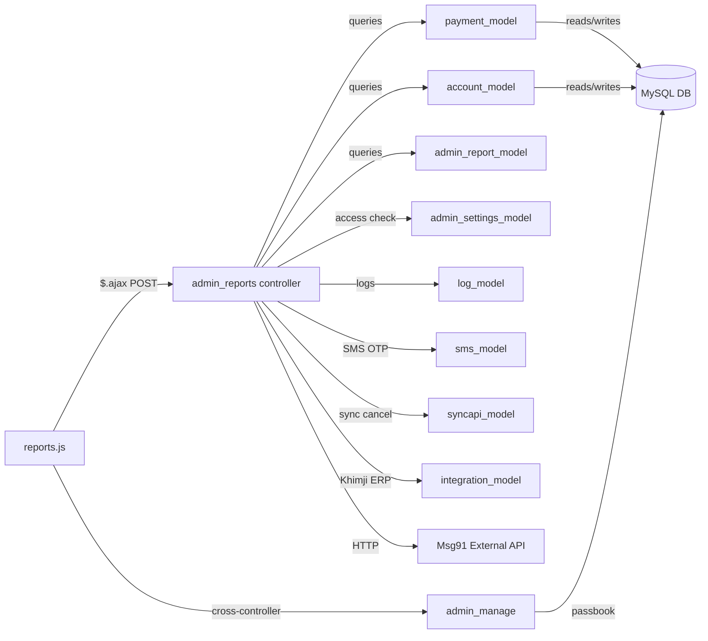

# CROSS-MODULE MAP — chit_reports
> Round R6-Upgrade — 2026-03-25

---

## Dependency Table

| External Module/Controller | Direction | Tables/Methods/Endpoints | What Data | Risk |
|---|---|---|---|---|
| `admin_manage` (controller) | JS calls outward | `passbook_reprint`, `passbook_print`, `set_remarks_byid`, `blk_payment_byid`, `loadGiftData`, `getRemarkPayments` | Passbook, bulk payment, gift load, remarks | If admin_manage routes change, reports break |
| `admin_employee` | JS calls outward | `get_employee` | Employee dropdown population | — |
| `admin_customer` | JS calls outward | `ajax_get_customers_list` | Autocomplete customer mobile search | — |
| `admin_payment` | JS calls outward | `getMetalRateBydate` | Metal rate lookup for edit form | — |
| `admin_dashboard` | JS calls outward | `inter_wallet_accounts__woc_det` | Wallet account data for inter-wallet view | — |
| `branch` (controller) | JS calls outward | `branchname_list` | Branch dropdown population | — |
| `get` (controller) | JS calls outward | `schemename_list`, `schemeclassify_list`, `giftname_list` | Dropdown population | — |
| `payment` (old route) | JS calls outward | `payment/verify` | Payment verification | Legacy route |
| `postdated` (controller) | JS calls outward | `postdated/payment/update` | Post-dated payment update | — |
| `reports` (old route) | JS calls outward | 8+ endpoints (old route system) | Same as admin_reports but via old URL | **Dual route risk** — both `/reports/` and `/admin_reports/` used |
| `khimji_services` | JS calls outward | `generateAcNoOrReceiptNoById` | Account/receipt number generation from Khimji ERP | External dependency |
| `payment_model` | Read (primary) | All payment queries | Collection data | Shared model — payment changes affect reports |
| `account_model` | Read/Write (scheme acc) | `get_all_scheme_account_by_range`, `scheme_summary_data` | Account info | Shared model |
| `admin_report_model` | Read (enquiry/gift/celeb) | `get_customerenquiry_by_date`, `get_gift_list`, `get_all_cus_celeb_dates` | Enquiry/gift/birthday data | **SQL injection in `get_customerenquiry_by_date`** |
| `dashboard_model` | Read | `schemewise_accounts` | Scheme-wise account summary | Dashboard dep |
| `log_model` | Read | `get_log_detail_range`, `log_detail`, `get_form_logger_log_list` | Audit logs | — |
| `admin_settings_model` | Read | `get_access(...)` | Access control | Controls visibility of report actions |
| `sms_model` | Write (outbound SMS) | `sendSMS_MSG91`, `sendSMS_Nettyfish`, `sendSMS_SpearUC` | OTP SMS | SMS gateway dependency for purchase OTP |
| `syncapi_model` | Write | `updPayStatusInTrans` | Sync cancellation to external | Only active when `integrationType=2` |
| `integration_model` | Read + Write | `khimji_curl`, `updateData` | Khimji ERP integration for trans IDs | External API dependency |
| **Msg91 API** | HTTP outbound | `control.msg91.com/api/balance.php`, `credit_history.php` | SMS balance/history | External service; SSL verification disabled |
| `chitadmin_model` (ADM_MODEL) | Loaded, rarely used | — | Admin-level data | Loaded in constructor but rarely invoked |
| `email_model` (MAIL_MODEL) | Loaded, not used | — | — | Loaded but no email calls found in reports |
| `customer_model` | Indirect (via account_model) | `format_accRcptNo` | Account number display formatting | account_model loads customer_model |

---

## Mermaid Dependency Graph

---

## Cross-Module Read Tables (chit_reports reads from other modules' tables)

| Table | Owned By | Read In |
|---|---|---|
| `employee` | HR/Employee module | `branchwise_employee`, `ajax_payment_list`, `getMemberReport` |
| `company` | Settings | `generateotp` (company name for SMS) |
| `inter_wallet_transaction` | Wallet module | `ajax_interWallet_trans` |
| `purch_customer`, `purch_payment` | Purchase module | `get_purchase_payment`, `purch_delivered` |
| `metal_rates` | Metal module | Referenced in `get_all_closed_account` SQL (gold rate for flexible scheme) |
| `ret_financial_year` | Financial module | `account_model::get_schAccount_no` (financial year boundary) |
| `agent` | Agent module | `update_kyc` (agent KYC update) |

---

## Cross-Module Write Tables (chit_reports WRITES to tables)

| Table | Primary Owner | Written By | Risk |
|---|---|---|---|
| `payment` | Payment module | `cancel_payment` (status=4), `updatePaymentDetails`, `generateTransUniqId` | ⚠️ Reports controller modifying payment records |
| `scheme_account` | Account module | `updateAccountDetails` | ⚠️ Reports controller modifying account records |
| `customer` | Customer module | `updateAccountDetails` → `updateDatacus` | Cascading customer cross-update |
| `customer_kyc` | KYC module | `update_kyc` | Expected write (approval flow) |
| `agent_kyc` | Agent module | `update_kyc` | Expected write |
| `customer_reg` | Reg module | `update_cusdatas` | Inter-table sync tool |
| `transaction` | Trans module | `update_transdatas` | Inter-table sync tool |
| `payment_status_log` | Payment module | `cancel_payment` | Audit log |
