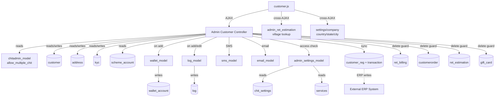

# Customer Module — Cross-Module Map

> **Brain Updated:** 2026-03-25 | **Round:** R3-Upgrade

---

## External Dependencies

| External Module | Direction | Method / Table | What Data | Risk |
|---|---|---|---|---|
| `chitadmin_model` | Read | `allow_multiple_chit()` → `chit_settings.allow_join_multiple` | Multi-scheme eligibility filter | If chit_settings missing, function fails |
| `admin_settings_model` | Read | `get_access('customer')` → permission control | View/edit/delete permissions | If settings missing, no redirect → access granted |
| `admin_settings_model` | Read | `settingsDB('get','','')` → `wallet_account_type`, `chit_settings` | Wallet creation gate | Wrong type = wrong wallet behavior |
| `admin_settings_model` | Read | `limitDB('get','1')` → `limit_cust`, `cust_max_count` | Customer creation limit | Stale limit = wrong block/allow |
| `admin_settings_model` | Read | `get_service(8)` → `services` | Wallet SMS/email service gate | Wrong service_id = wrong SMS |
| `admin_settings_model` | Read | `get_company()` → `company` | Company details for email | — |
| `wallet_model` | Read/Write | `get_wallet_acc_number()` → `wallet_account` | Next wallet number | Race condition risk |
| `wallet_model` | Write | `wallet_accountDB('insert')` → INSERT `wallet_account` | Create customer wallet | Wallet creation not in main transaction |
| `log_model` | Write | `log_detail('insert')` → `log` | Audit trail | Failure here doesn't block main operation |
| `admin_usersms_model` | Write | `get_SMS_data(8, id)` | Wallet creation SMS template | SMS failure = silent |
| `email_model` | Write | `send_email()` | Wallet creation email | Email failure = silent |
| `sms_model` | Write | `sendSMS_MSG91/Nettyfish/SpearUC/Asterixt/Qikberry` | SMS dispatch | All gateways gated by config `sms_gateway` |
| `admin_ret_estimation` (JS) | Read (AJAX) | `get_village` / `get_village_by_pincode` | Village lookup by zone/pincode | Cross-controller AJAX — breaks if estimation controller unavailable |
| `settings/company` (JS) | Read (AJAX) | `getcountry`, `getstate`, `getcity`, `getprofession`, `getlanguages` | Dropdowns | If settings controller unavailable, dropdowns empty |
| `admin_settings/ajax_village_list` (JS) | Read (AJAX) | Village filter by date | Village-zone data | External dependency |

---

## Tables Shared With Other Modules

| Table | This Module | Other Modules |
|---|---|---|
| `customer` | **Owns** — INSERT / UPDATE / DELETE | payment, scheme_account, billing, mobile_api, collection_app |
| `address` | **Owns** — CRUD | Most modules read customer address |
| `kyc` | **Owns** — INSERT / UPDATE, kyc type 1/2/3 | Potentially mobile app reads |
| `wallet_account` | **Creates** on customer add | `wallet_model` — manages balance |
| `scheme_account` | **Reads** (link check + sync) | `scheme` module **owns** this |
| `customer_reg` | **Reads + Updates** (sync) | ERP integration module writes this |
| `transaction` | **Reads + Updates** (sync) | ERP integration module writes this |
| `payment` | **Reads** (delete guard only) + sync writes | `admin_payment` **owns** this |
| `ret_billing` | **Reads** (delete guard) | Billing module **owns** this |
| `customerorder` | **Reads** (delete guard) | Order module **owns** this |
| `ret_estimation` | **Reads** (delete guard) | Estimation module **owns** this |
| `gift_card` | **Reads** (delete guard) | Gift card module **owns** this |
| `agent` | **Reads** — agent dropdown, allocation | Agent module **owns** this |
| `employee` | **Reads** — employee dropdown, allocation | Employee module **owns** this |
| `branch` | **Reads** — branch filter, display | Settings module **owns** this |
| `village` | **Reads** — village assignment | Settings module **owns** this |
| `zone` | **Owns** — CRUD via `zone()` method | — |
| `chit_settings` | **Reads** — multiple config flags | Settings module **owns** this |
| `ret_financial_year` | **Reads** — fin year code for customer | Finance module **owns** this |
| `ret_day_closing` | **Reads** — custom entry date | Day closing module **owns** this |

---

## Dependency Diagram

---

## AJAX URLs That Cross Module Boundaries (JS)

| JS Line | URL Called | Belongs To |
|---|---|---|
| L717 | `sms/login` | sms controller |
| L736 | `sms/login_email` | sms controller |
| L821 | `settings/company/getcountry` | admin_settings |
| L852 | `settings/company/getstate` | admin_settings |
| L896 | `settings/company/getcity` | admin_settings |
| L1291 | `admin_settings/ajax_village_list` | admin_settings |
| L1371 | `admin_settings/ajax_village_list` | admin_settings |
| L1923 | `settings/company/getprofession` | admin_settings |
| L4038 | `admin_ret_estimation/get_village` | **ret_estimation** module |
| L4080 | `admin_ret_estimation/get_village_by_pincode` | **ret_estimation** module |
| L4627 | `settings/company/getlanguages` | admin_settings |

**Risk Note:** The customer form depends on `admin_ret_estimation` controller for village lookups (L4038, L4080). If the estimation module is restricted or unavailable, village dropdowns in the customer form will silently fail.
