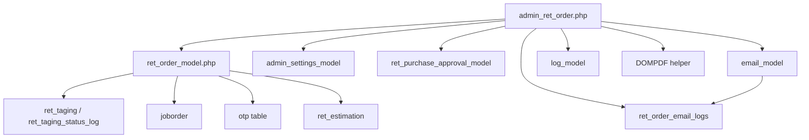

# Cross-Module Map: Customer Order (Enriched)

> Method-level integration map — all external module calls made by `admin_ret_order.php` and `ret_order_model.php`.

---

## Integration Table

| # | External Module | Model/Class | Direction | Method(s) Called | Data Exchanged | Risk |
|---|---|---|---|---|---|---|
| 1 | **Admin Settings** | `admin_settings_model` | Read | `get_access()` — every controller action | Permission bitmask | Permission bypass if misconfigured |
| 2 | **Admin Settings** | `admin_settings_model` | Read | `getBranchDayClosingData()` — order save/update | `entry_date` used as `order_date` | Stale date if day-closing not run |
| 3 | **Admin Settings** | `admin_settings_model` | Read | `get_company()` — PDF generation, OTP | Company name, GST, branding | Missing company = blank PDFs |
| 4 | **Admin Settings** | `admin_settings_model` | Read | `get_service_by_code('KAR_ALOC')`, `get_service_by_code('order_cancel_otp')` | Service config | Silently skipped if service not set |
| 5 | **Billing / Rates** | `ret_billing_model` (via JS) | Read | `get_branchwise_rate()` — AJAX on form load | Live metal rate for calculation | Rate locking: rate shown may differ from rate at save time |
| 6 | **Karigar / Vendor** | `ret_purchase_approval_model` | Read | `get_karigar_details($id_karigar)` — cart place | Karigar name, email | Missing email → email_log with status=2 |
| 7 | **Email** | `email_model` | Write | `send_email()` — after cart order_place | HTML email with order accept URL | Email sent inside TX (see BUG-CUSORD-006) |
| 8 | **Tagging** | `ret_taging` (via Model) | Read/Write | `updateData()` — order save, repair update | `id_orderdetails`, `tag_status` | Race condition: concurrent sale + order on same tag |
| 9 | **Tagging** | `ret_taging_status_log` | Write | `insertData()` — repair update type=4 | Status history row | Only on repair update, not on save (inconsistent) |
| 10 | **Job Order** | `joborder` | Write | `updateData(orderstatus=4)` — type=5 Tag Reserve | orderstatus change | Job order status may become stale if order is later cancelled |
| 11 | **Activity Log** | `log_model` | Write | `log_detail('insert','',$log_data)` — after TX commit | module, operation, record, remark | Log written after TX commit — misses rollback events |
| 12 | **SMS / WhatsApp** | `admin_usersms_model` | Write | `send_whatsApp_message()` — OTP send (currently **commented out**) | OTP message text | Dead code — no SMS sent despite being referenced |
| 13 | **PDF** | `DOMPDF` | Read/Write | `load_html()`, `render()`, `stream()` — karigar ack, repair print | Order data from model | Typo: `"portriat"` instead of `"portrait"` at L1019, L1225 |
| 14 | **Email Token** | `ret_order_email_logs` | Write | `save_email_log()`, `update_email_log()` — cart order_place | token, status, error_msg | Token not single-use (see BUG-CUSORD-023) |
| 15 | **Estimation** | `ret_estimation` | Read | `est_id` stored in `customerorder.est_id` | Estimation reference | Reference only — no validation that estimation exists |

---

## Extended Mermaid Dependency Graph

---

## Integration Risk Summary

| Risk | Modules | Details |
|---|---|---|
| **Email inside TX** | Email ↔ Cart Place | Email sent at L1993 before `trans_commit()` — sent even if order rolls back |
| **Rate timing** | Billing Rate → Order Form | Rate fetched at form load via AJAX — may differ from rate at save (no locking) |
| **Tag race condition** | Tagging ↔ Order Save | Same tag can be claimed by two concurrent order saves |
| **Inconsistent tag status** | Tagging ↔ Repair TX | Repair save (type=4) sets `id_orderdetails` but NOT `tag_status=8`; update sets both |
| **Dead SMS code** | SMS ↔ OTP | `send_whatsApp_message()` call commented out → OTP sent silently with no notification |
| **PDF orientation typo** | PDF ↔ Print | `"portriat"` used at L1019, L1225 — dompdf may fall back to default or error |
