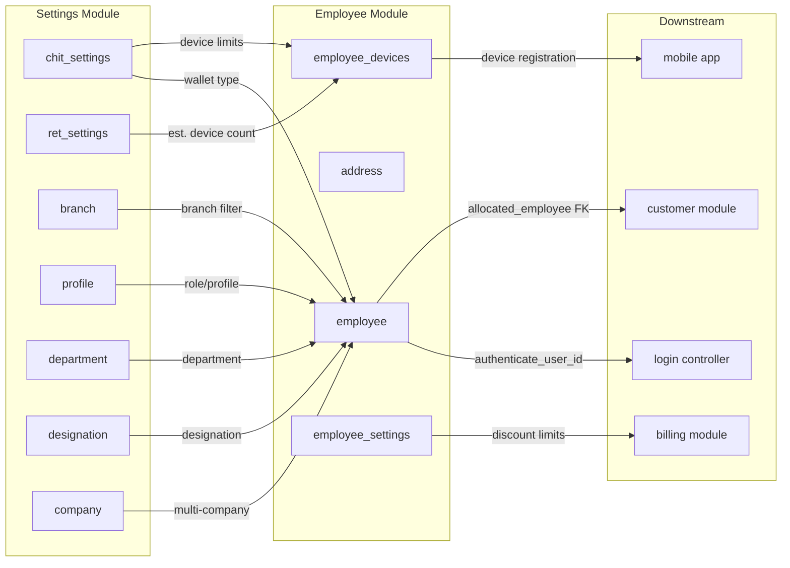

# Employee Module — Cross-Module Map

> **Brain Updated:** 2026-03-25 | **Round:** R2-Upgrade

---

## External Dependencies

| External Module | Direction | Tables/Methods Used | What Data | Risk |
|---|---|---|---|---|
| **Settings** (`Admin_settings_model`) | Read | `get_access('employee')` | Access control gate | None — standard |
| **Settings** (`Admin_settings_model`) | Read | `settingsDB('get',1,'')` | `chit_settings` (emp_wallet_account_type, device limits) | Settings missing → error |
| **Settings** (`Admin_settings_model`) | Read | `get_company_settings()` | Multi-company flag | Drives list filter |
| **Wallet** (`wallet_model`) | Read+Write | `get_wallet_acc_number()`, `wallet_accountDB('insert')` | Employee wallet creation | Wallet fail after emp commit |
| **Log** (`log_model`) | Write | `log_detail('insert', '', $log_data)` | Audit on settings add/update | Non-critical |
| **Estimation** (`ret_estimation_model`) | Read | `get_ret_settings('estimation_app_devices_count')` | Device limit for estimation app | Model loaded at runtime |
| **Country/State/City** (JS AJAX) | Read | `/settings/company/getcountry`, `/getstate`, `/getcity` | Address dropdowns | Cross-controller AJAX |
| **Profile** (JS AJAX) | Read | `/settings/profile/ajax_list` | User role dropdown | Cross-controller AJAX |
| **Login controller** | Read | `authenticate_user_id()`, `checkAccessTime()`, `isOTPReqToLogin()`, `loginOTP_exp()` | Auth via employee model | Login depends on employee model |

---

## Tables Owned by Employee Module

| Table | CRUD | Primary Key | FK Relationships |
|---|---|---|---|
| `employee` | Full CRUD | `id_employee` | `dept` → `department.id_dept`, `designation` → `designation.id_design`, `id_profile` → `profile.id_profile`, `id_branch` → `branch.id_branch`, `id_company` → `company.id_company` |
| `address` | Insert + Update + Delete | `id_address` | `id_employee` → `employee.id_employee`, `id_country/state/city` → geo tables |
| `employee_devices` | Status update only | `id_collection_device` | `emp_id` → `employee.id_employee` |
| `employee_settings` | Full CRUD | `id_emp_sett` | `id_employee` → `employee.id_employee` |

---

## Tables Referenced (Read-Only)

| Table | Owner Module | Used For |
|---|---|---|
| `department` | Settings/Masters | Department dropdown |
| `designation` | Settings/Masters | Designation dropdown |
| `profile` | Settings/Masters | User role/profile |
| `branch` | Settings | Branch dropdown, login branch |
| `company` | Settings | Multi-company login path |
| `chit_settings` | Settings | Device limits, OTP config, wallet type |
| `ret_settings` | Settings/Retail | Estimation app device count |
| `ret_stone_discount_master` | Settings/Retail | Diamond discount range |
| `country/state/city` | Settings | Address geo data |
| `wallet_account` | Wallet | Employee wallet creation |
| `log` | System | Audit trail |

---

## Who Depends on Employee Module

| Downstream Module | How They Use Employee | Risk |
|---|---|---|
| **Customer** | `customer.allocated_employee` FK | Delete breaks FK reference (EMP-BUG-016) |
| **Login** | `authenticate_user_id()`, `checkAccessTime()` | Auth depends on employee model |
| **Mobile/Collection App** | Device registration (`employee_devices`) | App registers → admin enables |
| **Billing/Estimation/Sales** | `employee_settings` discount limits | Limits enforced in billing modules |
| **Day Close** | `allow_day_close` from employee_settings | Controls who can close day |
| **Scheme Account** | Various — employee reference | Employee FK in scheme data |

---

## Dependency Graph

