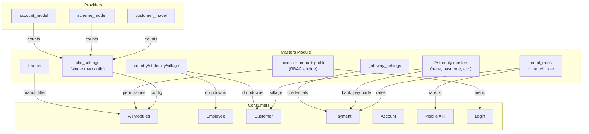

# Masters Module — Cross-Module Map

> **Brain Updated:** 2026-03-25 | **Round:** R5-Upgrade

---

## Role: Central Configuration Hub

The `masters` module is the **most connected module** in the system. It provides RBAC, system settings, metal rates, and master data to **every other module**.

---

## Services Provided TO Other Modules

| Service | Method/Table | Consumers | Risk |
|---|---|---|---|
| **RBAC engine** | `get_access($url)` → `access` + `menu` + `profile` | ALL modules | ⚠️ SQLi in core RBAC (MST-BUG-002) |
| **System settings** | `settingsDB('get')` → `chit_settings` | ALL modules | Single point of failure |
| **Company settings** | `get_company_settings()` | Employee, customer, payment | Multi-company toggle |
| **Menu generation** | `menu_generation()` → `menu` + `access` | Login controller | Navigation for all users |
| **Metal rates** | `metal_rates` table / `../api/rate.txt` | Payment, account, mobile API | ⚠️ rate.txt broken (MST-BUG-003/042) |
| **Branch list** | `branchname_list()` → `branch` | Employee, customer, payment, all dropdowns | — |
| **Country/State/City** | `get_country/state/city()` | Customer, employee (address dropdowns) | ⚠️ raw $_POST (MST-BUG-006) |
| **Village list** | `village_settingDB()` | Customer, collections | — |
| **Bank master** | `bankDB()` → `bank` | Payment, customer KYC | — |
| **Payment modes** | `paymodeDB()` → `payment_mode` | Payment module | — |
| **Drawee master** | `draweeDB()` → `drawee` | Payment module | — |
| **Profile/roles** | `profileDB()` → `profile` | Employee, login | Role definitions |
| **Gateway creds** | `gateway_settingsDB()` → `gateway_settings` | Payment module | — |
| **Notification config** | `getNotificationDetails()` → `notification` | Push notification system | — |
| **KYC rules** | `get_kyc_rules/settings()` | Customer module | KYC enforcement |

---

## Services Consumed FROM Other Modules

| Dependency | Module | Method/Table Used | Purpose |
|---|---|---|---|
| `customer_model` | Customer | Loaded in constructor | Customer count in general settings, `getCustomerByMobile()` |
| `scheme_model` | Scheme | Loaded in constructor | Scheme count in general settings |
| `account_model` | Account | Loaded in constructor | Scheme account count, `getSchemeAccountByCustomer()` |
| `chitadmin_model` | ChitAdmin | Loaded in constructor | Utilities |
| `admin_usersms_model` | SMS | Loaded in constructor | SMS dispatch (`send_bulk_sms`) |
| `log_model` | System | Loaded in constructor | Audit logging |

---

## Tables Owned by Masters Module

### Configuration Tables
| Table | Purpose | Consumers |
|---|---|---|
| `chit_settings` | System-wide config (single row, id=1) | ALL modules |
| `chit_limit` | Customer/scheme limits | Customer, scheme modules |
| `chit_discount` | Discount settings | Payment, billing |
| `config` | App version, account format config | Mobile app, account module |

### RBAC Tables
| Table | Purpose | Consumers |
|---|---|---|
| `menu` | Navigation menu items | Login, ALL modules |
| `access` | Menu-level permissions (view/add/edit/delete per profile) | ALL modules via `get_access()` |
| `dashboard_access` | Dashboard widget permissions | Dashboard |
| `dashboard_menu` | Dashboard menu items | Dashboard |
| `profile` | Role definitions with feature flags | Employee, login |

### Metal Rate Tables
| Table | Purpose | Consumers |
|---|---|---|
| `metal_rates` | Gold/silver/platinum rate history | Payment, account, mobile API |
| `branch_rate` | Branch-specific rate links | Payment (branch-wise mode) |
| `metal_rate_settings` | Rate display format per branch | Rate views |

### Master Entity Tables (25+ tables)
| Table | Purpose |
|---|---|
| `bank` | Bank master for payment/KYC |
| `payment_mode` | Payment mode master |
| `drawee` | Drawee master for receipts |
| `department` | Department master |
| `designation` | Designation master |
| `weight` | Weight unit master |
| `classification` | Jewellery classification |
| `card_brand` | Card brand master |
| `payment_charges` | Payment charges config |
| `offers` | Promotional offers |
| `new_arrivals` | New arrivals items |
| `gift` | Gift master |
| `profession` | Profession master |
| `village` | Village master |
| `terms_conditions` | Terms & conditions |
| `version` | App version history |
| `ledger` | Accounting ledger |
| `notification` | Notification templates |
| `quick_link` | Quick link config |
| `kyc_master` | KYC document types |
| `kyc_settings` | KYC rules config |

### System Tables
| Table | Purpose |
|---|---|
| `company` | Company master (multi-tenant) |
| `branch` | Branch master |
| `country` / `state` / `city` | Geo hierarchy |
| `gateway_settings` | Payment gateway credentials |
| `sms_api` | SMS API config |
| `mail_settings` | SMTP settings |
| `otp_credit_settings` | OTP credit config |
| `promotion_credit` | Promo credit settings |
| `wallet_type` | Wallet type config |
| `import_log` | Data import audit |

---

## Dependency Graph

