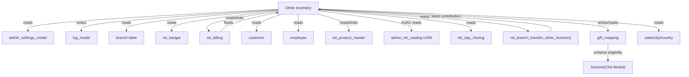

# CROSS-MODULE MAP — Other Inventory
> **Module:** Other Inventory | **Built:** 2026-03-14

---

## External Dependencies

| External Module | Direction | Table / Endpoint | What Data | Risk |
|---|---|---|---|---|
| **Settings** | Read | `admin_settings_model->getCompanyDetails()` | Company name, address for print | Breaking if model changes |
| **Settings** | Read | `admin_settings_model->getBranchDayClosingData()` | Entry date for purchase, tagging, issue | Wrong entry date if day closed |
| **Settings** | Read | `admin_settings_model->get_access()` | Permission flags (add/edit/delete) | Access not enforced server-side |
| **Log** | Write | `log_model->log_detail()` | Activity log on purchase + product details | Non-critical if log fails |
| **Branch** | Read | `branch` table | Branch names, HO designation | OI operations depend on branch.is_ho |
| **Karigar/Supplier** | Read | `ret_karigar` (karigar_for=4) | Supplier name, contact, GST, state | Purchase requires active supplier |
| **Billing** | Read | `ret_billing` | Active bills (status=1) for issue linkage | Issue requires valid bill reference |
| **Customer** | Read | `customer` | Customer name + mobile for issue report | Read-only dependency |
| **Employee** | Read | `employee` | Employee name for reports and print | Read-only |
| **Product Master** | Read | `ret_product_master` | Active products for product mapping | Product-OI link breaks if product deleted |
| **UOM/Catalog** | Read | `admin_ret_catalog/uom/active_uom` (AJAX) | UOM list for item form dropdown | Cross-controller AJAX dependency |
| **Day Closing** | Read | `ret_day_closing` | is_day_closed, entry_date | Entry date computation |
| **Branch Transfer** | Read | `ret_branch_transfer_other_inventory`, `ret_branch_transfer` | OI items in transit for stock display | Branch transfer feeds into stock |
| **Scheme/Chit** | Write | `gift_mapping` | OI item ↔ scheme linkage | Scheme module reads this for gift eligibility |
| **State/City/Country** | Read | `state`, `city`, `country` | Supplier address for purchase print | Read-only for print |

---

## Dependency Graph

---

## Who Reads Other Inventory Tables

| Table | Other Modules that Read It |
|---|---|
| `ret_other_inventory_item` | Billing (for gift issue), Branch Transfer, Scheme/Chit |
| `ret_other_inventory_purchase_items_details` | Branch Transfer, Billing (available stock check) |
| `ret_other_inventory_purchase_items_log` | Stock reports (from this module only) |
| `gift_mapping` | Scheme/Chit module (for checking issue eligibility) |
| `ret_other_invnetory_issue` | Reports, Billing reconciliation |

---

## Cross-Module AJAX Calls (JS)

| JS Function | URL Called | External Controller | Purpose |
|---|---|---|---|
| `get_uom_list()` | `admin_ret_catalog/uom/active_uom` | Catalog Controller | Load UOM dropdown on item form |

---

## Integration Risks

| Risk | Description | Impact |
|---|---|---|
| **Supplier deleted** | `ret_karigar` has no FK constraint enforced — supplier could be deleted after purchase | Purchase print shows null supplier name |
| **Product deleted** | `ret_product_master` deletion is not blocked by OI product link | Product mapping becomes orphan |
| **Day closing not set** | `getBranchDayClosingData()` returns null if no day closing record exists | entry_date will be NULL → INSERT failure |
| **Catalog controller down** | `admin_ret_catalog/uom/active_uom` AJAX failure silently leaves UOM dropdown empty | User cannot specify UOM on item master |
| **gift_mapping shared** | `gift_mapping` table is shared between OI and Scheme modules — format may conflict | Schema changes by one module break other |
