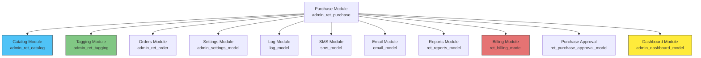

# PURCHASE MODULE — CROSS-MODULE MAP
> **Module:** Purchase | **Version:** 1.0 | **Date:** 2026-02-23

---

## Dependency Diagram

---

## Model Dependencies (Constructor + Dynamic)

| External Model | Load Location | Direction | Purpose | Risk |
|---|---|---|---|---|
| `admin_settings_model` | Constructor L27, L41 | Read | Access control, settings lookups | Model change affects access |
| `log_model` | Constructor L29 | Write | Audit trail for all operations | Log table schema change |
| `admin_usersms_model` | Constructor L31 | Read | SMS user management | N/A |
| `email_model` | Constructor L33 | Write | Email notifications | Email config change |
| `sms_model` | Constructor L35 | Write | SMS to karigars | SMS provider change |
| `ret_reports_model` | Constructor L37 | Read | Purchase reports data | Report query changes |
| `ret_catalog_model` | Constructor L39 | Read | Products, categories, designs | Master data changes |
| `ret_purchase_approval_model` | Dynamic L988 | Read/Write | Approval stock operations | Approval flow changes |
| `ret_billing_model` | Dynamic L6099 | Read | Cheque printing — bank details from karigar | Bank field changes |

---

## JS AJAX Cross-Module Calls

| # | JS Line | Target Controller | Endpoint | Data Retrieved | Risk |
|---|---|---|---|---|---|
| 1 | L5073 | `admin_ret_catalog` | `get_karigar_wise_wastage` | Karigar wastage percentages | Config change |
| 2 | L5117 | `admin_ret_catalog` | `get_karigar_wise_stones` | Karigar stone rates | Rate change |
| 3 | L5157 | `admin_ret_catalog` | `get_karigar_wise_charges` | Karigar charges config | Charge change |
| 4 | L5309 | `admin_ret_catalog` | `category/active_category` | Active categories list | Category add/delete |
| 5 | L5349 | `admin_ret_catalog` | `karigar/active_list` | Active karigars list | Karigar approval |
| 6 | L6771 | `admin_ret_order` | `get_img_by_order_id` | Customer order images | Image path change |
| 7 | L8089 | `admin_ret_catalog` | `get_ActiveProducts` | Active products list | Product master |
| 8 | L8409 | `admin_ret_tagging` | `get_ActiveSize` | Size options | Size master |
| 9 | L8489 | `admin_ret_catalog` | `get_active_design_products` | Design products | Design master |
| 10 | L8605 | `admin_ret_catalog` | `get_ActiveSubDesigns` | Sub-design options | Sub-design master |
| 11 | L14412 | `admin_ret_catalog` | `active_metals` | Active metals list | Metal master |
| 12 | L14700 | `admin_ret_catalog` | `get_ActiveProducts` | Products (metal issue) | Product master |
| 13 | L14764 | `admin_ret_catalog` | `get_MetalCategory` | Metal categories | Category config |
| 14 | L15192 | `admin_ret_catalog` | `charges/getActiveChargesList` | Charge types | Charge config |
| 15 | L16381 | `admin_ret_catalog` | `get_active_design_products` | Design products (GRN) | Design master |
| 16 | L16863 | `admin_ret_catalog` | `get_ActiveSubDesigns` | Sub-designs (GRN) | Sub-design master |
| 17 | L16999 | `admin_ret_catalog` | `category/cat_purity` | Category purity mapping | Purity config |
| 18 | L22520 | `admin_ret_catalog` | `ajax_getPurity` | Purity options | Purity master |
| 19 | L24798 | `admin_ret_tagging` | `getStoneItems` | Stone items | Stone master |
| 20 | L24846 | `admin_ret_tagging` | `getStoneTypes` | Stone types | Stone type master |

---

## Table Cross-References

| External Table | Owner Module | Direction | Used By (model method) | Data |
|---|---|---|---|---|
| `ret_karigar` | Catalog | Read | `get_karigar_details()`, PAN/GST/Aadhar checks | Vendor info, bank details |
| `ret_category` | Catalog | Read | Via joins in purchase queries | Product categories |
| `ret_product` | Catalog | Read | Via joins | Product names |
| `ret_design` | Catalog | Read | Via joins | Design names |
| `ret_sub_design` | Catalog | Read | Via joins | Sub-design names |
| `ret_purity` | Catalog | Read | `get_purity_details()`, `get_metal_issue_purity()` | Metal purity info |
| `ret_weight_range` | Catalog | Read | `get_ActiveWeightRange()` | Weight ranges |
| `ret_taging` | Tagging | Read/Write | `get_tag_details()`, `get_tag_status()`, `getTaggedRefNo()`, lot generation | Tag records |
| `ret_stone_item` | Tagging | Read | Via AJAX | Stone items |
| `ret_stone_type` | Tagging | Read | Via AJAX | Stone types |
| `ret_settings` | Settings | Read | `get_FinancialYear()`, `get_ret_settings()`, `get_gold_rate()` | System config |
| `sys_log` | Log | Write | `log_detail()` calls | Audit entries |
| `ret_wallet_account` | Shared | Read/Write | `get_retWallet_details()`, `updateWalletData()` | Supplier wallet/ledger |

---

## Impact Analysis Summary

> **If modifying the Purchase module:**

| What Changes | Impact On |
|---|---|
| PO table columns | Lot Module (reads PO data), Reports Module, Billing Module |
| Rate fixing logic | Accounts Module (payment calculations), Supplier Ledger |
| QC status fields | Tagging Module (lot generation depends on QC), Inventory |
| Payment amounts | Wallet account balances, Supplier ledger |
| Bill entry format | Reports Module (all purchase reports), Tax calculations |

> **If other modules change:**

| External Change | Impact on Purchase |
|---|---|
| Karigar master fields change | Breaks 10+ queries with karigar joins |
| Category/Product master change | Breaks dropdown population (20+ AJAX calls) |
| Tagging table schema change | Breaks approval stock, lot generation |
| Settings keys change | Breaks financial year, gold rate, access control |
| Stone item/type master change | Breaks QC/HM stone detail forms |