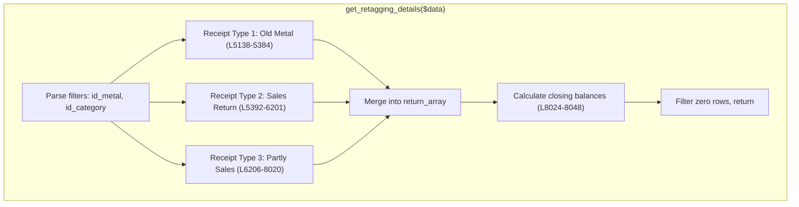

# PURCHASE MODULE — DEEP TRACE: `get_retagging_details()`
> **Location:** `ret_purchase_order_model.php` L5109-8052 (2,943 lines)
> **Type:** Report query | **Caller:** Controller `getRetaggingReport()` L13072
> **Risk:** CRITICAL — largest single method in module, all raw SQL

---

## Purpose
Generates the **Retagging Report** showing branch transfer balance tracking across 3 receipt types. Computes opening balance, period inward, metal issued, retagged, returned, pocketed, and closing balance — all segmented by 5 weight categories.

## Input Parameters
| Parameter | Type | Purpose |
|---|---|---|
| `$data['from_date']` | string | Report start date |
| `$data['to_date']` | string | Report end date |
| `$data['id_metal']` | array | Metal filter (multi-select) |
| `$data['id_category']` | array | Category filter (multi-select) |
| `$data['receipt_type']` | array | Which receipt types to include (1/2/3) |
| `$data['bt_code']` | string | Branch transfer code filter |
| `$data['id_branch']` | string | Branch filter |

## Architecture — 3 Receipt Type Queries



| Receipt Type | `item_type` | `transfer_item_type` | Line Range | JOINs | Subqueries |
|---|---|---|---|---|---|
| 1 — Old Metal | 1 | 3 | L5138-5384 | ~12 | 12 |
| 2 — Sales Return | 2 | 3 | L5392-6201 | ~50 | 40+ |
| 3 — Partly Sales | 3 | 3 | L6206-8020 | ~50 | 40+ |

## 5 Weight Categories (per receipt type)
| Category | Alias | `stone_type` | `uom_gross_wt` | Description |
|---|---|---|---|---|
| Gross/Net Weight | `_gwt`, `_nwt` | 0 | any | Plain metal weight |
| Diamond Weight | `_diawt` | — | — | Stone weight (type 1) |
| Gram Weight | `_grm_wt` | 1 | ≠6 | Stone items in grams |
| Carat Weight | `_ct_wt` | 1 | =6 | Stone items in carats |
| Loose Diamond | `looseDia` | 2 | any | Loose diamond items |

## 7 Balance Components (per receipt type, per weight category)
| Component | Alias Prefix | Subquery Join | Time Filter |
|---|---|---|---|
| Opening Balance Inward | `op_inw` | `ret_brch_transfer_old_metal` | `<= op_date` |
| Opening Balance Retag | `op_blc_retag` | `ret_acc_stock_process_details` | `<= op_date` |
| Opening Balance Pocket | `op_blc_pocket` | `ret_old_metal_pocket_details` | `<= op_date` |
| Period Inward | `inw` | `ret_brch_transfer_old_metal` | `BETWEEN from_date AND to_date` |
| Period Retag | `retag` | `ret_acc_stock_process_details` | `BETWEEN from_date AND to_date` |
| Period Return | `ret` | `ret_purchase_return` | `BETWEEN from_date AND to_date` |
| Period Pocket | `pocket` | `ret_old_metal_pocket_details` | `BETWEEN from_date AND to_date` |

**Type 2 & 3 additionally have:**
| Component | Alias Prefix | Source |
|---|---|---|
| Metal Issue | `metalIssue` | `ret_karigar_metal_issue` |
| Diamond Inward | `inw_dia` | `ret_billing_item_stones` |
| Return Diamonds | `retDia` | `ret_purchase_return_stone_items` |

## Closing Balance Formula (L8026-8034)
```php
$closing_gwt   = op_blc_gwt + inw_gwt - issue_gwt - ret_gwt - retag_gwt;
$closing_nwt   = op_blc_nwt + inw_nwt - issue_gwt - ret_nwt - retag_nwt;  // ⚠️ uses issue_gwt not issue_nwt
$closing_diawt = op_blc_diawt + inw_diawt - issue_diawt - return_diawt - retag_diawt;
$closing_grm_wt = op_blc_grm_wt + inw_grm_wt - issue_grm_wt - ret_grm_wt - retag_grm_wt;
$closing_ct_wt = op_blc_ct_wt + inw_ct_wt - issue_ct_wt - ret_ct_wt - retag_ct_wt;
```

> **Note:** `closing_nwt` uses `issue_gwt` instead of `issue_nwt` — may be intentional (metal issue doesn't distinguish gross/net) or a bug.

## Tables Used (22 unique)
| # | Table | Purpose |
|---|---|---|
| 1 | `ret_branch_transfer` | Main: Branch transfer headers |
| 2 | `branch` | Branch names |
| 3 | `ret_brch_transfer_old_metal` | Transfer old metal items |
| 4 | `ret_bill_old_metal_sale_details` | Bill-linked old metal |
| 5 | `ret_estimation_old_metal_sale_details` | Estimation old metal |
| 6 | `ret_old_metal_category` | Old metal category master |
| 7 | `metal` | Metal master |
| 8 | `ret_billing_item_stones` | Bill stone details |
| 9 | `ret_billing` | Bill headers |
| 10 | `ret_bill_details` | Bill line items |
| 11 | `ret_stone` | Stone master |
| 12 | `ret_taging` | Tag records |
| 13 | `ret_product_master` | Product master |
| 14 | `ret_category` | Category master |
| 15 | `ret_acc_stock_process` | Acc stock process headers |
| 16 | `ret_acc_stock_process_details` | Acc stock process details |
| 17 | `ret_acc_stock_process_stone_details` | Acc stock stone details |
| 18 | `ret_old_metal_pocket` | Metal pocket headers |
| 19 | `ret_old_metal_pocket_details` | Metal pocket details |
| 20 | `ret_old_metal_pocket_stone_details` | Pocket stone details |
| 21 | `ret_karigar_metal_issue` | Metal issue headers |
| 22 | `ret_karigar_metal_issue_details` | Metal issue details |
| 23 | `ret_purchase_return` | Purchase return headers |
| 24 | `ret_purchase_return_items` | Purchase return items |
| 25 | `ret_purchase_return_stone_items` | Return stones |
| 26 | `ret_taging_stone` | Tag stone details |

---

## 🐛 BUGS FOUND

### BUG 1: Typo in Closing Balance — `$clsoing_grm_wt` (L8045)
```php
// Line 8045 — TYPO
$item['closing_grm_wt'] = number_format($clsoing_grm_wt, 3, '.', '');
//                                       ^^^^^^^^^^^^^^ should be $closing_grm_wt
```
**Severity:** HIGH — `closing_grm_wt` will always be 0 (undefined variable) in the report output.
**Impact:** Gram weight closing balance is always 0 for all retagging report rows.

### BUG 2: Pocket Not Subtracted in Closing Balance (L8026-8028)
```php
$closing_gwt = op_blc_gwt + inw_gwt - issue_gwt - ret_gwt - retag_gwt;
// Missing: - pkt_gwt (pocket weight not subtracted)
```
**Severity:** MEDIUM — Pocket transfers are tracked but not deducted from closing balance.

### BUG 3: SQL Injection Risk — `$id_category` / `$id_metal` in WHERE (L5168+)
```php
\" and c.id_old_metal_cat in (\".$id_category.\") \"
```
**Severity:** HIGH — `$id_category` built from `implode()` of `$data['id_category']` array without sanitization. If POST data is manipulated, SQL injection possible.

### BUG 4: All Raw SQL — No Active Record (entire method)
**Severity:** MEDIUM — All 3 receipt type queries use `$this->db->query()` with string concatenation. Violates CI3 convention and makes maintenance extremely difficult.

---

## Performance Concerns
1. Each receipt type query has 30-50 LEFT JOINs with nested subqueries — **O(n²)** potential
2. `date()` function used on columns in WHERE — prevents index usage: `date(brch.dwnload_datetime)<='...'`
3. No `LIMIT` — unbounded result set
4. Same subquery pattern repeated 5× per weight category — could be consolidated with CASE/WHEN