# CROSS MODULE MAP — Retail Dashboard
> Generated: 2026-03-16 | Module: Retail Dashboard | Last updated: Round 8

---

## External Module Dependencies (Primary Controller — admin_ret_dashboard)

| External Module | Direction | Tables / Methods | What Data | Risk |
|---|---|---|---|---|
| **Estimation** | Read | `ret_estimation`, `ret_estimation_items` | Estimation head, items, status | Deleted estimation breaks dashboard |
| **Billing** | Read | `ret_billing`, `ret_bill_details`, `ret_billing_payment`, `ret_billing_advance`, `ret_billing_chit_utilization`, `ret_billing_gift_voucher_details`, `ret_billing_item_stones`, `ret_bill_return_details`, `ret_bill_old_metal_sale_details` | Bills, payments, returns, stones | Most critical dependency |
| **Tagging** | Read | `ret_taging`, `ret_taging_status_log` | Tag stock, status, weights | Tag data inconsistency causes wrong stock counts |
| **LOT (Lot Inwards)** | Read | `ret_lot_inwards`, `ret_lot_inwards_detail` | Lot quantity and weight | Missing lots skew inward counts |
| **Branch Transfer** | Read | `ret_branch_transfer` | Pending transfer counts | Stale approvals show wrong pending count |
| **Customer Orders** | Read | `customerorder`, `customerorderdetails` | Order status, pieces | Wrong order status causes misclassification |
| **E-commerce (Order Cart)** | Read | `order_cart` | Cart items, order placed/received status | Cart records without cleanup skew counts |
| **Customer (CRM)** | Read | `customer` | Customer profile, join channel | No impact risk — display only |
| **Gift Card / Voucher** | Read | `gift_card` | Voucher amounts issued/utilized/sold | — |
| **Non-tag Inventory** | Read | `ret_nontag_item` | Non-tagged stock quantities | — |
| **Finance (Receipts)** | Read | `ret_issue_receipt`, `ret_issue_rcpt_payment`, `ret_issue_credit_collection_details` | Advance receipts, credit collections | Cash abstract relies on this cross-module |
| **Wallet** | Read | `ret_wallet_transcation` | Advance adjustments | — |
| **Chit** | Read | `payment`, `payment_mode_details`, `scheme_account`, `scheme`, `chit_settings` | Chit payment collections | — |
| **Finance (Ledger)** | Read | `ledger_master` | Ledger balances, min_balance alerts | `getLedgerReportData()` missing → Fatal PHP error (Bug #5) |
| **Settings** | Read | `ret_settings` | Incentive rates per gram (gold/silver) | Wrong rate → wrong incentive display |
| **Metal Rates** | Read | `metal_rates` | Daily metal rates | Used by API model only |
| **Reorder Settings** | Read | `ret_reorder_settings` | Min/max pcs config per product/branch | If misconfigured → false reorder alerts |
| **Product Master** | Read | `ret_product_master`, `ret_category`, `ret_design_master` | Product and category metadata | — |
| **ret_reports_model** | Read (cross-model) | Multiple — via `getBillDetails()` and `getLedgerReportData()` | Cash abstract, ledger balances | Model-level cross-dependency — unusual pattern |
| **admin_settings_model** | Read (cross-model) | Access rights table | Route access check in `gross_profit_report()` | — |

---

## Additional Dependencies (API Controller — admin_ret_dashboard_api)

| External Module | Direction | Tables / Methods | What Data | Risk |
|---|---|---|---|---|
| **Purchase / Karigar PO** | Read | `ret_purchase_order`, `ret_purchase_order_items`, `customerorder`, `customerorderdetails` | Karigar purchase orders, job orders | Central dependency for all PO-related API tabs |
| **PO Payment** | Read | `ret_po_payment`, `ret_po_payment_detail`, `ret_po_bill_payment_details` | Karigar payment records | Unpaid PO widget relies on correct payment linkage |
| **Rate Fix / Rate Cut** | Read | `ret_po_rate_fix`, `ret_supplier_rate_cut`, `ret_crdr_note` | Rate-fixed allocations, Cr/Dr notes | ⚠️ Bug #23: `get_rate_cut_profit_loss` date filter inverted |
| **Purchase Return** | Read | `ret_purchase_return`, `ret_purchase_return_items` | Return weight for rate-unfix calculation | — |
| **Metal Issue** | Read | `ret_karigar_metal_issue`, `ret_karigar_metal_issue_details` | Issued metal weight to karigar | Used in overdue PO weight deduction |
| **GRN** | Read | `ret_grn_entry` | GRN amounts for rate-fix display | — |
| **QC** | Read | `ret_po_qc_issue_details`, `ret_po_qc_issue_process` | Failed QC pcs/weight | — |
| **Branch Transfer (Extended)** | Read | `ret_branch_transfer`, `ret_brch_transfer_old_metal`, `ret_brch_transfer_tag_items`, `ret_bt_order_log` | Account stock inwards by type | ⚠️ Bug #22: `get_accountstock_inwards_details` broken |
| **Supplier Approval Ledger** | Read | `ret_view_supplier_approval_ledger` (VIEW) | Issue/receipt/balance per supplier | Relies on VIEW accuracy |
| **Breakeven Logs** | Read | `ret_breakeven_logs` | Daily breakeven target per branch | If no log entry → breakeven shows 0 |
| **Cover-Up / Hedging** | Read | `ret_cover_up` | Hedging position weight | — |
| **Financial Year** | Read | `ret_financial_year` | FY start/end dates for monthly chart | — |
| **Metal Rates (Market)** | Read | `metal_rates` | Market gold rate for P&L calc | — |
| **Bank** | Read | `bank` | Bank name for payment details | — |
| **Profile Settings** | Read | `profile` | `allow_bill_type` EDA filter per user | **Every API model query** depends on this |
| **Catalog (cross-ctrl)** | Read (HTTP) | `admin_ret_catalog/get_section` | Section list (JS AJAX cross-ctrl call) | External HTTP round trip inside JS |

---

## Mermaid Dependency Graph

```mermaid
graph TD
    A["Retail Dashboard (Primary)"] -->|Reads| B["ret_billing / Billing"]
    A -->|Reads| C["ret_estimation / Estimation"]
    A -->|Reads| D["ret_taging / Tagging"]
    A -->|Reads| E["ret_lot_inwards / LOT"]
    A -->|Reads| F["ret_branch_transfer / Branch Transfer"]
    A -->|Reads| G["customerorder / Customer Orders"]
    A -->|Reads| H["order_cart / E-commerce"]
    A -->|Reads| I["ret_issue_receipt / Finance Receipts"]
    A -->|Reads| J["gift_card / Gift Vouchers"]
    A -->|Reads| K["customer / CRM"]
    A -->|Reads| L["ledger_master / Accounts"]
    A -->|Reads| M["ret_settings / Config"]
    A -->|Reads via model| N["ret_reports_model"]
    N -->|Reads| B
    N -->|Reads| I
    N -->|Reads| L

    API["Retail Dashboard (API Ctrl)"] -->|Reads| B
    API -->|Reads| D
    API -->|Reads| PO["ret_purchase_order / Karigar PO"]
    API -->|Reads| RC["ret_supplier_rate_cut / Rate Cut"]
    API -->|Reads| BT2["ret_brch_transfer_old_metal / BT Extended"]
    API -->|Reads via VIEW| SL["ret_view_supplier_approval_ledger"]
    API -->|Reads| BL["ret_breakeven_logs / Finance"]
    API -->|Reads| PROF["profile / User Settings"]
    API -->|HTTP call| CAT["admin_ret_catalog / Catalog"]

    B -->|Child tables| B2["ret_bill_details"]
    B -->|Child tables| B3["ret_billing_payment"]
    D -->|Log| D2["ret_taging_status_log"]
    PO -->|Items| POI["ret_purchase_order_items"]
    PO -->|Payment| PAY["ret_po_payment"]
```

---

## Cross-Model Dependency Detail

### ret_reports_model (critical cross-dependency)
- **Used in:** `get_cash_abstract_details()` (L1706), `get_LedgerBalanceAlert()` (L2112), `gross_profit_report()` (L1563)
- **Methods called:**
  - `ret_reports_model::getBillDetails($_POST)` — large aggregation method from Reports module
  - `ret_reports_model::getLedgerReportData($post_data)` — **⚠️ DOES NOT EXIST → Fatal PHP error (Bug #5)**
  - `ret_reports_model::get_access()` → `admin_settings_model::get_access()` for GP report access check
- **Risk:** If ret_reports_model changes its output structure, dashboard cash abstract will silently break

### admin_settings_model (single use)
- **Used in:** `gross_profit_report('ajax')` L1563
- **Method:** `get_access('admin_ret_reports/old_metal_purchase/list')` — access check
- **Risk:** Low — read-only access check

---

## Branch-Awareness Analysis

### Primary Controller
| Controller Method | Branch Filter Present? | Notes |
|---|---|---|
| Most AJAX methods | ✅ Yes — `id_branch` from POST | Correct |
| `get_CustomerDetails()` | ❌ No | Ignores `$id_branch` in query |
| `get_branch_transfer_details()` | ❌ No | Controller receives params but doesn't pass them to model |
| `get_retail_dashboard_details()` | ⚠️ Partial | Only some sub-calls pass branch; many don't |
| `get_MetalBill_details()` | ❌ No date | No date filter at all — lifetime data |

### API Controller
| API Model Method | Branch Filter Present? | Notes |
|---|---|---|
| Most API model methods | ✅ Yes — `$id_branch[]` array processed via `implode(',', ...)` | Correct pattern |
| `get_branch_wastage()` | ❌ Metal filter missing | `$id_metal` used in SQL but not in function signature (Bug #21) |
| `get_accountstock_inwards_details()` | ❌ Broken | Uses undefined `$data` for branch filter — always unfiltered (Bug #22) |
| `get_rate_cut_profit_loss()` | ⚠️ Date broken | `to_date` ignored (Bug #23) |
| `get_delayed_po_payments()` | ✅ Yes | Branch via `is_array($id_branch) ? implode(',', $id_branch) : $id_branch` |
