# CROSS MODULE MAP — Section Transfer
> Built: 2026-03-14 | Round 1

---

## Dependency Table

| External Module | Controller | Direction | Tables/Methods | What Data | Risk |
|---|---|---|---|---|---|
| Settings | `admin_settings_model` | Read | `profileDB()` | `counter_change_otp` flag | OTP feature broken if profile missing |
| Settings | `admin_settings_model` | Read | `getBranchDayClosingData()` | `entry_date`, `is_day_closed` | Wrong date stamp if day closing broken |
| Settings | `admin_settings_model` | Read | `get_company()` | Company name for OTP message | Minor — OTP text only |
| Settings | `admin_settings_model` | Read | `get_service_by_code('Counter_Change_Otp')` | OTP service config | OTP delivery config dependency |
| Reports (JS) | `admin_ret_reports` | Read AJAX | `get_ActiveProduct` | Product dropdown | Transfer blocked if reports controller unavailable |
| Catalog (JS) | `admin_ret_catalog` | Read AJAX | `get_sectionBranchwise` | Section dropdown | No sections = no transfer possible |
| Branch Transfer (JS) | `admin_ret_brntransfer` | Read AJAX | `getNonTaggedItem` | NT stock by branch/product | NT transfer broken if BT controller changes |
| Customer Orders | `customerorderdetails` | Read (JOIN) | `orderno`, `id_orderdetails` | Order reservation | Wrong data exposes reserved items |
| Estimation | `ret_estimation`, `ret_estimation_items` | Read (JOIN) | `estimation_id`, `tag_id`, `esti_for`, `esti_no` | Estimation-based tag filter | Estimation changes affect tag search |

---

## Mermaid Dependency Graph

```mermaid
graph TD
    ST[Section Transfer]
    
    ST -->|Read: profileDB, dayClosing, company, OTPservice| SETTINGS[admin_settings_model]
    ST -->|Write| TAGING[ret_taging]
    ST -->|Write| SECT_LOG[ret_section_tag_status_log]
    ST -->|Read+Write| HOME_ITEM[ret_home_section_item]
    ST -->|Write| HOME_LOG[ret_home_section_item_log]
    ST -->|Write| TAG_STATUS_LOG[ret_taging_status_log]
    ST -->|Read+Write| NT_ITEM[ret_nontag_item]
    ST -->|Write| NT_LOG[ret_section_nontag_item_log]
    ST -->|Write| OTP_TABLE[otp]
    
    RAPJS[JS: get_ActiveProduct] -->|AJAX| REPORTS[admin_ret_reports]
    SECJS[JS: get_sectionBranchwise] -->|AJAX| CATALOG[admin_ret_catalog]
    NTJS[JS: getNonTaggedItem] -->|AJAX| BRNTRANS[admin_ret_brntransfer]
    
    ST -->|JOIN: order check| ORDERS[customerorderdetails]
    ST -->|JOIN: est filter| ESTIMATION[ret_estimation + ret_estimation_items]
    ST -->|Read| BRANCH[branch]
    ST -->|Read| SECTION[ret_section]
    ST -->|Read| PRODUCT[ret_product_master]
    ST -->|Read| DAYCLOSING[ret_day_closing]
```

---

## Write Impact Analysis

If Section Transfer has a bug, these tables are affected:

| Table | Impact |
|---|---|
| `ret_taging.id_section` | Tag physically moves to wrong section |
| `ret_taging.tag_status` | Tag locked at status 14 incorrectly |
| `ret_home_section_item` | Home counter stock miscounted |
| `ret_nontag_item` | NT stock miscounted (no easy undo) |
| All *_log tables | Log entries created even on failure if trans_begin not wrapping correctly |

---

## Inbound Dependencies (Who Reads This Module's Data)

| Consumer Module | Reads What |
|---|---|
| Branch Transfer | `ret_nontag_item` (stock source) |
| Sales / Billing | `ret_taging.id_section`, `ret_home_section_item` |
| Reports | `ret_section_tag_status_log`, `ret_section_nontag_item_log` |
| Inventory | `ret_taging.id_section` for section-wise stock reports |
